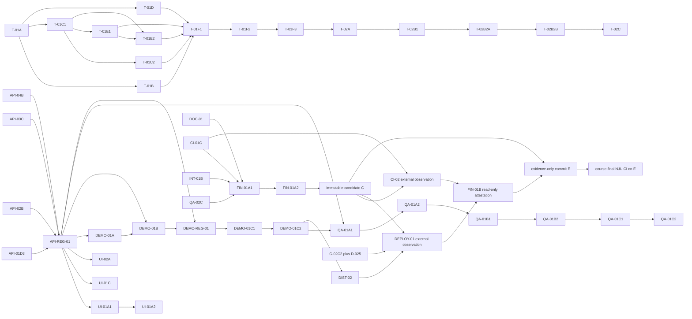

# ProjectB v1 Implementation Plan

> **For agentic workers:** REQUIRED SUB-SKILL: Use superpowers:subagent-driven-development (recommended) or superpowers:executing-plans to implement this plan task-by-task. Steps use checkbox (`- [ ]`) syntax for tracking.

**Goal:** Build the confirmed ProjectB single-user, local-first course learning workbench for Windows x64, with source-traceable material import, constrained AI assistance, deterministic understanding checks and review planning, a responsive WebUI, a safe public mock demo, and reproducible Windows/OCI distribution evidence.

**Architecture:** A Python/FastAPI application owns all authoritative domain state in SQLite and exposes one loopback/WebUI contract. React/Vite/TypeScript renders the browser experience. Material parsing, deterministic learning rules, credential handling, audit, and the provider-neutral adapter boundary are separate application services; the only local production adapter is the built-in OpenAI reference adapter, while deterministic mock is limited to tests/demo. The Windows deliverable is a single ProjectB.exe; the public deployment uses the same domain contracts in an OCI demo profile with synthetic/licensed fixtures and expiring isolated sessions.

**Tech Stack:** CPython 3.14.6; FastAPI 0.139.2; Uvicorn 0.51.0; Pydantic 2.13.4; HTTPX 0.28.1; httpx2 2.7.0 for the Starlette test-client path; OpenAI Python SDK 2.46.0 behind the provider-neutral port; pypdf 6.14.2; pypdfium2 5.12.1 with PDFium 152.0.7947.0; Pillow 12.3.0; keyring 25.7.0 with WinVaultKeyring; tzdata 2026.3; python-multipart 0.0.32; psutil 7.2.2; and SQLite from the CPython standard-library runtime. Backend verification uses pytest 9.1.1, Ruff 0.15.22, mypy 2.3.0, and types-psutil 7.2.2.20260518. Frontend/runtime tooling is Node.js 24.18.0 with npm 11.16.0, React/React DOM 19.2.7, lucide-react 1.25.0, Vite 8.1.5 with @vitejs/plugin-react 6.0.3, TypeScript 7.0.2, Vitest 4.1.10, @testing-library/dom 10.4.1, @testing-library/react 16.3.2, @testing-library/user-event 14.6.1, JSDOM 29.1.1, @playwright/test 1.61.1, @axe-core/playwright 4.12.1, @types/react 19.2.17, @types/react-dom 19.2.3, and @types/node 24.13.3. Windows distribution uses PyInstaller 6.21.0. OCI builds are pinned to `python:3.14.6-slim-bookworm` for linux/amd64 at manifest digest `sha256:f70215e5dbe2a47dee6d23f9c6d358bf3c148f59cce2fd165b61118e9d80f2bb`; the public host remains intentionally unset until the student resolves D-025. T-01A must materialize the verified Python lock input from `docs/engineering/DEPENDENCY_BASELINE.md`, and T-01C1 materializes the verified frontend lock; G-02B gates provider consumers, while G-02C2/D-025 gates only host-specific distribution, deployment, and final public evidence.

---

## Global Constraints

- The student confirmed SPEC.md as the v1 contract on 2026-07-20. This plan implements that contract and cannot silently change its numeric limits, ReviewPolicy v1, source semantics, or scope.
- First release is one local actor on Windows x64. No registration, login, multi-tenancy, sharing, LAN listener, or private-course public persistence.
- The WebUI is mandatory. The local server binds loopback only; Host/Origin and CSRF checks protect state-changing requests.
- Material modes are L (local), P (consented page/fragment remote), and F (consented whole-file/course remote). No body parsing or remote call occurs before the exact policy and file/batch ConsentRecord exist.
- M1 accepts only lecture, answer-free past_paper, and teacher_focus roles. Answer keys, personal notes, assignments/submissions, textbooks, unknown roles, and suspected leaked answers fail closed.
- SourceLocator is the only material-fact reference. A missing, stale, ambiguous, or hash-mismatched locator cannot become coverage, exam analysis, plan input, or source evidence.
- The first vertical learning slice is the mutex/race-condition chain. Its oracle, rubric, and evidence transitions are deterministic; provider wording cannot alter correctness or mastery.
- ReviewPolicy v1 is fixed: budget 10–480 minutes in steps of 5, defaults 30/90, task durations 5/10/15/20/30, intervals [1,3,7,14,30], stable ordering, versioned tzdata, and the exact continuous/finals/post-exam semantics in SPEC.md.
- The first release has named constrained ports only: propose_concept_coverage, generate_explanation, generate_practice_candidate, analyze_exam_material, and generate_feedback. There is no autonomous agent loop, arbitrary tool dispatch, or model authority over coverage, plan, priority, mastery, consent, or deletion.
- Local production registers only the built-in OpenAI adapter. Deterministic mock is registered only in test/demo profiles. No arbitrary base_url, endpoint, dynamic adapter, plugin, or unknown profile field is accepted.
- Secrets are entered invisibly and stored only through the verified Windows Credential Manager backend. Config, SQLite, browser state, logs, snapshots, tests, .env, and Git never contain secret values. Status exposes configured/unconfigured and timestamp only.
- All model requests carry port/version, scope, limits, idempotency key, profile/config/capability/policy fingerprints, and a response schema. Responses use store:false and disable non-essential hosted state/tools; policy snapshots must separately describe retention and deletion facts.
- Public demo accepts only built-in synthetic or explicitly licensed fixtures, uses deterministic mock, forbids upload/credentials/provider egress/private persistence, and enforces the confirmed session, size, concurrency, and rate limits.
- Before formal implementation, Open Design MCP and an actual design system/skill must be verified and recorded; the existing HTML mockup is brainstorming evidence only.
- Before formal implementation, a different-type fresh agent must perform the required cold-start attempt using only SPEC.md and PLAN.md. D-005 (the agent type/version) must be selected by the student before G-03 starts and is not selected by this plan. D-025/G-02C does not block that experiment; it continues to block host-specific distribution/deployment/final evidence.
- G-01 through G-04 are stage-gate/coordinator exceptions: they may run in the current coordination worktree because G-04 is the task that establishes the later worktree contract. Beginning with T-01A, every formal implementation dispatch uses a short-lived dedicated worktree/branch created only when that unit's dependencies are ready, records red and green evidence, runs the relevant and full test entry points, passes a SPEC-compliance review and a quality/security/license review, then records its commit hash in PLAN.md and AGENT_LOG.md. Future unit worktrees and branches are not pre-created. Remote pushes, PR/MR creation, and deployment require execution-time user authorization.

## Fresh-context dispatch-unit rule

Rows labelled **Task Group** are planning containers only. They are never dispatched, never receive a worker commit, and never count as completed on their own. G-01 through G-04 are coordinator-owned stage gates with the explicit workspace rules in their own sections. Every formal implementation heading matching the documented `### Task {unit-id}` template beginning with T-01A is one fresh-agent unit with one coherent contract, one short-lived worktree/branch, one red-to-green gate, two reviews, and one commit. CI-02, DEPLOY-01, and FIN-01B are explicit external-evidence exceptions: they run only after the immutable candidate commit exists, write only external artifacts during execution, and receive no worker commit on that candidate. Their observed results are added later by the coordinator in the allowlisted evidence-only commit defined by FIN-01B. A group is complete only when every child unit has its own required evidence and commit or explicit external-attestation record. If a unit still contains independent contracts, split it before dispatch rather than hiding the split in a prompt.

| Planning group | Dispatch units (each independently executable) |
| --- | --- |
| G-02 | G-02A toolchain/dependency/license baseline; G-02B provider policy/cost evidence; G-02C child group |
| G-02C | G-02C1 host-independent blocked-evidence checkpoint; G-02C2 D-025 host evidence and strict ready-marker activation |
| T-01 | T-01A Python manifest/raw lock; T-01B backend health; T-01C1 frontend manifest/lock/config contracts; T-01C2 four-file minimal tested frontend; T-01D secret scanner; T-01E1 absolute executable resolution; T-01E2 runner lock/frontend/runtime/version contracts; T-01F1 gate model/execution; T-01F2 owner-aware registries; T-01F3 canonical entry/parity |
| T-02 | T-02A common errors/IDs/material primitives; T-02B1 raw hashing/text normalization; T-02B2A locator/catalog/mapping contracts; T-02B2B B-stage source facade/exports; T-02C unique-page proof/final source facade |
| T-03 | T-03A schema/migration; T-03B course/material repositories; T-03C learning/remote repositories and tombstones |
| T-04 | T-04A loopback/Host/Origin policy; T-04B CSRF/session tokens; T-04C whitelist audit and application wiring |
| T-05 | T-05A strict ProviderProfile schema; T-05B WinVault SecretStore adapter; T-05C CredentialService lifecycle/forced-clear coordination |
| T-08 | T-08A job domain/repository/lease; T-08B progress/cancellation bounds; T-08C restart recovery/idempotency |
| M1-02 | M1-02A parser/fixture provenance; M1-02B raw-normalized persistence/hash idempotency; M1-02C batch partial failure/job recovery |
| M1-03 | M1-03A validated source retrieval; M1-03B coverage diff/candidate/append-only confirmation |
| X2-03 | X2-03A F enqueue/state/scope; X2-03B polling/restart/idempotency recovery; X2-03C deletion/expiry/reconciliation |
| M3-01 | M3-01A input/evidence-transition validation; M3-01B window/prerequisite/order/capacity planner; M3-01C canonical hash/UUID/timezone/golden fixtures |
| M3-02 | M3-02A mastery/evidence; M3-02B revisions/undo; M3-02C finals/post-exam; M3-02D review-task attempt/evidence/replanning |
| M2-02 | M2-02A explanation/practice candidates; M2-02B evaluator evidence/feedback |
| API-01 | API-01A course/material inspection; API-01B policy/consent; API-01C coverage/version conflicts; API-01D child group; API-REG-01 sole core app/router registration |
| API-01D | API-01D1 source retrieval routes; API-01D2 material deletion routes; API-01D3 durable local/F job lifecycle routes |
| API-02 | API-02A explanation/practice sessions; API-02B attempts/checks/evidence |
| API-03 | API-03A plan/tasks/revisions; API-03B review-goal/finals; API-03C study-focus confirmation |
| API-04 | API-04A profile/credential lifecycle; API-04B audit/security status |
| UI-01 | UI-01A child group; UI-01B timeline/navigation; UI-01C responsive/loading/error/empty states |
| UI-01A | UI-01A1 controlled Open Design run/evidence; UI-01A2 TDD shell/tokens/accessibility implementation |
| UI-02 | UI-02A metadata/import state; UI-02B policy/consent/start/recovery |
| UI-03 | UI-03A source/coverage; UI-03B privacy; UI-03C credentials |
| UI-04 | UI-04A explanation/citations; UI-04B deterministic checks/evidence |
| UI-05 | UI-05A dashboard/revision diff; UI-05B finals/post-exam |
| DEMO-01 | DEMO-01A sessions/quotas/fixtures; DEMO-01B mock-only API/provider isolation; DEMO-REG-01 sole demo-router registration; DEMO-01C child group |
| DEMO-01C | DEMO-01C1 DemoNotice/AppShell integration; DEMO-01C2 fixture-driven full-workflow verification |
| QA-01 | QA-01A/QA-01B/QA-01C child groups |
| QA-01A | QA-01A1 core workflow E2E; QA-01A2 responsive/overflow viewport evidence |
| QA-01B | QA-01B1 accessibility evidence with @axe-core/playwright; QA-01B2 Host/Origin/CSRF/demo-isolation security evidence |
| QA-01C | QA-01C1 M1 fixture matrix; QA-01C2 artifact-redaction scanner/evidence |
| QA-02 | QA-02A performance; QA-02B cancellation/restart recovery; QA-02C private benchmark boundary |
| CI-01 | CI-01A license inventory/verifier; CI-01B CI schema/YAML parity; CI-01C Windows/OCI artifact policy |
| INT-01 | INT-01A offline guarded runner/tests worker commit; INT-01B authorization-gated live P/F observation |
| FIN-01 | FIN-01A child group; CI-02/DEPLOY-01 external evidence; FIN-01B read-only attestation and evidence-commit handoff |
| FIN-01A | FIN-01A1 verifier/tests/templates worker unit; FIN-01A2 coordinator immutable candidate freeze |

## Critical Ownership and Release Dependency Graph

The status ledger is the authoritative complete dispatch-unit DAG. This compact graph makes the shared-registry and immutable-release edges explicit so coordinators cannot accidentally dispatch a feature unit against a shared file or create a self-referential final commit.



The coordinator updates the parent group summary only after all child commits and reviews are recorded. G-03 cold-start choices must name one or two dispatch-unit IDs; a Task Group heading is not a valid choice.

The formal subsystem split and authoring rules are recorded in `docs/engineering/PLAN_SUBSYSTEM_PARTITION.md` and `docs/engineering/DETAILED_PLAN_AUTHORING_CONTRACT.md`. Those records constrain detailed-plan generation and review but do not replace this root dependency/status ledger or authorize implementation.

## File and Ownership Map

The following paths are the intended responsibility boundaries. The literal `Files` list in each dispatch unit is authoritative; a task may not infer ownership from a directory name or refactor another task's file without a review note.

| Area | Files and responsibility |
| --- | --- |
| Backend packaging | T-01A owns `backend/pyproject.toml`, `backend/requirements-windows-x64.lock`, and its toolchain contract test; T-01B owns `backend/src/projectb/__init__.py` with the bootable API package. |
| Domain contracts | T-02A owns `backend/src/projectb/domain/types.py`, `errors.py`, and `materials.py`; T-02B1 owns `domain/source/hashing.py`; T-02B2A owns `domain/source/models.py`; T-02B2B first publishes `domain/source/__init__.py`; T-02C serially updates that facade and its export test and owns `proof.py`. Later owners add `provider.py`, `provider_candidates.py`, `jobs.py`, `remote.py`, `learning.py`, and `review.py` without reopening unrelated foundation contracts. |
| Application services | `backend/src/projectb/application/security.py`, `credentials.py`, `consent.py`, `provider.py`, `jobs.py`, `material_inspection.py`, `material_import.py`, `source_context.py`, `coverage.py`, `port_dispatcher.py`, `remote.py`, `material_deletion.py`, `mutex_race.py`, `learning.py`, `evidence.py`, `review_planner.py`, `mastery.py`, `review.py`, `review_attempts.py`, `study_focus.py`, and `demo.py` |
| Persistence | `backend/src/projectb/infrastructure/sqlite.py`, `migrations/001_initial.sql`, `repositories/course_repo.py`, `material_repo.py`, `learning_repo.py`, `remote_repo.py`, `job_repo.py`, and `audit.py` |
| Parsers, file inspection, and secrets | `backend/src/projectb/infrastructure/parsers.py`, `file_inspection.py`, and `keyring_store.py` |
| Providers | `backend/src/projectb/infrastructure/providers/base.py`, `mock.py`, `openai.py`, `openai_http.py`, and `openai_files.py` |
| HTTP boundary | T-01B creates the minimal `backend/src/projectb/api/app.py` health scaffold; T-04C serially adds the reviewed T-04A/B middleware/security/audit wiring and registers no feature router. Core registration in `app.py` and `routes/__init__.py` is then owned only by API-REG-01, followed only by DEMO-REG-01's serialized demo-router addition. API-01D1 owns `sources.py`, API-01D2 serially modifies `materials.py`/its schema for deletion, and API-01D3 owns `jobs.py`/its schema. |
| Backend tests | `backend/tests/unit/`, `backend/tests/contract/`, `backend/tests/integration/`, `backend/tests/performance/`, and `backend/tests/fixtures/` |
| Frontend | T-01C1 owns the initial frontend manifest/lock/materializer plus TypeScript/Vitest/Vite configuration contracts and both Node contract tests (11 paths); T-01C2 owns only `frontend/index.html`, `frontend/src/main.tsx`, `frontend/src/app/App.tsx`, and `frontend/src/app/App.test.tsx` (4 paths). UI-01A1 creates no production file; UI-01A2 owns the first production shell/tokens/accessibility files and the checked-in run record. Later UI owners add only their listed files. |
| Shared test/build entry | T-01D owns canonical `scripts/scan_secrets.py`, its thin `scan_secrets.ps1` wrapper, and `scripts/secret_scan/`; T-01E1/E2 own executable and preflight contracts; T-01F1/F2/F3 serially own gate execution, registries, and the canonical `scripts/test_all.py` entry. CI-01A owns `scripts/verify_licenses.py`, `scripts/verify_ci_contract.py`, `backend/tests/integration/test_ci_contract.py`, and the initial `docs/engineering/CI-01_EVIDENCE.md`; CI-01B owns `.gitlab-ci.yml` and `.github/workflows/ci.yml`; CI-01C alone creates `docs/engineering/gates/CI-01.ready` after validating those six CI-owned paths and serially finalizes the evidence file. No earlier CI unit may create the marker. G-02C2 activation is earlier and independent: it may read `scripts/verify_evidence.ps1` but may stage only its declared evidence/decision paths and `docs/engineering/gates/G-02C.ready`; it must not call or depend on the T-01D scanner path. |
| Windows distribution | `packaging/windows/build.ps1`, `packaging/windows/freezer-manifest.json`, and `packaging/windows/smoke_test.ps1` |
| OCI/demo | `packaging/oci/Dockerfile`, `packaging/oci/entrypoint.sh`, `.dockerignore`, `demo/fixtures/`, and `demo/profile.json` |
| Process/evidence docs | the exact `docs/engineering/*.md`, `README.md`, `PLAN.md`, `AGENT_LOG.md`, `.gitlab-ci.yml`, and `.github/workflows/ci.yml` paths named by each unit; only the coordinator edits shared ledgers |

Serialized shared-path handoffs are explicit and are not parallel ownership: `.gitignore` is G-04 -> T-01A -> INT-01A; `api/app.py` is T-01B -> T-04C -> API-REG-01 -> DEMO-REG-01; `domain/source/__init__.py` and `backend/tests/unit/domain/test_source_exports.py` are T-02B2B -> T-02C; `application/security.py` is T-04A -> T-04B -> T-06; `application/jobs.py` is T-08B -> T-08C; `material_repo.py` is T-03B -> M1-02B -> M1-02C; `material_import.py` is M1-02B -> M1-02C; `review_planner.py` is M3-01B -> M3-01C; CI YAML is CI-01B -> CI-01C; `api/routes/materials.py` and `api/schemas/materials.py` are API-01A -> API-01D2; `frontend/src/app/AppShell.tsx` is UI-01A2 -> UI-01C -> DEMO-01C1; `docs/engineering/QA-01A_EVIDENCE.md` is QA-01A1 -> QA-01A2; `docs/engineering/QA-01B_EVIDENCE.md` is QA-01B1 -> QA-01B2; `docs/engineering/QA-01C_EVIDENCE.md` is QA-01C1 -> QA-01C2; `README.md` is DOC-01 -> FIN-01A1 -> the allowlisted evidence-only commit. Any additional duplicate path requires a coordinator ownership amendment before dispatch.

The CI evidence handoff is serialized as `docs/engineering/CI-01_EVIDENCE.md: CI-01A creates the initial evidence contract, CI-01B supplies the reviewed workflow bytes, and CI-01C is the only unit allowed to finalize the evidence and create the ready marker. CI-01C reads both workflow files and the evidence path but does not re-own their source bytes.

## Execution and Review Protocol

Each implementation task must execute these concrete stages in its own worktree:

Before the first executable stage, the coordinator resolves and exports four absolute files for the current worktree: `$env:PROJECTB_PYTHON_EXE`, `$env:PROJECTB_NODE_EXE`, `$env:PROJECTB_NPM_CMD` (the Windows `npm.cmd` file), and `$env:PROJECTB_POWERSHELL_EXE`. Each value must be an existing fully qualified leaf path accepted by T-01E1 and, after T-01E2 exists, must pass T-01E2's direct self-version contract. The coordinator also exports `$env:PROJECTB_AGENT_ID`, matching `^[A-Za-z0-9][A-Za-z0-9._-]{1,63}$`; coordinator-only work uses `$env:PROJECTB_COORDINATOR_ID` with the same validation. `$env:PROJECTB_UNIT_ID`, `$env:PROJECTB_BASE_COMMIT`, and `$env:PROJECTB_WORKTREE_ROOT` are runtime metadata, not text placeholders. When a task needs them, the coordinator also supplies explicit validated `$env:PROJECTB_PROFILE`, `$env:PROJECTB_SMOKE_DATA_ROOT`, `$env:PROJECTB_CANDIDATE_SHA`, and `$env:PROJECTB_EVIDENCE_ROOT`; none may be inferred from a replaceable text field. Recorded commands must invoke the absolute executable values, never a bare executable or an unresolved angle/brace field.

The coordinator additionally resolves `$env:PROJECTB_GIT_EXE` to an absolute existing Git application leaf. Git is not one of the four toolchain runtime attestations, but every worker prelude must use this checked path (or the same checked resolution) and must bind the Git top-level to `$env:PROJECTB_WORKTREE_ROOT`.

1. Add the smallest failing test named in the task and run its exact focused command. Preserve the failure output in the task's AGENT_LOG entry.
2. Add the smallest implementation satisfying that test and rerun the focused command.
3. Run the task's listed regression command and then the canonical `scripts/test_all.py` entry through the T-01E1-resolved absolute Python executable. Every executable command in this plan and every execution record must use the resolved absolute `python.exe`, `node.exe`, Windows `npm.cmd`, or `powershell.exe` variable; a bare executable is invalid evidence. Every Ruff run passes `--config backend/pyproject.toml`; every mypy run passes `--config-file backend/pyproject.toml`.
4. Run the SPEC review: check every AC identifier listed by the task and inspect boundary/error paths.
5. Run the quality review: inspect ownership, security, dependency/license evidence, logging, migration compatibility, and test determinism. A Critical issue blocks the next task.
6. Run `scripts/scan_secrets.ps1` through `$env:PROJECTB_POWERSHELL_EXE` before commit. A suspected real credential stops the task and is reported without echoing the value. T-01A/T-01B/T-01C1/T-01C2 may reach review before T-01D exists; their regenerated detailed subsystem plan must therefore define and independently review a no-value-output bootstrap staged-path credential scan before any of those commits. `not_available_until:T-01D` is not sufficient pre-commit evidence. T-01D runs its final scanner against its own staged patch; all later units use that committed scanner. G-02C1/G-02C2 are coordinator evidence gates before T-01 and are explicitly exempt from this scanner path; they use only their owner paths, the strict evidence validator, and the G-02C marker contract.
7. Stage only the exact files listed for the current checkpoint, inspect the staged diff, and commit with a message containing the parent task/checkpoint ID, the validated `$env:PROJECTB_AGENT_ID` (or `$env:PROJECTB_COORDINATOR_ID` for a coordinator gate), and any human changes. Commit examples use literal runtime variables rather than replaceable angle-bracket fields. The coordinator records the observed command and hash; no unresolved placeholder may appear in executed commands or evidence. The coordinator then updates this plan's evidence columns and AGENT_LOG.md; no task may claim completion without those records. CI-02, DEPLOY-01, FIN-01B, G-02C1, G-02C2, UI-01A1, INT-01B, and FIN-01A2 instead record the allowed external/coordinator artifact and no worker commit where specified; they must not commit into or amend the candidate they attest.

The execution protocol is fail-closed by construction. Every native PowerShell command uses a checked absolute-leaf wrapper with an explicit timeout, bounded output capture, launch/nonzero/timeout handling, and recursive process-tree cleanup that is compatible with the advertised PowerShell version; failure to clean descendants is itself blocking. The wrapper constructs a sanitized child environment from an explicit allowlist of required non-secret PROJECTB_* runtime paths, IDs, candidate/evidence roots, and SystemRoot/PATH; it never inherits the caller environment wholesale and never logs secrets. Each command checks its exit before any later command can run, so a later successful command such as `git rev-parse` cannot mask an earlier failure. Exact staged-set proofs enumerate the entire index with `git diff --cached --name-only` without a pathspec, compare the result to the literal expected set including count, and stop before scanning or committing on any extra or missing path. After the staged scanner passes, capture the actual bytes from `git diff --cached --binary --full-index --no-ext-diff` into a current-user-only temporary directory outside the repository; do not print or persist the packet in the repository. Record only its byte count, SHA-256, exact path set, and the checked lowercase 40-hex `git write-tree` ID. Both fresh reviewer receipts must bind the same packet hash, tree ID, root/subplan hashes, unit ID, and reviewer identities. Any edit, restage, scanner rerun, or tree change invalidates both receipts and requires a new private packet. Immediately before commit, rerun the whole-index proof, `git diff --cached --check`, scanner, packet hash, and tree equality; each add, diff check, scanner, commit, and post-commit hash command is checked independently. After commit, require `git rev-parse HEAD^{tree}` to equal the reviewed tree before recording the commit hash.

## Status Ledger

There are 37 non-dispatchable planning-container groups and 113 dispatch units. G-01 through G-04 remain coordinator stage gates; the remaining 109 rows are child units or explicit coordinator/external-evidence units beginning with T-01A. This decomposition repair does not make the root plan PASS: the two subsystem plans must be regenerated against these child boundaries, linked with observed hashes, and independently reviewed before G-03 may start. The plan therefore remains in remediation / **NOT PASS**. The coordinator updates a row only from observed evidence; `尚未执行` is the truthful default for execution/review/commit evidence, while every detailed-plan cell remains `尚未通过` until that exact linked plan and hash pass review. No superseded fragment path or hash is completion evidence.

Current partition supersedes the earlier two-plan wording in this paragraph: Stage B requires the complete 14-plan set listed in `docs/engineering/PLAN_SUBSYSTEM_PARTITION.md`. The 12 coordinator/human/external units named there remain encapsulated and truthfully blocked until their owner supplies evidence; unattended agents must not poll for, infer, or fabricate that evidence. The legacy two-plan sentence immediately above is non-normative and must be read as this complete 14-plan requirement.

| ID | Deliverable | Dependencies | Parallel group | Status | Red | Green | SPEC review | Quality review | Worker commit | Coordinator log | Detailed plan / hash |
| --- | --- | --- | --- | --- | --- | --- | --- | --- | --- | --- | --- |
| G-01 | Open Design environment/MCP/selection gate | SPEC confirmed | G | [x] PASS | N/A（环境门禁） | `OPEN_DESIGN_VALIDATION` PASS | PASS（AC-44 / SPEC §4.2） | PASS（OD-004 scope review） | N/A；gate commit `b93c096db29f7b957950a0cfc74b80170a38d25a` | `AGENT_LOG.md` OD-004 | 尚未通过 |
| G-02A | Toolchain/dependency/license baseline | SPEC confirmed | G | [x] PASS | `EVIDENCE_VALIDATION_FAIL errors=3 rows=0` | `EVIDENCE_VALIDATION_PASS rows=63 explicitly_blocked=2 python_pins=54 npm_packages=166` | `/root/g02a_staged_review` PASS | `/root/g02a_staged_review` PASS | `22b516af7b6f4896c6127e75b2585435e407a3c0` | `AGENT_LOG.md` G-02A | 尚未通过 |
| G-02B | Provider policy/capability/cost evidence | G-02A | G | [x] PASS | provider-required rows absent（recorded） | `EVIDENCE_VALIDATION_PASS rows=63 explicitly_blocked=2 python_pins=54 npm_packages=166` | `/root/g02b_staged_review` PASS | `/root/g02b_staged_review` PASS | `5ac9d47ddda845ed78f1758326fb547610274f4c` | `AGENT_LOG.md` G-02B | 尚未通过 |
| G-02C1 | Host-independent distribution/hosting blocker checkpoint | G-02A | G | [x] CHECKPOINT ONLY；coordinator mapped existing `be666537706b4c133673029d950e84f15ea3ae1b`; D-025 still unresolved; not a subagent history claim | `-RequireDistributionReady` fails exactly on `host-cost`/`host-account` (existing checkpoint) | `EVIDENCE_VALIDATION_PASS rows=63 explicitly_blocked=2` (checkpoint only) | `/root/g02c_blocker_review` PASS (checkpoint scope) | `/root/g02c_blocker_review` PASS | N/A；existing coordinator checkpoint `be666537706b4c133673029d950e84f15ea3ae1b` | `AGENT_LOG.md` G-02C blocker mapping | 尚未通过 |
| G-02C2 | D-025 host evidence and strict ready-marker activation | G-02C1 + D-025 | G | [ ] BLOCKED；host/account/cost decision absent; no marker | 尚未执行 | 尚未执行 | 尚未执行 | 尚未执行 | 尚未执行 | 尚未执行 | 尚未通过 |
| G-03 | Fresh-agent cold start and implementation approval | formal writing-plans PASS, G-01 PASS, G-02A/B PASS, D-005 selected | G | [ ] BLOCKED；PLAN remains remediation / NOT PASS；D-005 unresolved | 尚未执行 | 尚未执行 | 尚未执行 | 尚未执行 | 尚未执行 | 尚未执行 | 尚未通过 |
| G-04 | Worktree/branch ownership map | G-03 approved | G | [ ] 尚未执行 | 尚未执行 | 尚未执行 | 尚未执行 | 尚未执行 | 尚未执行 | 尚未执行 | 尚未通过 |
| T-01A | Toolchain manifest and raw Python lock | G-01/G-02A/G-03/G-04 | F | [ ] 尚未执行 | 尚未执行 | 尚未执行 | 尚未执行 | 尚未执行 | 尚未执行 | 尚未执行 | 尚未通过 |
| T-01B | Backend health scaffold | T-01A | F | [ ] 尚未执行 | 尚未执行 | 尚未执行 | 尚未执行 | 尚未执行 | 尚未执行 | 尚未执行 | 尚未通过 |
| T-01C1 | Frontend manifest, raw lock, materializer, and config contracts | T-01A | F | [ ] 尚未执行 | 尚未执行 | 尚未执行 | 尚未执行 | 尚未执行 | 尚未执行 | 尚未执行 | 尚未通过 |
| T-01C2 | Four-file minimal tested frontend | T-01C1 | F | [ ] 尚未执行 | 尚未执行 | 尚未执行 | 尚未执行 | 尚未执行 | 尚未执行 | 尚未执行 | 尚未通过 |
| T-01D | Fail-closed redacting secret scanner | T-01A | F | [ ] 尚未执行 | 尚未执行 | 尚未执行 | 尚未执行 | 尚未执行 | 尚未执行 | 尚未执行 | 尚未通过 |
| T-01E1 | Absolute executable leaf-path resolution | T-01A/T-01C1 | F | [ ] 尚未执行 | 尚未执行 | 尚未执行 | 尚未执行 | 尚未执行 | 尚未执行 | 尚未执行 | 尚未通过 |
| T-01E2 | Runner lock/frontend/runtime/self-version contracts | T-01C1/T-01E1 | F | [ ] 尚未执行 | 尚未执行 | 尚未执行 | 尚未执行 | 尚未执行 | 尚未执行 | 尚未执行 | 尚未通过 |
| T-01F1 | Gate model and execution primitives | T-01B/T-01C2/T-01D/T-01E1/T-01E2 | F | [ ] 尚未执行 | 尚未执行 | 尚未执行 | 尚未执行 | 尚未执行 | 尚未执行 | 尚未执行 | 尚未通过 |
| T-01F2 | Owner-aware core/deferred registries | T-01F1 | F | [ ] 尚未执行 | 尚未执行 | 尚未执行 | 尚未执行 | 尚未执行 | 尚未执行 | 尚未执行 | 尚未通过 |
| T-01F3 | Canonical test entry and registry parity | T-01F2 | F | [ ] 尚未执行 | 尚未执行 | 尚未执行 | 尚未执行 | 尚未执行 | 尚未执行 | 尚未执行 | 尚未通过 |
| T-02A | Common domain errors, IDs, and material primitives | T-01F3 | D | [ ] 尚未执行 | 尚未执行 | 尚未执行 | 尚未执行 | 尚未执行 | 尚未执行 | 尚未执行 | 尚未通过 |
| T-02B1 | Raw hashing and source-text normalization | T-02A | D | [ ] 尚未执行 | 尚未执行 | 尚未执行 | 尚未执行 | 尚未执行 | 尚未执行 | 尚未执行 | 尚未通过 |
| T-02B2A | Source locator/catalog/mapping contracts | T-02B1 | D | [ ] 尚未执行 | 尚未执行 | 尚未执行 | 尚未执行 | 尚未执行 | 尚未执行 | 尚未执行 | 尚未通过 |
| T-02B2B | B-stage source facade and export contract | T-02B2A | D | [ ] 尚未执行 | 尚未执行 | 尚未执行 | 尚未执行 | 尚未执行 | 尚未执行 | 尚未执行 | 尚未通过 |
| T-02C | Unique-page proof and final public source facade | T-02B2B | D | [ ] 尚未执行 | 尚未执行 | 尚未执行 | 尚未执行 | 尚未执行 | 尚未执行 | 尚未执行 | 尚未通过 |
| T-03A | Idempotent SQLite schema and migration boundary | T-02C | D | [ ] 尚未执行 | 尚未执行 | 尚未执行 | 尚未执行 | 尚未执行 | 尚未执行 | 尚未执行 | 尚未通过 |
| T-03B | Course/material versioned repositories | T-03A | D | [ ] 尚未执行 | 尚未执行 | 尚未执行 | 尚未执行 | 尚未执行 | 尚未执行 | 尚未执行 | 尚未通过 |
| T-03C | Learning/remote repositories and tombstones | T-03B | D | [ ] 尚未执行 | 尚未执行 | 尚未执行 | 尚未执行 | 尚未执行 | 尚未执行 | 尚未执行 | 尚未通过 |
| T-04A | Loopback/Host/Origin policy | T-01F3/T-03C | S | [ ] 尚未执行 | 尚未执行 | 尚未执行 | 尚未执行 | 尚未执行 | 尚未执行 | 尚未执行 | 尚未通过 |
| T-04B | CSRF/session-token service | T-04A | S | [ ] 尚未执行 | 尚未执行 | 尚未执行 | 尚未执行 | 尚未执行 | 尚未执行 | 尚未执行 | 尚未通过 |
| T-04C | Whitelist audit and application wiring | T-04B | S | [ ] 尚未执行 | 尚未执行 | 尚未执行 | 尚未执行 | 尚未执行 | 尚未执行 | 尚未执行 | 尚未通过 |
| T-05A | Strict ProviderProfile schema | T-03C/T-04C/G-02A | S | [ ] 尚未执行 | 尚未执行 | 尚未执行 | 尚未执行 | 尚未执行 | 尚未执行 | 尚未执行 | 尚未通过 |
| T-05B | WinVault SecretStore adapter | T-05A | S | [ ] 尚未执行 | 尚未执行 | 尚未执行 | 尚未执行 | 尚未执行 | 尚未执行 | 尚未执行 | 尚未通过 |
| T-05C | CredentialService lifecycle and forced-clear coordination | T-05B | S | [ ] 尚未执行 | 尚未执行 | 尚未执行 | 尚未执行 | 尚未执行 | 尚未执行 | 尚未执行 | 尚未执行 | 尚未通过 |
| T-06 | Consent/policy/scope service | T-02C/T-03C/T-05C | S | [ ] 尚未执行 | 尚未执行 | 尚未执行 | 尚未执行 | 尚未执行 | 尚未执行 | 尚未执行 | 尚未通过 |
| T-07 | Provider-neutral registry and deterministic mock contract | T-05C/T-06 | X | [ ] 尚未执行 | 尚未执行 | 尚未执行 | 尚未执行 | 尚未执行 | 尚未执行 | 尚未执行 | 尚未通过 |
| T-08A | Durable job domain/repository/lease | T-03C/T-04C | F | [ ] 尚未执行 | 尚未执行 | 尚未执行 | 尚未执行 | 尚未执行 | 尚未执行 | 尚未执行 | 尚未通过 |
| T-08B | Progress/cancellation bounds | T-08A | F | [ ] 尚未执行 | 尚未执行 | 尚未执行 | 尚未执行 | 尚未执行 | 尚未执行 | 尚未执行 | 尚未通过 |
| T-08C | Restart recovery/idempotency | T-08B | F | [ ] 尚未执行 | 尚未执行 | 尚未执行 | 尚未执行 | 尚未执行 | 尚未执行 | 尚未执行 | 尚未通过 |
| M1-01 | Input inspection and role validation | T-02C/T-03C/T-06 | M1 | [ ] 尚未执行 | 尚未执行 | 尚未执行 | 尚未执行 | 尚未执行 | 尚未执行 | 尚未执行 | 尚未通过 |
| M1-02A | Parser adapter and fixture provenance | M1-01/T-03C/T-08C | M1 | [ ] 尚未执行 | 尚未执行 | 尚未执行 | 尚未执行 | 尚未执行 | 尚未执行 | 尚未执行 | 尚未通过 |
| M1-02B | Raw/normalized persistence and hash idempotency | M1-02A | M1 | [ ] 尚未执行 | 尚未执行 | 尚未执行 | 尚未执行 | 尚未执行 | 尚未执行 | 尚未执行 | 尚未通过 |
| M1-02C | Batch partial failure and durable-job recovery | M1-02B | M1 | [ ] 尚未执行 | 尚未执行 | 尚未执行 | 尚未执行 | 尚未执行 | 尚未执行 | 尚未执行 | 尚未通过 |
| M1-03A | Validated source retrieval | M1-02C/T-02C/T-07 | M1 | [ ] 尚未执行 | 尚未执行 | 尚未执行 | 尚未执行 | 尚未执行 | 尚未执行 | 尚未执行 | 尚未通过 |
| M1-03B | Coverage diff/candidates and append-only confirmation | M1-03A | M1 | [ ] 尚未执行 | 尚未执行 | 尚未执行 | 尚未执行 | 尚未执行 | 尚未执行 | 尚未执行 | 尚未通过 |
| X2-01 | Constrained port dispatcher and candidate validator | T-07/M1-03B | X2 | [ ] 尚未执行 | 尚未执行 | 尚未执行 | 尚未执行 | 尚未执行 | 尚未执行 | 尚未执行 | 尚未通过 |
| X2-02 | OpenAI P/reference Responses adapter | X2-01/G-02A/G-02B | X2 | [ ] 尚未执行 | 尚未执行 | 尚未执行 | 尚未执行 | 尚未执行 | 尚未执行 | 尚未执行 | 尚未通过 |
| X2-03A | F enqueue/state/scope contract | X2-02/T-03C/T-06/T-08C | X2 | [ ] 尚未执行 | 尚未执行 | 尚未执行 | 尚未执行 | 尚未执行 | 尚未执行 | 尚未执行 | 尚未通过 |
| X2-03B | Remote polling/restart/idempotency recovery | X2-03A | X2 | [ ] 尚未执行 | 尚未执行 | 尚未执行 | 尚未执行 | 尚未执行 | 尚未执行 | 尚未执行 | 尚未通过 |
| X2-03C | Remote deletion/expiry/reconciliation | X2-03B/G-02B | X2 | [ ] 尚未执行 | 尚未执行 | 尚未执行 | 尚未执行 | 尚未执行 | 尚未执行 | 尚未执行 | 尚未通过 |
| M1-04 | Material deletion, tombstones, and remote coordination | M1-03B/X2-03C | M1 | [ ] 尚未执行 | 尚未执行 | 尚未执行 | 尚未执行 | 尚未执行 | 尚未执行 | 尚未执行 | 尚未通过 |
| M2-01 | Mutex/race parameterized oracle and probes | T-02C/T-03C | M2 | [ ] 尚未执行 | 尚未执行 | 尚未执行 | 尚未执行 | 尚未执行 | 尚未执行 | 尚未执行 | 尚未通过 |
| M2-02A | Explanation/practice candidate flow | M2-01/X2-01/M1-03B | M2 | [ ] 尚未执行 | 尚未执行 | 尚未执行 | 尚未执行 | 尚未执行 | 尚未执行 | 尚未执行 | 尚未通过 |
| M2-02B | Evaluator evidence/feedback flow | M2-02A/T-03C | M2 | [ ] 尚未执行 | 尚未执行 | 尚未执行 | 尚未执行 | 尚未执行 | 尚未执行 | 尚未执行 | 尚未通过 |
| M3-01A | Planner input/evidence-transition validation | T-02C/T-03C/M1-03B | M3 | [ ] 尚未执行 | 尚未执行 | 尚未执行 | 尚未执行 | 尚未执行 | 尚未执行 | 尚未执行 | 尚未通过 |
| M3-01B | Window/prerequisite/order/capacity planner | M3-01A | M3 | [ ] 尚未执行 | 尚未执行 | 尚未执行 | 尚未执行 | 尚未执行 | 尚未执行 | 尚未执行 | 尚未通过 |
| M3-01C | Canonical hash/UUID/timezone/golden fixtures | M3-01B | M3 | [ ] 尚未执行 | 尚未执行 | 尚未执行 | 尚未执行 | 尚未执行 | 尚未执行 | 尚未执行 | 尚未通过 |
| M3-02A | Mastery/evidence derivation | M2-02B/M3-01C/M1-03B/T-03C | M3 | [ ] 尚未执行 | 尚未执行 | 尚未执行 | 尚未执行 | 尚未执行 | 尚未执行 | 尚未执行 | 尚未通过 |
| M3-02B | Append-only plan revisions and undo | M3-02A | M3 | [ ] 尚未执行 | 尚未执行 | 尚未执行 | 尚未执行 | 尚未执行 | 尚未执行 | 尚未执行 | 尚未通过 |
| M3-02C | Finals entry/exit and post-exam state | M3-02B | M3 | [ ] 尚未执行 | 尚未执行 | 尚未执行 | 尚未执行 | 尚未执行 | 尚未执行 | 尚未执行 | 尚未通过 |
| M3-02D | Review-task attempts, evidence, mastery, and replanning | M3-02C/M2-02B | M3 | [ ] 尚未执行 | 尚未执行 | 尚未执行 | 尚未执行 | 尚未执行 | 尚未执行 | 尚未执行 | 尚未通过 |
| M3-03 | Past-paper/teacher-focus candidate mapping and confirmation | M1-03B/X2-01/M3-02C | M3 | [ ] 尚未执行 | 尚未执行 | 尚未执行 | 尚未执行 | 尚未执行 | 尚未执行 | 尚未执行 | 尚未通过 |
| API-01A | Course/material inspection routes | M1-03B/T-04C/T-06 | API | [ ] 尚未执行 | 尚未执行 | 尚未执行 | 尚未执行 | 尚未执行 | 尚未执行 | 尚未执行 | 尚未通过 |
| API-01B | Policy/consent routes | API-01A | API | [ ] 尚未执行 | 尚未执行 | 尚未执行 | 尚未执行 | 尚未执行 | 尚未执行 | 尚未执行 | 尚未通过 |
| API-01C | Coverage/version-conflict routes | API-01B/M1-03B | API | [ ] 尚未执行 | 尚未执行 | 尚未执行 | 尚未执行 | 尚未执行 | 尚未执行 | 尚未执行 | 尚未通过 |
| API-01D1 | Source retrieval routes | API-01C/M1-03B/T-04C | API | [ ] 尚未执行 | 尚未执行 | 尚未执行 | 尚未执行 | 尚未执行 | 尚未执行 | 尚未执行 | 尚未通过 |
| API-01D2 | Material deletion routes | API-01D1/M1-04 | API | [ ] 尚未执行 | 尚未执行 | 尚未执行 | 尚未执行 | 尚未执行 | 尚未执行 | 尚未执行 | 尚未通过 |
| API-01D3 | Durable local/F job lifecycle routes | API-01D2/X2-03C/T-08C | API | [ ] 尚未执行 | 尚未执行 | 尚未执行 | 尚未执行 | 尚未执行 | 尚未执行 | 尚未执行 | 尚未通过 |
| API-02A | Explanation/practice session routes | M2-02A/API-01C | API | [ ] 尚未执行 | 尚未执行 | 尚未执行 | 尚未执行 | 尚未执行 | 尚未执行 | 尚未执行 | 尚未通过 |
| API-02B | Attempt/check/evidence routes | M2-02B/API-02A | API | [ ] 尚未执行 | 尚未执行 | 尚未执行 | 尚未执行 | 尚未执行 | 尚未执行 | 尚未执行 | 尚未通过 |
| API-03A | Plan/task/revision routes | M3-02D/API-01C | API | [ ] 尚未执行 | 尚未执行 | 尚未执行 | 尚未执行 | 尚未执行 | 尚未执行 | 尚未执行 | 尚未通过 |
| API-03B | Review-goal/finals routes | M3-02C/API-03A | API | [ ] 尚未执行 | 尚未执行 | 尚未执行 | 尚未执行 | 尚未执行 | 尚未执行 | 尚未执行 | 尚未通过 |
| API-03C | Study-focus confirmation routes | M3-03/API-03B | API | [ ] 尚未执行 | 尚未执行 | 尚未执行 | 尚未执行 | 尚未执行 | 尚未执行 | 尚未执行 | 尚未通过 |
| API-04A | Profile/credential lifecycle routes | T-04C/T-05C/T-06/API-01C | API | [ ] 尚未执行 | 尚未执行 | 尚未执行 | 尚未执行 | 尚未执行 | 尚未执行 | 尚未执行 | 尚未通过 |
| API-04B | Audit/security status routes | API-04A/T-03C | API | [ ] 尚未执行 | 尚未执行 | 尚未执行 | 尚未执行 | 尚未执行 | 尚未执行 | 尚未执行 | 尚未通过 |
| API-REG-01 | Core app/router registration | API-01D3/API-02B/API-03C/API-04B/T-04C | API | [ ] 尚未执行 | 尚未执行 | 尚未执行 | 尚未执行 | 尚未执行 | 尚未执行 | 尚未执行 | 尚未通过 |
| UI-01A1 | Controlled Open Design run/evidence (coordinator external artifact) | G-01/API-REG-01 | UI | [ ] 尚未执行 | 尚未执行 | 尚未执行 | 尚未执行 | 尚未执行 | 尚未执行 | 尚未执行 | 尚未通过 |
| UI-01A2 | TDD shell/tokens/accessibility implementation | UI-01A1 | UI | [ ] 尚未执行 | 尚未执行 | 尚未执行 | 尚未执行 | 尚未执行 | 尚未执行 | 尚未执行 | 尚未通过 |
| UI-01B | Four-stage timeline/navigation | UI-01A2 | UI | [ ] 尚未执行 | 尚未执行 | 尚未执行 | 尚未执行 | 尚未执行 | 尚未执行 | 尚未执行 | 尚未通过 |
| UI-01C | Responsive/loading/error/empty shell states | UI-01B/API-REG-01 | UI | [ ] 尚未执行 | 尚未执行 | 尚未执行 | 尚未执行 | 尚未执行 | 尚未执行 | 尚未执行 | 尚未通过 |
| UI-02A | Metadata/import state | UI-01C/API-01A | UI | [ ] 尚未执行 | 尚未执行 | 尚未执行 | 尚未执行 | 尚未执行 | 尚未执行 | 尚未执行 | 尚未通过 |
| UI-02B | Policy/consent/start/recovery | UI-02A/API-01B/API-01D3 | UI | [ ] 尚未执行 | 尚未执行 | 尚未执行 | 尚未执行 | 尚未执行 | 尚未执行 | 尚未执行 | 尚未通过 |
| UI-03A | Source/coverage screens | UI-01C/API-01D1 | UI | [ ] 尚未执行 | 尚未执行 | 尚未执行 | 尚未执行 | 尚未执行 | 尚未执行 | 尚未执行 | 尚未通过 |
| UI-03B | Material privacy/deletion settings | UI-03A/API-01D2 | UI | [ ] 尚未执行 | 尚未执行 | 尚未执行 | 尚未执行 | 尚未执行 | 尚未执行 | 尚未执行 | 尚未通过 |
| UI-03C | Hidden credential settings | UI-01C/API-04A | UI | [ ] 尚未执行 | 尚未执行 | 尚未执行 | 尚未执行 | 尚未执行 | 尚未执行 | 尚未执行 | 尚未通过 |
| UI-04A | Source-bound explanation/citations | UI-01C/UI-03A/API-02A/M2-02A | UI | [ ] 尚未执行 | 尚未执行 | 尚未执行 | 尚未执行 | 尚未执行 | 尚未执行 | 尚未执行 | 尚未通过 |
| UI-04B | Deterministic checks/evidence UI | UI-04A/API-02B/M2-02B | UI | [ ] 尚未执行 | 尚未执行 | 尚未执行 | 尚未执行 | 尚未执行 | 尚未执行 | 尚未执行 | 尚未通过 |
| UI-05A | Review dashboard/revision diff | UI-01C/API-03A/M3-02D | UI | [ ] 尚未执行 | 尚未执行 | 尚未执行 | 尚未执行 | 尚未执行 | 尚未执行 | 尚未执行 | 尚未通过 |
| UI-05B | Finals/post-exam UI | UI-05A/API-03B/API-03C/M3-02C/M3-03 | UI | [ ] 尚未执行 | 尚未执行 | 尚未执行 | 尚未执行 | 尚未执行 | 尚未执行 | 尚未执行 | 尚未通过 |
| DEMO-01A | Ephemeral sessions/quotas/fixtures | API-REG-01/T-07/UI-01C | DEMO | [ ] 尚未执行 | 尚未执行 | 尚未执行 | 尚未执行 | 尚未执行 | 尚未执行 | 尚未执行 | 尚未通过 |
| DEMO-01B | Mock-only API/provider isolation | DEMO-01A/API-REG-01/T-07 | DEMO | [ ] 尚未执行 | 尚未执行 | 尚未执行 | 尚未执行 | 尚未执行 | 尚未执行 | 尚未执行 | 尚未通过 |
| DEMO-REG-01 | Demo router registration | DEMO-01B/API-REG-01 | DEMO | [ ] 尚未执行 | 尚未执行 | 尚未执行 | 尚未执行 | 尚未执行 | 尚未执行 | 尚未执行 | 尚未通过 |
| DEMO-01C1 | DemoNotice/AppShell integration | DEMO-REG-01/UI-02B/UI-03B/UI-03C/UI-04B/UI-05B | DEMO | [ ] 尚未执行 | 尚未执行 | 尚未执行 | 尚未执行 | 尚未执行 | 尚未执行 | 尚未执行 | 尚未通过 |
| DEMO-01C2 | Fixture-driven full-workflow verification | DEMO-01C1 | DEMO | [ ] 尚未执行 | 尚未执行 | 尚未执行 | 尚未执行 | 尚未执行 | 尚未执行 | 尚未执行 | 尚未通过 |
| QA-01A1 | Core browser workflow E2E | UI-02B/UI-03B/UI-03C/UI-04B/UI-05B/DEMO-01C2/API-REG-01/T-08C | QA | [ ] 尚未执行 | 尚未执行 | 尚未执行 | 尚未执行 | 尚未执行 | 尚未执行 | 尚未执行 | 尚未通过 |
| QA-01A2 | Responsive/overflow viewport evidence | QA-01A1 | QA | [ ] 尚未执行 | 尚未执行 | 尚未执行 | 尚未执行 | 尚未执行 | 尚未执行 | 尚未执行 | 尚未通过 |
| QA-01B1 | Accessibility evidence (@axe-core/playwright) | QA-01A2/T-04C/API-04B | QA | [ ] 尚未执行 | 尚未执行 | 尚未执行 | 尚未执行 | 尚未执行 | 尚未执行 | 尚未执行 | 尚未通过 |
| QA-01B2 | Host/Origin/CSRF/demo-isolation security evidence | QA-01B1 | QA | [ ] 尚未执行 | 尚未执行 | 尚未执行 | 尚未执行 | 尚未执行 | 尚未执行 | 尚未执行 | 尚未通过 |
| QA-01C1 | M1 input fixture matrix | QA-01B2/M1-01/M1-02C | QA | [ ] 尚未执行 | 尚未执行 | 尚未执行 | 尚未执行 | 尚未执行 | 尚未执行 | 尚未执行 | 尚未通过 |
| QA-01C2 | Artifact-redaction scanner/evidence | QA-01C1 | QA | [ ] 尚未执行 | 尚未执行 | 尚未执行 | 尚未执行 | 尚未执行 | 尚未执行 | 尚未执行 | 尚未通过 |
| QA-02A | Performance evidence | M1-02C/M3-02C/API-01C | QA | [ ] 尚未执行 | 尚未执行 | 尚未执行 | 尚未执行 | 尚未执行 | 尚未执行 | 尚未执行 | 尚未通过 |
| QA-02B | Cancellation/restart recovery evidence | QA-02A/X2-03B/T-08C | QA | [ ] 尚未执行 | 尚未执行 | 尚未执行 | 尚未执行 | 尚未执行 | 尚未执行 | 尚未执行 | 尚未通过 |
| QA-02C | Private benchmark boundary | QA-02B | QA | [ ] 尚未执行 | 尚未执行 | 尚未执行 | 尚未执行 | 尚未执行 | 尚未执行 | 尚未执行 | 尚未通过 |
| DIST-01 | Windows x64 single-file build and clean-machine smoke | QA-01C2/QA-02C/API-04B/G-02A | DIST | [ ] 尚未执行 | 尚未执行 | 尚未执行 | 尚未执行 | 尚未执行 | 尚未执行 | 尚未执行 | 尚未通过 |
| DIST-02 | OCI image and public demo deployment preflight | DEMO-01C2/DIST-01/QA-01C2/G-02C2 | DIST | [ ] 尚未执行 | 尚未执行 | 尚未执行 | 尚未执行 | 尚未执行 | 尚未执行 | 尚未执行 | 尚未通过 |
| CI-01A | License inventory and strict verifier | T-01F3/DIST-01/DIST-02 | CI | [ ] 尚未执行 | 尚未执行 | 尚未执行 | 尚未执行 | 尚未执行 | 尚未执行 | 尚未执行 | 尚未通过 |
| CI-01B | CI schema and GitLab/GitHub YAML parity | CI-01A | CI | [ ] 尚未执行 | 尚未执行 | 尚未执行 | 尚未执行 | 尚未执行 | 尚未执行 | 尚未执行 | 尚未通过 |
| CI-01C | Windows/OCI artifact policy and final local CI evidence | CI-01B | CI | [ ] 尚未执行 | 尚未执行 | 尚未执行 | 尚未执行 | 尚未执行 | 尚未执行 | 尚未执行 | 尚未通过 |
| DOC-01 | README, dependency/license notices, operations and limits | CI-01C/INT-01B/QA-02C/G-01 | DOC | [ ] 尚未执行 | 尚未执行 | 尚未执行 | 尚未执行 | 尚未执行 | 尚未执行 | 尚未执行 | 尚未通过 |
| INT-01A | Offline guarded P/F runner/tests/fixture | X2-02/X2-03C/T-05C/T-06/G-02B | INT | [ ] 尚未执行 | 尚未执行 | 尚未执行 | 尚未执行 | 尚未执行 | 尚未执行 | 尚未执行 | 尚未通过 |
| INT-01B | Authorization-gated live P/F observation | INT-01A + execution authorization | INT | [ ] 尚未执行 | 尚未执行 | 尚未执行 | 尚未执行 | 尚未执行 | N/A (external observation; no worker commit) | 尚未执行 | 尚未通过 |
| FIN-01A1 | Fail-closed verifier/tests/templates worker unit | DOC-01/CI-01C/INT-01B/QA-02C | FIN | [ ] 尚未执行 | 尚未执行 | 尚未执行 | 尚未执行 | 尚未执行 | 尚未执行 | 尚未执行 | 尚未通过 |
| FIN-01A2 | Coordinator immutable candidate freeze | FIN-01A1 | FIN | [ ] 尚未执行 | 尚未执行 | 尚未执行 | 尚未执行 | 尚未执行 | N/A (coordinator freeze checkpoint; no worker commit) | 尚未执行 | 尚未通过 |
| CI-02 | Authorized GitLab/GitHub candidate-SHA observation | FIN-01A2/CI-01C + execution authorization | CI | [ ] 尚未执行 | 尚未执行 | 尚未执行 | 尚未执行 | 尚未执行 | 尚未执行 | 尚未执行 | 尚未通过 |
| DEPLOY-01 | Authorized image publication/deployment/external-browser evidence | FIN-01A2/DIST-02/G-02C2 + D-025 + execution authorization | DIST | [ ] 尚未执行 | 尚未执行 | 尚未执行 | 尚未执行 | 尚未执行 | 尚未执行 | 尚未执行 | 尚未通过 |
| FIN-01B | Read-only candidate attestation and evidence-commit handoff | FIN-01A2/CI-02/DEPLOY-01 | FIN | [ ] 尚未执行 | 尚未执行 | 尚未执行 | 尚未执行 | 尚未执行 | 尚未执行 | 尚未执行 | 尚未通过 |

---

### Task G-01: Verify Open Design Environment, MCP, Bundled Skill, and Selected Design System

**Goal:** Prove that the mandatory Open Design workflow is ready for later authorized UI work without requiring an empty project, permanent daemon process, or premature design generation.

**Files:**
- Create: docs/engineering/OPEN_DESIGN_VALIDATION.md
- Modify after the external verification: SPEC.md, SPEC_PROCESS.md, AGENT_LOG.md
- Do not modify: frontend source or production code

**Interfaces:**
- Consumes: the confirmed WebUI requirements in SPEC.md §4, the installed Open Design 0.15.1 package, and the student's composer selection.
- Produces: a recorded Open Design version, successful MCP discovery evidence, complete bundled skill evidence, selected design-system identifier, rationale, rejected alternatives, and verification dates. UI-01A1 consumes these exact identifiers through docs/engineering/OPEN_DESIGN_VALIDATION.md and performs the first actual project/run only after implementation approval.

**Dependencies / parallelism:** No code dependency. It may run beside G-02. The plan does not choose D-005 and must preserve the student's selected `frontend-design` + `default`/Neutral Modern combination. Open Design only needs to run while MCP or an actual design task is in use; an empty project list or inactive context does not fail this environment gate.

- [x] **Step 1: Verify the bundled workflow and design-system files**

Observed: the installed package contains the complete `frontend-design/SKILL.md` and Apache-2.0 `LICENSE.txt`, plus the `default` design system's `DESIGN.md`, tokens, components, manifests, and previews. No separate skill download is required.

- [x] **Step 2: Record the student-selected contract and runtime evidence**

Observed: the student selected `frontend-design` + `default` (`Neutral Modern`) in the Open Design composer; the 0.15.1 daemon's read-only API returned matching skill/design-system metadata. No prompt, project, artifact, or production file was created.

- [x] **Step 3: Verify fresh MCP discovery**

Observed in a fresh Codex task: `list_skills` returned built-in `frontend-design` with `mode=prototype`, `designSystemRequired=true`, and a complete body; `list_projects` truthfully returned `[]`; `get_active_context` truthfully returned `active=false`. These results prove MCP reachability and the pre-implementation state.

- [x] **Step 4: Review the gate scope**

Spec review: AC-44 and SPEC §4.2 identifiers match. Quality review: an empty project/context is not manufactured into a failure; the daemon is not required to remain open without an MCP call or design run; the actual Open Design project/run/artifact is deferred to UI-01A1 after G-03 approval, and UI-01A2 may not bypass TDD.

- [x] **Step 5: Commit and record the evidence hash**

Run during the evidence commit:

~~~powershell
rg -n "PASS|frontend-design|Neutral Modern|list_skills|projects|active" docs/engineering/OPEN_DESIGN_VALIDATION.md
git diff --cached --check
~~~

Expected: validation status is PASS, observed MCP results and selected identifiers are present, and the working changes contain no production source. At execution, the coordinator records the literal agent identity in the commit message rather than running an unresolved template; the actual evidence commit and identity are recorded below.

Evidence commit: `b93c096db29f7b957950a0cfc74b80170a38d25a` (`docs: correct Open Design gate scope [agent: Codex GPT-5]`).

**Completion standard:** The installed complete skill, selected design system, and successful MCP discovery are reproducible and recorded. No project or active context is required before implementation approval. Actual Open Design run/artifact evidence remains the mandatory UI-01A1 unit and is not implied by this PASS.

### Task Group G-02 (not dispatchable): Toolchain, Provider, License, Cost, and Hosting Evidence

**Goal:** Turn all unverified implementation choices into explicit evidence before a dependency, provider, freezer, or public-host claim is made.

**Files:**
- Create: docs/engineering/DEPENDENCY_BASELINE.md
- Create: docs/engineering/PROVIDER_POLICY_EVIDENCE.md
- Create: docs/engineering/DISTRIBUTION_EVIDENCE.md
- Create: scripts/verify_evidence.ps1
- Modify: AGENT_LOG.md only through the coordinator

**Interfaces:**
- Consumes: SPEC.md §§8–10, docs/research/TECH_STACK_DISTRIBUTION_BASELINE.md, CONSTRAINED_AI_PORT_CONTRACT.md, and REMOTE_FILE_LIFECYCLE_CONTRACT.md.
- Produces: machine-checkable rows for exact Python/Node/package versions, parser/render choice, HTTP/SDK choice, keyring backend, test tools, freezer, Docker base image, and all direct/transitive licenses; provider capability/policy/retention/deletion/region/cost evidence with source URL and retrieval date; and an explicit decision record whenever a candidate cannot be verified. Downstream manifests and adapter tasks consume these records.

**Dependencies / parallelism:** May run beside G-01. The child gates apply independently: G-02A must finish before T-01A or dependency/license use, G-02B before X2-02/provider claims, and G-02C2 before host-specific DIST-02/deployment/final public evidence. A verified G-02C1 freezer row may be consumed by DIST-01 while G-02C2 host rows remain blocked. G-02C2/D-025 does not block G-03. Never write “supported”, “free”, “licensed”, or “exactly once” without a cited current source and test evidence.

- [x] **Step 1: Add a failing evidence validator**

Create scripts/verify_evidence.ps1 that exits nonzero unless every required row has an exact version, source URL, license, verification date, and status verified or explicitly-blocked; it must reject rows containing a real secret or a blank source.

Run:

~~~powershell
& $env:PROJECTB_POWERSHELL_EXE -ExecutionPolicy Bypass -File scripts/verify_evidence.ps1
~~~

Expected: FAIL because the evidence files and required rows do not yet exist.

Observed red run on 2026-07-21: `EVIDENCE_VALIDATION_FAIL errors=3 rows=0`; the three evidence files were absent. A PowerShell interpolation error found in the first attempt was fixed before accepting this red evidence.

- [x] **Step 2: Fill evidence rows or record explicit blockers**

Record the selected compatible versions only after checking official release/compatibility pages and license texts. Record OpenAI policy snapshots for Responses, abuse monitoring, prompt cache, file safety review, Files, Vector Stores, deletion/expiry, region and pricing; distinguish “unknown/not verified” from a positive claim. Record Hugging Face Docker SDK terms, HTTPS/idle storage/quotas/cost, and the fallback SPEC-change procedure if the no-paid-resource boundary fails. Record the freezer's license and clean-machine constraints. Do not include private course PDFs.

Observed evidence ledgers: `docs/engineering/DEPENDENCY_BASELINE.md`, `PROVIDER_POLICY_EVIDENCE.md`, and `DISTRIBUTION_EVIDENCE.md`. G-02A's exact dependency/license rows and G-02B's current official provider rows are verified. G-02C has verified freezer/base/runtime facts but keeps two hosting cost/account rows explicitly blocked by D-025.

- [x] **Step 3: Run the validator to green**

Run:

~~~powershell
& $env:PROJECTB_POWERSHELL_EXE -ExecutionPolicy Bypass -File scripts/verify_evidence.ps1
~~~

Expected: PASS with a row count and no secret findings. If any provider, license, fee, or hosting fact remains unavailable, it stays explicitly blocked and the dependent task cannot claim completion.

Latest strict evidence run on 2026-07-22: `EVIDENCE_VALIDATION_PASS rows=63 explicitly_blocked=2 python_pins=54 npm_packages=166`. G-02A and G-02B are committed PASS. The two remaining blocked rows belong to G-02C, so the G-02 group remains incomplete.

- [ ] **Step 4: Review and commit**

Group review checks AC-20, AC-39, AC-48, AC-49 and AC-50 after G-02A/B/C. Quality review checks source authority, dates, license compatibility, cost language, and absence of credentials. No worker commit is assigned to this heading; use the three unit commit commands below.

**Completion standard:** Every selected v1 dependency and required evidence fact has a cited, compatible, actionable row. Evidence status describes whether a fact is established, not whether the provider offers a positive guarantee. A current official negative or undocumented guarantee may be `verified` only when its documentation boundary is recorded precisely and SPEC defines a deterministic fail-closed behavior such as `source_disabled` or `delete_incomplete`. `explicitly-blocked` is reserved for missing authoritative evidence, unbounded cost, or a selected component with no safe v1 fallback. A blocked row stops only its declared consumer: dependency/toolchain rows stop T-01A, provider rows stop provider work, and G-02C host-account/cost rows stop host-specific DIST-02/deployment/final public evidence, not G-03.

### Task G-02A: Establish the Toolchain, Dependency, and License Baseline

**Goal:** Lock exact compatible Python/Node packages, parser/render stack, keyring backend, test tools, freezer candidates, and direct/transitive license evidence.

**Files:** Create `docs/engineering/DEPENDENCY_BASELINE.md`, `docs/engineering/locks/python-3.14.6-windows-x64.lock`, `docs/engineering/locks/frontend-package-lock.json`, `scripts/evidence/g02a_python_smoke.py`, and `scripts/evidence/g02a_node_smoke.mjs`; create or modify `scripts/verify_evidence.ps1`; modify this G-02A file/commit contract in `PLAN.md` before staging the new evidence artifacts.

**Interfaces:** the validator rejects missing version/source/license/date/status rows and real-secret patterns; later manifests consume only `verified` compatible rows.

**Dependencies / parallelism:** Requires confirmed SPEC. It owns the shared validator and completes before G-02B/G-02C1 or T-01A.

- [x] **Red:** create the validator first and run `& $env:PROJECTB_POWERSHELL_EXE -ExecutionPolicy Bypass -File scripts/verify_evidence.ps1`; expected FAIL because the dependency baseline rows are absent. Observed `EVIDENCE_VALIDATION_FAIL errors=3 rows=0`.
- [x] **Green/refactor:** exact CPython 3.14.6/Node 24.18.0 selections, 54 Python pins, 166 npm package entries, 18 Python and 16 npm direct dependencies, reviewed license sets, and component smoke harnesses are recorded. Strict validation returned `EVIDENCE_VALIDATION_PASS rows=63 explicitly_blocked=2 python_pins=54 npm_packages=166`; the two blocked rows belong only to G-02C hosting.
- [x] **Reviews:** `/root/g02a_staged_review` performed the SPEC/acceptance review and quality/security/license review. It found CRLF hash instability, incomplete PLAN scope, weak direct/license validation, and a false Python package count; all blockers were fixed and the final review reported no P0/P1 or evidence-truthfulness issue. Credential Manager write lifecycle, Playwright browser binaries, full app freezer, and clean-machine distribution remain later tasks.
- [x] **Commit:** `22b516af7b6f4896c6127e75b2585435e407a3c0` (`docs(G-02A): lock toolchain and license baseline [agent: Codex GPT-5]`).

**Completion standard:** Every implementation/build dependency has one compatible locked row and verified license, and the validator passes without an unresolved required row.

### Task G-02B: Establish Provider Capability, Policy, and Cost Evidence

**Goal:** Verify current OpenAI P/F capabilities, retention/deletion/region facts, endpoint limitations, and bounded cost assumptions without making a live paid call.

**Files:** Create or modify `docs/engineering/PROVIDER_POLICY_EVIDENCE.md`; modify the provider-required row set in `scripts/verify_evidence.ps1` through serialized G-02 coordinator ownership; modify the G-02B/G-03/X2-03 gate semantics in `PLAN.md` before staging.

**Interfaces:** dated evidence rows cover Responses, abuse monitoring, prompt cache, file review, Files/Vector Stores, deletion/expiry, region, pricing, and explicit unsupported/unknown facts.

**Dependencies / parallelism:** Requires G-02A. It may run beside G-02C1 with serialized validator edits. X2-02, X2-03C, and INT-01A depend on this unit.

- [x] **Red:** add provider-required-row assertions and run `& $env:PROJECTB_POWERSHELL_EXE -ExecutionPolicy Bypass -File scripts/verify_evidence.ps1 -RequireProviderReady`; expected FAIL because provider rows were absent in the initial red run.
- [x] **Green/refactor:** exact `gpt-5.4-mini-2026-03-17` reference arithmetic, P direct PDF/token-count capability, F attributes/filter/results/File-ID primitives, current retention/region facts, and unsupported guarantees are mapped to deterministic fail-closed behavior. Run `& $env:PROJECTB_POWERSHELL_EXE -ExecutionPolicy Bypass -File scripts/verify_evidence.ps1 -RequireProviderReady`; the verified result is `EVIDENCE_VALIDATION_PASS rows=63 explicitly_blocked=2 python_pins=54 npm_packages=166`, and both blocked rows belong only to G-02C.
- [x] **Reviews:** `/root/g02b_staged_review` performed the SPEC/acceptance and quality/security/cost reviews. It verified the US$0.15035 ceiling and no G-02B/X2-03 cycle, then found the missing Vector Store post-delete server-removal window. The final diff distinguishes local revocation, delete acceptance, and the documented maximum 30-day server-removal period; final review found no blocker.
- [x] **Commit:** `5ac9d47ddda845ed78f1758326fb547610274f4c` (`docs(G-02B): verify provider policy and cost [agent: Codex GPT-5]`).

**Completion standard:** The evidence is sufficient to implement the provider boundary without guessing: P capability, F attributes/filter/result/delete primitives, retention/region facts, exact model/pricing, and all non-guarantees are current and mapped to deterministic fail-closed behavior. G-02B PASS does not claim a working live adapter, authorize a provider call, or enable F. Runtime F remains `source_disabled` until X2-03 proves the adapter contract; an actual selected profile/account lifecycle is claimed only by the explicitly authorized INT-01 evidence.

### Task Group G-02C (not dispatchable): Distribution and Hosting Evidence Activation

**Goal:** Preserve the existing host-independent checkpoint separately from the D-025-dependent activation. The parent owns no file, ledger row, worker history, or commit.

**Dependencies / children:** G-02A -> G-02C1 -> G-02C2; D-025 additionally gates G-02C2. Only G-02C2 is the terminal dependency for host-specific consumers.

### Task G-02C1: Map the Host-independent Blocked-evidence Checkpoint

**Goal:** Truthfully map the already reviewed freezer/base/runtime evidence and the two unresolved host blockers without inventing a fresh worker run.

**Files:** Read-only mapping of `docs/engineering/DISTRIBUTION_EVIDENCE.md` and existing checkpoint `be666537706b4c133673029d950e84f15ea3ae1b`; no new repository edit.

**Interfaces:** verified host-independent rows plus exactly `host-cost`/`host-account` blocked; no ready marker and no host selection.

**Dependencies / parallelism:** Requires G-02A; completes before G-02C2 and does not depend on any foundation-scaffold child unit.

- [x] **Red/Green:** preserve the observed strict-validator failure and standard-validator PASS already attached to the checkpoint; do not rerun them as fabricated history.
- [x] **Reviews:** map `/root/g02c_blocker_review` only to this checkpoint scope; it is not full hosting PASS.
- [x] **Record:** `Worker commit = N/A`; coordinator maps existing `be666537706b4c133673029d950e84f15ea3ae1b` and records that no fresh subagent history is claimed.

**Completion standard:** The checkpoint is truthfully represented as host-independent reviewed evidence, while D-025 and activation remain open.

### Task G-02C2: Resolve D-025 Evidence and Activate the Strict Ready Marker

**Goal:** Verify the Windows freezer, OCI base image, selected public host terms, HTTPS/storage/sleep/quota/cost limits, and fallback boundaries.

**Files:** Create or modify `docs/engineering/DISTRIBUTION_EVIDENCE.md`; create `docs/engineering/gates/G-02C.ready` with the exact activation JSON below only at the final reviewed PASS checkpoint; modify `SPEC.md`, `DECISIONS_NEEDED.md`, `docs/research/TECH_STACK_DISTRIBUTION_BASELINE.md`, `docs/research/USER_DEPLOYMENT_BOUNDARY_OPTIONS.md`, and this G-02C checkpoint contract in `PLAN.md` when current host evidence forces a student deployment decision. The required validator row set remains under the completed G-02A ownership unless its schema must change. G-02C is the sole creator and owner of the readiness marker; no scaffold, runner, distribution, CI, or deployment task may write it.

**Interfaces:** dated rows cover freezer license/clean-machine constraints, Docker image digest/license, hosting runtime/HTTPS/storage/idle/quota/account/cost, and no-paid-resource fallback.

**Dependencies / parallelism:** Requires G-02C1 and an explicit D-025 decision. DIST-01 may consume G-02C1 freezer rows; DIST-02/deployment/final public evidence requires this terminal unit.

- [x] **Red:** add distribution/hosting required-row assertions and run `& $env:PROJECTB_POWERSHELL_EXE -ExecutionPolicy Bypass -File scripts/verify_evidence.ps1 -RequireDistributionReady`; expected FAIL because distribution rows were absent in the initial red run.
- [ ] **Green/refactor:** verify authoritative sources, record exact usable terms, then run `& $env:PROJECTB_POWERSHELL_EXE -ExecutionPolicy Bypass -File scripts/verify_evidence.ps1 -RequireDistributionReady`. PyInstaller 6.21.0, the immutable linux/amd64 Python base, and Hugging Face runtime/HTTPS/storage/sleep/quota terms are now verified. The command still exits nonzero exactly because `host-cost` and `host-account` remain explicitly blocked by D-025; no host is substituted silently. This checkbox remains open until D-025 is resolved and that exact command passes.
- [ ] **Reviews:** SPEC review AC-10, AC-41, AC-43, AC-47; quality review source dates, license compatibility, architecture support, cost language, and clean-host reproducibility. A reviewed blocker checkpoint may be committed without marking G-02C complete. Critical findings block packaging/deployment.
- [ ] **Commit:** after D-025 resolves the host, update all rows to verified and run `& $env:PROJECTB_POWERSHELL_EXE -ExecutionPolicy Bypass -File scripts/verify_evidence.ps1 -RequireDistributionReady`. Dispatch the independent SPEC review and independent quality/security/license review against that exact staged evidence. Only after the strict command exits 0 and both reviews report PASS with no unresolved Critical issue may the G-02C owner create `docs/engineering/gates/G-02C.ready`, stage it with the reviewed evidence, validate `$env:PROJECTB_COORDINATOR_ID`, and commit with `git commit -m "docs(G-02C): verify distribution and hosting [coordinator: $env:PROJECTB_COORDINATOR_ID]"`. Until then, the marker must be absent; commit only a clearly named blocked checkpoint and record its observed hash without checking this item.

  The marker content is exactly this JSON object, with no alternate owner, state, or substitute path:

  ~~~json
  {
    "contractVersion": 1,
    "gate": "evidence-distribution",
    "owner": "G-02C2",
    "state": "active"
  }
  ~~~

Reviewed blocker checkpoint: `be666537706b4c133673029d950e84f15ea3ae1b` (`docs(G-02C): record hosting cost conflict [agent: Codex GPT-5]`). `/root/g02c_blocker_review` found no Critical issue and approved it only as a pending checkpoint. Standard validation passed with 63 rows and two blockers; `-RequireDistributionReady` failed exactly on the two hosting rows. This is not G-02C completion.

2026-07-22 safe follow-up: first-party read-only research compared an existing x64 Docker host with Tailscale Funnel, Azure for Students + Container Apps, and screened-out routes. It is recorded in `docs/research/PUBLIC_HOSTING_ALTERNATIVES.md` only to support D-025. No platform, account, payment method, registry, image or deployment was selected or created, so every G-02C checkbox remains open and the strict validator must still fail on exactly `host-cost` and `host-account`.

Research-only checkpoint: `47f294c` (`docs(G-02C-R1): research no-paid hosting alternatives [agent: Codex GPT-5]`). The independent SPEC/gate review approved the corrected diff with no Critical/P1. This hash is not G-02C Green/Reviews/Commit completion evidence.

**Completion standard:** The selected host has verified account/cost/runtime rows, the strict validator and two reviews pass, and only this coordinator gate creates the exact ready marker consumed read-only by T-01F2. Its activation stages only declared G-02C2 decision/evidence paths and `docs/engineering/gates/G-02C.ready`; it neither calls nor depends on the T-01D scanner.

### Task G-03: Run the Required Fresh-Agent Cold Start and Obtain Implementation Approval

**Goal:** Use a different agent type in a brand-new session to expose specification/plan ambiguity before formal implementation.

**Current gate status:** `superpowers:writing-plans` was genuinely invoked and its audit is recorded in `docs/engineering/WRITING_PLANS_VALIDATION.md`, but the current result is remediation / **NOT PASS**. D-005 is also unresolved. Therefore this task has not started and cannot start until the repaired plan passes formal review and the student selects the different agent type/version.

**Files:**
- Modify: SPEC.md only when the cold-start finding proves a specification defect
- Modify: PLAN.md only when the cold-start finding proves a plan defect
- Modify: SPEC_PROCESS.md
- Modify: DECISIONS_NEEDED.md if the student records a new decision
- Create: a disposable cold-start workspace whose initial visible inputs are one byte-for-byte SPEC.md copy and one deterministically assembled self-contained file named PLAN.md
- Do not merge: any cold-start source changes

**Interfaces:**
- Coordinator-only packet inputs: the formally reviewed, hash-bound root PLAN.md and detailed subsystem-plan set. The fresh agent never receives or may access those separate source files, this conversation history, repository files, generated summaries, or coordinator notes.
- Deterministic packet-build contract: choose one or two eligible dispatch IDs (`T-02B2A`, `M2-01`, `M3-01A`, or `API-01A`) whose exact detailed plans have independently passed review. Verify the source files against the hashes recorded by the formal writing-plans PASS. Assemble the disposable PLAN.md in this fixed order: packet version and selected IDs; source path/hash manifest; root Global Constraints; Fresh-context dispatch-unit rule; relevant File and Ownership Map rows; Execution and Review Protocol; the selected root ledger row(s); and the complete reviewed detailed task body/bodies copied verbatim from the hash-bound formal plan set. The embedded bodies must include exact files, interfaces, dependencies, red test/code/command, green implementation content, verification commands, reviews, commit scope, and completion standard. Do not insert links in place of content or claim the current root skeleton is the detailed body.
- Supplied-file boundary: after assembly, verify each selected dispatch heading occurs exactly once, every declared selected ID matches its embedded source body, no Task Group is selected, and no instruction requires opening a third file. Record every source hash, the supplied SPEC.md hash, and the assembled PLAN.md hash; then place exactly SPEC.md and PLAN.md in the empty disposable workspace.
- Produces: the student-selected D-005 agent type/version, session boundary, source/supplied-file hashes, exact dispatch-unit IDs attempted (one or two), questions/pauses, misunderstood contract points, output gap, and before/after repository SPEC/PLAN diff. The implementation gate is a signed student decision after those revisions.

**Dependencies / parallelism:** Requires a formal PASS for this plan under `superpowers:writing-plans`, reproducible G-01 PASS, G-02A PASS, G-02B PASS, and the student's recorded D-005 agent type/version selection. A source-backed provider non-guarantee mapped to an explicit SPEC fail-closed state is a verified boundary, not a blocked row. G-02C2/D-025 is deliberately excluded because the cold-start units do not consume a public host; it remains a hard gate only for host-specific distribution/deployment/final public evidence. G-03 is a hard gate before T-01A and must not select D-005 itself.

- [ ] **Step 1: Prepare the cold-start prompt**

Create a new empty disposable directory. Verify the formal-plan source hashes, build the self-contained PLAN.md by the deterministic contract above, copy the confirmed repository SPEC.md byte-for-byte, and record the source manifest, initial two-file listing, and both supplied-file SHA-256 values. Open a fresh session of the student-selected different agent and supply only those two files plus this prompt:

~~~text
Choose one or two implementation units from this eligible set: T-02B2A, M2-01, M3-01A, or API-01A. Read the selected unit's complete contract from PLAN.md. Do not choose a Task Group, UI-01A1/UI-01A2, or a G/DOC/FIN unit. This is a pre-implementation cold-start experiment: upstream task implementations are intentionally absent, so treat the interfaces declared in SPEC.md and PLAN.md as contracts and create only the minimum disposable scaffold or test doubles needed to attempt the selected unit. Do not mark a dependency complete, inspect any other repository file, follow a link to another plan, run a real Open Design task, or merge the attempt. If any requirement, interface, dependency, or acceptance criterion is uncertain, pause and ask instead of guessing.
~~~

The normal dispatch dependency rule is deliberately suspended only inside this disposable G-03 experiment; it remains mandatory for every formal implementation dispatch after approval. The disposable PLAN.md is a generated cold-start packet, not a replacement for repository PLAN.md and not evidence that root skeleton sections are complete. Keep every generated attempt file outside the implementation branches.

- [ ] **Step 2: Preserve the first failure/question**

Run the chosen task's first red-test command in the disposable workspace after the fresh agent creates its minimum temporary scaffold. Expected: FAIL on the selected behavior's absent implementation, or pause before the command when the fresh agent finds a specification gap; preserve the exact question, initial file listing, temporary scaffold, and command/output. A failure caused only by an intentionally absent upstream implementation is recorded as an implementation prerequisite, not misclassified as a SPEC defect. Do not fabricate a pass and do not merge its implementation.

- [ ] **Step 3: Analyze and revise**

Compare the agent's interpretation to SPEC.md. For each gap, record whether the document or agent was wrong, the expected-vs-actual output difference, and a focused diff to SPEC.md/PLAN.md. If a revision changes a confirmed contract, stop for student confirmation.

- [ ] **Step 4: Verify the gate**

Run:

~~~powershell
git diff -- SPEC.md PLAN.md SPEC_PROCESS.md
rg -n "冷启动|D-005|问题|误解|修订前|修订后|implementation approval" SPEC_PROCESS.md
~~~

Expected: evidence contains a different agent type, a new session, 1–2 attempted task IDs, the formal source hashes, both supplied-file hashes, the initial two-file listing, all pauses and diffs, and an explicit student approval to enter implementation. Without that approval, all T-* and feature tasks remain blocked.

- [ ] **Step 5: Review and commit process evidence**

Spec review checks the course cold-start requirements, formal source hashes, deterministic embedded-body equality, both supplied-file hashes, the eligible child ID, and that no hidden context or third input file was supplied. Quality review checks truthful timestamps, no invented output, no link-only plan body, and no source merge. After D-005 is recorded, the coordinator validates `$env:PROJECTB_COORDINATOR_ID`, stages only the process files actually changed, and commits with `git commit -m "process(G-03): record cold-start findings [coordinator: $env:PROJECTB_COORDINATOR_ID]"`. The resulting observed hash is recorded in this ledger and AGENT_LOG.md.

**Completion standard:** Every SPEC/PLAN defect exposed by the fresh agent is corrected and, when it changes a confirmed contract, explicitly confirmed by the student. Any unresolved defect leaves G-03 incomplete and blocks implementation even if it is documented; implementation approval is valid only after the corrected documents are reviewed.

### Task G-04: Create Worktree, Branch, Runtime, and Shared-Document Ownership Map

**Goal:** Apply `superpowers:using-git-worktrees` before implementation, define an immutable machine-readable dispatch row, attest the exact exported toolchain leaves, and prevent parallel agents from overwriting shared process evidence.

**Files:**
- Create: `docs/engineering/WORKTREE_MAP.v2.json`
- Create: `scripts/verify_worktree_map.ps1`
- Modify: `.gitignore` to ignore the project-local `.worktrees/` directory
- Do not alter: user changes in existing worktrees

**Interfaces:** G-04 consumes the implementation approval from G-03 and produces a UTF-8 JSON object whose only top-level keys are `schema_version` (literal `worktree-map-v2`) and `rows`. Each row has exactly `unit_id`, `owner`, `branch`, `worktree_path`, `base_commit`, `dependency_commits`, `merge_order`, `status`, `plan_hashes`, and `runtime_attestations`. Worker rows use a root-relative dispatch ID, `status: dispatched`, an exact `codex/` branch, an absolute canonical project-local worktree path, a 40-lowercase-hex implementation-content ancestor, the exact declared dependency-ID map, positive merge order, and plan hashes for `PLAN.md`, the reviewed direct predecessor, and the row's detailed plan. `runtime_attestations` has exactly `python`, `node`, `npm`, and `powershell`; each has exactly `path`, lowercase `sha256`, exact self-version `version`, and a non-empty `provenance` string. A coordinator inventory row may use `unit_id: G-04`, `status: coordinator`, the current root worktree and `master` branch, an empty dependency map, and the coordinator's three planning hashes. No row may contain an extra key, unset runtime, caller-supplied dependency, or unverified path/hash/version.

**Dispatch snapshot rule:** The map row is committed before the worker worktree is created. The commit containing that row is the unit's immutable `$env:PROJECTB_BASE_COMMIT`/dispatch `HEAD`; the row's `base_commit` is the earlier implementation-content ancestor. This avoids a self-referential Git hash. `Assert-UnitStart` reads the immutable map blob at `$env:PROJECTB_BASE_COMMIT`, validates the actual branch/worktree/owner, checks every declared dependency and plan blob hash, and compares all four runtime attestations with the coordinator exports before any red test. A worker may not replace a missing row, plan hash, dependency hash, owner, path, runtime, or version with an environment value.

**Dependencies / parallelism:** Requires G-03 approval and must precede T-01A. G-04 is a coordinator-stage exception and does not require a worktree created by G-04. It defines and validates the template but does not pre-create future branches. Before each later unit is dispatched, the coordinator verifies dependencies, invokes `superpowers:using-git-worktrees`, records the row in the map, commits the map row, creates only that unit's short-lived worktree from that dispatch commit, and reruns the validator. Later units may run in parallel only when their listed files and database migrations do not overlap.

- [ ] **Step 1: Add the fail-closed map validator and preserve the red run**

Create `scripts/verify_worktree_map.ps1` with this complete content:

~~~powershell
[CmdletBinding()]
param([string]$Root = "")

Set-StrictMode -Version Latest
$ErrorActionPreference = "Stop"
$GitExe = (Get-Command git -CommandType Application -ErrorAction Stop).Source
if (-not [IO.Path]::IsPathFullyQualified($GitExe) -or -not (Test-Path -LiteralPath $GitExe -PathType Leaf)) {
    throw "git executable must be an absolute existing leaf"
}
if ([string]::IsNullOrWhiteSpace($Root)) {
    $Root = (Resolve-Path (Join-Path $PSScriptRoot "..")).Path
}
$Root = (Resolve-Path -LiteralPath $Root -ErrorAction Stop).Path
$SafeDirectory = $Root.Replace("\", "/")
$MapPath = Join-Path $Root "docs/engineering/WORKTREE_MAP.v2.json"
$Errors = [System.Collections.Generic.List[string]]::new()
$HashPattern = "^[0-9a-f]{64}$"
$CommitPattern = "^[0-9a-f]{40}$"
$RuntimeNames = @("python", "node", "npm", "powershell")
$WorkerIds = @(
    Select-String -LiteralPath (Join-Path $Root "PLAN.md") -Pattern "^### Task (?!Group )([A-Z0-9-]+):" |
        ForEach-Object { $_.Matches.Groups[1].Value } | Sort-Object -Unique
)

function Get-PropertyNames {
    param([Parameter(Mandatory)]$Object)
    return @($Object.PSObject.Properties.Name | Sort-Object)
}
function Add-Error {
    param([Parameter(Mandatory)][string]$Message)
    $Errors.Add($Message)
}
function Assert-ExactKeys {
    param([Parameter(Mandatory)]$Object,[Parameter(Mandatory)][string[]]$Expected,[Parameter(Mandatory)][string]$Label)
    $actual = Get-PropertyNames $Object
    $delta = @(Compare-Object ($Expected | Sort-Object) $actual)
    if ($delta.Count -ne 0) { Add-Error "$Label key set mismatch" }
}
function Test-Leaf {
    param([Parameter(Mandatory)][string]$Path)
    return [IO.Path]::IsPathFullyQualified($Path) -and (Test-Path -LiteralPath $Path -PathType Leaf)
}
function Test-Ancestor {
    param([Parameter(Mandatory)][string]$Ancestor,[Parameter(Mandatory)][string]$Descendant)
    $null = @(& $GitExe -c "safe.directory=$SafeDirectory" -C $Root merge-base --is-ancestor $Ancestor $Descendant 2>$null)
    return $LASTEXITCODE -eq 0
}
function Get-GitBlobSha256 {
    param([Parameter(Mandatory)][string]$Commit,[Parameter(Mandatory)][string]$Path)
    $psi = New-Object System.Diagnostics.ProcessStartInfo
    $psi.FileName = $GitExe
    $psi.Arguments = '-c "safe.directory=' + $SafeDirectory + '" -C "' + $Root + '" show --format= --no-ext-diff --no-textconv "' + $Commit + ':' + $Path + '"'
    $psi.UseShellExecute = $false
    $psi.CreateNoWindow = $true
    $psi.RedirectStandardOutput = $true
    $psi.RedirectStandardError = $true
    $process = New-Object System.Diagnostics.Process
    $process.StartInfo = $psi
    $memory = $null
    try {
        if (-not $process.Start()) { Add-Error "git blob launch failed: $Path"; return "" }
        $memory = New-Object System.IO.MemoryStream
        if (-not $process.WaitForExit(120000)) {
            try { $process.Kill() } catch {}
            Add-Error "git blob timeout: $Path"
            return ""
        }
        $process.StandardOutput.BaseStream.CopyTo($memory)
        $null = $process.StandardError.ReadToEnd()
        if ($process.ExitCode -ne 0) {
            Add-Error "git blob read failed: $Path"
            return ""
        }
        $digest = [Security.Cryptography.SHA256]::Create().ComputeHash($memory.ToArray())
        return ([BitConverter]::ToString($digest).Replace("-", "")).ToUpperInvariant()
    } finally {
        if ($null -ne $memory) { $memory.Dispose() }
        $process.Dispose()
    }
}

if (-not (Test-Path -LiteralPath $MapPath -PathType Leaf)) {
    Add-Error "Missing docs/engineering/WORKTREE_MAP.v2.json"
    $Map = $null
} else {
    try {
        $Map = Get-Content -LiteralPath $MapPath -Raw -Encoding UTF8 | ConvertFrom-Json
    } catch {
        Add-Error "map JSON is invalid"
        $Map = $null
    }
}
$null = @(& $GitExe -c "safe.directory=$SafeDirectory" -C $Root check-ignore -q ".worktrees/probe" 2>$null)
if ($LASTEXITCODE -ne 0) { Add-Error ".worktrees/ is not ignored" }
$WorktreeLines = @(& $GitExe -c "safe.directory=$SafeDirectory" -C $Root worktree list --porcelain 2>$null)
if ($LASTEXITCODE -ne 0) {
    Add-Error "git worktree list failed"
    $WorktreePaths = @()
} else {
    $WorktreePaths = @($WorktreeLines | Where-Object { $_.StartsWith("worktree ") } | ForEach-Object { (Resolve-Path -LiteralPath $_.Substring(9) -ErrorAction SilentlyContinue).Path })
}

if ($null -ne $Map) {
    Assert-ExactKeys $Map @("rows","schema_version") "map"
    if ([string]$Map.schema_version -ne "worktree-map-v2") { Add-Error "schema_version mismatch" }
    $Rows = @($Map.rows)
    $Seen = [System.Collections.Generic.HashSet[string]]::new()
    foreach ($Row in $Rows) {
        Assert-ExactKeys $Row @("base_commit","branch","dependency_commits","merge_order","owner","plan_hashes","runtime_attestations","status","unit_id","worktree_path") "row"
        $Unit = [string]$Row.unit_id
        if (-not $Seen.Add($Unit)) { Add-Error "duplicate unit row: $Unit" }
        $IsCoordinator = $Unit -eq "G-04"
        if (-not $IsCoordinator -and $WorkerIds -notcontains $Unit) { Add-Error "unknown unit row: $Unit" }
        if ($IsCoordinator) {
            if ([string]$Row.status -ne "coordinator") { Add-Error "coordinator status mismatch" }
        } elseif ([string]$Row.status -ne "dispatched") {
            Add-Error "worker status mismatch: $Unit"
        }
        if ([string]$Row.owner -notmatch "^[A-Za-z0-9][A-Za-z0-9._-]{1,63}$") { Add-Error "owner identity malformed: $Unit" }
        if ($IsCoordinator) {
            if ([string]$Row.branch -ne "master") { Add-Error "coordinator branch mismatch" }
        } elseif ([string]$Row.branch -notmatch "^codex/[A-Za-z0-9][A-Za-z0-9._-]{1,63}$") {
            Add-Error "worker branch malformed: $Unit"
        }
        if (-not (Test-Leaf ([string]$Row.worktree_path))) { Add-Error "worktree path is not an absolute leaf: $Unit" }
        if ([string]$Row.base_commit -notmatch $CommitPattern) { Add-Error "base commit malformed: $Unit" }
        if ([int64]$Row.merge_order -lt 0 -or (-not $IsCoordinator -and [int64]$Row.merge_order -lt 1)) { Add-Error "merge order malformed: $Unit" }
        $Dependencies = Get-PropertyNames $Row.dependency_commits
        if ($IsCoordinator -and $Dependencies.Count -ne 0) { Add-Error "coordinator has dependencies" }
        foreach ($Dependency in $Dependencies) {
            if ([string]$Row.dependency_commits.$Dependency -notmatch $CommitPattern) { Add-Error "dependency commit malformed: $Unit/$Dependency" }
            if (-not (Test-Ancestor ([string]$Row.dependency_commits.$Dependency) ([string]$Row.base_commit))) { Add-Error "dependency is not an ancestor: $Unit/$Dependency" }
        }
        foreach ($PlanPath in (Get-PropertyNames $Row.plan_hashes)) {
            if ([string]$Row.plan_hashes.$PlanPath -notmatch $HashPattern -or [string]$Row.plan_hashes.$PlanPath -cne ([string]$Row.plan_hashes.$PlanPath).ToUpperInvariant()) {
                Add-Error "plan hash malformed: $Unit/$PlanPath"
            }
        }
        $PlanPaths = @(Get-PropertyNames $Row.plan_hashes)
        if ($IsCoordinator) {
            if ($PlanPaths.Count -lt 3 -or $PlanPaths -notcontains "PLAN.md") { Add-Error "coordinator plan-hash set incomplete" }
        } elseif ($PlanPaths.Count -ne 3 -or $PlanPaths -notcontains "PLAN.md" -or ($PlanPaths | Where-Object { $_ -notmatch "\.md$" }).Count -ne 0) {
            Add-Error "worker plan-hash set must contain root, direct predecessor, and detailed plan: $Unit"
        }
        foreach ($PlanPath in $PlanPaths) {
            $actualPlanHash = Get-GitBlobSha256 ([string]$Row.base_commit) $PlanPath
            if ($actualPlanHash -and [string]$Row.plan_hashes.$PlanPath -cne $actualPlanHash) {
                Add-Error "immutable plan bytes/hash mismatch: $Unit/$PlanPath"
            }
        }
        $Attestations = Get-PropertyNames $Row.runtime_attestations
        if (@(Compare-Object ($RuntimeNames | Sort-Object) $Attestations).Count -ne 0) { Add-Error "runtime attestation set mismatch: $Unit" }
        foreach ($RuntimeName in $RuntimeNames) {
            $Attestation = $Row.runtime_attestations.$RuntimeName
            if ($null -eq $Attestation) { continue }
            Assert-ExactKeys $Attestation @("path","provenance","sha256","version") "$Unit/$RuntimeName"
            if (-not (Test-Leaf ([string]$Attestation.path))) { Add-Error "runtime path is not an absolute leaf: $Unit/$RuntimeName" }
            if ([string]$Attestation.sha256 -notmatch $HashPattern -or [string]$Attestation.sha256 -cne ([string]$Attestation.sha256).ToLowerInvariant()) { Add-Error "runtime hash malformed: $Unit/$RuntimeName" }
            if ([string]::IsNullOrWhiteSpace([string]$Attestation.version) -or [string]::IsNullOrWhiteSpace([string]$Attestation.provenance)) { Add-Error "runtime version/provenance missing: $Unit/$RuntimeName" }
        }
        $RowPath = [IO.Path]::GetFullPath([string]$Row.worktree_path)
        if ($WorktreePaths -notcontains $RowPath) { Add-Error "map row does not match an active worktree: $Unit" }
    }
    foreach ($Path in $WorktreePaths) {
        if (-not ($Rows | Where-Object { [IO.Path]::GetFullPath([string]$_.worktree_path) -eq $Path })) { Add-Error "unrecorded active worktree: $Path" }
    }
}
if ($Errors.Count -gt 0) {
    $Errors | ForEach-Object { "- $_" }
    Write-Output "WORKTREE_MAP_VALIDATION_FAIL errors=$($Errors.Count)"
    exit 1
}
Write-Output "WORKTREE_MAP_VALIDATION_PASS active_worktrees=$($WorktreePaths.Count) rows=$(@($Map.rows).Count)"
~~~

Run `& $env:PROJECTB_POWERSHELL_EXE -ExecutionPolicy Bypass -File scripts/verify_worktree_map.ps1`. Expected: nonzero with `WORKTREE_MAP_VALIDATION_FAIL` because the v2 map and `.worktrees/` ignore rule do not exist yet. Preserve that output. Existing user worktrees are inventory only and must not be removed or altered.

- [ ] **Step 2: Invoke the worktree skill and create the immutable v2 contract**

Invoke the installed `superpowers:using-git-worktrees` workflow and verify the repository state and ignore rule. Add `.worktrees/` to `.gitignore`. Create `docs/engineering/WORKTREE_MAP.v2.json` with the exact top-level/row/runtime schemas above, add a coordinator inventory row for every active worktree (including the current root worktree), and never pre-create future worker rows without verified dependencies. For a worker row, read the exact plan bytes from the immutable dispatch `HEAD`/map blob with a binary-safe Git subprocess, compute uppercase SHA-256 hashes over those raw bytes, resolve the four exported runtime leaves, compute lowercase executable SHA-256 values, capture exact direct self-version output, and record provenance (source command and verification date, without secrets). The validator must recompute the raw plan hashes from that same immutable commit and compare them to the row; a current working-tree hash or caller-supplied value is not evidence. Do not record a mutable PATH lookup.

- [ ] **Step 3: Validate the initial map and define on-demand creation**

Run `& $env:PROJECTB_POWERSHELL_EXE -ExecutionPolicy Bypass -File scripts/verify_worktree_map.ps1`. Expected: `WORKTREE_MAP_VALIDATION_PASS active_worktrees=$observedCount rows=$observedRows`, where the execution record replaces both values with integers printed by the validator and records those literal values in AGENT_LOG.md.

Before each implementation dispatch, the coordinator validates `$env:PROJECTB_UNIT_ID`, `$env:PROJECTB_AGENT_ID`, `$env:PROJECTB_BASE_COMMIT`, and `$env:PROJECTB_WORKTREE_ROOT`; verifies the exact dependency IDs/hashes and plan hashes from the immutable map blob; resolves `$env:PROJECTB_PYTHON_EXE`, `$env:PROJECTB_NODE_EXE`, `$env:PROJECTB_NPM_CMD`, and `$env:PROJECTB_POWERSHELL_EXE`; and compares each path, lowercase executable SHA-256, exact version, and provenance to the row. Only after all checks pass does it add one map row, commit that map row, and create the short-lived worktree:

~~~powershell
Set-StrictMode -Version Latest
$ErrorActionPreference = "Stop"
$GitExe = (Get-Command git -CommandType Application -ErrorAction Stop).Source
if (-not [IO.Path]::IsPathFullyQualified($GitExe) -or -not (Test-Path -LiteralPath $GitExe -PathType Leaf)) { throw "git executable must be an absolute existing leaf" }
$RepoRoot = (Resolve-Path ".").Path
$SafeDirectory = $RepoRoot.Replace("\", "/")
$UnitIdLower = $env:PROJECTB_UNIT_ID.ToLowerInvariant()
$WorktreePath = Join-Path $RepoRoot ".worktrees/$UnitIdLower"
$BranchName = "codex/$env:PROJECTB_UNIT_ID-$env:PROJECTB_SHORT_NAME"
$Output = @(& $GitExe -c "safe.directory=$SafeDirectory" -C $RepoRoot worktree add $WorktreePath -b $BranchName $env:PROJECTB_BASE_COMMIT)
$ExitCode = $LASTEXITCODE
if ($ExitCode -ne 0) { throw "git worktree add failed" }
& $env:PROJECTB_POWERSHELL_EXE -ExecutionPolicy Bypass -File (Join-Path $RepoRoot "scripts/verify_worktree_map.ps1")
if ($LASTEXITCODE -ne 0) { throw "worktree map validation failed" }
~~~

The coordinator records the map commit, active worktree path, branch, base/dependency hashes, all four attestation records, and validator output before dispatch. Merge a unit only after both fresh reviews. The worker never edits shared ledgers; the coordinator removes a completed worktree only through the non-destructive cleanup path approved by `superpowers:using-git-worktrees`.

- [ ] **Step 4: Review and commit**

SPEC review checks one-worktree-per-PR intent, immutable map-blob reads, dependency-ready creation, exact four-runtime attestation coverage, and merge order. Quality review checks project-root containment, `.worktrees/` ignore behavior, branch naming, path/hash/version provenance, preservation of user worktrees, and absence of forced push/reset. Stage exactly `docs/engineering/WORKTREE_MAP.v2.json`, `scripts/verify_worktree_map.ps1`, and `.gitignore`; run the complete whole-index staged proof and private packet capture below; validate `$env:PROJECTB_COORDINATOR_ID`; and commit with `git commit -m "process(G-04): record worktree ownership [coordinator: $env:PROJECTB_COORDINATOR_ID]"`. Record the observed commit and tree hashes.

**Completion standard:** The v2 map validates every active worktree and every worker row, `.worktrees/` is ignored, all four exported runtimes have coordinator-owned path/hash/version/provenance attestations, shared process files have one coordinator owner, and every later unit has an on-demand creation/validation procedure without pre-created future branches or worktrees.

### Task Group T-01 (not dispatchable): Reproducible Project, Safety Scanner, and Canonical Test Scaffold

**Goal:** Establish the verified Python/frontend locks, minimal bootable application, fail-closed project scanner, and one registry-driven test entry without placing several independent contracts in one worker session.

**Files / ownership:** T-01A owns the Python manifest/raw lock; T-01B owns only the health API slice; T-01C1 owns the 11 frontend manifest/lock/materializer/config-contract paths; T-01C2 owns only the four minimal-app paths; T-01D owns the scanner; T-01E1 owns exactly `scripts/projectb_test_runner/__init__.py`, `scripts/projectb_test_runner/executables.py`, and `backend/tests/unit/test_runner_executables.py`; T-01E2 owns exactly `scripts/projectb_test_runner/contracts.py`, `scripts/projectb_test_runner/locks.py`, `scripts/projectb_test_runner/runtime.py`, `backend/tests/unit/test_runner_contracts.py`, `backend/tests/unit/test_runner_locks.py`, and `backend/tests/unit/test_runner_runtime.py`; T-01F1 owns gate primitives, T-01F2 owns registries, and T-01F3 owns the canonical entry. The T-01 allocation remains 49 unique paths across 10 units. The parent group owns no file, worktree, review, or commit.

**Interfaces:** The terminal T-01F3 commit exposes `& $env:PROJECTB_PYTHON_EXE scripts/test_all.py`, backed by one formal registry and resolved absolute runtime commands. T-01B exposes `create_app`; T-01C1 publishes a reproducible lock and exact scripts, T-01C2 publishes the non-no-op frontend; T-01D exposes scanner exit codes 0/1/2. Later tasks consume those interfaces and do not edit foundation manifests or registries without an explicit ownership review.

**Dependencies / parallelism:** Group summary only. T-01A follows G-01/G-02A/G-03/G-04. T-01A unlocks T-01B/T-01C1/T-01D; T-01C1 unlocks T-01C2 and T-01E1; T-01C1 plus T-01E1 unlock T-01E2; T-01B/T-01C2/T-01D/T-01E1/T-01E2 unlock T-01F1; then T-01F1 -> T-01F2 -> terminal T-01F3. G-02C2/D-025 is not a scaffold dependency.

**Group completion standard:** Every child has its own red/green evidence, two independent reviews, credential scan, exact staged-path proof, worker commit, and coordinator ledger/log record. This group is not dispatchable and never receives a commit.

**Bootstrap scan rule:** Because the dependency graph intentionally allows T-01B/T-01C1/T-01C2 to reach review before T-01D, the regenerated T-01 subsystem plan must include one deterministic, fail-closed, no-value-output staged-path scan for those units. It may be a coordinator command but may not write a second production scanner or weaken T-01D. Its exact command, synthetic red proof, review result, and output are evidence; after T-01D merges it is retired.

### Task T-01A: Lock the Python Toolchain Manifest and Raw Windows Closure

**Goal:** Materialize the exact G-02A Python project contract and byte-identical Windows x64 lock before any backend or runner code depends on it.

**Files:**
- Modify: `.gitignore` only to add the single `*.egg-info/` rule after G-04's worktree rule
- Create: `backend/pyproject.toml`
- Create by raw-byte copy: `backend/requirements-windows-x64.lock`
- Create: `backend/tests/unit/test_toolchain_contract.py`

**Interfaces:** `backend/pyproject.toml` pins the confirmed runtime, application, test, quality, and build dependencies and contains the authoritative pytest, Ruff, and mypy configuration. The production lock is a raw-byte copy of `docs/engineering/locks/python-3.14.6-windows-x64.lock`; decoding or newline normalization is forbidden. The standard-library toolchain contract verifies both files before the package itself exists.

**Dependencies / parallelism:** Requires G-01 PASS, G-02A PASS, G-03 implementation approval, and G-04. It is the first formal implementation unit. T-01B/T-01C1/T-01D wait for this commit; no other unit edits its four paths.

- [ ] **Red:** write `test_toolchain_contract.py` first and run it through the coordinator-recorded absolute `$env:PROJECTB_PYTHON_EXE`. Expected: contract failures because `backend/pyproject.toml` and the production lock are absent; a wrong runtime is an environment blocker, not valid red evidence.
- [ ] **Green/refactor:** add the exact manifest and ignore rule; copy the source lock with `[IO.File]::ReadAllBytes`/`WriteAllBytes`. Prove source and destination byte arrays and SHA-256 are identical and prove the source digest still matches the reviewed G-02A evidence before installing with `& $env:PROJECTB_PYTHON_EXE -m pip install --require-hashes -r backend/requirements-windows-x64.lock` followed by `& $env:PROJECTB_PYTHON_EXE -m pip install --no-deps -e "backend[test,quality,build]"`.
- [ ] **Verify:** rerun the four standard-library toolchain contract tests, then the pytest view of that file and `& $env:PROJECTB_PYTHON_EXE -m ruff check --config backend/pyproject.toml backend/tests/unit/test_toolchain_contract.py`. Inspect the manifest to prove mypy's strict configuration is explicit; no package source exists yet to type-check. Every executable path is absolute and recorded; no bare `python`, Ruff configuration discovery, or dependency resolution is accepted.
- [ ] **Reviews:** SPEC review checks the Windows/local-first and one-command prerequisites without claiming the later runner exists. Quality/security/license review checks exact pins, raw-byte identity, install flags, the single ignore edit, and G-02A license provenance. Any Critical finding returns to red/green.
- [ ] **Commit:** validate a literal `$env:PROJECTB_AGENT_ID`, run the reviewed bootstrap staged-path credential scan, then run `git add -- .gitignore backend/pyproject.toml backend/requirements-windows-x64.lock backend/tests/unit/test_toolchain_contract.py`; run `git diff --cached --check` and compare the staged set to those four literal paths; commit `build(T-01A): lock Python toolchain and quality config [agent: $env:PROJECTB_AGENT_ID]`. Record the observed hash only after both reviews.

**Completion standard:** Exact reviewed Python inputs install without unpinned resolution and all checks pass. The detailed-plan status remains `尚未通过` until a newly generated T-01 subsystem plan covering this boundary is hash-linked and independently reviewed.

### Task T-01B: Add the Profile-labelled Backend Health Scaffold

**Goal:** Prove the smallest bootable backend/API contract independently of frontend and runner work.

**Files:**
- Create: `backend/src/projectb/__init__.py`
- Create: `backend/src/projectb/api/__init__.py`
- Create: `backend/src/projectb/api/app.py`
- Create: `backend/tests/unit/test_health.py`

**Interfaces:** `create_app(profile: str = "local") -> FastAPI`; module-level `app = create_app()`; `GET /api/health` returns status 200 and a frozen, extra-forbidden `HealthResponse(status="ok", profile=profile)` serialized as exactly the two keys `status` and `profile`. This task registers no feature router.

**Dependencies / parallelism:** Requires T-01A. It may run in parallel with T-01C1 and T-01D. T-01F1 consumes this commit; T-04C later adds middleware without replacing the factory contract.

- [ ] **Red:** create only `backend/tests/unit/test_health.py` and run `& $env:PROJECTB_PYTHON_EXE -m pytest -c backend/pyproject.toml backend/tests/unit/test_health.py -q` with the exact T-01A environment. Expected: import/collection failure because `projectb.api.app` is absent.
- [ ] **Green/refactor:** implement the minimal factory, route, explicit response schema, and module app. Keep profile selection injectable and perform no persistence, provider, network, router, or Open Design work.
- [ ] **Verify:** rerun the focused test, then `& $env:PROJECTB_PYTHON_EXE -m ruff check --config backend/pyproject.toml backend/src/projectb/api backend/tests/unit/test_health.py` and `& $env:PROJECTB_PYTHON_EXE -m mypy --config-file backend/pyproject.toml backend/src/projectb/api`. Expected: all exit 0.
- [ ] **Reviews:** SPEC review checks AC-10's bootable local boundary and local/demo profile separation. Quality review checks schema exactness, import behavior, no global external side effects, deterministic tests, and no new dependency/license.
- [ ] **Commit:** run the committed T-01D scanner if available, otherwise the reviewed bootstrap staged-path scan; `not_available_until` is forbidden here. Run `git add -- backend/src/projectb/__init__.py backend/src/projectb/api/__init__.py backend/src/projectb/api/app.py backend/tests/unit/test_health.py`, verify that exact four-path staged set, and commit `feat(T-01B): add typed backend health scaffold [agent: $env:PROJECTB_AGENT_ID]` after both reviews.

**Completion standard:** The focused health test and configured quality checks pass from a clean T-01A base; detailed-plan status remains `尚未通过` pending linked subsystem-plan review.

### Task T-01C1: Materialize the Frontend Manifest, Lock, and Configuration Contracts

**Goal:** Create the exact frontend dependency closure, deterministic lock materializer, and structural TypeScript/Vitest/Vite contracts before any application component is added.

**Files:**
- Create: `frontend/package.json`, `frontend/.npmrc`, `frontend/tsconfig.json`, `frontend/vitest.contract.json`, `frontend/vite.config.contract.json`, `frontend/vite.config.ts`, `frontend/package-lock.json`
- Create: `scripts/frontend_lock_contract.mjs`, `scripts/materialize_frontend_lock.mjs`
- Create: `scripts/tests/frontend_lock_contract.test.mjs`, `scripts/tests/frontend_contract.test.mjs`

**Interfaces:** `package.json` pins the G-02A versions and declares the exact non-no-op command names consumed by T-01C2. The materializer validates reviewed source-lock bytes, deterministically produces all 166 non-root entries in an isolated output, compares complete production bytes, and supports only argument-safe `--write`/`--check` modes. The TypeScript/Vitest/Vite contracts define test inclusion and immutable configuration semantics without requiring an application component.

**Dependencies / parallelism:** Requires T-01A and may run beside T-01B/T-01D. T-01C2 and T-01E1 wait for this unit; it exclusively owns the listed lock paths.

- [ ] **Red:** run `& $env:PROJECTB_NODE_EXE --test scripts/tests/frontend_lock_contract.test.mjs scripts/tests/frontend_contract.test.mjs`; expected failure because the manifest/materializer/lock/config contracts are absent.
- [ ] **Green/refactor:** implement strict UTF-8/JSON parsing, raw digest/package-count checks, deterministic sorted transformation, full-byte comparison, argument validation, exact-engine/no-lifecycle install policy, and structural TypeScript/Vitest/Vite contracts; materialize only through the script.
- [ ] **Verify:** run both Node contract tests, materializer `--check`, and `& $env:PROJECTB_NPM_CMD --prefix frontend ci`; byte/config-change negative fixtures must fail closed.
- [ ] **Reviews:** SPEC review checks reproducible mandatory-WebUI prerequisites; quality/security/license review checks complete lock derivation, source digest, package scripts, config semantics, no lifecycle execution, and G-02A licenses.
- [ ] **Commit:** bootstrap-scan and stage exactly the 11 declared paths; compare the staged path set byte-for-byte to that list and commit `build(T-01C1): materialize frontend lock and config contracts [agent: $env:PROJECTB_AGENT_ID]`.

**Completion standard:** A clean exact-toolchain install reproduces the committed lock byte-for-byte; detailed-plan status remains `尚未通过` pending linked subsystem-plan review.

### Task T-01C2: Add the Four-file Minimal Tested Frontend

**Goal:** Add only the smallest non-no-op React/Vite application over the locked and structurally validated T-01C1 closure.

**Files:** Create `frontend/index.html`, `frontend/src/main.tsx`, `frontend/src/app/App.tsx`, and `frontend/src/app/App.test.tsx`.

**Interfaces:** a buildable ProjectB root and one non-no-op render test through the T-01C1-owned scripts/configuration; no feature UI, configuration rewrite, or Open Design artifact is claimed.

**Dependencies / parallelism:** Requires T-01C1. It may run while T-01B/T-01D/T-01E1 finish and is a direct prerequisite of T-01F1.

- [ ] **Red:** run the T-01C1-owned frontend test command; expected failure because the four application files are absent.
- [ ] **Green/refactor:** add only the four minimal application files, then run the focused test, full frontend test, and build by invoking `& $env:PROJECTB_NPM_CMD` with the declared script arguments.
- [ ] **Reviews:** SPEC review checks the mandatory WebUI build surface; quality/security/license review checks the non-no-op render, CSP-safe root, determinism, path ownership, and locked licenses.
- [ ] **Commit:** bootstrap-scan and stage exactly the four listed files; commit `build(T-01C2): add minimal tested frontend [agent: $env:PROJECTB_AGENT_ID]`.

**Completion standard:** The locked frontend installs, tests, and builds through structurally validated commands without claiming feature UX.

### Task T-01D: Add the Fail-closed Redacting Project Secret Scanner

**Goal:** Scan relevant tracked and untracked project files without leaking matched values or silently skipping malformed/unsafe input.

**Files:**
- Create: `scripts/secret_scan/__init__.py`, `scripts/secret_scan/encoding.py`, `scripts/secret_scan/paths.py`, `scripts/secret_scan/rules.py`
- Create: `scripts/scan_secrets.py`, `scripts/scan_secrets.ps1`
- Create: `backend/tests/unit/test_secret_scanner.py`

**Interfaces:** the Python scanner is canonical and the PowerShell file is a thin argument-safe wrapper. It returns 0 for clean, 1 for a synthetic/pattern finding, and 2 for inventory, containment, read, decoding, or operational failure. Output contains stable redacted diagnostics, never matched values or raw paths. Inventory covers relevant extensionless configuration plus text/code/document formats including `.lock`, `.sql`, `.sh`, `.bat`, and `.cmd`, and handles tracked/untracked files without reading `.git` or ignored build/cache output.

**Dependencies / parallelism:** Requires T-01A. It may run beside T-01B/T-01C1. T-01F1 consumes it and every later worker commit invokes it. It exclusively owns the scanner paths.

- [ ] **Red:** write temp-repository tests for a synthetic marker, strict UTF-8/UTF-8-BOM/UTF-16 BOM decoding, malformed bytes, embedded NUL without a BOM, read failure, untracked `.lock`/`.sql`/`.sh`/`.bat`/`.cmd`, and every symlink/reparse/path-escape boundary. Run `& $env:PROJECTB_PYTHON_EXE -m pytest -c backend/pyproject.toml backend/tests/unit/test_secret_scanner.py -q`; expected failure because the scanner package does not exist.
- [ ] **Green/refactor:** implement strict decoders, explicit allowed inventory, canonical root containment, all-component symlink/reparse rejection, stable rule IDs, the canonical Python CLI, and a thin PowerShell wrapper. Any NUL-containing no-BOM candidate, invalid/ambiguous encoding, race/read error, path escape, symlink, junction, or unsupported reparse condition fails closed with 2. Findings never print content, token fragments, hashes of values, raw paths, or environment values.
- [ ] **Verify:** run the focused test, configured Ruff/mypy over the Python scanner, parse the wrapper, run `& $env:PROJECTB_PYTHON_EXE scripts/scan_secrets.py`, and invoke the wrapper through resolved absolute `$env:PROJECTB_POWERSHELL_EXE`. Expected: all synthetic matrix cases return the exact code and the clean project scan returns 0 with no sensitive output.
- [ ] **Reviews:** SPEC review checks credential non-disclosure and all project artifact boundaries. Quality/security review checks path normalization, symlink/reparse containment, NUL/decoder fail-closed behavior, extension coverage, TOCTOU/read failures, redaction, and no third-party code/license.
- [ ] **Commit:** run `git add -- scripts/secret_scan/__init__.py scripts/secret_scan/encoding.py scripts/secret_scan/paths.py scripts/secret_scan/rules.py scripts/scan_secrets.py scripts/scan_secrets.ps1 backend/tests/unit/test_secret_scanner.py`; compare the staged set to those seven literal paths, run the final scanner against that staged patch, and commit `feat(T-01D): add strict fail-closed secret scanner [agent: $env:PROJECTB_AGENT_ID]` after both reviews.

**Completion standard:** The full scanner matrix and clean-project scan pass with deterministic exit codes and no value disclosure; detailed-plan status remains `尚未通过` pending linked subsystem-plan review.

### Task T-01E1: Resolve and Canonicalize Absolute Tool Leaf Paths

**Goal:** Resolve the exact Python, Node, Windows npm.cmd, and PowerShell leaf files once and reject every unset, relative, missing, directory, non-leaf, or wrong npm filename before any version invocation.

**Files:**
- Create: `scripts/projectb_test_runner/__init__.py`, `scripts/projectb_test_runner/executables.py`
- Create: `backend/tests/unit/test_runner_executables.py`

**Interfaces:** immutable `Executables` contains only canonical existing absolute leaf paths matching `$env:PROJECTB_PYTHON_EXE`, `$env:PROJECTB_NODE_EXE`, `$env:PROJECTB_NPM_CMD`, and `$env:PROJECTB_POWERSHELL_EXE`. It does not invoke a tool, claim a version, build a shell string, or accept a directory/PATH lookup; npm must be the resolved Windows `npm.cmd` leaf.

**Dependencies / parallelism:** Requires T-01A and T-01C1. It may run while T-01B/T-01C2/T-01D finish. T-01E2 and T-01F1 consume it.

- [ ] **Red:** reject unset/relative/missing values, directories/non-leaf paths, PATH-only names, non-`npm.cmd` npm values, and alias/path-escape cases; expected import failure before implementation.
- [ ] **Green/refactor:** canonicalize and validate only the four environment-provided leaf paths and return the immutable path object without executing a child process.
- [ ] **Verify:** run `backend/tests/unit/test_runner_executables.py` plus configured Ruff/mypy using `$env:PROJECTB_PYTHON_EXE`.
- [ ] **Reviews:** SPEC review checks reproducible command prerequisites; quality/security/license review checks canonical path containment, leaf/file checks, `.cmd` naming, alias/reparse behavior, immutability, and absence of process execution.
- [ ] **Commit:** scan and stage exactly the three listed files; commit `test(T-01E1): resolve absolute test tools [agent: $env:PROJECTB_AGENT_ID]`.

**Completion standard:** Only four canonical absolute executable leaf paths reach T-01E2; no version has yet been inferred or executed. Detailed-plan status remains `尚未通过` pending linked subsystem-plan review.

### Task T-01E2: Validate Locks, Frontend Contracts, and Runtime Preconditions

**Goal:** Make raw-lock identity, frontend/runtime semantics, and exact direct self-version checks fail closed before any gate is dispatched.

**Files:** Create `scripts/projectb_test_runner/contracts.py`, `scripts/projectb_test_runner/locks.py`, `scripts/projectb_test_runner/runtime.py`, `backend/tests/unit/test_runner_contracts.py`, `backend/tests/unit/test_runner_locks.py`, and `backend/tests/unit/test_runner_runtime.py`.

**Interfaces:** byte-identity checks for evidence/production locks; structural package/Vitest/Vite checks that reject dead text, lexical lookalikes, missing/non-no-op scripts, weakened suffixes, and changed Vite bytes; runtime preflight rejects invalid repository roots, missing files, unsafe environment inheritance, or mutable command inputs. `runtime.py` invokes each T-01E1 leaf directly with a fixed argument vector, parses its own version output, and requires the exact reviewed Python/Node/npm/PowerShell versions without a shell, PATH lookup, wrapper substitution, or mutable command string.

**Dependencies / parallelism:** Requires T-01C1 and T-01E1. It may run beside T-01B/T-01C2/T-01D and is required by T-01F1.

- [ ] **Red:** add byte-change, script/config-weakened, dead-code lookalike, wrong-version, malformed-version, fake-wrapper, nonzero, timeout, and shell-string negatives; expected import failure.
- [ ] **Green/refactor:** implement byte/structured-data checks and fixed direct self-version invocations through the T-01E1 paths, with bounded timeouts and no bare executable or shell.
- [ ] **Verify:** run the three focused contract/lock/runtime tests and configured Ruff/mypy, then validate the actual T-01C1/T-01C2 artifacts when available.
- [ ] **Reviews:** SPEC review checks deterministic runner prerequisites; quality/security/license review checks complete bytes, semantic parsing, immutable inputs, exact version equality, fixed argument vectors, timeout/error handling, and no shell/PATH side effects.
- [ ] **Commit:** scan and stage exactly the six listed files; commit `test(T-01E2): validate runner locks and contracts [agent: $env:PROJECTB_AGENT_ID]`.

**Completion standard:** Every changed lock, weakened frontend contract, or mismatched/malformed tool self-version fails before a gate child command starts.

### Task T-01F1: Implement Immutable Gate Records and Execution

**Goal:** Implement the immutable gate model, three-state resolution, and fail-fast child execution independently of registry contents and the CLI.

**Files:**
- Create: `scripts/projectb_test_runner/gate_model.py`, `gate_run.py`
- Create: `backend/tests/unit/test_runner_gates.py`

**Interfaces:** immutable `Gate`, `GateState`, and `GateResult`; an unavailable gate carries a concrete owner task ID, partial/malformed activation is exit 2, an active nonzero child fails, and every child command begins with a T-01E1 absolute executable.

**Dependencies / parallelism:** Requires T-01B, T-01C2, T-01D, T-01E1, and T-01E2. It is followed serially by T-01F2.

- [ ] **Red:** test absent/partial/active states, nonzero child propagation, output redaction, and exact command tuples; expected import failure.
- [ ] **Green/refactor:** implement immutable records, state resolution, rendering, and argument-array execution only.
- [ ] **Verify:** run the focused test and configured Ruff/mypy; all commands must start with a T-01E1-resolved absolute file.
- [ ] **Reviews:** SPEC review checks AC-10 truthful state semantics; quality/security/license review checks command construction, fail-fast/final-summary behavior, and redaction.
- [ ] **Commit:** scan and stage exactly the three listed files; commit `test(T-01F1): add gate execution primitives [agent: $env:PROJECTB_AGENT_ID]`.

**Completion standard:** Gate state and child execution fail closed without depending on registry or CLI implementation.

### Task T-01F2: Publish Owner-aware Core and Deferred Registries

**Goal:** Define one ordered duplicate-checked registry with concrete owner activation contracts, including the read-only G-02C2 marker.

**Files:** Create `scripts/projectb_test_runner/core_registry.py`, `deferred_registry.py`, `registry.py`, and `backend/tests/unit/test_runner_registry.py`.

**Interfaces:** exactly 17 unique gates; core gates cover evidence, locks, backend/frontend quality/build, and T-01D scanning; deferred gates name G-02C2, QA-01A2, QA-01C2, DIST-01, DIST-02, and the CI-01 owner group. G-02C2 alone creates `docs/engineering/gates/G-02C.ready`; this unit only reads its exact four-field JSON and never writes a substitute path. The browser-E2E gate stays `not_available_until:QA-01A2` until QA-01A2 creates `frontend/e2e/responsive.spec.ts`; QA-01A1's core spec does not partially activate it. The artifact-redaction gate stays `not_available_until:QA-01C2` until QA-01C2 creates `scripts/check_artifact_redaction.py`; QA-01C1's fixture matrix does not partially activate it. Every CI deferred gate remains `not_available_until:CI-01` until CI-01C creates `docs/engineering/gates/CI-01.ready` with exactly `contractVersion: 1`, `gateOwner: "CI-01"`, `terminalOwner: "CI-01C"`, and `state: "active"`; activation then requires that marker plus exactly `scripts/verify_licenses.py`, `scripts/verify_ci_contract.py`, `backend/tests/integration/test_ci_contract.py`, `docs/engineering/CI-01_EVIDENCE.md`, `.gitlab-ci.yml`, and `.github/workflows/ci.yml`. T-01F2 reads but never creates or substitutes any owner marker/path.

**Dependencies / parallelism:** Requires T-01F1 and completes before T-01F3.

- [ ] **Red:** test duplicate IDs, missing core requirements, owner/path coverage, and absent/partial/complete marker states; expected import failure.
- [ ] **Green/refactor:** implement the ordered registries and exact owner activation without editing any owner path.
- [ ] **Verify:** run registry/gate tests and configured Ruff/mypy; malformed or premature marker state must exit 2.
- [ ] **Reviews:** SPEC review checks AC-10 and truthful unavailable-vs-pass semantics; quality/security/license review checks completeness, exact marker owner, path containment, and no scanner-path dependency for activation.
- [ ] **Commit:** scan and stage exactly the four listed files; commit `test(T-01F2): add owner-aware gate registries [agent: $env:PROJECTB_AGENT_ID]`.

**Completion standard:** The registry has one authoritative owner/path for every gate and cannot infer readiness from partial files.

### Task T-01F3: Publish the Canonical Test Entry and Registry Parity

**Goal:** Expose the single fail-closed CLI whose listing and execution consume the same T-01F2 registry.

**Files:** Create `scripts/projectb_test_runner/runner.py`, `scripts/test_all.py`, and `backend/tests/unit/test_runner_cli.py`.

**Interfaces:** `scripts/test_all.py --list` and normal execution share the same registry/order/summary; all subprocess commands use PROJECTB absolute executable variables through T-01E1; configured Ruff/mypy flags are mandatory.

**Dependencies / parallelism:** Requires T-01F2. It is the terminal foundation child and is required by T-02A and every later canonical full-suite verification.

- [ ] **Red:** test list/run parity, fail-fast plus final summary, missing/failed gate nonzero, and exact command arrays; expected import failure.
- [ ] **Green/refactor:** implement the runner and thin entry only, without duplicating registry contents.
- [ ] **Verify:** run all runner tests, `& $env:PROJECTB_PYTHON_EXE scripts/test_all.py --list`, and the canonical entry; unopened owners remain truthfully unavailable.
- [ ] **Reviews:** SPEC review checks AC-10; quality/security/license review checks registry parity, process cleanup, output redaction, and absolute executable enforcement.
- [ ] **Commit:** scan and stage exactly the three listed files; commit `test(T-01F3): publish canonical project test entry [agent: $env:PROJECTB_AGENT_ID]`.

**Completion standard:** `& $env:PROJECTB_PYTHON_EXE scripts/test_all.py` is the single deterministic entry and cannot silently skip an activated owner or fabricate PASS. The root remains **NOT PASS** until regenerated subsystem plans are hash-linked and independently reviewed.

### Task Group T-02 (not dispatchable): Immutable Domain and Source Evidence Foundation

**Goal:** Establish stable IDs/material authority and a strict source package in five dependency-ordered commits, avoiding one broad file or worker that mixes primitive, hashing, facade, locator, and proof concerns.

**Files / ownership:** T-02A owns common domain files; T-02B1 owns `source/hashing.py`; T-02B2A owns `source/models.py`; T-02B2B first publishes `source/__init__.py` and `test_source_exports.py`; T-02C alone adds `proof.py` and serially updates the terminal facade/export test. The parent group owns no file, worktree, review, or commit.

**Interfaces:** downstream code imports immutable StrEnum/ID/material contracts from `projectb.domain` and all source contracts from `projectb.domain.source`. Source failures use stable common-domain error codes and never include content or identifiers in messages. The terminal proof binds chunk, page catalog, material ID, and raw content hash.

**Dependencies / parallelism:** Group summary only. T-01F3 -> T-02A -> T-02B1 -> T-02B2A -> T-02B2B -> terminal T-02C. The sequence is serial because each child publishes the next exact type surface.

**Group completion standard:** All five children have focused red/green evidence, configured Ruff/mypy, the canonical T-01F3 entry, scanner output, two reviews, a worker commit, and coordinator evidence. This group is not dispatchable and never receives a commit.

### Task T-02A: Define Common Errors, IDs, and Material Primitives

**Goal:** Publish immutable common types and fixed v1 material-authority limits before locator code uses them.

**Files:**
- Create: `backend/src/projectb/domain/__init__.py`, `domain/types.py`, `domain/errors.py`, `domain/materials.py`
- Create: `backend/tests/unit/domain/test_domain_primitives.py`

**Interfaces:** `ProcessingMode`, `MaterialRole`, `MaterialReviewState`, and `MaterialUnitKind` are exact `StrEnum` contracts, with modes exactly `L`, `P`, and `F` and roles exactly `lecture`, `past_paper`, and `teacher_focus`. Typed nonblank IDs preserve string serialization without accepting whitespace-surrounded/empty values. Frozen `MaterialLimits`, `SelectedFile`, and `MaterialUnit` enforce the fixed `material-limits.v1` values and exact enum instances; runtime overrides, booleans-as-integers, wrong versions, string-as-container `quality_flags`, and non-string flag members fail closed. Common source/domain exceptions expose only stable error codes.

**Dependencies / parallelism:** Requires T-01F3. It owns the common domain foundation and cannot run in parallel with another edit to those paths. T-02B1 consumes it.

- [ ] **Red:** create the primitive tests first, covering exact StrEnum values/types, IDs, fixed v1 limits, every override type/value, exact role/review/unit enum membership, immutable values, and defensive `quality_flags` copying. Run `& $env:PROJECTB_PYTHON_EXE -m pytest -c backend/pyproject.toml backend/tests/unit/domain/test_domain_primitives.py -q`; expected collection failure because `projectb.domain` contracts are absent.
- [ ] **Green/refactor:** implement the smallest frozen dataclass/StrEnum/NewType-style surface needed by the tests. Validate before coercion so strings, booleans, unknown enum values, mutable containers, and runtime authority escalation are rejected rather than normalized into authority.
- [ ] **Verify:** rerun the focused tests; run Ruff with `--config backend/pyproject.toml`, mypy with `--config-file backend/pyproject.toml`, `& $env:PROJECTB_PYTHON_EXE scripts/test_all.py`, and the T-01D scanner. No exact test count is preclaimed; record the observed output.
- [ ] **Reviews:** SPEC review checks AC-01, AC-03, AC-12, AC-15 and fixed material limits/roles/modes. Quality/security/license review checks immutability, enum identity, boolean/coercion traps, stable redacted errors, deterministic standard-library-only implementation, and no private fixture data.
- [ ] **Commit:** run `git add -- backend/src/projectb/domain/__init__.py backend/src/projectb/domain/types.py backend/src/projectb/domain/errors.py backend/src/projectb/domain/materials.py backend/tests/unit/domain/test_domain_primitives.py`; compare the staged set to those five literal paths, run the scanner, and commit `feat(T-02A): add immutable domain primitives [agent: $env:PROJECTB_AGENT_ID]` after both reviews.

**Completion standard:** Common authority-bearing values cannot be widened by runtime coercion or configuration; detailed-plan status remains `尚未通过` pending linked subsystem-plan review.

### Task T-02B1: Define Raw Hashing and Source-text Normalization

**Goal:** Separate authoritative raw-byte identity from the deterministic text normalization used only for source proof.

**Files:**
- Create: `backend/src/projectb/domain/source/hashing.py`
- Create: `backend/tests/unit/domain/test_source_hashing.py`

**Interfaces:** `raw_file_content_hash(raw_bytes)` returns 64 lowercase SHA-256 hex characters from untouched bytes. `normalize_source_text` performs only the signed NFKC/newline/soft-hyphen/whitespace normalization for proof matching; it is never material identity.

**Dependencies / parallelism:** Requires T-02A and completes before T-02B2A.

- [ ] **Red:** cover raw-byte vectors, uppercase/prefixed/wrong hashes, normalization boundaries, and raw-vs-normalized separation; expected import failure.
- [ ] **Green/refactor:** implement the two deterministic functions only; run focused/domain/full tests.
- [ ] **Reviews:** SPEC review checks AC-03/AC-37 raw identity; quality/security/license review checks Unicode determinism and standard-library-only code.
- [ ] **Commit:** scan, stage the two listed files, and commit `feat(T-02B1): add source hashing and normalization [agent: $env:PROJECTB_AGENT_ID]`.

**Completion standard:** Raw identity and proof normalization cannot be confused; detailed-plan status remains `尚未通过` pending linked subsystem-plan review.

### Task Group T-02B2 (not dispatchable): Source Models and B-stage Facade

**Goal:** Separate locator/catalog/mapping behavior from the sequential public-export checkpoint. This parent owns no file, ledger row, review, or commit.

### Task T-02B2A: Define SourceLocator, Catalog, and Mapping Contracts

**Goal:** Validate all four mutually exclusive SourceLocator branches against an immutable strictly typed catalog without publishing the package facade.

**Files:** Create `backend/src/projectb/domain/source/models.py` and `backend/tests/unit/domain/test_source_models.py`.

**Interfaces:** strict PDF/image/text/manual locator union, `source_locator_from_mapping`, immutable `SourceCatalog`, 1-based bounds, normalized regions, and stable redacted validation errors.

**Dependencies / parallelism:** Requires T-02B1 and completes before T-02B2B.

- [ ] **Red:** cover every union shape, unknown/mixed keys, malformed containers/members, bool/numeric traps, stale/deleted/missing catalog records, and region bounds; expected import failure.
- [ ] **Green/refactor:** implement frozen branches, strict dispatch, and immutable catalog copies without creating `source/__init__.py`.
- [ ] **Reviews:** SPEC review checks AC-03/AC-12--14/AC-37; quality/security/license review checks strict member validation, stable errors, immutability, and synthetic fixtures.
- [ ] **Commit:** scan, stage the two listed files, and commit `feat(T-02B2A): add source locator catalog contracts [agent: $env:PROJECTB_AGENT_ID]`.

**Completion standard:** Every locator is structurally exclusive and catalog-bound or fails with a stable redacted error, while package exports remain deferred.

### Task T-02B2B: Publish the B-stage Source Facade

**Goal:** Publish only the reviewed hashing/normalization/model/catalog/mapping exports before the proof API exists.

**Files:** Create `backend/src/projectb/domain/source/__init__.py` and `backend/tests/unit/domain/test_source_exports.py`.

**Interfaces:** the B-stage facade exports only T-02B1/T-02B2A public names in a deterministic `__all__`; it exposes no proof symbol, alternate implementation, wildcard import, or import-time side effect.

**Dependencies / parallelism:** Requires T-02B2A. It is the first owner of the facade/export test; T-02C alone may modify both paths next.

- [ ] **Red:** add an export test asserting the exact B-stage public set, stable import, no proof symbol, and no internal leakage; expected failure because `source/__init__.py` is absent.
- [ ] **Green/refactor:** create the minimum explicit facade and `__all__`, then run the focused model/export tests and full domain/canonical checks.
- [ ] **Reviews:** SPEC review checks the AC-03/AC-37 public boundary; quality/security/license review checks explicit exports, import cycles/side effects, type identity, and no duplicate logic.
- [ ] **Commit:** scan, stage the two listed files, and commit `feat(T-02B2B): publish source model facade [agent: $env:PROJECTB_AGENT_ID]`.

**Completion standard:** Downstream imports see one explicit B-stage source API, and proof/final-facade work remains isolated to T-02C.

### Task T-02C: Add Unique-page Proof and Publish the Source Facade

**Goal:** Prove a normalized text chunk maps to exactly one page of one specific raw material version and expose the stable downstream source API.

**Files:**
- Modify: `backend/src/projectb/domain/source/__init__.py`
- Modify: `backend/tests/unit/domain/test_source_exports.py`
- Create: `backend/src/projectb/domain/source/proof.py`
- Create: `backend/tests/unit/domain/test_source_proof.py`

**Interfaces:** `PageText(material_id, content_hash, page, text)` is immutable and strictly validated. The signature is exactly `prove_unique_pdf_page(chunk: str, pages: Sequence[PageText], material_id: MaterialId, content_hash: str) -> PdfPageLocator | SourceInsufficient`. The four arguments are mandatory: proof validates every page record belongs to the requested material/hash and that `pages` is a complete, duplicate-free, contiguous 1..N verified page directory before matching; sparse or out-of-range records are rejected, so a returned page is always within the represented catalog count. Fewer than 32 normalized code points returns `TOO_SHORT`; zero, one, or multiple matching pages return `NO_MATCH`, a locator, or `AMBIGUOUS` respectively. A cross-page span and visual-only claim never fabricate a page locator.

**Dependencies / parallelism:** Requires T-02B2B. It is the terminal domain/source child and sole proof/final-facade owner. T-03A, M1, M2, M3, and X2 consumers wait for this reviewed commit.

- [ ] **Red:** write proof tests for 31/32 code points, unique, duplicate, absent, cross-page, visual-only, duplicate page numbers, sparse/out-of-range page directories, wrong material, and stale content hash. Expected collection failure because `source.proof` is absent. After proof turns green, write the facade export test and preserve its failure before modifying `source/__init__.py`.
- [ ] **Green/refactor:** implement validated `PageText` and the deterministic four-argument proof; then publish the complete source facade without duplicating normalization, hash, model, or proof logic. Sequence inputs are runtime-validated before member access so malformed containers produce stable domain errors.
- [ ] **Verify:** run the proof/export files and full domain directory; run configured Ruff/mypy, the canonical T-01F3 entry, and the scanner. Record actual counts only from this run.
- [ ] **Reviews:** SPEC review checks AC-03/AC-37, the 32-normalized-code-point rule, raw-file binding, and fail-closed evidence states. Quality/security/license review checks four-argument typing, duplicate catalog handling, deterministic normalization, immutable inputs/outputs, facade cohesion, redacted errors, no provider/network, and no added dependency/license.
- [ ] **Commit:** run `git add -- backend/src/projectb/domain/source/__init__.py backend/src/projectb/domain/source/proof.py backend/tests/unit/domain/test_source_proof.py backend/tests/unit/domain/test_source_exports.py`; compare the staged set to those four literal paths, run the scanner, and commit `feat(T-02C): add source proof facade [agent: $env:PROJECTB_AGENT_ID]` after both reviews.

**Completion standard:** Every later source-bearing interface can accept only a catalog-validated locator or an explicit source-insufficient result bound to material ID and raw content hash. The root remains **NOT PASS** until the regenerated T-02 subsystem plan is hash-linked and independently reviewed; the ledger detailed-plan cell remains `尚未通过` until then.

### Task Group T-03 (not dispatchable): SQLite Migrations, Versioned Repositories, and Tombstones

**Goal:** Persist authoritative state append-only enough to preserve materials, evidence, plans, consent, remote objects, and deletion history.

**Files:**
- Create: backend/src/projectb/infrastructure/sqlite.py
- Create: backend/src/projectb/infrastructure/migrations/001_initial.sql
- Create: backend/src/projectb/infrastructure/repositories/course_repo.py
- Create: backend/src/projectb/infrastructure/repositories/material_repo.py
- Create: backend/src/projectb/infrastructure/repositories/learning_repo.py
- Create: backend/src/projectb/infrastructure/repositories/remote_repo.py
- The T-03A migration also reserves the durable local-job tables consumed exclusively through T-08's repository.

**Interfaces:**
- Consumes: the terminal T-02C domain/source facade, including T-02A common types.
- Produces:
  - Database.open(path: Path) -> Database, Database.migrate() -> None, Database.transaction().
  - Repository methods put_versioned(entity), get_active(id), list_history(owner_id), tombstone(id, reason).
  - RepositoryError("state_inconsistent" | "owner_forbidden" | "not_found").
  - The schema contains owner-scoped durable-job state, idempotency key, progress counts, heartbeat, cancellation request, and redacted error columns; it contains no path/body/answer/secret column. T-08 owns behavior and repository methods.

**Dependencies / parallelism:** T-02C required. This owns all migration files; M1/M3/X2 worktrees must add migrations through this owner or a reviewed migration commit, never concurrently.

**Group execution:** Dispatch only T-03A, then T-03B, then T-03C. Their focused tests are `test_sqlite_schema.py`, `test_course_material_repositories.py`, and `test_learning_remote_repositories.py`; no combined worker test or commit exists for this heading.

**Group review:** After all three child reviews, check AC-06, AC-07, AC-17, AC-30, AC-35, and AC-40 across transaction boundaries, rollback, indexes, migration repeatability, and path/secret minimization. No worker commit is assigned to this group.

**Completion standard:** A restarted process can reopen the schema without rewriting history, and deletion leaves only non-reconstructive tombstones/invalid locators.

### Task T-03A: Add the Idempotent SQLite Schema and Migration Boundary

**Goal:** Create only the database bootstrap, owner-scoped schema, constraints, indexes, and repeatable migration contract.

**Files:** Create `backend/src/projectb/infrastructure/sqlite.py`, `backend/src/projectb/infrastructure/migrations/001_initial.sql`, and `backend/tests/integration/test_sqlite_schema.py`.

**Interfaces:** `Database.open(path)`, `Database.migrate()`, and `Database.transaction()`; schema tables and columns follow the T-03 group contract, include the durable local-job persistence boundary consumed by T-08, and contain no secret, path, answer, course-body, or audit-body fields.

**Dependencies / parallelism:** Requires T-02C. It exclusively owns migration files and must complete before T-03B.

- [ ] **Red:** add idempotency, foreign-key, owner-column, rollback, durable-job state/constraint, and forbidden-column assertions; run `& $env:PROJECTB_PYTHON_EXE -m pytest backend/tests/integration/test_sqlite_schema.py -q`. Expected: FAIL because the database bootstrap/schema is absent.
- [ ] **Green/refactor:** implement only schema bootstrap and migration invariants, then rerun the focused test and `& $env:PROJECTB_PYTHON_EXE -m pytest backend/tests -q`.
- [ ] **Reviews:** SPEC review AC-06, AC-07, AC-30, AC-40; quality review transaction rollback, indexes, repeatability, path handling, and forbidden columns. Critical findings block T-03B.
- [ ] **Commit:** run the scanner, then `git add -- backend/src/projectb/infrastructure/sqlite.py backend/src/projectb/infrastructure/migrations/001_initial.sql backend/tests/integration/test_sqlite_schema.py`; run `git diff --cached --check`; commit with `git commit -m "feat(T-03A): add idempotent SQLite schema [agent: $env:PROJECTB_AGENT_ID]"`; record `git rev-parse HEAD` through the coordinator.

**Completion standard:** A fresh and an already-migrated database reach the same schema with enforced ownership/foreign keys and no forbidden secret/body columns.

### Task T-03B: Add Course and Material Versioned Repositories

**Goal:** Implement owner-scoped course/material persistence, immutable versions, content-hash idempotency, and active/history reads without adding learning or remote behavior.

**Files:** Create `backend/src/projectb/infrastructure/repositories/course_repo.py`, `backend/src/projectb/infrastructure/repositories/material_repo.py`, and `backend/tests/integration/test_course_material_repositories.py`.

**Interfaces:** the T-03 group repository methods for courses/materials plus unique `(course_id, content_hash, role)` handling and owner-forbidden/not-found errors.

**Dependencies / parallelism:** Requires T-03A and consumes the T-02C terminal facade. It completes before T-03C; no concurrent migration edits.

- [ ] **Red:** add version-history, duplicate-content, cross-owner, and rollback tests; run `& $env:PROJECTB_PYTHON_EXE -m pytest backend/tests/integration/test_course_material_repositories.py -q`. Expected: FAIL because the repositories are absent.
- [ ] **Green/refactor:** implement only course/material repository behavior, rerun the focused test, then `& $env:PROJECTB_PYTHON_EXE -m pytest backend/tests -q`.
- [ ] **Reviews:** SPEC review AC-06, AC-17, AC-30; quality review optimistic concurrency, stable ordering, indexes, rollback, and no body/path leakage. Critical findings block T-03C.
- [ ] **Commit:** run the scanner, then `git add -- backend/src/projectb/infrastructure/repositories/course_repo.py backend/src/projectb/infrastructure/repositories/material_repo.py backend/tests/integration/test_course_material_repositories.py`; run `git diff --cached --check`; commit with `git commit -m "feat(T-03B): add course and material repositories [agent: $env:PROJECTB_AGENT_ID]"`; record the hash through the coordinator.

**Completion standard:** Course/material versions and duplicate imports are deterministic, owner-scoped, restart-safe, and append-only.

### Task T-03C: Add Learning, Remote, and Tombstone Repositories

**Goal:** Complete persistence for evidence/plans, consent/remote jobs, audit metadata, and non-reconstructive tombstones without changing the schema contract informally.

**Files:** Create `backend/src/projectb/infrastructure/repositories/learning_repo.py`, `backend/src/projectb/infrastructure/repositories/remote_repo.py`, and `backend/tests/integration/test_learning_remote_repositories.py`. Consume the complete schema committed by T-03A; this unit does not modify migrations.

**Interfaces:** append/list immutable evidence and plan revisions, persist remote job/object states and consent references, and tombstone an object while `get_active(id)` returns none and history remains non-reconstructive.

**Dependencies / parallelism:** Requires T-03B. A schema defect stops this unit and returns to the coordinator for a separately reviewed migration repair; it is never folded into this commit. T-04A, T-05A, T-06, M1/M2/M3, and X2 consumers depend on this terminal unit where they require persistence.

- [ ] **Red:** add append-only history, tombstone, restart, cross-owner, and state-inconsistent tests; run `& $env:PROJECTB_PYTHON_EXE -m pytest backend/tests/integration/test_learning_remote_repositories.py -q`. Expected: FAIL because these repositories are absent.
- [ ] **Green/refactor:** implement the smallest repositories/tombstones, rerun the focused test, `& $env:PROJECTB_PYTHON_EXE -m pytest backend/tests/integration -q`, and `& $env:PROJECTB_PYTHON_EXE scripts/test_all.py`.
- [ ] **Reviews:** SPEC review AC-06, AC-07, AC-17, AC-25, AC-26, AC-27, AC-28, AC-29, AC-30, AC-31, AC-35, AC-40, and AC-50; quality review transaction ordering, migration compatibility, indexes, redaction, consent/scope binding, remote lifecycle, audit metadata, and tombstone non-reconstructiveness. Critical findings block downstream persistence consumers.
- [ ] **Commit:** run the scanner, then `git add -- backend/src/projectb/infrastructure/repositories/learning_repo.py backend/src/projectb/infrastructure/repositories/remote_repo.py backend/tests/integration/test_learning_remote_repositories.py`; run `git diff --cached --check`; commit with `git commit -m "feat(T-03C): add learning and remote repositories [agent: $env:PROJECTB_AGENT_ID]"`; record the hash through the coordinator. Any migration change blocks this exact commit and requires a new owned unit.

**Completion standard:** All non-course/material authoritative histories reopen after restart, preserve immutable versions, and expose only non-reconstructive deletion history.

### Task Group T-04 (not dispatchable): Local HTTP Trust Boundary

**Goal:** Separate network trust policy, session-bound CSRF, and shared application/audit wiring. The parent owns no file, ledger row, review, or commit.

### Task T-04A: Enforce Loopback, Host, and Origin Policy

**Goal:** Reject non-loopback binding and untrusted Host/Origin before route execution.

**Files:** Create `backend/src/projectb/application/security.py` and `backend/tests/integration/test_http_origin_policy.py`.

**Interfaces:** `TrustedRequestPolicy.check(request)` with exact loopback/Host/Origin allowlists and stable redacted errors.

**Dependencies / parallelism:** Requires T-01F3 and T-03C; completes before T-04B.

- [ ] **Red/Green:** first prove hostile Host/Origin and LAN binding are accepted/undefined, then implement the minimum fail-closed policy and run focused/backend/full tests.
- [ ] **Reviews/commit:** review AC-07/AC-11 and normalization/proxy/CORS risks; scan and commit only the two listed files as `feat(T-04A): enforce local request origins [agent: $env:PROJECTB_AGENT_ID]`.

**Completion standard:** Only an explicitly allowed loopback Host/Origin reaches the application boundary.

### Task T-04B: Add Session-bound CSRF Tokens

**Goal:** Issue, expire, and verify unpredictable session-bound CSRF tokens for every state-changing request.

**Files:** Modify `backend/src/projectb/application/security.py`; create `backend/tests/unit/test_csrf_tokens.py`.

**Interfaces:** `CsrfService.issue(session_id)` and constant-time `verify(session_id, token)` with replay/expiry/session mismatch rejection.

**Dependencies / parallelism:** Requires T-04A; completes before T-04C and serially owns `security.py`.

- [ ] **Red/Green:** preserve failing missing/replayed/cross-session/expired-token tests, implement minimum service, and run focused/backend/full tests.
- [ ] **Reviews/commit:** review AC-11 and entropy/constant-time/expiry behavior; scan and commit the two listed paths as `feat(T-04B): add session CSRF tokens [agent: $env:PROJECTB_AGENT_ID]`.

**Completion standard:** No state change is authorized by Origin alone or by a token from another/expired session.

### Task T-04C: Wire Shared Middleware and Whitelist-only Audit

**Goal:** Wire the reviewed T-04A/B controls once in `create_app` and emit only whitelist-approved audit metadata.

**Files:**
- Create: `backend/src/projectb/api/middleware.py`, `backend/src/projectb/infrastructure/audit.py`, `backend/tests/integration/test_http_security.py`
- Modify: `backend/src/projectb/api/app.py`

**Interfaces:**
- Consumes: app scaffold T-01B through terminal foundation T-01F and database/audit repository T-03C.
- Produces:
  - TrustedRequestPolicy.check(request) -> None | SecurityError.
  - CsrfService.issue(session_id) -> str and CsrfService.verify(session_id, token) -> None.
  - AuditWriter.record(event_type, object_ids, result, metadata) -> None, with a whitelist-only payload.
  - create_app(profile) rejects untrusted Host/Origin and state changes without the CSRF proof.

**Dependencies / parallelism:** Requires T-04B. Security middleware is shared by all API routes and cannot be bypassed by a feature-specific router.

- [ ] **Step 1: Write the failing tests**

~~~python
def test_untrusted_origin_and_missing_csrf_are_rejected(client):
    assert client.get("/api/health", headers={"Host": "evil.invalid"}).status_code == 403
    assert client.post("/api/_security_probe", headers={"Origin": "https://evil.invalid"}).status_code == 403
    assert client.post("/api/_security_probe", headers={"Origin": "http://127.0.0.1"}).status_code == 403
~~~

Run: & $env:PROJECTB_PYTHON_EXE -m pytest backend/tests/integration/test_http_security.py -q

Expected: FAIL because the middleware is not installed.

- [ ] **Step 2: Implement the minimal controls**

Install the shared middleware in `create_app`, bind the server configuration to 127.0.0.1, allow only the generated localhost origins, issue a random per-session CSRF token, require it on POST/PATCH/DELETE, and reject wildcard CORS. The test-only `_security_probe` route is defined inside the test fixture, never production routing. Audit only event type, opaque IDs, result, duration, and approved metadata keys; add a test logger that fails if a path, body, answer, or credential-shaped value is emitted.

- [ ] **Step 3: Verify**

~~~powershell
& $env:PROJECTB_PYTHON_EXE -m pytest backend/tests/integration/test_http_security.py -q
& $env:PROJECTB_PYTHON_EXE -m pytest backend/tests -q
~~~

Expected: trusted requests pass only with a valid token; hostile Host/Origin, replayed/empty token, and exception paths are rejected/redacted.

- [ ] **Step 4: Review and commit**

Spec review checks AC-07, AC-11, AC-21, AC-22, AC-30 and threat controls T-09/T-13. Quality review checks constant-time token comparison, session expiry, error headers, and no accidental permissive CORS. Commit with feat(T-04): enforce local request trust boundary.
**Commit command:** validate `$env:PROJECTB_AGENT_ID`; stage only `backend/src/projectb/api/middleware.py backend/src/projectb/api/app.py backend/src/projectb/infrastructure/audit.py backend/tests/integration/test_http_security.py`; scan, diff-check, and commit `feat(T-04C): wire trust boundary and audit [agent: $env:PROJECTB_AGENT_ID]`.

**Completion standard:** No feature route can mutate state or invoke a provider without passing the shared middleware and producing a redacted audit event.

### Task Group T-05 (not dispatchable): Provider Profile and Credential Lifecycle

**Goal:** Separate non-secret profile authority, Windows secret storage, and forced-clear lifecycle coordination. The parent owns no file, ledger row, review, or commit.

### Task T-05A: Define the Strict ProviderProfile Schema

**Goal:** Reject arbitrary endpoints/plugins/unknown fields and secret-shaped config before any store or adapter access.

**Files:** Create `backend/src/projectb/domain/provider.py` and `backend/tests/unit/test_provider_profile.py`.

**Interfaces:** `validate_provider_profile(payload)` accepts only adapter/model/controlled parameters/budget/credential_ref/version and returns stable errors.

**Dependencies / parallelism:** Requires T-03C, T-04C, and G-02A; completes before T-05B.

- [ ] **Red/Green:** preserve failing base_url/endpoint/plugin/secret/unknown-field tests, implement strict parsing, and prove store/network calls remain zero.
- [ ] **Reviews/commit:** review AC-30/AC-38 and coercion/unknown-field redaction; scan and commit the two files as `feat(T-05A): define strict provider profile [agent: $env:PROJECTB_AGENT_ID]`.

**Completion standard:** Ordinary config cannot select arbitrary code/network targets or carry a secret value.

### Task T-05B: Implement the WinVault SecretStore Adapter

**Goal:** Implement the verified keyring/WinVault backend behind a secret-store protocol with status/ref-only ordinary outputs.

**Files:** Create `backend/src/projectb/infrastructure/keyring_store.py` and `backend/tests/integration/test_win_vault_store.py`.

**Interfaces:** `SecretStore.set/status/clear/resolve`; only `resolve` returns a short-lived handle at the adapter boundary.

**Dependencies / parallelism:** Requires T-05A; completes before T-05C.

- [ ] **Red/Green:** use fake and Windows-backend contract tests for set/status/update/clear/error redaction, then implement the minimum adapter without `.env` fallback.
- [ ] **Reviews/commit:** review AC-07/AC-40, backend selection, memory lifetime, packaging license; scan and commit the two files as `feat(T-05B): add WinVault secret store [agent: $env:PROJECTB_AGENT_ID]`.

**Completion standard:** Secret values exist only in the verified store/short-lived handle boundary.

### Task T-05C: Coordinate Credential Lifecycle and Forced Clear

**Goal:** Provide hidden entry, status, update, clear, and fail-closed profile validation without exposing a secret to ordinary state.

**Files:** Create `backend/src/projectb/application/credentials.py`, `backend/tests/unit/test_credentials.py`, and `backend/tests/integration/test_credential_boundary.py`.

**Interfaces:**
- Consumes: T-03C persistence and T-04 security.
- Produces:
  - SecretStore.set(credential_ref: str, value: SecretValue), status(ref) -> CredentialStatus, clear(ref), resolve(ref) -> SecretHandle.
  - CredentialService.configure(profile_id, hidden_value) -> CredentialStatus, status(profile_id) -> CredentialStatus, clear(profile_id, force=False) -> ClearResult.
  - validate_provider_profile(payload) -> ProviderProfile | ProfileError; allowed fields are adapter ID, model ID, controlled parameters, budget policy, credential_ref, and version.

**Dependencies / parallelism:** Requires T-05B and consumes T-03C/T-04C. T-06/T-07/API-04A consume this terminal unit.

- [ ] **Step 1: Write the failing tests**

~~~python
def test_status_never_returns_secret(fake_store):
    service = CredentialService(fake_store)
    status = service.configure("profile-1", "test-secret")
    assert status.configured is True
    assert "test-secret" not in repr(status)
    assert service.status("profile-1").configured is True

def test_base_url_and_unknown_fields_fail_before_resolve():
    assert validate_provider_profile({"adapter_id":"openai","base_url":"https://x"}).is_error
~~~

Run: & $env:PROJECTB_PYTHON_EXE -m pytest backend/tests/unit/test_credentials.py backend/tests/integration/test_credential_boundary.py -q

Expected: FAIL because the service/store/schema do not exist.

- [ ] **Step 2: Implement the boundary**

Store the value only through the verified keyring adapter selected in G-02A; persist only credential_ref, configured flag, timestamp, and redacted failure code. Reject .env, key/token/password fields, base_url, endpoint, plugin/module path, unknown fields, and missing adapter/profile before calling resolve. clear(force=True) marks unfinished remote work as credential_unavailable/delete_incomplete and never silently switches profile or mock.

- [ ] **Step 3: Verify**

~~~powershell
& $env:PROJECTB_PYTHON_EXE -m pytest backend/tests/unit/test_credentials.py backend/tests/integration/test_credential_boundary.py -q
& $env:PROJECTB_PYTHON_EXE -m pytest backend/tests -q
~~~

Expected: hidden entry/status/update/clear pass; SQLite, browser response, logs, snapshots, and test reports contain no secret; forced clear fails future remote calls closed.

- [ ] **Step 4: Review and commit**

Spec review checks AC-07, AC-30, AC-40 and threat controls T-06/T-19. Quality review checks Windows backend behavior, process-memory lifetime, error redaction, and dependency/license evidence. Commit with feat(T-05): add fail-closed credential service.
**Commit command:** validate `$env:PROJECTB_AGENT_ID`; stage only `backend/src/projectb/application/credentials.py backend/tests/unit/test_credentials.py backend/tests/integration/test_credential_boundary.py`; scan, diff-check, and commit `feat(T-05C): coordinate credential lifecycle [agent: $env:PROJECTB_AGENT_ID]`.

**Completion standard:** The only code path that resolves a credential is the adapter invocation boundary, and all ordinary interfaces expose status/ref only.

### Task T-06: Implement Processing Policy, Consent, and Scope Tokens

**Goal:** Prevent silent data egress and bind every P/F request to an exact immutable consent and policy snapshot.

**Files:**
- Create: backend/src/projectb/application/consent.py
- Modify: backend/src/projectb/application/security.py only through the T-04 owner
- Create: backend/tests/unit/test_consent_scope.py
- Create: backend/tests/integration/test_no_consent_egress.py

**Interfaces:**
- Consumes: T-02C locator/types facade, T-03C repositories, T-05 profiles/credential status.
- Produces:
  - create_consent(course_id, mode, payload_scope, profile, capability_snapshot, policy_snapshot) -> ConsentRecord.
  - require_consent(consent_id, exact_payload) -> ConsentRecord.
  - scope_token(course_id, material_id, content_hash, consent_id, config_fingerprint) -> str using SHA-256.
  - processing_policy_for(course_id) -> ProcessingPolicy.

**Dependencies / parallelism:** T-02C/T-03C/T-05C required; no parallel edits to shared security.py. Provider and M1 tasks consume this immutable contract.

- [ ] **Step 1: Write the failing tests**

~~~python
def test_remote_spy_is_not_called_without_exact_consent(remote_spy, service):
    result = service.request_remote("course-1", ["material-1"], mode="F")
    assert result.status == "awaiting_consent"
    assert remote_spy.calls == 0

def test_scope_token_changes_when_consent_or_config_changes():
    assert scope_token("c","m","h","consent-a","cfg") != scope_token("c","m","h","consent-b","cfg")
~~~

Run: & $env:PROJECTB_PYTHON_EXE -m pytest backend/tests/unit/test_consent_scope.py backend/tests/integration/test_no_consent_egress.py -q

Expected: FAIL because consent validation and scope token generation are absent.

- [ ] **Step 2: Implement the minimal policy service**

Require exact file IDs/content hashes, mode, adapter/profile/config fingerprint, capability snapshot, policy snapshot, budget, and purpose in the append-only payload scope. A changed file, added batch, changed profile/config/policy, L/P-to-F transition, or re-enable after revoke creates a new record. Empty/unknown scope returns source_insufficient/awaiting_consent before adapter resolution.

- [ ] **Step 3: Verify**

~~~powershell
& $env:PROJECTB_PYTHON_EXE -m pytest backend/tests/unit/test_consent_scope.py backend/tests/integration/test_no_consent_egress.py -q
& $env:PROJECTB_PYTHON_EXE -m pytest backend/tests -q
~~~

Expected: no-consent, stale-consent, changed-hash, revoked-token, and profile-fingerprint tests all show zero provider calls; consent history remains readable.

- [ ] **Step 4: Review and commit**

Spec review checks AC-01, AC-02, AC-25, AC-28, AC-31 and AC-48. Quality review checks canonical payload hashing, replay protection, append-only history, and no body text in consent/audit. Commit with feat(T-06): enforce consent and source scope.
**Commit command:** `git add -- backend/src/projectb/application/consent.py backend/src/projectb/application/security.py backend/tests/unit/test_consent_scope.py backend/tests/integration/test_no_consent_egress.py; git diff --cached --check; git commit -m "feat(T-06): enforce consent and source scope [agent: $env:PROJECTB_AGENT_ID]"; git rev-parse HEAD`

**Completion standard:** Every remote-capable service requires an exact, current consent record and can prove the scope token it is allowed to use.

### Task T-07: Build the Provider-Neutral Registry and Deterministic Mock Contract

**Goal:** Make constrained ports deterministic and testable without a network/LLM, while ensuring local production cannot fall back to mock.

**Files:**
- Create: backend/src/projectb/infrastructure/providers/base.py
- Create: backend/src/projectb/infrastructure/providers/mock.py
- Create: backend/src/projectb/application/provider.py
- Create: backend/tests/contract/test_provider_contract.py
- Create: backend/tests/contract/test_mock_scenarios.py

**Interfaces:**
- Consumes: T-05 profile validation and T-06 consent.
- Produces:
  - ProviderRequestEnvelope, ProviderResponseEnvelope, PortName, PortVersion.
  - ProviderAdapter.describe() -> CapabilityDescriptor; ProviderAdapter.invoke(request, secret_handle) -> ProviderResponseEnvelope.
  - ProviderAdapterRegistry.for_profile(profile, runtime_profile) -> ProviderAdapter | ConfigError.
  - DeterministicMock(scenario, seed).invoke(request), calls, and repeatable output by idempotency_key.

**Dependencies / parallelism:** T-05C/T-06 required. This owns the shared adapter protocol; X2 and M2 must not invent alternate envelopes.

- [ ] **Step 1: Write the failing contract tests**

~~~python
def test_mock_wording_change_cannot_change_authoritative_inputs(mock_factory):
    request = {
        "port": "generate_explanation",
        "port_version": "1",
        "source_scope": ["source-1#page=1"],
        "idempotency_key": "test-request-1",
        "input": {"concept_id": "mutex"},
    }
    a = mock_factory("success", seed=7).invoke(request)
    b = mock_factory("same_structure_different_wording", seed=7).invoke(request)
    assert validate_candidate(a).canonical_domain_fields == validate_candidate(b).canonical_domain_fields

def test_local_registry_never_registers_mock():
    registry = ProviderAdapterRegistry()
    assert registry.for_profile({"adapter_id": "mock"}, "local").code == "adapter_unavailable"
    assert registry.for_profile({"adapter_id": "openai.reference"}, "local").code == "adapter_unavailable"
~~~

Run: & $env:PROJECTB_PYTHON_EXE -m pytest backend/tests/contract/test_provider_contract.py backend/tests/contract/test_mock_scenarios.py -q

Expected: FAIL because registry/envelopes/mock scenarios do not exist.

- [ ] **Step 2: Implement the deterministic boundary**

Define the five named ports and the common request fields from CONSTRAINED_AI_PORT_CONTRACT.md. Mock scenarios must cover success, low confidence, source_insufficient, bad schema, timeout, rate limit, cancellation, prompt-injection text, duplicate response, and wording-only changes. All non-candidate states have empty authoritative content. The base registry starts with no production adapter; X2-02 registers `openai.reference` only after its implementation exists, while test/demo profiles explicitly register mock. Do not expose an arbitrary callable/tool list.

- [ ] **Step 3: Verify**

~~~powershell
& $env:PROJECTB_PYTHON_EXE -m pytest backend/tests/contract -q
& $env:PROJECTB_PYTHON_EXE -m pytest backend/tests -q
~~~

Expected: all scenario invariants pass, an empty local registry fails closed for both mock and not-yet-installed OpenAI, test/demo registration is explicit, and no test opens a network socket or resolves a real credential.

- [ ] **Step 4: Review and commit**

Spec review checks AC-21–24, AC-30, AC-32, AC-38, AC-49. Quality review checks schema strictness, idempotency, timeout/cancellation interfaces, and injection-as-data handling. Commit with feat(T-07): add provider-neutral contract and deterministic mock.
**Commit command:** `git add -- backend/src/projectb/infrastructure/providers/base.py backend/src/projectb/infrastructure/providers/mock.py backend/src/projectb/application/provider.py backend/tests/contract/test_provider_contract.py backend/tests/contract/test_mock_scenarios.py; git diff --cached --check; git commit -m "feat(T-07): add provider-neutral contract and deterministic mock [agent: $env:PROJECTB_AGENT_ID]"; git rev-parse HEAD`

**Completion standard:** All later model calls compile against one contract and can be replayed deterministically without an LLM.

### Task Group T-08 (not dispatchable): Durable Local Job Lifecycle

**Goal:** Separate durable job authority/leases, observable progress/cancellation, and restart recovery/idempotency. The parent owns no file, ledger row, review, or commit.

### Task T-08A: Define Job Domain, Repository, and Lease Semantics

**Goal:** Persist the exact state machine with owner scope, idempotent enqueue, transactional claim, and expiring worker leases.

**Files:** Create `backend/src/projectb/domain/jobs.py`, `backend/src/projectb/infrastructure/repositories/job_repo.py`, and `backend/tests/integration/test_job_repository.py`.

**Interfaces:** exact job kinds/states, owner/kind/idempotency uniqueness, claim/lease/heartbeat persistence, and opaque payload refs.

**Dependencies / parallelism:** Requires T-03C and T-04C; completes before T-08B.

- [ ] **Red/Green:** preserve failing enqueue/claim/stale-worker/cross-owner/redaction tests, implement minimum repository, and run focused/backend/full tests.
- [ ] **Reviews/commit:** review AC-15/17/27 and transaction/lease/idempotency races; scan and commit the three files as `feat(T-08A): add durable job repository [agent: $env:PROJECTB_AGENT_ID]`.

**Completion standard:** Duplicate requests reuse one owner-scoped durable job and only the valid lease holder mutates it.

### Task T-08B: Enforce Progress and Cancellation Bounds

**Goal:** Expose monotonic progress at least once per second and stop new work within the signed cancellation bounds.

**Files:** Create `backend/src/projectb/application/jobs.py` and `backend/tests/integration/test_job_progress_cancel.py`.

**Interfaces:** `heartbeat`, `request_cancel`, `cancel_token`, `should_start_unit`, and `finish` over T-08A with an injected clock.

**Dependencies / parallelism:** Requires T-08A; completes before T-08C.

- [ ] **Red/Green:** preserve fake-clock one/two/five-second failures, implement minimum manager, and run focused/backend/full tests.
- [ ] **Reviews/commit:** review AC-26/46 and monotonic counters/cancellation races; scan and commit the two files as `feat(T-08B): enforce job progress cancellation [agent: $env:PROJECTB_AGENT_ID]`.

**Completion standard:** Cancellation is observably bounded and no new unit starts after the signed deadline.

### Task T-08C: Add Restart Recovery and Authoritative Idempotency

**Goal:** Provide the product-owned durable job state machine used by local imports and remote coordination so progress, cancellation, idempotency, and restart recovery satisfy SPEC §5.3 before QA measures them.

**Files:** Modify `backend/src/projectb/application/jobs.py`; create `backend/tests/integration/test_durable_jobs.py`.

**Interfaces:**
- Consumes: the durable-job tables and transaction boundary from T-03A/T-03C and whitelist-only audit writer from T-04.
- Produces: `DurableJobManager.enqueue(owner_id, kind, idempotency_key, total_units, payload_ref) -> DurableLocalJob`, `claim(job_id, worker_id, lease_until)`, `heartbeat(job_id, completed_units, now)`, `request_cancel(job_id, now)`, `cancel_token(job_id)`, `should_start_unit(job_id, now) -> bool`, `finish(job_id, result)`, and `recover_incomplete(now) -> Sequence[DurableLocalJob]`.
- `kind` is `local_import | remote_upload | remote_index | remote_reconcile | remote_delete`; states are exactly `queued | running | cancelling | cancelled | succeeded | failed | recovery_required`. The same owner/kind/idempotency key returns the existing job.
- Active workers publish monotonic progress at least once per second through an injected clock; cancellation makes `cancelling/cancelled` observable within two seconds and `should_start_unit` false no later than five seconds after the request. Restart recovery makes every unfinished job observable within ten seconds, expires stale leases, and never creates a second authoritative material/job/plan write.
- `payload_ref` is an opaque internal ID. Job rows, audit, errors, and progress contain counts/timestamps/white-listed codes only, never a local path, course body, answer, provider payload, or secret.

**Dependencies / parallelism:** Requires T-08B. M1-02A/X2-03A consume this terminal manager; QA-02B verifies but does not implement recovery.

- [ ] **Red:** add fake-clock tests for idempotent enqueue, monotonic one-second progress, lease ownership, two/five-second cancellation bounds, ten-second restart visibility, stale worker rejection, cross-owner denial, and redacted persistence; run `& $env:PROJECTB_PYTHON_EXE -m pytest backend/tests/integration/test_durable_jobs.py -q`. Expected: FAIL because the job domain, manager, and repository are absent.
- [ ] **Green/refactor:** implement the minimum transactionally claimed state machine and injected-clock recovery; run the focused test, `& $env:PROJECTB_PYTHON_EXE -m pytest backend/tests/integration -q`, and `& $env:PROJECTB_PYTHON_EXE scripts/test_all.py`.
- [ ] **Reviews:** SPEC review AC-07, AC-15, AC-17, AC-26, AC-27, AC-46 and every §5.3 progress/cancel/restart threshold; quality review lease races, monotonic counters, idempotency, process restart, clock injection, owner scope, error redaction, and no duplicate authority path. Critical findings block M1-02/X2-03A.
- [ ] **Commit:** scan; stage only `backend/src/projectb/application/jobs.py backend/tests/integration/test_durable_jobs.py`; diff-check and commit `feat(T-08C): add job restart recovery [agent: $env:PROJECTB_AGENT_ID]`.

**Completion standard:** Local and remote workers share one restart-safe, owner-scoped, idempotent job state machine whose observable progress and cancellation satisfy the confirmed thresholds without storing sensitive content.

### Task M1-01: Inspect Material Metadata and Validate Roles Before Parsing

**Goal:** Enforce the complete v1 input-safety contract before body parsing, provider calls, coverage writes, or plan writes.

**Files:**
- Create: backend/src/projectb/application/material_inspection.py
- Create: backend/src/projectb/infrastructure/file_inspection.py
- Create: backend/tests/unit/test_material_inspection.py
- Create: backend/tests/fixtures/invalid_inputs/README.md

**Interfaces:**
- Consumes: MaterialRole and ProcessingMode from T-02A through terminal T-02C, repositories from T-03C, and ProcessingPolicy from T-06.
- Produces: inspect_selected_material(selection: SelectedFile, declared_role: str, limits: MaterialLimits, sniffer: FileSniffer) -> InspectionResult.
- Produces: inspect_batch(course_id: str, selections: Sequence[SelectedFile]) -> BatchInspection.
- InspectionResult uses accepted, unsupported_role, needs_user_review, or rejected plus a white-listed failure code and affected file/page. FileSniffer may read structural metadata but cannot call the body parser or provider.

**Dependencies / parallelism:** Requires T-02C, T-03C, and T-06. It owns application/infrastructure input inspection in the materials worktree; the immutable domain/materials.py contract belongs to T-02A and is read-only here. It may run in parallel with T-07 after those dependencies merge. It must not edit provider or UI files.

- [ ] **Step 1: Write and run the failing tests**

~~~python
def test_mime_conflict_is_rejected_without_body_or_network(parser_spy, provider_spy):
    result = inspect_selected_material(
        fake_selected_file("slides.pdf", mime="image/png"),
        "lecture",
        MaterialLimits(),
        fake_sniffer(),
    )
    assert result.code == "mime_extension_conflict"
    assert parser_spy.calls == 0
    assert provider_spy.calls == 0

def test_answer_role_is_rejected_before_body_processing(parser_spy):
    result = inspect_selected_material(
        fake_selected_file("answers.pdf", mime="application/pdf"),
        "answer_key",
        MaterialLimits(),
        fake_sniffer(),
    )
    assert result.code == "unsupported_role"
    assert parser_spy.calls == 0
~~~

Run: & $env:PROJECTB_PYTHON_EXE -m pytest backend/tests/unit/test_material_inspection.py -q

Expected: FAIL because `MaterialLimits`, `FileSniffer`, and `inspect_selected_material` do not exist.

- [ ] **Step 2: Implement the minimum behavior**

Implement the exact SPEC v1 limits: PDF extension/MIME/magic, 256 MiB and 2,000 pages; PNG/JPEG/WebP extension/MIME, 20 MiB and 50 megapixels; UTF-8 or UTF-8 BOM TXT/Markdown, 2 MiB; manual teacher_focus from 1 to 10,000 Unicode code points; at most 50 files, 1 GiB, and 5,000 PDF pages per batch. Reject empty, encrypted, corrupt, undecodable, disguised, outside-selection, and over-limit inputs. Explicit answer/personal-note/assignment/unknown roles return unsupported_role. Suspected answer/leak findings return needs_user_review with remote and authoritative write counts fixed at zero.

- [ ] **Step 3: Run green tests and regression**

Run:

~~~powershell
& $env:PROJECTB_PYTHON_EXE -m pytest backend/tests/unit/test_material_inspection.py -q
& $env:PROJECTB_PYTHON_EXE -m pytest backend/tests/unit -q
& $env:PROJECTB_PYTHON_EXE scripts/test_all.py
~~~

Expected: PASS for every limit boundary, allowed MIME/extension pair, invalid encoding, encrypted/corrupt input, path escape, role rejection, and batch aggregate; rejected cases call neither parser nor provider.

- [ ] **Step 4: Review and commit**

SPEC review checks AC-01, AC-15, AC-33, AC-45 and threat controls T-01D/T-05/T-20. Quality review checks symlink/path normalization, integer overflow, decompression/resource abuse, deterministic error codes, fixture licensing, and absence of private courseware. A Critical finding blocks M1-02. After both reviews pass, run the credential scan and commit with feat(M1-01): enforce material inspection contract; record the commit hash, red/green evidence, subagent identity, and human changes in PLAN.md and AGENT_LOG.md.
**Commit command:** `git add -- backend/src/projectb/application/material_inspection.py backend/src/projectb/infrastructure/file_inspection.py backend/tests/unit/test_material_inspection.py backend/tests/fixtures/invalid_inputs/README.md; git diff --cached --check; git commit -m "feat(M1-01): enforce material inspection contract [agent: $env:PROJECTB_AGENT_ID]"; git rev-parse HEAD`

**Completion standard:** Every selected file and batch has a stable metadata-only result, and no rejected or undecided input can reach body parsing, remote work, coverage, or plan mutation.

### Task Group M1-02 (not dispatchable): Local Parser, Persistence, and Batch Recovery

**Goal:** Separate licensed parser fixtures, raw/normalized authority, and batch/job recovery. The parent owns no file, ledger row, review, or commit.

### Task M1-02A: Add Parser Adapter and Fixture Provenance

**Goal:** Parse only accepted synthetic/licensed PDF/image/text/manual fixtures with explicit parser/version/quality provenance.

**Files:** Create `backend/src/projectb/infrastructure/parsers.py`, `backend/tests/unit/test_parser_adapter.py`, and `backend/tests/fixtures/synthetic_materials/{README.md,good.pdf,broken.pdf,soft_hyphen.txt}`.

**Interfaces:** `ParserAdapter.inspect_structure`/`parse(cancel_token)` returns versioned units and warnings without persistence.

**Dependencies / parallelism:** Requires M1-01, T-03C, and T-08C; completes before M1-02B.

- [ ] **Red/Green:** preserve failing format/cancel/warning/provenance tests, generate tiny licensed fixtures deterministically, and run focused/backend/full tests.
- [ ] **Reviews/commit:** review AC-03/33/45 and parser/resource/fixture licenses; scan and commit only listed files as `feat(M1-02A): add parser fixtures and provenance [agent: $env:PROJECTB_AGENT_ID]`.

**Completion standard:** Parser behavior is deterministic, cancellable, versioned, and backed only by documented fixtures.

### Task M1-02B: Persist Raw/Normalized Units with Hash Idempotency

**Goal:** Preserve raw units separately from normalized proof text and reuse existing material identity for the same raw hash/role.

**Files:** Create `backend/src/projectb/application/material_import.py`, modify `backend/src/projectb/infrastructure/repositories/material_repo.py`, and create `backend/tests/integration/test_material_persistence.py`.

**Interfaces:** raw SHA-256 authority, distinct raw/normalized/render/quality fields, and duplicate material resolution without a second authoritative row.

**Dependencies / parallelism:** Requires M1-02A; completes before M1-02C and serially owns repository/import paths.

- [ ] **Red/Green:** preserve raw-vs-normalized/hash/duplicate failures, implement minimum transaction, and run focused/backend/full tests.
- [ ] **Reviews/commit:** review AC-03/15/17 and transactional/raw-byte identity; scan and commit three files as `feat(M1-02B): persist source units idempotently [agent: $env:PROJECTB_AGENT_ID]`.

**Completion standard:** Normalization never overwrites source authority and repeated content creates no duplicate material.

### Task M1-02C: Coordinate Batch Partial Failure and Durable-job Recovery

**Goal:** Persist incremental batches with raw-file SHA-256 idempotency, original units, parser versions, quality flags, durable progress/cancellation/restart hooks, and independent file-level failure.

**Files:** Modify `backend/src/projectb/application/material_import.py` and `backend/src/projectb/infrastructure/repositories/material_repo.py`; create `backend/tests/integration/test_material_import.py`.

**Interfaces:**
- Consumes: accepted InspectionResult values from M1-01, database/repository contracts from T-03C, and the durable job/lease/cancellation manager from T-08.
- Produces: ParserAdapter.inspect_structure(file) -> StructuralMetadata and ParserAdapter.parse(file, cancel_token) -> ParsedMaterial.
- Produces: enqueue_material_batch(course_id, batch_id, inspected_files, jobs, mode="L") -> DurableLocalJob and import_material_batch(job_id, inspected_files, cancel_token) -> ImportBatchResult as the claimed worker operation; `jobs` is the injected T-08 `DurableJobManager`.
- MaterialUnit stores raw_text, normalized_text, render_ref, quality_flags, parser_version, material_id, unit identity, and content_hash separately. Repeating course/content_hash/role resolves to the existing material and creates no duplicate local or remote job.

**Dependencies / parallelism:** Requires M1-02B. It is the terminal import unit; M1-03A and QA-02A consume it.

- [ ] **Step 1: Write and run the failing tests**

~~~python
from pathlib import Path
from types import SimpleNamespace

from projectb.application.material_import import enqueue_material_batch, import_material_batch, import_one

good_pdf = Path("backend/tests/fixtures/synthetic_materials/good.pdf")
broken_pdf = Path("backend/tests/fixtures/synthetic_materials/broken.pdf")
text_fixture_with_soft_hyphen = SimpleNamespace(
    path=Path("backend/tests/fixtures/synthetic_materials/soft_hyphen.txt"),
    original_text="mutex\u00ad race condition",
)

def test_partial_failure_and_duplicate_import_are_independent(tmp_path, durable_jobs):
    first_job = enqueue_material_batch("course", "batch-1", [good_pdf, broken_pdf], durable_jobs, mode="L")
    first = import_material_batch(first_job.id, [good_pdf, broken_pdf], durable_jobs.cancel_token(first_job.id))
    second_job = enqueue_material_batch("course", "batch-2", [good_pdf], durable_jobs, mode="L")
    second = import_material_batch(second_job.id, [good_pdf], durable_jobs.cancel_token(second_job.id))
    assert first.files["good_pdf"].state == "ready"
    assert first.files["broken_pdf"].state == "failed"
    assert second.files["good_pdf"].material_id == first.files["good_pdf"].material_id
    assert second.created_material_ids == []
    assert second.remote_jobs == []

def test_normalization_never_overwrites_raw_text():
    page = import_one(text_fixture_with_soft_hyphen)
    assert page.raw_text != page.normalized_text
    assert page.raw_text == text_fixture_with_soft_hyphen.original_text
~~~

Run: & $env:PROJECTB_PYTHON_EXE -m pytest backend/tests/integration/test_material_import.py -q

Expected: FAIL because ParserAdapter, durable enqueue/import workers, and raw/normalized unit persistence are absent.

- [ ] **Step 2: Implement the minimum behavior**

Generate the three tiny fixture files deterministically in the test-fixture commit and document their origin/license in the fixture README; `broken.pdf` must have a valid PDF extension/MIME declaration but intentionally malformed bytes. Hash accepted raw bytes with the T-02C source facade's T-02B SHA-256 contract before parsing, enqueue/claim through T-08, persist one batch-file state per input, heartbeat at least once per second while active, and keep original page/image/text/manual identity separate from extraction. Use only synthetic or explicitly licensed fixtures. Store parser/version and quality flags for low-text, visual-only, animation-first-frame, and warning states. Roll back only the failed file, keep successful files, expose an independent retry, and honor T-08 cancellation without launching new units after the confirmed bound. On restart, reclaim or report every unfinished batch through the same durable job. Manual teacher_focus uses manual_entry SourceLocator and never receives a fake page number.

- [ ] **Step 3: Run green tests and regression**

Run:

~~~powershell
& $env:PROJECTB_PYTHON_EXE -m pytest backend/tests/integration/test_material_import.py -q
& $env:PROJECTB_PYTHON_EXE -m pytest backend/tests/unit backend/tests/integration -q
& $env:PROJECTB_PYTHON_EXE scripts/test_all.py
~~~

Expected: PASS for PDF/image/text/manual fixtures, exact raw-file hashes, duplicate submissions/jobs, partial failure, one-second progress, bounded cancellation, ten-second restart recovery, and parser warnings; source identity and raw text remain intact.

- [ ] **Step 4: Review and commit**

SPEC review checks AC-03, AC-15, AC-16, AC-17, AC-45 and AC-46 prerequisites. Quality review checks parser isolation, file-handle cleanup, bounded memory, cancellation, transactional recovery, idempotency, and parser/license evidence. A Critical finding blocks M1-03. After both reviews pass, scan credentials and commit with feat(M1-02): add incremental local material import; update PLAN.md and AGENT_LOG.md with the real hash and evidence.
**Commit command:** validate `$env:PROJECTB_AGENT_ID`; stage only `backend/src/projectb/application/material_import.py backend/src/projectb/infrastructure/repositories/material_repo.py backend/tests/integration/test_material_import.py`; scan, diff-check, and commit `feat(M1-02C): add batch recovery [agent: $env:PROJECTB_AGENT_ID]`.

**Completion standard:** Local mode imports a safe mixed synthetic batch into traceable raw/normalized units, survives a partial failure/restart, and never creates duplicate authoritative material.

### Task Group M1-03 (not dispatchable): Source Retrieval and Coverage Authority

**Goal:** Separate validated source reads from append-only coverage decisions. The parent owns no file, ledger row, review, or commit.

### Task M1-03A: Retrieve Validated Source Context

**Goal:** Return only current owner-scoped locator units with raw/normalized/quality data and no arbitrary path or URL input.

**Files:** Create `backend/src/projectb/application/source_context.py` and `backend/tests/integration/test_source_context.py`.

**Interfaces:** `retrieve_context(course_id, source_scope, locator) -> ContextBundle`; stale/deleted/ambiguous/cross-owner references fail closed.

**Dependencies / parallelism:** Requires M1-02C, T-02C, T-06, and T-07; completes before M1-03B.

- [ ] **Red/Green:** preserve locator/hash/owner/bounds failures, implement service delegation only, and run focused/backend/full tests.
- [ ] **Reviews/commit:** review AC-03/17/37 and path/locator/redaction risks; scan and commit two files as `feat(M1-03A): add validated source retrieval [agent: $env:PROJECTB_AGENT_ID]`.

**Completion standard:** Every returned context is bound to a current validated locator and exact source version.

### Task M1-03B: Propose Coverage Diffs and Append Decisions

**Goal:** Make source retrieval and added/reinforced/changed/unmapped/duplicate coverage candidates explicit, reviewable, and unable to mutate authoritative course knowledge before confirmation.

**Files:** Create `backend/src/projectb/application/coverage.py` and `backend/tests/unit/test_coverage_confirmation.py`.

**Interfaces:**
- Consumes: material units from M1-02, SourceLocator proof from T-02C, processing policy from T-06, and provider candidate envelopes from T-07.
- Produces: retrieve_context(course_id, source_scope, locator) -> ContextBundle containing raw/normalized unit data and quality flags.
- Produces: propose_coverage(batch_id, candidate_source_scope) -> Sequence[ConceptCoverage].
- Produces: confirm_coverage(coverage_id, decision, reason, actor="local_user") -> CoverageDecision and authoritative_concepts(course_id) -> Sequence[KnowledgeConcept].
- Only accepted CoverageDecision history is authoritative; candidate confidence is a review signal, not a fact.

**Dependencies / parallelism:** Requires M1-03A. X2-01/M2/M3/API-01A consume this terminal coverage unit.

- [ ] **Step 1: Write and run the failing tests**

~~~python
def test_unconfirmed_coverage_cannot_enter_authoritative_course(service):
    candidate = service.propose_coverage("batch-1", ["source-25"])[0]
    assert service.authoritative_concepts("course-1") == []
    service.confirm_coverage(candidate.id, "accepted", "matches source", actor="local_user")
    assert service.authoritative_concepts("course-1") == [candidate.concept_id]

def test_stale_hash_locator_is_rejected():
    with pytest.raises(SourceInvalid):
        retrieve_context(
            "course-1",
            ["source-25"],
            PdfPageLocator(material_id="m", content_hash="old", page=25),
        )
~~~

Run: & $env:PROJECTB_PYTHON_EXE -m pytest backend/tests/unit/test_coverage_confirmation.py backend/tests/integration/test_source_context.py -q

Expected: FAIL because ContextBundle, coverage candidate/decision services, and authority filtering do not exist.

- [ ] **Step 2: Implement the minimum behavior**

Validate owner, source scope, content hash/version, and page/image/line/manual bounds on every retrieval. Preserve original units. Generate stable coverage relations and explicit conflict/low-confidence states. Append every accept/reject/correction; do not overwrite old decisions. Missing, deleted, ambiguous, or stale locators return source_insufficient and zero coverage/plan writes. Provider candidates enter only this candidate path.

- [ ] **Step 3: Run green tests and regression**

Run:

~~~powershell
& $env:PROJECTB_PYTHON_EXE -m pytest backend/tests/unit/test_coverage_confirmation.py backend/tests/integration/test_source_context.py -q
& $env:PROJECTB_PYTHON_EXE -m pytest backend/tests -q
& $env:PROJECTB_PYTHON_EXE scripts/test_all.py
~~~

Expected: PASS for all five diff relations, conflicts, corrections, owner mismatch, deleted/stale/ambiguous locators, and repeated decisions; only confirmed coverage is scheduler-visible.

- [ ] **Step 4: Review and commit**

SPEC review checks AC-03, AC-16, AC-17, AC-19, AC-25, AC-37. Quality review checks optimistic concurrency, stable ordering, owner scope, append-only decisions, and redacted conflict errors. A Critical finding blocks X2-01, M2-02A, and M3-01. After both reviews pass, scan credentials and commit with feat(M1-03): add source-bound coverage confirmation; update the shared ledgers with the actual hash.
**Commit command:** validate `$env:PROJECTB_AGENT_ID`; stage only `backend/src/projectb/application/coverage.py backend/tests/unit/test_coverage_confirmation.py`; scan, diff-check, and commit `feat(M1-03B): add append-only coverage confirmation [agent: $env:PROJECTB_AGENT_ID]`.

**Completion standard:** The material workspace returns validated source context and a complete candidate diff, while only an explicit append-only user decision can change authoritative course knowledge.

### Task X2-01: Dispatch Constrained Ports and Validate Candidate Responses

**Goal:** Centralize request-envelope, consent/source, schema, budget, timeout, cancellation, and authority checks for all five named model ports.

**Files:**
- Create: backend/src/projectb/application/port_dispatcher.py
- Create: backend/src/projectb/domain/provider_candidates.py
- Create: backend/tests/contract/test_port_dispatcher.py
- Create: backend/tests/contract/test_candidate_authority.py

**Interfaces:**
- Consumes: consent/scope from T-06, registry/mock from T-07, and source/coverage from M1-03.
- Produces: PortDispatcher.call(port_name, request_context, adapter) -> ValidatedPortResult.
- Produces: validate_port_request(request) -> NormalizedRequest | RequestError.
- Produces: validate_port_response(response, source_catalog, authority_matrix) -> ValidatedCandidate.
- ValidatedPortResult statuses are candidate, source_insufficient, schema_rejected, provider_scope_violation, provider_config_invalid, credential_unavailable, capability_unsupported, policy_unknown, provider_failed, cancelled, or budget_exceeded.

**Dependencies / parallelism:** Requires T-06, T-07, and M1-03B. It owns the only application-level model dispatcher. OpenAI, M2, and M3 code cannot call adapters directly. It may run in parallel with M2-01.

- [ ] **Step 1: Write and run the failing tests**

~~~python
from projectb.application.port_dispatcher import PortDispatcher, validate_port_response


class AdapterSpy:
    def __init__(self):
        self.calls = 0

    def invoke(self, request, secret_handle=None):
        self.calls += 1
        return {"status": "candidate", "candidate": {}}


def make_request(source_scope):
    return {
        "port": "generate_explanation",
        "port_version": "1",
        "source_scope": source_scope,
        "idempotency_key": "x2-test-1",
        "input": {"concept_id": "mutex"},
    }


def test_empty_source_scope_never_reaches_adapter():
    adapter_spy = AdapterSpy()
    dispatcher = PortDispatcher()
    result = dispatcher.call("generate_explanation", make_request([]), adapter_spy)
    assert result.status == "source_insufficient"
    assert adapter_spy.calls == 0

def test_bad_schema_cannot_emit_authoritative_updates():
    bad_schema_response = {"status": "candidate", "candidate": {"unexpected": True}}
    catalog = {"source-1": {"material_id": "material-1", "content_hash": "hash-1"}}
    authority_matrix = {"generate_explanation": []}
    result = validate_port_response(bad_schema_response, catalog, authority_matrix)
    assert result.status == "schema_rejected"
    assert result.authoritative_updates == []
~~~

Run: & $env:PROJECTB_PYTHON_EXE -m pytest backend/tests/contract/test_port_dispatcher.py backend/tests/contract/test_candidate_authority.py -q

Expected: FAIL because dispatcher, request normalization, candidate validation, and the authority matrix are absent.

- [ ] **Step 2: Implement the minimum behavior**

Require the port/version, course/task IDs, source/evidence scope, input digest, limits, idempotency key, profile/config/capability/policy fingerprints, and response-schema version. Reject arbitrary paths, credentials, executable tool parameters, unknown ports, missing consent, and mismatched snapshots before adapter resolution. Coverage/exam candidates require validated locators; explanation/practice/feedback without one are model_supplement only. Do not allow implicit port chaining or retries beyond the bounded policy.

- [ ] **Step 3: Run green tests and regression**

Run:

~~~powershell
& $env:PROJECTB_PYTHON_EXE -m pytest backend/tests/contract/test_port_dispatcher.py backend/tests/contract/test_candidate_authority.py -q
& $env:PROJECTB_PYTHON_EXE -m pytest backend/tests/contract -q
& $env:PROJECTB_PYTHON_EXE scripts/test_all.py
~~~

Expected: PASS for empty/out-of-scope sources, stale consent, bad schema, injection text, timeout, cancellation, rate limit, and budget exhaustion; authoritative coverage, plan, due_at, mastery, consent, and deletion remain unchanged.

- [ ] **Step 4: Review and commit**

SPEC review checks AC-21–24, AC-30–32, AC-37–39. Quality review checks strict schema parsing, cancellation propagation, bounded retries, idempotency, provider-reference redaction, and the absence of an agent loop/tool dispatcher. A Critical finding blocks X2-02 and M2-02A. After both reviews pass, scan credentials and commit with feat(X2-01): add constrained port dispatcher; record hash/evidence/reviews in PLAN.md and AGENT_LOG.md.
**Commit command:** `git add -- backend/src/projectb/application/port_dispatcher.py backend/src/projectb/domain/provider_candidates.py backend/tests/contract/test_port_dispatcher.py backend/tests/contract/test_candidate_authority.py; git diff --cached --check; git commit -m "feat(X2-01): add constrained port dispatcher [agent: $env:PROJECTB_AGENT_ID]"; git rev-parse HEAD`

**Completion standard:** Every model interaction has one auditable path from an exact consented source scope to candidate-only output, and all failure statuses preserve authoritative state.

### Task X2-02: Implement the OpenAI Reference Adapter for P Requests

**Goal:** Add the single built-in local-production adapter for consented page/fragment Responses calls without leaking provider details into domain state.

**Files:**
- Create: backend/src/projectb/infrastructure/providers/openai.py
- Create: backend/src/projectb/infrastructure/providers/openai_http.py
- Create: backend/tests/contract/test_openai_request_policy.py
- Create: backend/tests/integration/test_openai_adapter_fake_transport.py

**Interfaces:**
- Consumes: X2-01 dispatcher, T-05 SecretStore, T-06 consent, G-02A's verified client/license, and G-02B's policy/capability/cost evidence.
- Produces: build_responses_payload(request: ProviderRequestEnvelope) -> dict.
- Produces: OpenAIReferenceAdapter.describe() -> CapabilityDescriptor and invoke(request, secret_handle, transport) -> ProviderResponseEnvelope.
- Produces: OpenAITransport.post(payload, headers, timeout_ms) -> RawResponse; tests always inject a fake transport.

**Dependencies / parallelism:** Requires X2-01, G-02A, and G-02B. It owns the built-in OpenAI adapter files and may run in parallel with M2-01/M3-01A. No real key/network is used outside INT-01B.

- [ ] **Step 1: Write and run the failing tests**

~~~python
import json

from projectb.infrastructure.providers.openai import OpenAIReferenceAdapter, build_responses_payload


PAGE_REQUEST = {
    "port": "generate_explanation",
    "port_version": "1",
    "source_scope": ["source-1#page=1"],
    "store": False,
    "input": {"concept_id": "mutex"},
}
STALE_CONSENT_REQUEST = {**PAGE_REQUEST, "consent_record_id": "stale-consent"}


class FakeSecretHandle:
    pass


class FakeTransport:
    def __init__(self):
        self.calls = 0

    def post(self, *args, **kwargs):
        self.calls += 1
        raise AssertionError("stale policy must fail before transport")


def test_payload_uses_store_false_and_no_unapproved_hosted_tools():
    payload = build_responses_payload(PAGE_REQUEST)
    assert payload["store"] is False
    assert payload.get("background", False) is False
    assert payload.get("tools", []) == []
    assert "credential_ref" not in json.dumps(payload)

def test_policy_mismatch_blocks_transport():
    fake_transport = FakeTransport()
    adapter = OpenAIReferenceAdapter()
    result = adapter.invoke(STALE_CONSENT_REQUEST, FakeSecretHandle(), fake_transport)
    assert result.status == "provider_config_invalid"
    assert fake_transport.calls == 0
~~~

Run: & $env:PROJECTB_PYTHON_EXE -m pytest backend/tests/contract/test_openai_request_policy.py backend/tests/integration/test_openai_adapter_fake_transport.py -q

Expected: FAIL because request construction, transport, and the reference adapter are absent.

- [ ] **Step 2: Implement the minimum behavior**

Use only the G-02A verified client and G-02B policy/capability contract. Build foreground Responses requests with store:false, no background, Conversations, remote MCP, Hosted Shell, or Code Interpreter; P sends only consented pages/images within limits and a strict response schema. Resolve the secret only inside the transport call. Normalize refusal, timeout, rate limit, cancellation, malformed response/schema, and provider IDs to provider-neutral statuses. Reject base_url, custom endpoint, plugin/module path, unknown profile fields, stale snapshots, and absent credentials before network access. Never present store:false as ZDR.

- [ ] **Step 3: Run green tests and regression**

Run:

~~~powershell
& $env:PROJECTB_PYTHON_EXE -m pytest backend/tests/contract/test_openai_request_policy.py backend/tests/integration/test_openai_adapter_fake_transport.py -q
& $env:PROJECTB_PYTHON_EXE -m pytest backend/tests/contract backend/tests/integration -q
& $env:PROJECTB_PYTHON_EXE scripts/test_all.py
~~~

Expected: PASS for captured compliant payload, structured success/refusal, malformed schema, timeout/rate limit, stale policy/config, unsupported endpoint fields, missing secret, and prompt-injection output; fake transport sees only approved scope.

- [ ] **Step 4: Review and commit**

SPEC review checks AC-21, AC-22, AC-30–32, AC-37–39, AC-49. Quality review checks secret lifetime, payload/log redaction, timeout/cancellation, dependency/license evidence, endpoint immutability, and policy-snapshot wording. A Critical finding blocks X2-03A and INT-01. After both reviews pass, scan credentials and commit with feat(X2-02): add OpenAI reference adapter for P; update the shared ledgers with the real hash.
**Commit command:** `git add -- backend/src/projectb/infrastructure/providers/openai.py backend/src/projectb/infrastructure/providers/openai_http.py backend/tests/contract/test_openai_request_policy.py backend/tests/integration/test_openai_adapter_fake_transport.py; git diff --cached --check; git commit -m "feat(X2-02): add OpenAI reference adapter for P [agent: $env:PROJECTB_AGENT_ID]"; git rev-parse HEAD`

**Completion standard:** Fake-transport tests prove a compliant P request and every failure path; local production exposes no other real adapter and no unverified provider assertion.

### Task Group X2-03 (not dispatchable): F Remote Lifecycle, Scope Filtering, Recovery, and Deletion

**Goal:** Track whole-file upload/index/search/delete with exact consent, per-course stores, at-least-once recovery, request filtering, File-ID allowlisting, locator proof, and truthful incomplete states.

**Files:**
- Create: backend/src/projectb/domain/remote.py
- Create: backend/src/projectb/application/remote.py
- Create: backend/src/projectb/infrastructure/providers/openai_files.py
- Modify: backend/src/projectb/infrastructure/repositories/remote_repo.py
- Create: backend/tests/contract/test_remote_lifecycle.py
- Create: backend/tests/integration/test_remote_recovery.py

**Interfaces:**
- Consumes: X2-02 adapter, T-03C persistence, T-06 consent/scope tokens, T-02C locator proof, and the T-08 durable job/lease/progress/cancellation manager.
- Produces: RemoteMaterialService.enqueue_upload(consent_id, material_id, jobs) -> DurableLocalJob with `kind=remote_upload`; provider references and F object state remain in `RemoteMaterialObject`, not a second job store.
- Produces: reconcile_job(job_id, jobs) -> RemoteMaterialObject, build_file_search_request(scope_tokens, allowed_file_ids) -> dict, validate_file_search_results(results, allowed_file_ids) -> ValidatedResults | ScopeViolation, and request_delete(object_id, reason, jobs) -> DurableLocalJob.
- RemoteMaterialObject separates provider File, association, and course/profile/config-exclusive Vector Store references and states.

**Dependencies / parallelism:** Group summary only. X2-03A requires X2-02/T-03C/T-06/T-08C; X2-03B requires X2-03A and continues through the same T-08C job; X2-03C requires X2-03B/G-02B. Migration/repository changes are serialized with the persistence owner. X2-03C must finish before M1-04 and INT-01A.

- [ ] **Step 1: Write and run the failing tests**

~~~python
def test_f_without_consent_stays_awaiting_and_calls_nothing(remote_adapter):
    state = service.enqueue_upload("missing-consent", "material-1")
    assert state.state == "awaiting_consent"
    assert remote_adapter.calls == []

def test_any_out_of_allowlist_file_discards_the_full_response():
    with pytest.raises(ScopeViolation):
        validate_file_search_results(
            [result(file_id="allowed"), result(file_id="revoked")],
            ["allowed"],
        )
~~~

Run: & $env:PROJECTB_PYTHON_EXE -m pytest backend/tests/contract/test_remote_lifecycle.py backend/tests/integration/test_remote_recovery.py -q

Expected: FAIL because the remote state machine, search filter, and recovery service are absent.

- [ ] **Step 2: Implement the minimum behavior in three fresh checkpoints**

1. **X2-03A lifecycle/scope:** enqueue and claim through T-08, persist the consent-to-upload/index state machine, exact adapter/profile/config/policy/material/hash/consent idempotency tuple, per-course/profile/config store ownership, association scope-token attributes, and post-result File-ID allowlisting.
2. **X2-03B recovery:** use T-08 heartbeat/cancellation/recovery, persist provider references before transitions, reconcile after timeout/restart, quarantine duplicates, bound polling/retry, and expose truthful `recovery_required`/`credential_unavailable` states. Do not promise provider exactly-once.
3. **X2-03C deletion/expiry:** enqueue cleanup through T-08, map only unique normalized spans of at least 32 code points to locators, then delete association, File, and an empty exclusive store in order; unknown cleanup remains incomplete and unusable.

Each checkpoint adds and runs its own focused red test before implementation, then runs the shared regression and exact commit command from the protocol. No subagent may implement two checkpoints in one session.

- [ ] **Step 3: Run green tests and regression**

Run:

~~~powershell
& $env:PROJECTB_PYTHON_EXE -m pytest backend/tests/contract/test_remote_lifecycle.py backend/tests/integration/test_remote_recovery.py -q
& $env:PROJECTB_PYTHON_EXE -m pytest backend/tests -q
& $env:PROJECTB_PYTHON_EXE scripts/test_all.py
~~~

Expected: PASS for partial failure, lost response, restart, cancellation, offline recovery, duplicate objects, config/profile change, revoked scope, cross-file result, ambiguous/short/visual-only locator, single-file deletion, course deletion, and unsupported capability. No unusable or out-of-scope object reaches a port.

- [ ] **Step 4: Review and commit**

Group review checks AC-26, AC-27, AC-28, AC-29, AC-37, AC-48, AC-50 and the remote lifecycle matrix after X2-03A/B/C. Quality review checks transaction ordering, bounded polling/retry, provider-ref redaction, duplicate isolation/cost language, store ownership, and deletion evidence. A Critical finding blocks M1-04. No worker commit is assigned to this group heading; use the three unit commit commands below.

**Completion standard:** F defaults to `source_disabled`. X2-03 may clear the code-level gate only after deterministic tests prove capability-snapshot validation, scoped filters/results, locator checks, lifecycle reconciliation and fail-closed cleanup. These tests prove adapter behavior, not actual account/provider behavior; no live capability or AC-48 claim exists before explicitly authorized INT-01 evidence.

### Task X2-03A: Add F Enqueue, State, and Scope Contracts

**Goal:** Establish exact-consent F enqueue, remote state/domain objects, idempotency keys, store ownership, and allowlisted search scope without polling or deletion behavior.

**Files:** Create `backend/src/projectb/domain/remote.py`, `backend/src/projectb/application/remote.py`, and `backend/tests/contract/test_remote_enqueue.py`; modify `backend/src/projectb/infrastructure/repositories/remote_repo.py` only through the T-03C interface.

**Interfaces:** `enqueue_upload(consent_id, material_id, jobs) -> DurableLocalJob`, T-08 job states/progress/cancellation, remote object states through indexing/ready, one store per course/profile/config, scope-token metadata filtering, and post-result File-ID allowlisting.

**Dependencies / parallelism:** Requires X2-02, T-03C, T-06, T-02C, and T-08C. It owns the remote domain/application interface and completes before X2-03B.

- [ ] **Red:** assert missing/stale consent performs zero calls, the T-08 enqueue/idempotency tuple is stable, progress is observable, cancellation starts no new provider unit after the T-08 bound, and one out-of-allowlist result discards the whole response; run `& $env:PROJECTB_PYTHON_EXE -m pytest backend/tests/contract/test_remote_enqueue.py -q`. Expected: FAIL because F enqueue/scope contracts are absent.
- [ ] **Green/refactor:** implement only enqueue/state/scope validation over the injected T-08 manager; run the focused test, `& $env:PROJECTB_PYTHON_EXE -m pytest backend/tests/contract -q`, and `& $env:PROJECTB_PYTHON_EXE scripts/test_all.py`.
- [ ] **Reviews:** SPEC review AC-26, AC-28, AC-29, AC-37, AC-48; quality review exact consent, canonical tokens, File-ID filtering, provider-ref redaction, and no out-of-scope candidate. Critical findings block X2-03B.
- [ ] **Commit:** scan secrets; `git add -- backend/src/projectb/domain/remote.py backend/src/projectb/application/remote.py backend/src/projectb/infrastructure/repositories/remote_repo.py backend/tests/contract/test_remote_enqueue.py`; run `git diff --cached --check`; commit with `git commit -m "feat(X2-03A): add F job and scope contract [agent: $env:PROJECTB_AGENT_ID]"`.

**Completion standard:** An exact current consent can create one scoped F job, while stale/missing consent or any cross-file result produces no authoritative candidate.

### Task X2-03B: Add Remote Polling, Restart, and Idempotency Recovery

**Goal:** Reconcile at-least-once provider operations after timeout, cancellation, duplicate response, process restart, or credential loss without claiming exactly-once behavior.

**Files:** Modify `backend/src/projectb/application/remote.py` and `backend/src/projectb/infrastructure/repositories/remote_repo.py`; create `backend/tests/integration/test_remote_recovery.py`.

**Interfaces:** `reconcile_job(job_id, jobs)`, T-08 heartbeat/cancel/recover calls, bounded status polling/retry, persisted provider references before transitions, duplicate quarantine, and truthful recovery states.

**Dependencies / parallelism:** Requires X2-03A. Shared remote files are serially owned; completes before X2-03C.

- [ ] **Red:** add lost-response, restart, duplicate, cancellation, offline, stale-config, credential-unavailable, monotonic progress, and ten-second T-08 recovery cases; run `& $env:PROJECTB_PYTHON_EXE -m pytest backend/tests/integration/test_remote_recovery.py -q`. Expected: FAIL because reconciliation/recovery is absent.
- [ ] **Green/refactor:** implement bounded recovery and quarantine through the existing T-08 manager only; run the focused test, `& $env:PROJECTB_PYTHON_EXE -m pytest backend/tests/integration -q`, and `& $env:PROJECTB_PYTHON_EXE scripts/test_all.py`.
- [ ] **Reviews:** SPEC review AC-26, AC-27, AC-28, AC-48, AC-50; quality review transaction ordering, timeouts, retry/idempotency, restart determinism, cost language, and no exactly-once claim. Critical findings block X2-03C.
- [ ] **Commit:** scan secrets; `git add -- backend/src/projectb/application/remote.py backend/src/projectb/infrastructure/repositories/remote_repo.py backend/tests/integration/test_remote_recovery.py`; run `git diff --cached --check`; commit with `git commit -m "feat(X2-03B): add remote recovery [agent: $env:PROJECTB_AGENT_ID]"`.

**Completion standard:** Every interrupted job resumes, quarantines, or remains visibly incomplete from persisted state, without duplicating usable provider objects silently.

### Task X2-03C: Add Remote Deletion and Provider-object Reconciliation

**Goal:** Delete associations, Files, and empty exclusive stores in a verified order and keep ambiguous cleanup unusable and visible.

**Files:** Create `backend/src/projectb/infrastructure/providers/openai_files.py` and `backend/tests/integration/test_remote_deletion.py`; modify `backend/src/projectb/application/remote.py` and `backend/src/projectb/infrastructure/repositories/remote_repo.py`.

**Interfaces:** `request_delete(object_id, reason, jobs) -> DurableLocalJob`, ordered association/File/store cleanup, expiry reconciliation, locator invalidation, and `deleted | delete_incomplete | credential_unavailable` reports; cleanup progress and cancellation use T-08.

**Dependencies / parallelism:** Requires X2-03B and G-02B capability evidence. Shared remote files remain serial. M1-04 and INT-01A depend on this terminal unit.

- [ ] **Red:** add single-file, shared/non-empty store, course deletion, expiry, missing credential, unknown provider state, and locator invalidation tests; run `& $env:PROJECTB_PYTHON_EXE -m pytest backend/tests/integration/test_remote_deletion.py -q`. Expected: FAIL because deletion reconciliation is absent.
- [ ] **Green/refactor:** implement the minimum ordered cleanup and fail-closed incomplete states; run the focused test, all remote tests, and `& $env:PROJECTB_PYTHON_EXE scripts/test_all.py`.
- [ ] **Reviews:** SPEC review AC-27, AC-28, AC-29, AC-37, AC-48, AC-50; quality review deletion order/evidence, store ownership, bounded retry, provider-reference redaction, capability gating, and non-reconstructive history. Critical findings block M1-04.
- [ ] **Commit:** scan secrets; `git add -- backend/src/projectb/infrastructure/providers/openai_files.py backend/src/projectb/application/remote.py backend/src/projectb/infrastructure/repositories/remote_repo.py backend/tests/integration/test_remote_deletion.py`; run `git diff --cached --check`; commit with `git commit -m "feat(X2-03C): add remote deletion reconciliation [agent: $env:PROJECTB_AGENT_ID]"`.

**Completion standard:** Cleanup reports only observed provider/local states, and every unproved or incomplete object is excluded from search, learning, and plan inputs.

### Task M1-04: Delete Materials, Invalidate Sources, and Coordinate Remote Cleanup

**Goal:** Make material deletion a verifiable cascade that removes reconstructive content, preserves minimal history, and never reports incomplete remote cleanup as success.

**Files:**
- Create: backend/src/projectb/application/material_deletion.py
- Modify: backend/src/projectb/infrastructure/repositories/material_repo.py
- Modify: backend/src/projectb/infrastructure/repositories/remote_repo.py
- Create: backend/tests/integration/test_material_deletion.py

**Interfaces:**
- Consumes: source/coverage from M1-03, remote lifecycle from X2-03C, tombstones from T-03C, and credential status from T-05.
- Produces: delete_material(material_id, actor="local_user") -> DeletionReport.
- DeletionReport contains local_state, invalid_locator_ids, remote_states, pending_job_ids, and a white-listed recovery_code.
- Retrieval, candidate validation, and new provider requests reject deleted/invalid locators immediately.

**Dependencies / parallelism:** Requires M1-03B and X2-03C. It owns the cross-layer deletion transaction in the materials worktree and cannot run in parallel with repository migration edits.

- [ ] **Step 1: Write and run the failing test**

~~~python
def test_delete_removes_reconstructive_content_but_preserves_history():
    report = delete_material("material-1")
    assert retrieve_body("material-1") is None
    assert retrieve_history("material-1").tombstone is True
    assert report.local_state == "deleted"
    assert report.remote_states in ({"deleted"}, {"delete_incomplete"})
~~~

Run: & $env:PROJECTB_PYTHON_EXE -m pytest backend/tests/integration/test_material_deletion.py -q

Expected: FAIL because the local/remote cascade and locator invalidation are not wired.

- [ ] **Step 2: Implement the minimum behavior**

Stop queued work, invalidate locators/references, remove original copies, page renders, extracted/normalized text, and reconstructive indexes, then preserve attempts/evidence/old plans with non-reconstructive tombstones and source-invalid markers. Immediately remove revoked material from provider scope. Delete its association and File; delete a Vector Store only when course/F removal and reconciliation prove it empty. Missing credentials or any unproved layer returns credential_unavailable/delete_incomplete with bounded recovery instructions.

- [ ] **Step 3: Run green tests and regression**

Run:

~~~powershell
& $env:PROJECTB_PYTHON_EXE -m pytest backend/tests/integration/test_material_deletion.py -q
& $env:PROJECTB_PYTHON_EXE -m pytest backend/tests -q
& $env:PROJECTB_PYTHON_EXE scripts/test_all.py
~~~

Expected: PASS for local-only, F-ready, partial remote failure, repeated deletion, forced credential clear, and shared-course-store scenarios; deleted content is not retrievable while other materials and old non-reconstructive history remain.

- [ ] **Step 4: Review and commit**

SPEC review checks AC-06, AC-17, AC-28–30, AC-40 and threat controls T-08/T-18. Quality review checks transaction rollback, background-job cancellation, tombstone minimization, idempotent retries, and provider-reference redaction. A Critical finding blocks API/UI material-deletion work. After both reviews pass, scan credentials and commit with feat(M1-04): add verifiable material deletion; update PLAN.md and AGENT_LOG.md with hash/evidence/reviews.
**Commit command:** `git add -- backend/src/projectb/application/material_deletion.py backend/src/projectb/infrastructure/repositories/material_repo.py backend/src/projectb/infrastructure/repositories/remote_repo.py backend/tests/integration/test_material_deletion.py; git diff --cached --check; git commit -m "feat(M1-04): add verifiable material deletion [agent: $env:PROJECTB_AGENT_ID]"; git rev-parse HEAD`

**Completion standard:** A deletion report reflects actual local and remote state, and deleted content cannot re-enter retrieval, coverage, plans, learning evidence, or provider scope.

### Task M2-01: Implement the Mutex/Race Parameterized Oracle and Starting Probes

**Goal:** Provide the first vertical learning slice's deterministic diagnosis, legal-interleaving oracle, and rubric without model authority.

**Files:**
- Create: backend/src/projectb/domain/learning.py
- Create: backend/src/projectb/application/mutex_race.py
- Create: backend/tests/unit/test_mutex_race_oracle.py
- Create: backend/tests/fixtures/mutex_race_traces.json

**Interfaces:**
- Consumes: T-02C source types and T-03C evidence persistence interfaces.
- Produces the exact SPEC union contracts: `TraceSpec({trace_version:"mutex-race.v1", trace_id, seed, initial_shared_state, threads, expected_final_states})`, `MutexRaceAnswer({answer_version:"mutex-race-answer.v1", kind, trace_id, ...})`, `enumerate_legal_interleavings(trace) -> Sequence[Interleaving]`, and `evaluate_interleaving(answer, trace) -> OracleResult`.
- Trace events are only `read | add | write | lock | unlock`; every legal interleaving contains each globally unique event ID exactly once, preserves per-thread order, and applies the SPEC register/shared-state/mutex-owner semantics. Answers use only `interleaving | race_window | repair_invariant` and their declared fields.
- Produces: `run_starting_probes(trace, max_probes=3) -> Sequence[ProbeResult]` with diagnostic codes exactly `race_preconditions | read_modify_write_expansion | bad_interleaving`. The rubric criterion IDs are exactly `thread_order | event_completeness | final_state | race_window | mutual_exclusion_invariant` with the SPEC isomorphic/transfer pass rules.
- ProbeResult has no permanent mastery update. OracleResult exposes criterion-level results and versioned white-listed error codes; free text/provider feedback has no scoring authority.

**Dependencies / parallelism:** Requires T-02C and T-03C. It may run in parallel with X2-01 and M3-01A because it owns learning/oracle files and emits no plan state.

- [ ] **Step 1: Write and run the failing tests**

~~~python
def test_seeded_trace_replays_legal_order_and_final_value():
    result = evaluate_interleaving(answer_for_seed(11), trace_for_seed(11))
    assert result.thread_order_ok is True
    assert result.events_complete is True
    assert result.final_value_ok is True

def test_probe_budget_is_three_and_diagnosis_is_not_mastery():
    results = run_starting_probes(trace_for_seed(3), max_probes=3)
    assert len(results) <= 3
    assert all(result.permanent_mastery_update is None for result in results)
~~~

Run: & $env:PROJECTB_PYTHON_EXE -m pytest backend/tests/unit/test_mutex_race_oracle.py -q

Expected: FAIL because TraceSpec, the oracle, and probe runner do not exist.

- [ ] **Step 2: Implement the minimum behavior**

Represent the confirmed dependency chain from concurrent execution through shared state, non-atomic read-modify-write, interleaving, race, critical section, and one mutual-exclusion safety reason. Implement the exact `mutex-race.v1` trace semantics, `mutex-race-answer.v1` discriminated answer shapes, criterion IDs, isomorphic/transfer gates, and diagnostic codes declared in SPEC; reject unknown fields/operations/criteria deterministically. Keep probe diagnosis separate from later evidence and mastery. Fixed seeds must produce the same trace and expected outcomes regardless of provider output.

- [ ] **Step 3: Run green tests and regression**

Run:

~~~powershell
& $env:PROJECTB_PYTHON_EXE -m pytest backend/tests/unit/test_mutex_race_oracle.py -q
& $env:PROJECTB_PYTHON_EXE -m pytest backend/tests/unit -q
& $env:PROJECTB_PYTHON_EXE scripts/test_all.py
~~~

Expected: PASS for legal and illegal order, omitted/duplicate events, wrong final value, deterministic seed replay, all three diagnosis categories, and the three-probe cap; no model/mock text affects correctness.

- [ ] **Step 4: Review and commit**

SPEC review checks AC-12–14 and the five required vertical-slice stages. Quality review checks seeded reproducibility, exhaustive event validation, bounded complexity, stable error codes, and absence of hidden scoring weights. A Critical finding blocks M2-02A. After both reviews pass, scan credentials and commit with feat(M2-01): add mutex race oracle and probes; record hash and evidence in shared ledgers.
**Commit command:** `git add -- backend/src/projectb/domain/learning.py backend/src/projectb/application/mutex_race.py backend/tests/unit/test_mutex_race_oracle.py backend/tests/fixtures/mutex_race_traces.json; git diff --cached --check; git commit -m "feat(M2-01): add mutex race oracle and probes [agent: $env:PROJECTB_AGENT_ID]"; git rev-parse HEAD`

**Completion standard:** The first learning slice has a replayable local correctness oracle and bounded probe diagnosis that remain fully testable with the real model removed.

### Task Group M2-02 (not dispatchable): Source-Bound Explanation, Practice, Feedback, and Evidence Flow

**Goal:** Connect source-bound explanations and practice candidates to deterministic evaluation and append-only `LearningEvidence v1` without directly changing mastery.

**Files:**
- Create: backend/src/projectb/application/learning.py
- Create: backend/src/projectb/application/evidence.py
- Modify: backend/src/projectb/domain/learning.py
- Create: backend/tests/integration/test_learning_flow.py
- Create: backend/tests/contract/test_learning_provider_boundary.py

**Interfaces:**
- Consumes: M2-01 oracle, M1-03 source/coverage, X2-01 dispatcher, and T-03C learning repository.
- Produces: start_explanation(course_id, concept_id, goal, baseline_evidence_ids, source_ids) -> ExplanationSession.
- Produces: create_practice_candidate(concept_id, trace_seed, source_scope) -> PracticeCandidate, evaluate_attempt(attempt, oracle) -> EvaluatorResult, `record_learning_evidence(session_id, evaluator_result, occurred_at) -> LearningEvidence v1`, and generate_feedback(evaluator_result, source_ids) -> FeedbackCandidate.
- `LearningEvidence v1` is immutable and contains the exact SPEC fields/enums: opaque evidence/course/concept/attempt/session/review-task IDs, course-unique `attempt_key`, origin, evaluator type/version, check kind, outcome, sorted criterion results and locator IDs, optional trace/variant IDs, RFC 3339 UTC `occurred_at_utc`, and `evidence_version="learning-evidence.v1"`; it stores no answer body. `retained` is derived mastery, never an evidence outcome.
- FeedbackCandidate has no scoring authority; ExplanationSession cannot update mastery.

**Dependencies / parallelism:** Requires M2-01, M1-03B, and X2-01. It may run in parallel with M3-01A after M2-01 merges, but M3-02A waits for this evidence contract.

- [ ] **Step 1: Write and run the failing tests**

~~~python
from datetime import datetime, timezone

def test_explanation_without_locator_is_supplement_only():
    session = start_explanation("c", "concept", "goal", [], [])
    assert session.material_fact_status == "model_supplement"
    assert session.mastery_updates == []

def test_successful_check_appends_oracle_evidence():
    trace = trace_for_seed(11)
    answer = answer_for_seed(11)
    result = evaluate_attempt(answer, lambda value: evaluate_interleaving(value, trace))
    occurred_at = datetime(2026, 7, 20, 12, 0, tzinfo=timezone.utc)
    evidence = record_learning_evidence("session", result, occurred_at)
    assert evidence.outcome == "demonstrated_now"
    assert evidence.evaluator == "mutex_race_oracle"
~~~

Run: & $env:PROJECTB_PYTHON_EXE -m pytest backend/tests/integration/test_learning_flow.py backend/tests/contract/test_learning_provider_boundary.py -q

Expected: FAIL because explanation/practice/evidence orchestration and the evaluator/provider boundary are absent.

- [ ] **Step 2: Implement the minimum behavior**

Run at most three probes, select explanation shape from the deterministic failure category, and require validated locators for material facts. Practice candidates carry a replayable trace seed, source scope, and rubric. Evaluate locally, append evidence transactionally, and store only redacted response references in ordinary logs. Provider feedback may explain a deterministic result but cannot change pass/fail, evidence outcome, mastery, plan, consent, source, or deletion. Provider failure preserves the session and existing state.

- [ ] **Step 3: Run green tests and regression**

Run:

~~~powershell
& $env:PROJECTB_PYTHON_EXE -m pytest backend/tests/integration/test_learning_flow.py backend/tests/contract/test_learning_provider_boundary.py -q
& $env:PROJECTB_PYTHON_EXE -m pytest backend/tests -q
& $env:PROJECTB_PYTHON_EXE scripts/test_all.py
~~~

Expected: PASS for source-bound success, model_supplement, malformed/injected/provider-failed feedback, wrong-source candidate, same-seed replay, isomorphic check, transfer check, and append-only evidence; no explanation alone changes mastery.

- [ ] **Step 4: Review and commit**

Group review checks AC-03, AC-04, AC-12–14, AC-21–24, AC-32 after M2-02A/B. Quality review checks evaluator/provider separation, answer/log redaction, transactionality, retry/cancellation, and evidence provenance. A Critical finding blocks M3-02A and API-02A. No worker commit is assigned to this heading; use the two unit commit commands below.

**Completion standard:** A student can complete the deterministic explanation/check cycle, inspect source/rubric, and append learning evidence without a false mastery or plan update.

### Task M2-02A: Build Source-bound Explanation and Practice Candidates

**Goal:** Orchestrate source-bound explanations, bounded probes, and replayable practice candidates while keeping all outputs candidate-only.

**Files:** Create `backend/src/projectb/application/learning.py` and `backend/tests/contract/test_learning_provider_boundary.py`; modify `backend/src/projectb/domain/learning.py`.

**Interfaces:** `start_explanation`, `create_practice_candidate`, at-most-three probes, validated locator requirements, supplement status, replayable trace seed/rubric, and unchanged state on provider failure.

**Dependencies / parallelism:** Requires M2-01, M1-03B, and X2-01. It owns session/candidate orchestration and completes before M2-02B/API-02A.

- [ ] **Red:** assert no-locator supplement status, three-probe cap, source-bound candidate schema, deterministic seed, timeout/cancel unchanged state, and no mastery write; run `& $env:PROJECTB_PYTHON_EXE -m pytest backend/tests/contract/test_learning_provider_boundary.py -q`. Expected: FAIL because learning orchestration is absent.
- [ ] **Green/refactor:** implement only explanation/practice candidate flow; run focused/contract tests and `& $env:PROJECTB_PYTHON_EXE scripts/test_all.py`.
- [ ] **Reviews:** SPEC review AC-03, AC-12, AC-13, AC-21, AC-22, AC-23, AC-32; quality review provider/evaluator separation, source validation, cancellation/idempotency, and no answer/body logging. Critical findings block M2-02B/API-02A.
- [ ] **Commit:** scan secrets; `git add -- backend/src/projectb/application/learning.py backend/src/projectb/domain/learning.py backend/tests/contract/test_learning_provider_boundary.py`; run `git diff --cached --check`; commit with `git commit -m "feat(M2-02A): add explanation and practice candidates [agent: $env:PROJECTB_AGENT_ID]"`.

**Completion standard:** Explanation/practice sessions are deterministic candidate flows with bounded probes and no authority over evidence, mastery, or plans.

### Task M2-02B: Add Deterministic Evaluation, Feedback, and Learning Evidence

**Goal:** Evaluate attempts through M2-01, append evidence transactionally, and allow provider feedback to explain but never change the oracle result.

**Files:** Create `backend/src/projectb/application/evidence.py` and `backend/tests/integration/test_learning_flow.py`; modify `backend/src/projectb/application/learning.py` through M2-02A ownership.

**Interfaces:** `evaluate_attempt`, `record_learning_evidence`, `generate_feedback`, evaluator provenance, and the exact immutable `learning-evidence.v1` fields/enums/idempotency rules from SPEC; provider failure preserves session/evidence state and no answer body enters evidence, audit, or ordinary logs.

**Dependencies / parallelism:** Requires M2-02A and T-03C. M3-02A/API-02B/UI-04B depend on this terminal unit.

- [ ] **Red:** assert local oracle result, transactional append, duplicate attempt idempotency, malformed/timeout feedback unchanged evidence, and redacted answer references; run `& $env:PROJECTB_PYTHON_EXE -m pytest backend/tests/integration/test_learning_flow.py -q`. Expected: FAIL because evidence/feedback orchestration is absent.
- [ ] **Green/refactor:** implement evaluation/evidence/feedback only; run focused/backend tests and `& $env:PROJECTB_PYTHON_EXE scripts/test_all.py`.
- [ ] **Reviews:** SPEC review AC-04, AC-14, AC-17, AC-23, AC-24, AC-34; quality review transactionality, evaluator provenance, answer redaction, retry/cancellation, and provider non-authority. Critical findings block M3/API/UI consumers.
- [ ] **Commit:** scan secrets; `git add -- backend/src/projectb/application/evidence.py backend/src/projectb/application/learning.py backend/tests/integration/test_learning_flow.py`; run `git diff --cached --check`; commit with `git commit -m "feat(M2-02B): add evaluator evidence and feedback [agent: $env:PROJECTB_AGENT_ID]"`.

**Completion standard:** Only deterministic evaluator results create append-only evidence, and feedback/model failures cannot alter correctness, mastery, or plans.

### Task Group M3-01 (not dispatchable): Deterministic ReviewPolicy v1 Planner

**Goal:** Separate authority-bearing input validation, scheduling/packing, and canonical identity/timezone/golden proof. The parent owns no file, ledger row, review, or commit.

### Task M3-01A: Validate Planner Inputs and Evidence Transitions

**Goal:** Reject inconsistent complete evidence/state history, invalid policy/date/timezone/budget data, and unsupported transitions before scheduling.

**Files:** Create `backend/src/projectb/domain/review.py` and `backend/tests/unit/test_review_input_validation.py`.

**Interfaces:** strict `PlanReviewsInput`, `ReviewPolicy`, evidence-transition validation, and stable `state_inconsistent`/validation errors.

**Dependencies / parallelism:** Requires T-02C, T-03C, and M1-03B; completes before M3-01B.

- [ ] **Red/Green:** preserve invalid budget/type/history/timezone/transition failures, implement immutable validation, and run focused/domain/full tests.
- [ ] **Reviews/commit:** review AC-05/34-36 and coercion/full-history/error determinism; scan and commit two files as `feat(M3-01A): validate review planner input [agent: $env:PROJECTB_AGENT_ID]`.

**Completion standard:** Invalid or inconsistent authority never reaches scheduling or changes a plan.

### Task M3-01B: Implement Window, Prerequisite, Ordering, and Capacity Planning

**Goal:** Implement the signed continuous/finals windows, prerequisites, stable tuple ordering, and no-overage capacity packing as a pure function.

**Files:** Create `backend/src/projectb/application/review_planner.py` and `backend/tests/unit/test_review_scheduling.py`.

**Interfaces:** pure candidate tasks, blocked concepts, capacity_exceeded, archive/pause result, and reason codes; no provider/wall clock/network.

**Dependencies / parallelism:** Requires M3-01A; completes before M3-01C.

- [ ] **Red/Green:** preserve window/prerequisite/order/capacity/post-exam failures, implement minimum signed rules, and run focused/backend/full tests.
- [ ] **Reviews/commit:** review every ReviewPolicy clause and purity/order/capacity boundaries; scan and commit two files as `feat(M3-01B): implement deterministic review packing [agent: $env:PROJECTB_AGENT_ID]`.

**Completion standard:** Fixed validated inputs produce one stable reasoned packing without hidden weights or provider authority.

### Task M3-01C: Add Canonical Hash, UUID, Timezone, and Golden Fixtures

**Goal:** Implement the exact signed ReviewPolicy v1, canonical input hashing, deterministic IDs, capacity packing, prerequisites, time-zone semantics, and golden fixtures without provider involvement.

**Files:** Modify `backend/src/projectb/application/review_planner.py`; create `backend/tests/unit/test_review_policy_v1.py` and `backend/tests/fixtures/review_policy_v1_golden.json`.

**Interfaces:**
- Consumes: confirmed coverage/source contracts from M1-03, evidence types from M2-02B only through the declared `LearningEvidence v1` shape, and immutable clock/tzdata inputs.
- Produces: plan_reviews_v1(input: PlanReviewsInput) -> PlanReviewsOutput as a pure function.
- PlanReviewsInput includes sorted course/concept/coverage/dependencies, complete relevant LearningEvidence history, ConceptReviewState, current MasteryEstimate, current unstarted tasks, CourseReviewGoal, ReviewPolicy, today_local, timezone_id, and tzdata_version.
- PlanReviewsOutput includes candidate tasks, blocked concepts, capacity_exceeded, archive/pause result, plan_input_hash, and optional PlanRevision. IDs use UUIDv5 namespace `b9cb3ff6-04c6-550c-9ec7-8eb349e9efe8` and name `plan_input_hash|concept_id|due_local_date|task_type`.

**Dependencies / parallelism:** Requires M3-01B. It is the terminal planner unit consumed by M3-02A/B/C and QA-02A.

- [ ] **Step 1: Write and run the failing golden tests**

~~~python
@pytest.mark.parametrize("fixture_id", ["G-01", "G-02", "G-03", "G-04", "G-05"])
def test_review_policy_v1_golden_fixtures(fixture_id):
    fixture = load_review_fixture(fixture_id)
    assert plan_reviews_v1(fixture.input) == fixture.expected

def test_repeated_canonical_input_has_same_hash_ids_and_order():
    first = plan_reviews_v1(canonical_input)
    second = plan_reviews_v1(reordered_equivalent_input)
    assert first.plan_input_hash == second.plan_input_hash
    assert first.tasks == second.tasks
~~~

Run: & $env:PROJECTB_PYTHON_EXE -m pytest backend/tests/unit/test_review_policy_v1.py -q

Expected: FAIL because PlanReviewsInput, canonical hashing, and plan_reviews_v1 do not exist.

- [ ] **Step 2: Implement the minimum exact policy**

Validate budget 10–480 step 5, defaults continuous 30/finals 90, durations 5/10/15/20/30 default 10, intervals [1,3,7,14,30], evidence transitions, and state/history consistency. Filter blocked prerequisites and prioritize learnable prerequisites. Use the signed stable tuple: overdue descending, confirmed teacher focus in finals, past-paper repeats descending capped 5, evidence weakness, requested/due date ascending, concept_id ascending. Build continuous 30-day and finals through-target windows, pack without split/overage, expose capacity_exceeded, derive due_at from the earliest valid local instant, and pause only when today_local is after target_local_date. Canonicalize complete input as UTF-8 JSON with sorted keys/IDs and SHA-256; create revision/task IDs with namespace `b9cb3ff6-04c6-550c-9ec7-8eb349e9efe8`. No model, FSRS, BKT, hidden weight, wall clock, or network access.

- [ ] **Step 3: Run green tests and regression**

Run:

~~~powershell
& $env:PROJECTB_PYTHON_EXE -m pytest backend/tests/unit/test_review_policy_v1.py -q
& $env:PROJECTB_PYTHON_EXE -m pytest backend/tests/unit -q
& $env:PROJECTB_PYTHON_EXE scripts/test_all.py
~~~

Expected: all five SPEC golden fixtures pass exactly; invalid budget/timezone/state returns the white-listed failure, DST fixtures avoid duplicate/nonexistent times, equivalent ordering yields identical hash/IDs/tasks, and provider mock changes have no effect.

- [ ] **Step 4: Review and commit**

SPEC review checks AC-05, AC-18, AC-34–36 and every ReviewPolicy v1 clause/fixture. Quality review checks purity, full-history hashing, stable sort, UUIDv5 namespace, tzdata injection, overflow/capacity behavior, and property tests for determinism. A Critical finding blocks M3-02A. After both reviews pass, scan credentials and commit with feat(M3-01): implement deterministic ReviewPolicy v1; record exact red/green output and hash in shared ledgers.
**Commit command:** validate `$env:PROJECTB_AGENT_ID`; stage only `backend/src/projectb/application/review_planner.py backend/tests/unit/test_review_policy_v1.py backend/tests/fixtures/review_policy_v1_golden.json`; scan, diff-check, and commit `feat(M3-01C): add canonical planner identity fixtures [agent: $env:PROJECTB_AGENT_ID]`.

**Completion standard:** Fixed normalized inputs, clock, timezone data, and policy version always produce the exact same tasks, reasons, dates, hashes, and IDs with no provider call.

### Task Group M3-02 (not dispatchable): Mastery, Plan Revisions, Finals, and Review-task Evidence

**Goal:** Turn append-only evidence and confirmed inputs into explainable mastery estimates and versioned plan revisions that modify only unstarted future tasks.

**Files:**
- Create: backend/src/projectb/application/mastery.py
- Create: backend/src/projectb/application/review.py
- Create: backend/src/projectb/application/review_attempts.py
- Modify: backend/src/projectb/infrastructure/repositories/learning_repo.py
- Create: backend/tests/integration/test_mastery_and_revisions.py
- Create: backend/tests/integration/test_finals_state.py
- Create: backend/tests/integration/test_review_task_attempts.py

**Interfaces:**
- Consumes: M2-02B LearningEvidence, M3-01 planner, M1-03 confirmed coverage, and T-03C versioned repositories.
- Produces: derive_mastery(history, prior_state, policy_version, now) -> MasteryEstimate | StateInconsistent.
- Produces: revise_plan(course_id, trigger, planner_input) -> PlanRevision | NoChange, revert_revision(revision_id, actor) -> PlanRevision, and update_review_goal(course_id, change, actor) -> CourseReviewGoal.
- Produces: `record_review_attempt(task_id, attempt_key, evaluator_result, occurred_at_utc) -> ReviewAttemptResult`; the result links the append-only Attempt and `LearningEvidence v1` to the task, then exposes the deterministic mastery result and optional M3-02B plan revision.
- MasteryEstimate includes level, algorithm_version, complete evidence IDs, derived_at, and user-correction state. Revert creates a new revision with reverts_revision_id.

**Dependencies / parallelism:** Group summary only. M3-02A requires M2-02B/M3-01C/M1-03B/T-03C; M3-02B requires M3-02A; M3-02C requires M3-02B; M3-02D requires M3-02C/M2-02B and consumes M3-02A/B. Repository edits are serialized. M3-03 waits for M3-02C; API-03A and UI review-attempt consumers wait for terminal M3-02D.

- [ ] **Step 1: Write and run the failing tests**

~~~python
def test_revision_replaces_only_unstarted_future_tasks_and_undo_is_append_only():
    revision = revise_plan("course", "budget_changed", planner_input)
    assert started_task.id in revision.unchanged_task_ids
    assert completed_task.id in revision.unchanged_task_ids
    undo = revert_revision(revision.id, actor="local_user")
    assert undo.reverts_revision_id == revision.id
    assert load_revision(revision.id) is not None

def test_exam_date_does_not_enter_finals_and_exam_day_does_not_pause():
    goal = update_review_goal("course", set_date(target_date), actor="local_user")
    assert goal.mode == "continuous"
    entered = update_review_goal("course", enter_finals(), actor="local_user")
    assert entered.mode == "finals"
    assert plan_for(today_local=target_date).post_exam_state != "post_exam_paused"
~~~

Run: & $env:PROJECTB_PYTHON_EXE -m pytest backend/tests/integration/test_mastery_and_revisions.py backend/tests/integration/test_finals_state.py backend/tests/integration/test_review_task_attempts.py -q

Expected: FAIL because mastery derivation, revision persistence, undo, finals state transitions, and review-task attempt/evidence orchestration are absent.

- [ ] **Step 2: Implement the minimum behavior in four fresh checkpoints**

1. **M3-02A mastery/evidence:** derive unknown/demonstrated_now/retained from complete evidence and signed rules; require an active-retrieval variant at least one local day later; preserve source-insufficient repair semantics; validate full history before returning state_inconsistent.
2. **M3-02B revision/undo:** route new evidence, budget/date/confirmed-coverage changes through M3-01; create no revision when candidate/current unstarted sets match; preserve started/completed tasks and old evidence; implement append-only revert revisions.
3. **M3-02C finals/post-exam:** require valid date/timezone plus explicit finals entry; make exit/clear/date changes affect future tasks only; pause/archive only after the local target date has completely passed and require a new explicit goal.
4. **M3-02D review-task attempts:** validate the owner/task/evaluator result, append one Attempt plus one `LearningEvidence v1` for a course-unique attempt key, derive mastery through M3-02A, and request any future-task revision through M3-02B; replay or any failed validation/provider candidate creates no second or partial authoritative write.

Each checkpoint has a separate red/green run, SPEC review, quality review, and exact task-file commit. The parent task remains pending until all four hashes are recorded.

- [ ] **Step 3: Run green tests and regression**

Run:

~~~powershell
& $env:PROJECTB_PYTHON_EXE -m pytest backend/tests/integration/test_mastery_and_revisions.py backend/tests/integration/test_finals_state.py backend/tests/integration/test_review_task_attempts.py -q
& $env:PROJECTB_PYTHON_EXE -m pytest backend/tests -q
& $env:PROJECTB_PYTHON_EXE scripts/test_all.py
~~~

Expected: PASS for no evidence, incorrect/partial/pass/skip/source-insufficient, delayed variant retained, inconsistent state, no-change planning, budget/date/coverage/evidence revisions, undo, explicit finals entry/exit, exam-day learning, post-exam pause, review-attempt replay/failure, and history preservation.

- [ ] **Step 4: Review and commit**

Group review checks AC-04, AC-05, AC-14, AC-17, AC-18, AC-34–36 after M3-02A/B/C/D. Quality review checks append-only transactions, concurrency/version conflicts, full-evidence validation, clock/timezone injection, attempt idempotency, no provider authority, and readable reason codes/diffs. A Critical finding blocks API-03/UI-05. No worker commit is assigned to this group heading; use the four unit commit commands below.

**Completion standard:** Every mastery/plan change is deterministic, evidence-linked, versioned, explainable, undoable through a new revision, and incapable of rewriting completed history.

### Task M3-02A: Derive Mastery from Complete Learning Evidence

**Goal:** Implement the deterministic mastery state derivation independently of plan revision and finals transitions.

**Files:** Create `backend/src/projectb/application/mastery.py` and `backend/tests/integration/test_mastery_derivation.py`.

**Interfaces:** `derive_mastery(history, prior_state, policy_version, now) -> MasteryEstimate | StateInconsistent`, including complete evidence IDs, algorithm version, derived timestamp, correction state, and source-insufficient repair semantics.

**Dependencies / parallelism:** Requires M2-02B, M3-01C, M1-03B, and T-03C. It is read-only against plan/review persistence and completes before M3-02B.

- [ ] **Red:** cover no evidence, incorrect/partial/pass/skip, delayed retained evidence, source-insufficient, inconsistent history, and provider wording variants; run `& $env:PROJECTB_PYTHON_EXE -m pytest backend/tests/integration/test_mastery_derivation.py -q`. Expected: FAIL because mastery derivation is absent.
- [ ] **Green/refactor:** implement the signed evidence/state rules only; run the focused test, `& $env:PROJECTB_PYTHON_EXE -m pytest backend/tests -q`, and `& $env:PROJECTB_PYTHON_EXE scripts/test_all.py`.
- [ ] **Reviews:** SPEC review AC-04, AC-14, AC-17, AC-34; quality review full-history validation, clock injection, deterministic algorithm version, no provider authority, and readable reason codes. Critical findings block M3-02B.
- [ ] **Commit:** scan secrets; `git add -- backend/src/projectb/application/mastery.py backend/tests/integration/test_mastery_derivation.py`; run `git diff --cached --check`; commit with `git commit -m "feat(M3-02A): derive mastery from evidence [agent: $env:PROJECTB_AGENT_ID]"`.

**Completion standard:** Identical evidence/history inputs produce identical mastery or a deterministic `state_inconsistent` result, and reading an explanation alone never changes state.

### Task M3-02B: Add Append-only Plan Revisions and Undo

**Goal:** Recalculate only unstarted future tasks, preserve history, and implement undo as a new revision.

**Files:** Create `backend/src/projectb/application/review.py`, modify `backend/src/projectb/infrastructure/repositories/learning_repo.py`, and create `backend/tests/integration/test_plan_revisions.py`.

**Interfaces:** `revise_plan`, `revert_revision`, no-change detection, immutable old plans/evidence, and started/completed task preservation.

**Dependencies / parallelism:** Requires M3-02A and consumes M3-01C/M2-02B contracts. It completes before M3-02C; repository edits are serialized with T-03C.

- [ ] **Red:** assert budget/date/coverage/evidence triggers, no-change cases, started/completed preservation, optimistic conflict, and append-only undo; run `& $env:PROJECTB_PYTHON_EXE -m pytest backend/tests/integration/test_plan_revisions.py -q`. Expected: FAIL because revision persistence is absent.
- [ ] **Green/refactor:** implement revision/undo transactions only; run the focused test, all backend tests, and `& $env:PROJECTB_PYTHON_EXE scripts/test_all.py`.
- [ ] **Reviews:** SPEC review AC-05, AC-18, AC-34, AC-35, AC-36; quality review concurrency, append-only history, full input hashes, no hidden priority math, and rollback. Critical findings block M3-02C.
- [ ] **Commit:** scan secrets; `git add -- backend/src/projectb/application/review.py backend/src/projectb/infrastructure/repositories/learning_repo.py backend/tests/integration/test_plan_revisions.py`; run `git diff --cached --check`; commit with `git commit -m "feat(M3-02B): add append-only plan revisions [agent: $env:PROJECTB_AGENT_ID]"`.

**Completion standard:** Revision and undo operations are deterministic, explainable, conflict-safe, and cannot rewrite started/completed tasks or old evidence.

### Task M3-02C: Add Finals Entry, Exit, and Post-exam State

**Goal:** Implement explicit finals mode and truthful exam-day/post-exam transitions without changing historical tasks.

**Files:** Modify `backend/src/projectb/application/review.py`; create `backend/tests/integration/test_finals_state.py`.

**Interfaces:** `update_review_goal`, explicit `enter_finals`/exit, valid local date/timezone/budget validation, exam-day learning, and `post_exam_paused` only after the target date.

**Dependencies / parallelism:** Requires M3-02B and M3-01C. M3-03, UI-05B, and QA-02A depend on this finals-state unit; API-03A waits for M3-02D.

- [ ] **Red:** assert date entry remains continuous, explicit entry changes to finals, exam day is not paused, exit/date edits affect future tasks only, and after-target state has zero future tasks; run `& $env:PROJECTB_PYTHON_EXE -m pytest backend/tests/integration/test_finals_state.py -q`. Expected: FAIL because finals transitions are absent.
- [ ] **Green/refactor:** implement only finals/post-exam state transitions; run the focused test, all backend tests, and `& $env:PROJECTB_PYTHON_EXE scripts/test_all.py`.
- [ ] **Reviews:** SPEC review AC-05, AC-08, AC-18, AC-34, AC-35, AC-36; quality review timezone/DST injection, explicit actions, history preservation, and no automatic re-entry. Critical findings block API-03/UI-05B.
- [ ] **Commit:** scan secrets; `git add -- backend/src/projectb/application/review.py backend/tests/integration/test_finals_state.py`; run `git diff --cached --check`; commit with `git commit -m "feat(M3-02C): add finals and post-exam states [agent: $env:PROJECTB_AGENT_ID]"`.

**Completion standard:** Finals mode is entered only by an explicit action, exam-day behavior is usable, and post-exam pause is date-correct, visible, and reversible only through a new goal.

### Task M3-02D: Record Review-task Attempts, Evidence, Mastery, and Replanning

**Goal:** Give an assigned review task one authoritative submission path that records a deterministic attempt/evidence pair and then derives mastery and future-plan changes without letting provider text or retries create authority.

**Files:** Create `backend/src/projectb/application/review_attempts.py` and `backend/tests/integration/test_review_task_attempts.py`; use the T-03C/M3-02B repository interfaces without creating a second evidence or revision store.

**Interfaces:** `record_review_attempt(task_id, attempt_key, evaluator_result, occurred_at_utc) -> ReviewAttemptResult`. It validates task ownership/status and an M2-02B deterministic evaluator result; appends one protected Attempt and one `LearningEvidence v1` with `review_task_id`; derives mastery through M3-02A; and requests an optional future-only revision through M3-02B. The same course/attempt key returns the original result. Student answer bodies remain only in the protected Attempt and never enter evidence, audit, ordinary logs, or planner input.

**Dependencies / parallelism:** Requires M3-02C and M2-02B and consumes the stable M3-02A/M3-02B services. It owns review_attempts.py and completes before API-03A/UI-05A; shared repository writes remain serialized through T-03C.

- [ ] **Red:** assert valid isomorphic/transfer/delayed attempts append exactly one Attempt and one correctly linked `learning-evidence.v1`, replay returns the same IDs, invalid/stale/cross-owner/completed-task/provider-only results append nothing, source-insufficient follows repair semantics, and any mastery/revision failure rolls back the whole authoritative write; run `& $env:PROJECTB_PYTHON_EXE -m pytest backend/tests/integration/test_review_task_attempts.py -q`. Expected: FAIL because review-task attempt orchestration is absent.
- [ ] **Green/refactor:** implement the minimum transactional orchestration over M2-02B/M3-02A/M3-02B, with no evaluator, mastery, or planner logic duplicated; run the focused test, `& $env:PROJECTB_PYTHON_EXE -m pytest backend/tests -q`, and `& $env:PROJECTB_PYTHON_EXE scripts/test_all.py`.
- [ ] **Reviews:** SPEC review AC-04, AC-05, AC-14, AC-17, AC-18, AC-34, AC-35, AC-36 and `LearningEvidence v1`; quality review transaction boundaries, attempt-key races, answer redaction, task lifecycle, deterministic service delegation, optimistic conflicts, and provider non-authority. Critical findings block API-03A/UI-05A.
- [ ] **Commit:** scan secrets; `git add -- backend/src/projectb/application/review_attempts.py backend/tests/integration/test_review_task_attempts.py`; run `git diff --cached --check`; commit with `git commit -m "feat(M3-02D): record review task evidence and replan [agent: $env:PROJECTB_AGENT_ID]"`.

**Completion standard:** A valid review-task submission creates one replay-safe attempt/evidence result and only deterministic derived mastery/future revisions; invalid or repeated submissions create no partial or duplicate authority.

### Task M3-03: Analyze and Confirm Past-Paper and Teacher-Focus Candidates

**Goal:** Convert answer-free past papers and teacher focus into source-bound StudyFocus candidates that affect finals priority only after explicit user confirmation.

**Files:**
- Create: backend/src/projectb/application/study_focus.py
- Modify: backend/src/projectb/domain/review.py
- Create: backend/tests/contract/test_exam_material_analysis.py
- Create: backend/tests/integration/test_study_focus_confirmation.py

**Interfaces:**
- Consumes: allowed roles/materials from M1-01/M1-03, analyze_exam_material through X2-01, confirmed concepts, finals state from M3-02C, and the plan revision service owned by M3-02B.
- Produces: propose_study_focus(material_id, confirmed_concepts, source_scope) -> Sequence[StudyFocusCandidate].
- Produces: confirm_study_focus(candidate_id, decision, correction, actor="local_user") -> StudyFocusDecision and active_study_focus(course_id) -> Sequence[StudyFocus].
- StudyFocus separates teacher_explicit from past_paper_pattern/system_inference, preserves locator/type/difficulty/confidence, and never carries an answer key or “predicted exam question” claim.

**Dependencies / parallelism:** Requires M1-03B, X2-01, and M3-02C. It may run in the review worktree after M3-02C interfaces merge. It must not add training/fine-tuning/automatic-upload endpoints.

- [ ] **Step 1: Write and run the failing tests**

~~~python
def test_unconfirmed_exam_candidate_does_not_change_priority_or_plan():
    confirmed_concepts = [{"id": "concept-mutex", "confirmed": True}]
    plan_before = current_plan("course")
    candidate = propose_study_focus("past-paper-1", confirmed_concepts, ["source-3"])[0]
    assert active_study_focus("course") == []
    assert current_plan("course") == plan_before
    confirm_study_focus(candidate.id, "accepted", None, actor="local_user")
    assert active_study_focus("course")[0].concept_id == candidate.concept_id

def test_analysis_has_no_training_prediction_or_auto_upload_path(provider_spy):
    answer_key_fixture = {"role": "answer_key", "content_hash": "synthetic-answer-key"}
    result = analyze_exam_material_without_consent(answer_key_fixture)
    assert result.status == "unsupported_role"
    assert provider_spy.calls == 0
    assert registered_operations().isdisjoint({"train", "fine_tune", "predict_exam", "auto_upload"})
~~~

Run: & $env:PROJECTB_PYTHON_EXE -m pytest backend/tests/contract/test_exam_material_analysis.py backend/tests/integration/test_study_focus_confirmation.py -q

Expected: FAIL because StudyFocus candidate/decision services and forbidden-operation assertions are absent.

- [ ] **Step 2: Implement the minimum behavior**

Accept only answer-free past_paper and teacher_focus material already passing M1 policy/consent. Validate every locator and candidate schema. Keep teacher-declared focus distinct from repetition-derived candidates; cap past-paper repeat count at five for planning. Append user accept/reject/correction decisions and trigger the M3-02B revision service only after confirmation. Provider failure, low confidence, missing locator, suspected answer/leak, or unsupported role creates no focus/priority/plan change. Expose structure/topic/type/difficulty analysis and similar practice only; no training, fine-tuning, original-question prediction, or automatic upload path exists.

- [ ] **Step 3: Run green tests and regression**

Run:

~~~powershell
& $env:PROJECTB_PYTHON_EXE -m pytest backend/tests/contract/test_exam_material_analysis.py backend/tests/integration/test_study_focus_confirmation.py -q
& $env:PROJECTB_PYTHON_EXE -m pytest backend/tests -q
& $env:PROJECTB_PYTHON_EXE scripts/test_all.py
~~~

Expected: PASS for confirmed/unconfirmed/corrected mapping, source failure, injected provider output, answer role, provider failure, no-consent zero-call, repeat cap, teacher-vs-inference separation, and absence of forbidden operations.

- [ ] **Step 4: Review and commit**

SPEC review checks AC-18–20, AC-22–24, AC-33–36. Quality review checks role enforcement, candidate authority, locator validity, academic-integrity copy, injection handling, append-only decisions, and stable priority inputs. A Critical finding blocks API-03/UI-05B. After both reviews pass, scan credentials and commit with feat(M3-03): add confirmed study-focus mapping; record actual hash and review evidence in PLAN.md/AGENT_LOG.md.
**Commit command:** `git add -- backend/src/projectb/application/study_focus.py backend/src/projectb/domain/review.py backend/tests/contract/test_exam_material_analysis.py backend/tests/integration/test_study_focus_confirmation.py; git diff --cached --check; git commit -m "feat(M3-03): add confirmed study-focus mapping [agent: $env:PROJECTB_AGENT_ID]"; git rev-parse HEAD`

**Completion standard:** Finals planning can consume only source-bound, user-confirmed StudyFocus records, while provider/unsupported/answer material can never alter priority or create a training/prediction path.
### Task DIST-01: Build the Windows x64 Single-File Distribution

**Goal:** Produce a reproducible single `ProjectB.exe` that embeds the production WebUI and required runtime resources, starts only the loopback WebUI, and can be smoke-tested on a clean Windows x64 machine without Python, Node, or Docker.

**Files:**
- Create: `packaging/windows/build.ps1`
- Create: `packaging/windows/freezer-manifest.json`
- Create: `packaging/windows/smoke_test.ps1`
- Create: `backend/tests/integration/test_windows_distribution_contract.py`
- Create: `docs/engineering/DIST-01_EVIDENCE.md`

**Interfaces:**
- Consumes: QA-01C2/QA-02C terminal evidence, API-04B, the production frontend build, the data-directory/loopback contracts, G-02A, and the already verified freezer/version/license row in the G-02C1 distribution evidence checkpoint.
- Produces:
  - `& $env:PROJECTB_POWERSHELL_EXE -NoProfile -ExecutionPolicy Bypass -File packaging/windows/build.ps1 -Clean -OutputDirectory dist` -> `dist/ProjectB.exe`.
  - `& $env:PROJECTB_POWERSHELL_EXE -NoProfile -ExecutionPolicy Bypass -File packaging/windows/smoke_test.ps1 -ExePath dist/ProjectB.exe -DataRoot $env:PROJECTB_SMOKE_DATA_ROOT` -> a nonzero exit on startup, bind, health, SQLite, credential-status, shutdown, or residue failure.
  - A redacted evidence record containing the source commit, exact commands, Windows build/architecture, artifact SHA-256/size, freezer version, signature/SmartScreen truth, test times, and clean-machine result. It contains no credential, course body, local course path, or private fixture.

**Dependencies / parallelism:** Requires QA-01C2, QA-02C, API-04B, G-02A, and the verified compatible freezer/version/license row already present in the G-02C1 evidence checkpoint; it does not require G-02C2 completion, D-025, or any host account/cost row. Their transitive graph covers backend/API/UI. DIST-01 owns the Windows packaging files and must not run in parallel with changes to the application launcher, frontend asset base path, or dependency locks. It must not silently substitute a freezer. Building is local. Publishing an executable, creating a release, pushing a branch, or opening a PR/MR requires execution-time user authorization.

- [ ] **Step 1: Write and run the failing distribution-contract test**

Add tests that require a toolchain-evidence-linked manifest, one-file output, embedded frontend assets, external user-data storage, loopback-only launch arguments, and a smoke script that never accepts a secret on its command line.

Run:

~~~powershell
& $env:PROJECTB_PYTHON_EXE -m pytest backend/tests/integration/test_windows_distribution_contract.py -q
~~~

Expected: FAIL because the freezer manifest, build script, smoke script, and `dist/ProjectB.exe` do not yet exist. Preserve this failure as the red evidence; do not create a dummy executable to satisfy the test.

- [ ] **Step 2: Add the minimum package and evidence path**

Make `build.ps1` perform a clean locked frontend build, stage only required static/backend resources, invoke only the freezer/version/license from the already verified distribution-evidence row, and emit exactly one user-facing `ProjectB.exe`. Do not inspect or require the unrelated host-account/cost rows. Resolve packaged resources relative to the frozen application while placing SQLite, material data, and logs in the documented external user-data directory. Exclude tests, development tools, `.git`, evidence drafts, credentials, private courseware, and demo-only provider registration. Make `smoke_test.ps1` start the executable, discover the loopback URL without parsing sensitive logs, verify health/profile, initialize SQLite, exercise configured/unconfigured credential status without a key, confirm no LAN listener, stop the process, and report residual files. Run the same smoke script on a clean Windows 11 x64 environment with Python, Node, and Docker absent, and record an actual result or `not executed`; never infer the clean-machine result from the development host.

- [ ] **Step 3: Run focused and full regression verification**

Run on the build host, then repeat the smoke command on the clean host:

~~~powershell
& $env:PROJECTB_PYTHON_EXE -m pytest backend/tests/integration/test_windows_distribution_contract.py -q
& $env:PROJECTB_POWERSHELL_EXE -NoProfile -ExecutionPolicy Bypass -File packaging/windows/build.ps1 -Clean -OutputDirectory dist
& $env:PROJECTB_POWERSHELL_EXE -NoProfile -ExecutionPolicy Bypass -File packaging/windows/smoke_test.ps1 -ExePath dist/ProjectB.exe -DataRoot "$env:TEMP\ProjectB-DIST01-Smoke"
& $env:PROJECTB_PYTHON_EXE scripts/test_all.py
~~~

Expected: the focused test, build, smoke test, and full suite PASS; the artifact is a single Windows x64 executable, serves the production WebUI on loopback, initializes external data, exposes only redacted credential state, and contains no private course material or secret. A development-host-only smoke run is not a clean-machine PASS.

- [ ] **Step 4: Review and commit**

SPEC compliance review checks AC-07, AC-11, AC-40, AC-43, and the Windows distribution contract in SPEC sections 8-10. Quality/security/license review checks deterministic locked inputs, resource discovery, process cleanup, loopback binding, writable-directory separation, artifact inspection, secret/courseware scan, freezer and bundled dependency licenses, code-signing truth, and the reproducibility of the clean-machine evidence. Critical findings block the commit. Commit with `build(DIST-01): package Windows x64 single-file app`. The coordinator then records the hash and both review outcomes in `PLAN.md` and `AGENT_LOG.md`.
**Commit command:** `git add -- packaging/windows/build.ps1 packaging/windows/freezer-manifest.json packaging/windows/smoke_test.ps1 backend/tests/integration/test_windows_distribution_contract.py docs/engineering/DIST-01_EVIDENCE.md; git diff --cached --check; git commit -m "build(DIST-01): package Windows x64 single-file app [agent: $env:PROJECTB_AGENT_ID]"; git rev-parse HEAD`

**Completion standard:** The exact commands above pass, an actual clean Windows x64 host without developer runtimes can start and use `ProjectB.exe`, the evidence records the real signature/SmartScreen status, and scans find neither a secret nor private course content. No release/push claim is made without separate user authorization.

### Task DIST-02: Build the OCI Demo Image and Deployment Preflight

**Goal:** Package the complete demo profile as a reproducible OCI image that starts with one `docker run`, preserves the confirmed session/quota behavior, and makes upload, credentials, real-provider egress, and private persistence unreachable before any public deployment is attempted.

**Files:**
- Create: `packaging/oci/Dockerfile`
- Create: `packaging/oci/entrypoint.sh`
- Create: `.dockerignore`
- Create: `packaging/oci/smoke_test.ps1`
- Create: `backend/tests/integration/test_oci_distribution_contract.py`
- Create: `docs/engineering/DIST-02_EVIDENCE.md`
- Modify: `demo/profile.json`

**Interfaces:**
- Consumes: DEMO-01C2's synthetic/explicitly licensed fixture workflow and ephemeral-session service, QA-01C2 evidence, DIST-01's resource-layout contract, and the base-image/hosting/license/cost evidence verified by G-02C2.
- Produces:
  - `docker build --file packaging/oci/Dockerfile --tag projectb-demo:local .` -> a locally tagged OCI image.
  - `docker run --rm --publish 127.0.0.1:7860:7860 projectb-demo:local` -> the demo WebUI on port 7860.
  - A local smoke result for two isolated sessions, expiry/reset, quotas, health, and the full import/confirmation/learning/revision flow, plus a deployment-preflight record whose public URL/status remains `not executed`. DEPLOY-01 owns any later publication, deployment, external-browser, and rollback evidence.

**Dependencies / parallelism:** DEMO-01C2, DIST-01, QA-01C2, and G-02C2 are required. Do not proceed if the Docker base image/license or the selected host's current HTTPS, storage, sleep, quota, account, and fee terms are unverified. This task owns OCI files and must not run beside demo-profile or fixture-manifest edits. DIST-02 performs local build/run preflight only. It must not push an image, create or mutate a registry/host, deploy, spend money, or claim a public URL; those authorization-gated actions belong exclusively to DEPLOY-01.

- [ ] **Step 1: Write and run the failing OCI contract test**

Add a test that parses the Dockerfile and `demo/profile.json` and requires the deterministic mock, built-in licensed fixture IDs, exact 30-minute idle/2-hour lifetime, one course, 20 materials, two jobs, 64 MiB session state, 60 requests/IP/minute, no upload route, no credential store, no local-production adapter, a non-root runtime, health check, and a `.dockerignore` excluding secrets/private data.

Run:

~~~powershell
& $env:PROJECTB_PYTHON_EXE -m pytest backend/tests/integration/test_oci_distribution_contract.py -q
~~~

Expected: FAIL because the OCI packaging contract is absent or incomplete. The test must not pull an image, open a network connection, or use a real credential.

- [ ] **Step 2: Add the minimum image and local preflight**

Use only the G-02-verified base image and locked dependencies. Build frontend/backend artifacts in deterministic stages, copy only runtime files and licensed fixtures, run as a non-root user, set the demo profile explicitly in `entrypoint.sh`, and keep runtime state in an ephemeral bounded directory. Fail startup if a credential/provider profile, arbitrary upload/path/URL, local data mount, or production adapter is enabled. Make the smoke script build/run the image, wait for health, exercise two browser-session IDs, test cross-session denial and quota/expiry/reset behavior, scan outputs for secrets/private paths, and always remove its local test container. Do not put a registry token or deployment credential in build arguments, image layers, logs, or evidence.

- [ ] **Step 3: Run focused and full regression verification**

Run:

~~~powershell
& $env:PROJECTB_PYTHON_EXE -m pytest backend/tests/integration/test_oci_distribution_contract.py -q
docker build --file packaging/oci/Dockerfile --tag projectb-demo:local .
& $env:PROJECTB_POWERSHELL_EXE -NoProfile -ExecutionPolicy Bypass -File packaging/oci/smoke_test.ps1 -Image projectb-demo:local -Port 7860
& $env:PROJECTB_PYTHON_EXE scripts/test_all.py
~~~

Expected: focused tests, the single build command, the smoke run, and the full suite PASS; the container completes the interactive demo using only licensed/synthetic fixtures and mock responses, session isolation/limits are reproducible, and provider/credential/upload calls remain zero. These local results do not prove a public HTTPS URL.

- [ ] **Step 4: Review and commit**

SPEC compliance review checks AC-07, AC-10, AC-41, AC-47, and the confirmed demo limits in SPEC section 4.5. Quality/security/license review checks image provenance/digest, non-root execution, dependency locks/SBOM or equivalent inventory, base-image and fixture licenses, build-context exclusions, layer/history secret scans, session cleanup, resource bounds, network/provider fail-closed behavior, and honest hosting/cost wording. Commit with `build(DIST-02): add isolated OCI demo preflight`. The coordinator records the local-preflight hash and reviews; all public deployment fields remain `not executed` for this task and are owned by DEPLOY-01.
**Commit command:** `git add -- packaging/oci/Dockerfile packaging/oci/entrypoint.sh .dockerignore packaging/oci/smoke_test.ps1 backend/tests/integration/test_oci_distribution_contract.py docs/engineering/DIST-02_EVIDENCE.md demo/profile.json; git diff --cached --check; git commit -m "build(DIST-02): add isolated OCI demo preflight [agent: $env:PROJECTB_AGENT_ID]"; git rev-parse HEAD`

**Completion standard:** The exact local build/run/smoke commands pass from a clean checkout and the image cannot reach credential, upload, private-persistence, or real-provider paths. DIST-02 records the public URL/deployment fields as `not executed`; only DEPLOY-01 may later supply real publication/deployment evidence for immutable candidate `C`.

### Task Group CI-01 (not dispatchable): Local Gates and Dual-platform CI

Planning group ID: CI-01 (not dispatchable; use CI-01A/CI-01B/CI-01C)

### Task CI-01A: Add Strict License and CI-contract Verifiers

**Goal:** Add parser-backed license and CI contract checks before either CI platform definition exists.

**Files:** Create `scripts/verify_licenses.py`, `scripts/verify_ci_contract.py`, `backend/tests/integration/test_ci_contract.py`, and `docs/engineering/CI-01_EVIDENCE.md`.

**Interfaces:** Fail closed on an unrecorded/incompatible license, missing `unit-test` contract, secret-valued workflow field, or command divergence; diagnostics remain redacted.

**Dependencies / parallelism:** Requires T-01F3 and G-02B. It owns the verifier/test/evidence paths and precedes CI-01B.

- [ ] **Red:** run `& $env:PROJECTB_PYTHON_EXE -m pytest backend/tests/integration/test_ci_contract.py -q`; expected FAIL because the verifiers and CI contracts are absent.
- [ ] **Green/refactor:** implement only parser-backed verifier logic and fixtures; run the focused test and `& $env:PROJECTB_PYTHON_EXE scripts/test_all.py`.
- [ ] **Reviews:** SPEC review AC-10/42/43/47; quality/security/license review parser behavior, redaction, dependency inventory, and deterministic exits.
- [ ] **Commit:** stage only the four declared paths, run `git diff --cached --check`, and commit as `test(CI-01A): add strict CI and license verifiers [agent: $env:PROJECTB_AGENT_ID]`.

**Completion standard:** The local verifiers deterministically reject missing or incompatible contracts without touching a remote. `docs/engineering/gates/CI-01.ready` remains absent and every CI deferred gate remains `not_available_until:CI-01`.

### Task CI-01B: Define GitLab and GitHub CI Workflows

**Goal:** Add the GitLab and GitHub workflow definitions against the verified shared command contract.

**Files:** Create `.gitlab-ci.yml` and `.github/workflows/ci.yml`.

**Interfaces:** GitLab exposes a job named exactly `unit-test`; both platforms use the canonical test entry, least-privilege permissions, pinned tools, and verified distribution commands.

**Dependencies / parallelism:** Requires CI-01A, DIST-01, and DIST-02. It exclusively owns both CI YAML files and precedes CI-01C.

- [ ] **Red:** run `& $env:PROJECTB_PYTHON_EXE scripts/verify_ci_contract.py`; expected FAIL because workflow definitions are absent.
- [ ] **Green/refactor:** add only the two workflow files, then run the verifier and YAML parser tests.
- [ ] **Reviews:** SPEC review platform requirements; quality/security/license review triggers, permissions, action/image pins, caches, timeouts, and artifact retention.
- [ ] **Commit:** stage only both workflow paths, run `git diff --cached --check`, and commit as `ci(CI-01B): define dual-platform workflows [agent: $env:PROJECTB_AGENT_ID]`.

**Completion standard:** Both workflow definitions validate locally against the same canonical entry; no remote execution is claimed. CI-01B does not create the CI readiness marker, so every CI deferred gate remains `not_available_until:CI-01`.

### Task CI-01C: Integrate and Verify the Complete Local CI Gate

**Goal:** Make one deterministic local command drive the same test/build/security/license gates defined for NJU GitLab and the GitHub mirror, including the exact GitLab `unit-test` job and selected distribution builds, without treating local YAML validation as remote execution evidence.

**Files:** Modify `docs/engineering/CI-01_EVIDENCE.md` with the final local command matrix and observed results; create `docs/engineering/gates/CI-01.ready` only after the terminal checks and both reviews pass. Consume the other five CI-01A/B paths read-only. CI-01C is the exclusive marker owner.

**Interfaces:**
- Consumes: locked backend/frontend dependencies, all automated tests, DIST-01/DIST-02 build commands, and G-02 dependency/license evidence.
- Produces:
  - CI activation for the already canonical T-01F3 `scripts/test_all.py` entry without editing that entry or its T-01D scanner. Before the terminal marker exists, every deferred CI gate reports exactly `not_available_until:CI-01`; after activation, each requires the marker plus all six CI-owned paths.
  - A strict cross-platform license check with redacted diagnostics and nonzero failure codes; secret scanning remains T-01D-owned.
  - A GitLab job named exactly `unit-test` and GitHub push/PR jobs that invoke the same command for the same commit; OCI build and Windows artifact jobs call the verified DIST scripts without embedding credentials.

**Dependencies / parallelism:** Requires CI-01B and all automated test owners. It consumes rather than replaces the T-01D scanner and T-01F3 canonical entry. Any push, mirror configuration, runner/registry mutation, PR/MR creation, or remote CI trigger requires execution-time user authorization. A local YAML check cannot substitute for a real remote pipeline.

- [ ] **Step 1: Write and run the failing CI-contract test**

Use a YAML parser, not regular-expression rewriting, to assert the exact GitLab job name, shared entry command, push triggers, least-privilege GitHub permissions, distribution build jobs, pinned/verified tool versions, artifact retention, and absence of secret-valued workflow fields. Also assert that `test_all.py` reaches backend tests, frontend tests/build, contract/E2E tests that are CI-safe, secret scan, license verification, and evidence validation.

Run:

~~~powershell
& $env:PROJECTB_PYTHON_EXE -m pytest backend/tests/integration/test_ci_contract.py -q
~~~

Expected: FAIL because the CI files and final shared gates do not yet exist. No remote pipeline is triggered in this step.

- [ ] **Step 2: Add the minimum shared gates and CI definitions**

Keep `test_all.py` and both secret-scanner entries unchanged. Verify that the formal registry reports exactly `not_available_until:CI-01` while `docs/engineering/gates/CI-01.ready` is absent; a partial marker or any missing CI-owned path exits 2. Verify every shipped direct/transitive dependency and asset against G-02 evidence, failing on an unrecorded or incompatible license. Confirm GitLab `unit-test` and GitHub tests call only the shared entry, OCI/Windows jobs use the verified DIST scripts, permissions are minimal, and ordinary tests contain no real secret variables. Only after all six exact CI-owned paths exist, all local commands pass, and both reviews approve may CI-01C create the readiness marker.

- [ ] **Step 3: Run focused and full regression verification**

Run:

~~~powershell
& $env:PROJECTB_PYTHON_EXE -m pytest backend/tests/integration/test_ci_contract.py -q
& $env:PROJECTB_PYTHON_EXE scripts/verify_ci_contract.py
& $env:PROJECTB_PYTHON_EXE scripts/scan_secrets.py
& $env:PROJECTB_PYTHON_EXE scripts/verify_licenses.py --strict
& $env:PROJECTB_PYTHON_EXE scripts/test_all.py
~~~

Expected: every local command PASS, the canonical entry exercises the complete CI-safe suite and frontend production build, scanners report no secret and no unlicensed dependency, and both YAML files validate against the same entry. Remote GitLab/GitHub status remains `not executed` until an authorized push produces real pipeline URLs.

- [ ] **Step 4: Review and commit**

SPEC compliance review checks AC-07, AC-10, AC-42, AC-43, and AC-47. Quality/security/license review checks deterministic installs/caches, pinned third-party actions/images, least-privilege tokens, protected artifact handling, untrusted-PR behavior, scanner redaction/false-negative fixtures, license completeness, job timeouts, exact command parity, marker schema/ownership, and the exact six-path activation set. After both reviews PASS, create `docs/engineering/gates/CI-01.ready` with exactly four JSON fields and values: `contractVersion: 1`, `gateOwner: "CI-01"`, `terminalOwner: "CI-01C"`, and `state: "active"`; rerun registry tests and the canonical entry. CI-02 exclusively owns any later authorization-gated push/run observation and records only actual pipeline URLs, candidate SHA, job names, and results; CI-01 never copies a local PASS into remote evidence.
**Commit command:** `git add -- docs/engineering/CI-01_EVIDENCE.md docs/engineering/gates/CI-01.ready; git diff --cached --check; git commit -m "ci(CI-01C): activate verified local CI gates [agent: $env:PROJECTB_AGENT_ID]"; git rev-parse HEAD`

**Completion standard:** All local gates pass, both CI definitions validate against the same canonical entry and selected distribution commands, both reviews pass, and CI-01C alone commits the exact readiness marker beside finalized CI evidence. Activated gates require the marker plus all six CI-owned paths; remote execution remains `not executed`. Remote GitLab/GitHub results are neither required nor claimed here; CI-02 later observes them against immutable candidate `C` after explicit authorization.

### Task DOC-01: Publish Accurate User, Operations, Security, and License Documentation

**Goal:** Give a new user and reviewer accurate, executable instructions for obtaining, running, configuring, deleting, testing, distributing, and operating ProjectB while clearly separating verified facts, known limits, and unexecuted external evidence.

**Files:**
- Create: `README.md`
- Create: `docs/engineering/OPERATIONS.md`
- Create: `docs/engineering/THIRD_PARTY_NOTICES.md`
- Create: `docs/engineering/DOC-01_EVIDENCE.md`
- Create: `backend/tests/integration/test_documentation_contract.py`

**Interfaces:**
- Consumes: the actual CLI/UI behavior, DIST-01/DIST-02 commands and evidence, CI-01 entry points, G-02 dependency/provider/hosting evidence, and the final security/credential boundaries.
- Produces: README sections for overview/30-second value, installation/acquisition, local run, test, Windows and OCI distribution commands, directory structure, credential configure/status/update/clear, data locations/deletion, security boundaries, deployment architecture/CI-CD, known limits, third-party dependencies/assets/licenses, and troubleshooting. Operations and notices provide detail without contradicting README.

**Dependencies / parallelism:** All behavior and distribution tasks must be stable; DOC-01 may begin with the section contract but factual commands and claims wait for their owning tasks. It owns these documentation files. It must not create or write `REFLECTION.md`; only the student authors that file. At the DOC-01 commit, remote artifact links, pipeline results, and public URLs remain `not executed` or unavailable. After CI-02, DEPLOY-01, and FIN-01B produce real external artifacts, only the coordinator's allowlisted evidence commit `E` may update README with those observed facts.

- [ ] **Step 1: Write and run the failing documentation-contract test**

Add a parser-based test for every required README heading, literal one-command test/build/run examples, Windows x64/no-Python-Node-Docker limits, localhost-only behavior, no `.env` production path, hidden Credential Manager workflow, demo restrictions, data retention/uninstall, SmartScreen/signature truth, CI platform roles, deployment architecture, known limitations, and source/license rows for every shipped third-party dependency and asset.

Run:

~~~powershell
& $env:PROJECTB_PYTHON_EXE -m pytest backend/tests/integration/test_documentation_contract.py -q
~~~

Expected: FAIL because README and the supporting operations/license documents are absent or incomplete. The test must reject placeholder success language, example keys, private course paths, and claims of an unverified CI run or URL.

- [ ] **Step 2: Write the minimum complete and evidence-backed documentation**

Derive commands from executable scripts rather than inventing them. Describe the single-file local path, external data directory, loopback trust boundary, safe credential UI operations, forced-clear/delete-incomplete recovery, OCI demo limits, acquisition/uninstall, support boundary, and exact platform/architecture prerequisites. Generate dependency and asset notices only from G-02/CI-01 verified inventories and record source/license; do not claim a dependency, host, provider feature, free quota, code signature, CI result, downloadable release, or HTTPS URL without evidence. Explain that private courseware is excluded from Git/CI/distributions and that `.env` is not a supported production credential path.

- [ ] **Step 3: Run focused and full regression verification**

Run:

~~~powershell
& $env:PROJECTB_PYTHON_EXE -m pytest backend/tests/integration/test_documentation_contract.py -q
& $env:PROJECTB_PYTHON_EXE scripts/verify_licenses.py --strict
& $env:PROJECTB_PYTHON_EXE scripts/test_all.py
~~~

Expected: focused docs tests, license validation, and the full suite PASS; every documented local command/path matches the implementation, every shipped dependency/asset has verified license evidence, and absent external facts are visibly marked `not executed` rather than presented as complete.

- [ ] **Step 4: Review and commit**

SPEC compliance review checks AC-07, AC-10, AC-39-44, AC-47, and the README/distribution requirements in the course rules. Quality/security/license review checks command reproducibility, link targets, terminology consistency, no secret/course body/local private path, threat and deletion accuracy, accessible plain-language instructions, complete third-party notices, and the absence of AI-authored reflection content. Commit with `docs(DOC-01): add user operations security and license guide` and let the coordinator record the task hash/reviews.
**Commit command:** `git add -- README.md docs/engineering/OPERATIONS.md docs/engineering/THIRD_PARTY_NOTICES.md docs/engineering/DOC-01_EVIDENCE.md backend/tests/integration/test_documentation_contract.py; git diff --cached --check; git commit -m "docs(DOC-01): add user operations security and license guide [agent: $env:PROJECTB_AGENT_ID]"; git rev-parse HEAD`

**Completion standard:** A clean reader can follow README to test and run the supported artifacts, safely configure credential status without exposing a key, understand storage/deletion/demo/security limits, and trace every third-party item to verified license evidence. `REFLECTION.md` remains student-authored, and no CI/URL/release statement is fabricated.

### Task Group INT-01 (not dispatchable): Offline P/F Contract and Authorized Live Evidence

Planning group ID: INT-01 (not dispatchable; use INT-01A/INT-01B)

### Task INT-01A: Add the Offline P/F Evidence Guard and Dry-run Suite

**Goal:** Build a bounded, reproducible P/F lifecycle evidence runner whose normal implementation and CI verification use only a synthetic/licensed fixture, an in-memory fake secret handle, and a scripted transport; make any later real paid invocation stop for explicit user authorization and keep the key outside arguments, files, logs, reports, and the agent context.

**Files:**
- Create: `scripts/run_pf_evidence.py`
- Create: `backend/tests/integration/test_pf_evidence_guard.py`
- Create: `backend/tests/fixtures/pf_evidence_synthetic.json`
- Create: `docs/engineering/INT-01_EVIDENCE.md`
- Modify: `.gitignore`
- Generate but do not commit: `artifacts/int-01/summary.json`

**Interfaces:**
- Consumes: X2-02/X2-03C through the provider-neutral application boundary, G-02B capability/policy/price evidence, a non-course synthetic or explicitly licensed fixture, an injected clock/transport, and opaque `credential_ref`/secret-handle abstractions only.
- Produces:
  - `& $env:PROJECTB_PYTHON_EXE scripts/run_pf_evidence.py --mode dry-run --fixture backend/tests/fixtures/pf_evidence_synthetic.json --output artifacts/int-01/summary.json` -> a redacted P/F request/lifecycle summary with zero network calls.
  - Guards for at most 5 pages/20,000 input tokens, 20 HTTP requests, two Responses, 1,500 output tokens per Response, five status polls, no retry for non-idempotent create, one retry for GET/status, ten minutes, and a US$1.00 preflight ceiling.
  - An authorization gate for a future student-run live mode that accepts a profile ID, never an API-key/token value; it resolves a handle only inside the adapter boundary and refuses to start when current official pricing is unavailable or the estimate exceeds the ceiling.

**Dependencies / parallelism:** X2-02, X2-03C, T-05C, T-06, and G-02B are required. INT-01A owns the runner, fixture, tests, ignore rule, and initial evidence. During implementation and automated verification, use no real key, private courseware, paid call, or provider network.

- [ ] **Step 1: Write and run the failing guard tests**

Test that dry-run is the default, sockets/provider transport are never reached, `--api-key`/`--token`/arbitrary input paths are rejected, only the allowlisted synthetic fixture is accepted, raw bodies/provider IDs are absent from output, all AC-48 counters stop before exceeding their caps, stale policy/consent or missing pricing yields zero calls, and a fake credential value cannot appear in logs/snapshots/reports.

Run:

~~~powershell
& $env:PROJECTB_PYTHON_EXE -m pytest backend/tests/integration/test_pf_evidence_guard.py -q
~~~

Expected: FAIL because the guarded runner and fixture do not exist. No real credential, courseware, network, or paid call is used to obtain the red evidence.

- [ ] **Step 2: Add the minimum offline evidence runner and live stop gate**

Implement a scripted P flow and F upload/index/scope-filter/query/revoke/delete flow through the same application interfaces as production. Validate the fixture license marker and size/token estimates before resolving a profile. Capture only booleans, counts, duration buckets, request configuration proofs (`store:false`, non-background, disabled hosted tools), scope/allowlist outcomes, redacted lifecycle states, and cleanup results. Reject arbitrary fixture paths and credential-like CLI/config fields. The dry run injects a fake `SecretHandle` and transport and records zero external calls. The live branch must stop with `authorization_required` unless the student has just authorized that exact scope/budget; no subagent may self-authorize it or read a key.

- [ ] **Step 3: Run focused and full regression verification**

Run only the offline commands during this task unless the user separately authorizes a live call:

~~~powershell
& $env:PROJECTB_PYTHON_EXE -m pytest backend/tests/integration/test_pf_evidence_guard.py -q
& $env:PROJECTB_PYTHON_EXE scripts/run_pf_evidence.py --mode dry-run --fixture backend/tests/fixtures/pf_evidence_synthetic.json --output artifacts/int-01/summary.json
& $env:PROJECTB_PYTHON_EXE scripts/test_all.py
~~~

Expected: focused tests, dry-run lifecycle, and the full suite PASS with deterministic P/F evidence, exact caps, complete cleanup transitions, and zero network/real-credential/private-courseware use. The committed evidence must say `live provider run: not executed`; this PASS is not evidence that AC-48's real-provider clause has run.

- [ ] **Step 4: Review and commit**

SPEC compliance review checks AC-07, AC-21-23, AC-27-32, AC-37-40, AC-48-50 and explicitly records AC-48 live status separately from offline contract coverage. Quality/security/license review checks fail-before-resolve ordering, budget arithmetic, retry/idempotency rules, clock/timeouts, redaction, artifact ignore rules, fixture origin/license, no request/response body capture, and inability to smuggle a secret or course path through CLI/config. Commit with `test(INT-01): add authorization-gated P/F evidence suite`. The coordinator records the hash and reviews without converting dry-run results into live evidence.
**Commit command:** `git add -- scripts/run_pf_evidence.py backend/tests/integration/test_pf_evidence_guard.py backend/tests/fixtures/pf_evidence_synthetic.json docs/engineering/INT-01_EVIDENCE.md .gitignore; git diff --cached --check; git commit -m "test(INT-01A): add offline P/F evidence guard [agent: $env:PROJECTB_AGENT_ID]"; git rev-parse HEAD`

**Completion standard:** The offline suite passes deterministically with no key, courseware, network, or paid call; its runner cannot exceed the confirmed limits or emit sensitive content. Live evidence remains `not executed`.

### Task INT-01B: Observe One Explicitly Authorized Live P/F Run

**Goal:** After a fresh execution-time authorization, observe the bounded live run without exposing a secret or changing product code.

**Files:** Repository files: none. Produce one redacted external observation at an authorization-approved location; the coordinator later records its URL/digest in the final evidence commit.

**Interfaces:** Accept only an already configured Credential Manager profile reference; enforce the confirmed caps, current price ceiling, cleanup, candidate binding, and redacted result schema. Missing authorization, price evidence, profile status, or cleanup truth yields `not executed` or FAIL, never PASS.

**Dependencies / parallelism:** Requires INT-01A and fresh explicit authorization for the exact provider/profile/budget/scope. This is an external-observation unit with no worker commit and no repository mutation.

- [ ] **Red / precondition:** demonstrate that absent authorization or current pricing produces zero network calls and a non-PASS result.
- [ ] **Green / observation:** run only the authorized bounded command, verify caps and cleanup, and write the redacted external observation plus digest.
- [ ] **Reviews:** SPEC review AC-48--50; quality/security review authorization scope, price arithmetic, secret isolation, lifecycle truth, and redaction.
- [ ] **Record:** `Worker commit = N/A`; coordinator records the external observation URL/digest and reviewer identities without copying secrets or bodies.

**Completion standard:** The authorized run is bound to the approved scope and produces redacted lifecycle evidence, or truthfully remains `not executed`.

### Task Group FIN-01 (not dispatchable): Immutable Candidate, External Evidence, and Final Attestation

Planning group ID: FIN-01 (not dispatchable; use FIN-01A1/FIN-01A2/CI-02/DEPLOY-01/FIN-01B)

**Group goal:** Close the release with an acyclic, fail-closed evidence chain. Local verifier/template work is committed before the candidate freezes; remote CI, deployment, and final attestation then observe that immutable candidate without changing it; one later coordinator evidence commit records those observations without pretending to be the candidate it describes.

**Immutable candidate and evidence model:**

1. FIN-01A1 commits only the local verifier, contract tests, and evidence templates. After its reviews, FIN-01A2 performs the ordinary coordinator ledger/log synchronization, commits that exact checkpoint, and reads its Git object ID as candidate `C`. No file in `C` claims to contain `C`'s own hash; the Git object ID is the authority.
2. `C` is immutable. CI-02 pushes/triggers and observes GitLab/GitHub for exactly `C`; DEPLOY-01 publishes and deploys an image built from exactly `C`; FIN-01B reads `C` plus those external artifacts. These three units do not edit, amend, tag-move, or commit into `C`, and missing authorization remains `not executed`.
3. After all three external artifacts pass, the coordinator creates one evidence-only commit `E` whose parent history contains `C`. `E` may modify only `PLAN.md`, `AGENT_LOG.md`, `README.md`, `docs/engineering/CI-02_EVIDENCE.md`, `docs/engineering/DEPLOY-01_EVIDENCE.md`, `docs/engineering/FINAL_VERIFICATION.md`, and `docs/engineering/RELEASE_CHECKLIST.md`. It records `C`, external URLs/digests/timestamps, and review results; it never claims that `E` equals `C` and never attempts to write `E`'s own hash into itself.
4. The course-final NJU GitLab pipeline runs on `E`, proves `C` is an ancestor, rejects any non-allowlisted path in `C..E`, and reruns the canonical full suite. That pipeline URL, observed `E` SHA, exact `unit-test` result, and branch-finishing decision remain authoritative external/coordinator evidence; they are not committed back into `E`, so no self-referential evidence commit is created.

**Dependencies / parallelism:** FIN-01A1 follows DOC-01/CI-01C/INT-01B/QA-02C; FIN-01A2 follows FIN-01A1. CI-02 and DEPLOY-01 may observe the same frozen `C` in parallel only after FIN-01A2 and with their separate execution-time authorizations; DEPLOY-01 also requires resolved D-025/G-02C2. FIN-01B explicitly requires FIN-01A2, CI-02, and DEPLOY-01. No FIN unit runs beside product changes. `REFLECTION.md` is checked only for student ownership/presence; the agent never writes it.

**Group record:** no worker commit is assigned to this heading. The coordinator records the FIN-01A1 worker commit, the FIN-01A2 coordinator freeze checkpoint, CI-02/DEPLOY-01/FIN-01B external artifact URLs and digests, the observed `C`, evidence commit `E`, the final course pipeline on `E`, and the branch-finishing decision without claiming any commit contains its own hash.

### Task Group FIN-01A (not dispatchable): Release Preparation and Immutable Freeze

**Goal:** Keep verifier/template implementation and the coordinator's immutable freeze as two auditable units. This parent owns no file, ledger row, review, or commit.

### Task FIN-01A1: Prepare the Fail-closed Verifier, Tests, and Evidence Templates

**Goal:** Add the local release verifier and empty external-evidence templates and prove they fail closed without freezing a candidate or making any remote, deployment, or paid action.

**Files:**
- Create: `scripts/final_verify.ps1`
- Create: `backend/tests/integration/test_release_evidence_contract.py`
- Create: `docs/engineering/FINAL_VERIFICATION.md`
- Create: `docs/engineering/RELEASE_CHECKLIST.md`
- Create: `docs/engineering/CI-02_EVIDENCE.md`
- Create: `docs/engineering/DEPLOY-01_EVIDENCE.md`
- Modify: `README.md` only to expose truthful local release status and `not executed` external fields

**Interfaces:**
- Consumes: every completed task commit/review, AC-01 through AC-50 local evidence, `& $env:PROJECTB_PYTHON_EXE scripts/test_all.py`, DIST smoke results, UI screenshots/interactions, secret/license scans, and the empty external-evidence schema.
- Produces:
  - `& $env:PROJECTB_POWERSHELL_EXE -NoProfile -ExecutionPolicy Bypass -File scripts/final_verify.ps1 -ExpectedCandidate $env:PROJECTB_CANDIDATE_SHA -EvidenceRoot $env:PROJECTB_EVIDENCE_ROOT` -> PASS only when every required evidence item is schema-valid, belongs to the expected immutable candidate, and no Critical issue/open placeholder remains.
  - Evidence templates mapping each AC and external observation to result, artifact URL/digest, observed SHA, timestamp, reviewer, and coordinator log. Missing external facts remain `not executed` and make the final verifier nonzero.

**Dependencies / parallelism:** DOC-01, CI-01C, INT-01B, and QA-02C are direct prerequisites; their acyclic transitive graph covers every G/T/M/X/API/UI/DEMO/QA/DIST unit and both reviews. FIN-01A1 does not run in parallel with product changes. It performs no push, remote trigger, registry publication, deployment, paid invocation, freeze, or branch finishing. FIN-01A2 alone consumes the reviewed worker result.

- [ ] **Step 1: Write and run the failing final-evidence contract**

Add deterministic contract tests around temporary evidence fixtures. Require one expected candidate SHA, all task hashes/statuses, red/green commands, both review results, local test/build/static/UI/distribution evidence, zero unresolved Critical issues, secret/license PASS, GitLab/GitHub observation fields for the same candidate, one deployment image digest/public HTTPS observation, and explicit final-course-CI fields. Reject localhost as a public URL, screenshots/local logs as CI proof, placeholder/example domains, mismatched commits, future timestamps, `PASS` paired with `not executed`, non-allowlisted evidence-commit paths, and any assertion that a commit contains its own hash. Synthetic fixtures test parser/verifier behavior only and must be visibly marked test data; they are never release evidence.

Run:

~~~powershell
& $env:PROJECTB_PYTHON_EXE -m pytest backend/tests/integration/test_release_evidence_contract.py -q
~~~

Expected: FAIL because the verifier, templates, and fixture-validation behavior are absent. No remote pipeline, registry, host, public URL, real credential, or paid call is touched to obtain this red evidence.

- [ ] **Step 2: Add the minimum fail-closed verifier and evidence matrix**

Make `final_verify.ps1` run the canonical tests, focused release-contract test, secret/license/evidence validators, Windows and OCI artifact contract checks, and validate every evidence record against the supplied `-ExpectedCandidate`; it must not infer that value from mutable `HEAD`. Require explicit rows for all ACs and both reviews. Create empty CI-02/DEPLOY-01/final templates whose external status is `not executed`; the verifier returns a specific nonzero missing-evidence result against those real repository templates while the contract tests pass against isolated positive/negative fixtures. Do not query a remote, deploy, update README with imagined results, rewrite student reflection, backfill conversations/timestamps, or infer a public result from local tests.

- [ ] **Step 3: Run focused and full regression verification**

Run the local contract and full suite, then prove the repository-level release invocation still fails closed before external evidence exists:

~~~powershell
$preFreeze = git rev-parse HEAD
& $env:PROJECTB_PYTHON_EXE -m pytest backend/tests/integration/test_release_evidence_contract.py -q
& $env:PROJECTB_PYTHON_EXE scripts/test_all.py
& $env:PROJECTB_POWERSHELL_EXE -NoProfile -ExecutionPolicy Bypass -File scripts/final_verify.ps1 -ExpectedCandidate $preFreeze -EvidenceRoot docs/engineering
~~~

Expected: the focused contract tests and full suite PASS; the last command returns nonzero with the documented missing CI-02/DEPLOY-01/FIN-01B evidence codes, without accepting placeholders. FIN-01A1 passes by proving the gate behavior, not by claiming the release gate has passed.

- [ ] **Step 4: Perform both reviews and commit only the preparation**

SPEC compliance review walks AC-01 through AC-50 and confirms each required local/external field exists without converting `not executed` into PASS. Quality/security/license review checks deterministic reproduction, expected-candidate handling, scanner scope/redaction, artifact provenance, dependency/asset notices, data/credential boundaries, private-course exclusion, URL/digest validation, and the `C..E` path allowlist. Validate `$env:PROJECTB_AGENT_ID`, scan the exact staged paths, and commit only the preparation files. The worker does not freeze, push, deploy, or invoke branch finishing.
**Commit command:** `git add -- scripts/final_verify.ps1 backend/tests/integration/test_release_evidence_contract.py docs/engineering/FINAL_VERIFICATION.md docs/engineering/RELEASE_CHECKLIST.md docs/engineering/CI-02_EVIDENCE.md docs/engineering/DEPLOY-01_EVIDENCE.md README.md; git diff --cached --check; git commit -m "chore(FIN-01A1): add fail-closed release preparation [agent: $env:PROJECTB_AGENT_ID]"; git rev-parse HEAD`

**Completion standard:** The verifier/templates exist, deterministic contract tests and the full local suite pass, the real repository-level gate fails for exactly the still-missing external evidence, both reviews have no unresolved Critical issue, and the FIN-01A1 worker commit is recorded. No immutable candidate exists yet, and FIN-01A1 claims no remote CI, deployment, public URL, final attestation, or branch completion.

### Task FIN-01A2: Freeze the Immutable Candidate as a Coordinator Checkpoint

**Goal:** Synchronize only the observed FIN-01A1 evidence, verify the release-preparation tree is clean and dependency-complete, and form immutable candidate `C` without writing its own SHA into repository content.

**Files:** Modify `PLAN.md` and `AGENT_LOG.md` only to record the observed FIN-01A1 red/green commands, both review identities/results, worker commit, and coordinator checkpoint. Do not modify verifier/templates, product files, README, SPEC, or REFLECTION.md.

**Interfaces:** Consume the reviewed FIN-01A1 commit and the exact dependency commits in the ledger. Produce one coordinator commit whose observed Git object ID is exported as `$env:PROJECTB_CANDIDATE_SHA` after the commit exists. The commit contents record its parent/dependency evidence but never a predicted/self-referential candidate SHA.

**Dependencies / parallelism:** Requires FIN-01A1. It runs alone after all ordinary product/documentation changes are terminal. CI-02 and DEPLOY-01 depend on this checkpoint and may only read the resulting `C`.

- [ ] **Pre-freeze verification:** validate `$env:PROJECTB_COORDINATOR_ID`; verify every ledger dependency is terminal with observed commits/reviews, the FIN-01A1 worker tree is clean, no Critical issue is open, and the repository-level final verifier fails only on the expected missing external-evidence codes.
- [ ] **Coordinator synchronization:** update only PLAN.md and AGENT_LOG.md with the already observed FIN-01A1 evidence, stage those two files, run `git diff --cached --check`, inspect the staged path list, and commit with `git commit -m "chore(FIN-01A2): freeze release candidate [coordinator: $env:PROJECTB_COORDINATOR_ID]"`.
- [ ] **Immutable observation:** run `git rev-parse HEAD` after the commit, assign that literal result to `$env:PROJECTB_CANDIDATE_SHA`, record it outside `C` in the coordinator execution record, and verify `git status --short` is empty. Do not amend, rebase, tag-move, or write the observed SHA back into `C`.
- [ ] **Reviews/record:** SPEC review confirms the implementation gate, AC evidence, and student-only REFLECTION boundary; quality/security/license review confirms clean-tree immutability, exact path ownership, no self-reference, scanner/license results, and no external mutation. `Worker commit = N/A`; the coordinator checkpoint itself is the observed candidate `C`.

**Completion standard:** One clean coordinator checkpoint contains only truthful pre-freeze evidence synchronization, its post-commit object ID is observed as immutable `C`, and no content in `C` predicts or embeds `C`'s own hash.

### Task CI-02: Observe Authorized GitLab and GitHub Runs for Immutable Candidate C

**Goal:** With explicit execution-time authorization, push/trigger and observe both CI platforms for exactly immutable candidate `C`, producing external evidence without changing `C` or mistaking a local YAML check for a remote run.

**Files:** Repository files: none. Produce one redacted external `CI-02 observation` artifact at an authorization-approved location; its URL and digest are later copied into evidence commit `E`. Do not edit the CI-02 template inside `C`, amend `C`, or create a worker commit.

**Interfaces:** The observation records candidate `C`, remote/repository identity, GitLab pipeline URL/ID and exact `unit-test` job URL/status, GitHub workflow/run/job URLs and status, each platform's observed source SHA, trigger/observation timestamps, artifact/delivery status, observer identity, and a digest over the redacted record. A queued/running/cancelled/skipped/mismatched-SHA job is not PASS.

**Dependencies / parallelism:** Requires FIN-01A2, CI-01C, frozen candidate `C`, and explicit authorization for the exact remotes, ref updates, trigger scope, and observation. It may run beside DEPLOY-01 because both only read `C`. Withheld credentials/authorization, unavailable remotes, or an unapproved push remain `not executed`; the agent does not infer permission from the plan.

- [ ] **Red / precondition evidence:** rerun CI-01's local contract against `C`, confirm no qualifying external artifact is already being reused, and record the current missing/unauthorized/mismatched remote state without exposing tokens. Expected: no CI-02 PASS before both real systems report terminal success for `C`.
- [ ] **Green / observation:** only after authorization, push or trigger the allowlisted refs for `C`, wait for terminal GitLab and GitHub results, verify each reported source SHA byte-for-byte equals `C`, and write the redacted external observation artifact plus digest. Do not retry a write outside the approved scope or mutate CI configuration.
- [ ] **Reviews:** SPEC review AC-42, AC-43, AC-47 and the dual-platform course requirement; quality/security review SHA binding, real job URLs/IDs, terminal status, least-privilege credentials, log/artifact redaction, trigger provenance, and absence of repository mutation. Any Critical finding or wrong-SHA run blocks FIN-01B.
- [ ] **External record:** `Worker commit = N/A (external attestation)`. The coordinator log records authorization scope, observed `C`, artifact URL/digest, Red/Green facts, and both review results. The observation must never include a token or claim to be stored inside `C`.

**Completion standard:** Real NJU GitLab `unit-test` and GitHub Actions jobs finish successfully for the same immutable candidate `C`, and their URLs, exact source SHAs, statuses, timestamps, and redacted artifact digest are externally observable. Otherwise CI-02 remains `not executed`, failed, or blocked as the observed facts require.

### Task DEPLOY-01: Publish, Deploy, Externally Verify, and Roll Back Candidate C

**Goal:** After D-025 is explicitly resolved and execution is authorized, publish and deploy the DIST-02 image built from immutable candidate `C`, verify the real public WebUI from an external clean browser, and prove the rollback path without changing `C`.

**Files:** Repository files: none. Produce one redacted external `DEPLOY-01 observation` artifact at an authorization-approved location; its URL and digest are later copied into evidence commit `E`. Do not edit deployment templates inside `C`, change packaging files, amend `C`, or create a worker commit.

**Interfaces:** The observation binds `C` to the local source/image attestation, immutable registry image digest, selected D-025 host/account/cost decision, deployment/revision ID, public HTTPS URL, external clean-browser checks, demo profile/health/session isolation/quota/no-upload/no-credential/no-real-provider assertions, rollback target/action/result, timestamps, observer, and a digest over the redacted record. A mutable tag alone is not provenance, localhost is not public evidence, and a screenshot alone is not an interaction result.

**Dependencies / parallelism:** Requires FIN-01A2, DIST-02, G-02C2 PASS, an explicit recorded D-025 selection, frozen candidate `C`, and execution-time authorization for the exact registry, host/account, cost ceiling, publication, deployment, browser observation, and rollback scope. It may run beside CI-02. If any decision, account, credential handle, fee term, or authorization is absent, stop before external mutation and record `not executed` without inventing a URL.

- [ ] **Red / precondition evidence:** verify the DIST-02 local image contract for `C`, confirm D-025/G-02C and the action/budget authorization, and establish that no candidate-bound public deployment/rollback artifact yet exists. Expected: no DEPLOY-01 PASS from local Docker evidence or an unrelated existing URL.
- [ ] **Green / observation:** publish by immutable digest, deploy the digest, observe the source-to-image provenance, and use a clean external browser/session to exercise health plus the complete bounded demo workflow at required desktop/mobile viewports. Execute the pre-authorized rollback test, verify the rollback target and service state, then restore only if that action was also authorized. Record exact results and redacted digest externally.
- [ ] **Reviews:** SPEC review AC-07, AC-10, AC-41, AC-44, AC-47 and the public-WebUI/distribution requirements; quality/security/license review source/image digest binding, TLS/public reachability, clean-browser behavior, responsive/accessibility smoke, session isolation, secret/private-data exclusion, host/registry permissions, cost bounds, rollback integrity, base/fixture licenses, and redaction. Any Critical issue blocks FIN-01B.
- [ ] **External record:** `Worker commit = N/A (external attestation)`. The coordinator log records D-025, authorization scope, observed `C`, image digest, deployment/rollback IDs, public URL, artifact URL/digest, Red/Green facts, and both review results without storing credentials.

**Completion standard:** One immutable image demonstrably built from `C` is published and deployed under the selected D-025 policy, the actual public HTTPS WebUI passes external clean-browser workflow and safety checks, rollback is observed within the authorized scope, and all provenance/result fields are externally recorded. Otherwise DEPLOY-01 remains `not executed`, failed, or blocked as observed.

### Task FIN-01B: Perform the Final Read-only Candidate Attestation

**Goal:** Read immutable candidate `C` and the completed CI-02/DEPLOY-01 artifacts, run the fail-closed verifier without modifying the checkout, and issue the final external attestation that permits the coordinator to create evidence-only commit `E`.

**Files:** Repository files: none. Consume a read-only checkout of `C` plus immutable external evidence inputs and produce one redacted external `FIN-01B attestation` artifact. Do not edit or amend `C`, update its templates, move its identifying ref, or create a worker commit.

**Interfaces:** Run `scripts/final_verify.ps1` with explicit `-ExpectedCandidate C` and an external evidence root. The attestation records the verified `C`, full local gate result, every AC/review mapping, CI-02 and DEPLOY-01 artifact URLs/digests, image/deployment provenance, zero unresolved Critical issues, allowlisted future `C..E` paths, timestamp, verifier version from `C`, reviewers, and its own digest. It authorizes an evidence handoff only; it does not claim that `E` or the final course pipeline already exists.

**Dependencies / parallelism:** Explicitly requires FIN-01A2, CI-02, and DEPLOY-01. It runs after both external observations are terminal and does not run beside product or candidate changes. Missing authorization/evidence, mismatched SHA/digest, an unreachable URL, stale result, failed rollback, open Critical issue, or verifier nonzero leaves FIN-01B incomplete.

- [ ] **Red / precondition evidence:** in a read-only `C` checkout, run the verifier with each external artifact omitted or mismatched in controlled negative checks and confirm fail-closed codes; then run against the real evidence set. Expected before complete valid inputs: nonzero, with no file modification.
- [ ] **Green / attestation:** verify both external artifact digests and candidate bindings, rerun the canonical tests/scans/contracts and final verifier against `C`, confirm the planned evidence-commit path allowlist, and emit the signed/hashed redacted attestation externally. A locally edited worktree or evidence copied into `C` invalidates the run.
- [ ] **Reviews:** SPEC review AC-01 through AC-50 and all course submission gates; quality/security/license review immutability, reproducibility, evidence authenticity/freshness, candidate/image/deployment binding, scanner/license coverage, private-data exclusion, no self-referential hash claim, and exact `C..E` allowlist. Any Critical issue blocks `E`.
- [ ] **External record:** `Worker commit = N/A (external attestation)`. The coordinator log records observed `C`, verifier command/result, attestation URL/digest, Red/Green facts, and both review results. No PASS is written into `C`.

**Completion standard:** A read-only run against `C` passes every local gate and validates real same-`C` CI/deployment evidence with no unresolved Critical issue; the external FIN-01B artifact is digest-bound and authorizes only the documented evidence handoff. It does not by itself prove evidence commit `E` or the course-final pipeline.

**FIN-01 group completion standard:** After FIN-01B passes, the coordinator creates allowlisted evidence-only commit `E`, verifies `C` is its ancestor and `C..E` changes no other path, and, with separate execution-time authorization, pushes/runs the course-final NJU GitLab pipeline for exactly `E`. The group is complete only when that external pipeline's exact `unit-test` and required distribution jobs pass for observed `E`, the evidence-only diff and all digests remain valid, the student-owned `REFLECTION.md` requirement is truthfully checked, and `finishing-a-development-branch` records the actual merge/PR/keep decision. The final pipeline result and `E` SHA are external/coordinator evidence and are not written back into `E`; any missing authorization, failed job, unavailable public URL, open Critical issue, or absent branch decision keeps FIN-01 and the project incomplete.

### Task Group API-01 (not dispatchable): Course, Material, Coverage, Source, and Lifecycle Routes

Planning group ID: API-01 (not dispatchable; use API-01A/API-01B/API-01C/API-01D1/API-01D2/API-01D3/API-REG-01)

**Goal:** Expose the M1 course/material workflow through a strict, owner-scoped HTTP contract. The route layer must stop at metadata inspection until the user selects L/P/F and creates an exact consent record; candidate coverage remains separate from confirmed coverage, while source viewing, deletion, local/F progress, cancellation, retry, and reconciliation are truthful application-service operations rather than UI-only states.

**Files:**
- API-REG-01 only: Modify `backend/src/projectb/api/app.py` and create `backend/src/projectb/api/routes/__init__.py` after every core feature router passes its focused tests
- Create: `backend/src/projectb/api/routes/courses.py`
- Create: `backend/src/projectb/api/routes/materials.py`
- Create: `backend/src/projectb/api/routes/policy.py`
- Create: `backend/src/projectb/api/routes/coverage.py`
- Create: `backend/src/projectb/api/routes/sources.py`
- Create: `backend/src/projectb/api/routes/jobs.py`
- Create: `backend/src/projectb/api/schemas/materials.py`
- Create: `backend/src/projectb/api/schemas/jobs.py`
- Create: `backend/tests/integration/test_api_course_materials.py`
- Create: `backend/tests/integration/test_api_policy_consent.py`
- Create: `backend/tests/integration/test_api_coverage.py`
- Create: `backend/tests/integration/test_api_source_retrieval.py`
- Create: `backend/tests/integration/test_api_material_deletion.py`
- Create: `backend/tests/integration/test_api_job_lifecycle.py`

**Interfaces:**
- `GET /api/courses` -> `CourseSummary[]`; `POST /api/courses` accepts `{name, timezone_id}` and returns `CourseSummary` with status 201; `GET /api/courses/{course_id}` is owner-scoped.
- `POST /api/courses/{course_id}/batches/inspect` accepts a validated local staging/metadata envelope and returns `BatchInspection` with `awaiting_policy`, per-file limits, hashes, role candidates, and quality flags. It may stream enough bytes to validate magic, size, and hash, but must not parsebody text, persist extractable text, or call a provider before policy/consent.
- `GET /api/courses/{course_id}/batches/{batch_id}` returns independent per-file states, including `unsupported_role` and `needs_user_review`; `POST /api/courses/{course_id}/batches/{batch_id}/policy` accepts `{mode: L|P|F, file_ids, scope, profile_fingerprint}` and returns a policy preview without silently widening scope.
- `POST /api/courses/{course_id}/batches/{batch_id}/consent` accepts the exact file/hash/mode/profile/capability/policy payload and creates an immutable `ConsentRecord`; `GET` returns redacted status only. `GET/PATCH /api/courses/{course_id}/policy` reads or changes the course policy and requires a new confirmation when the outbound scope grows.
- `GET /api/courses/{course_id}/coverage?batch_id=...` returns candidate coverage, source locator/quality/confidence, and confirmation state. `POST /api/courses/{course_id}/coverage/decisions` accepts `{expected_version, decisions[]}` and writes an append-only `CoverageDecision`; stale versions return 409 and unconfirmed/ambiguous items never enter authoritative state.
- `GET /api/courses/{course_id}/sources/{locator_id}` delegates to M1-03 and returns only the validated current PDF page/region, image/region, text-line range, or manual-entry view; it accepts no filesystem path/URL and fails closed for deleted, stale-hash, cross-owner, ambiguous, or invalid locators.
- `DELETE /api/courses/{course_id}/materials/{material_id}` delegates to M1-04 and returns its `DeletionReport` without converting `delete_incomplete` or `credential_unavailable` into success. `POST .../materials/{material_id}/remote-delete` and `/remote-delete/reconcile` delegate to X2-03C for an explicitly requested or retried F cleanup.
- `GET /api/courses/{course_id}/jobs/{job_id}` returns the T-08 state (`queued | running | cancelling | cancelled | succeeded | failed | recovery_required`), monotonic completed/total units, redacted error/recovery code, and permitted actions; it may include the provider-neutral F lifecycle state (`awaiting_consent | uploading | indexing | ready | delete_requested | deleted | delete_incomplete | source_disabled | credential_unavailable`). `POST .../jobs/{job_id}/cancel`, `/retry`, and `/reconcile` call T-08/X2-03 and never manufacture terminal success.
- Route errors use the stable codes `validation_error`, `owner_forbidden`, `not_found`, `awaiting_policy`, `awaiting_consent`, `unsupported_role`, `needs_user_review`, `state_inconsistent`, and `conflict`; responses contain opaque IDs and recovery actions, never local paths, body text, or credentials.
- Feature tests construct a local FastAPI test app around the router under test and the T-04 middleware contract; feature units never edit the production app or registry. API-REG-01 creates the one explicit ordered core-router list after API-01/02/03/04 terminal units pass. DEMO-REG-01 is the only later task allowed to append the demo router.

**Dependencies / parallelism:** Group summary only. API-01A requires M1-03B/T-04C/T-06; API-01B requires API-01A; API-01C requires API-01B/M1-03B; API-01D1 requires API-01C/M1-03B/T-04C; API-01D2 requires API-01D1/M1-04; API-01D3 requires API-01D2/X2-03C/T-08C. API-02A/B, API-03A/B/C, and API-04A/B feature routers may proceed in separate worktrees without touching shared registration files. API-REG-01 waits for API-01D3/API-02B/API-03C/API-04B/T-04C and is the sole core-registration owner consumed by UI, demo, QA, and distribution.

- [ ] **Step 1: Write the minimum failing test**

  Add tests that create and inspect a course batch with zero parser/provider calls, reject stale coverage decisions without a write, retrieve only a validated owner-scoped locator, preserve `delete_incomplete`, and expose/cancel/recover one durable local/F job without leaking a path or provider reference.

  Run:

  ```powershell
  & $env:PROJECTB_PYTHON_EXE -m pytest backend/tests/integration/test_api_course_materials.py backend/tests/integration/test_api_policy_consent.py backend/tests/integration/test_api_coverage.py backend/tests/integration/test_api_source_retrieval.py backend/tests/integration/test_api_material_deletion.py backend/tests/integration/test_api_job_lifecycle.py -q
  ```

  Expected: FAIL because the feature routers and schemas do not yet exist.

- [ ] **Step 2: Implement the smallest route layer in seven fresh checkpoints**

  1. **API-01A course/material inspection:** add strict course and batch schemas/routes, metadata/hash-only inspection, owner scope, and stable errors.
  2. **API-01B policy/consent:** add exact L/P/F policy preview and immutable consent snapshots, with CSRF/Host/Origin enforcement and no silent widening.
  3. **API-01C coverage/version conflict:** add candidate/confirmed coverage routes, expected-version checks, append-only decisions, and authoritative-service-only writes.
  4. **API-01D1 source retrieval:** delegate only validated current locator reads to M1-03B, accepting no arbitrary path or URL.
  5. **API-01D2 material deletion:** expose the exact M1-04 deletion and X2-03C reconciliation results without replacing incomplete states.
  6. **API-01D3 durable job lifecycle:** expose T-08C/X2-03C status, progress, cancellation, retry, and reconciliation without a second state machine.
  7. **API-REG-01 core registration:** after every core feature router passes independently, create one explicit ordered registry and connect it once to `create_app` behind the T-04C middleware.

  Each feature checkpoint has its own focused red test and commit without shared registry edits. API-REG-01 alone owns the core `routes/__init__.py`/`app.py` change. Do not duplicate domain validation or create a second persistence path.

- [ ] **Step 3: Focused and full regression**

  Run:

  ```powershell
  & $env:PROJECTB_PYTHON_EXE -m pytest backend/tests/integration/test_api_course_materials.py backend/tests/integration/test_api_policy_consent.py backend/tests/integration/test_api_coverage.py backend/tests/integration/test_api_source_retrieval.py backend/tests/integration/test_api_material_deletion.py backend/tests/integration/test_api_job_lifecycle.py -q
  & $env:PROJECTB_PYTHON_EXE -m pytest backend/tests -q
  & $env:PROJECTB_PYTHON_EXE scripts/test_all.py
  ```

  Expected: focused route tests pass; the full backend suite and the one-command entry pass; no unauthorized parser/provider call, cross-owner source/job read, body/path/provider-reference log, silent policy expansion, false deletion success, or duplicate job action is observed.

- [ ] **Step 4: SPEC compliance review and quality/security/license review**

  SPEC review must check AC-01, AC-02, AC-03, AC-15, AC-16, AC-17, AC-25, AC-28, AC-30, AC-33, and AC-45 against each route and error path. Quality/security/license review must check strict schema bounds, multipart/hash handling, owner isolation, optimistic concurrency, CSRF/Host/Origin enforcement, redacted errors/audit, no secret/body persistence, dependency evidence from G-02, and no unverified third-party asset or parser license. Critical findings block the next API task.

  **Group record:** no worker commit is assigned to the group heading. The coordinator records API-01A/B/C, API-01D1/D2/D3, and API-REG-01 hashes and reviews separately.

**Completion standard:** A clean test profile can create and inspect a course batch, require an explicit L/P/F policy and exact consent before processing, expose source-bound candidate coverage and validated source views, reject stale or unauthorized decisions, report deletion truthfully, and control/recover local/F jobs without bypassing shared security controls.

### Task API-01A: Add Course and Material Inspection Routes

**Goal:** Expose owner-scoped course creation/read and metadata-only batch inspection without policy, consent, or coverage writes.

**Files:** Create `backend/src/projectb/api/routes/courses.py`, `backend/src/projectb/api/routes/materials.py`, `backend/src/projectb/api/schemas/materials.py`, and `backend/tests/integration/test_api_course_materials.py`. Do not edit `app.py` or `routes/__init__.py`; the focused test uses a local test app and API-REG-01 owns production registration.

**Interfaces:** course list/create/get; batch metadata/hash inspection and per-file states; stable redacted errors; shared security middleware remains in path.

**Dependencies / parallelism:** Requires M1-03B, T-04C, and T-06. It owns the initial course/material route contract, never the production registry, and completes before API-01B.

- [ ] **Red:** assert course 201, owner isolation, `awaiting_policy`, hash/limit metadata, and zero parser/provider calls; run `& $env:PROJECTB_PYTHON_EXE -m pytest backend/tests/integration/test_api_course_materials.py -q`. Expected: FAIL because routes/schemas are absent.
- [ ] **Green/refactor:** implement only course/material inspection routes, run the focused test, backend regression, and `& $env:PROJECTB_PYTHON_EXE scripts/test_all.py`.
- [ ] **Reviews:** SPEC review AC-01, AC-03, AC-15, AC-30, AC-33, AC-45; quality review strict bounds, streaming/hash handling, owner/CSRF enforcement, redacted errors, and no parser/body/provider access. Critical findings block API-01B.
- [ ] **Commit:** scan secrets; `git add -- backend/src/projectb/api/routes/courses.py backend/src/projectb/api/routes/materials.py backend/src/projectb/api/schemas/materials.py backend/tests/integration/test_api_course_materials.py`; run `git diff --cached --check`; commit with `git commit -m "feat(API-01A): add course material inspection routes [agent: $env:PROJECTB_AGENT_ID]"`.

**Completion standard:** Course and batch metadata inspection is owner-scoped, bounded, parser/provider-free, and ready for API-REG-01 to register through the shared security controls.

### Task API-01B: Add Policy and Exact-consent Routes

**Goal:** Expose L/P/F policy preview/change and immutable exact consent without widening scope or adding a second policy engine.

**Files:** Create `backend/src/projectb/api/routes/policy.py` and `backend/tests/integration/test_api_policy_consent.py`. Do not edit shared registration files.

**Interfaces:** batch policy preview, exact consent create/redacted get, course policy get/patch, new-confirmation requirement on scope expansion, and stable awaiting-policy/consent errors.

**Dependencies / parallelism:** Requires API-01A and T-06. It does not edit the production registry and completes before API-01C.

- [ ] **Red:** assert no consent before policy, exact file/hash/profile snapshot, mode/scope changes invalidate old consent, widening needs confirmation, and no provider call; run `& $env:PROJECTB_PYTHON_EXE -m pytest backend/tests/integration/test_api_policy_consent.py -q`. Expected: FAIL because policy/consent routes are absent.
- [ ] **Green/refactor:** implement strict route schemas over T-06 only; run the focused test, backend regression, and `& $env:PROJECTB_PYTHON_EXE scripts/test_all.py`.
- [ ] **Reviews:** SPEC review AC-01, AC-02, AC-25, AC-28, AC-30; quality review canonical scope, CSRF/owner checks, redacted status, optimistic versioning, and no silent fallback. Critical findings block API-01C.
- [ ] **Commit:** scan secrets; `git add -- backend/src/projectb/api/routes/policy.py backend/tests/integration/test_api_policy_consent.py`; run `git diff --cached --check`; commit with `git commit -m "feat(API-01B): add policy and consent routes [agent: $env:PROJECTB_AGENT_ID]"`.

**Completion standard:** Every processing route can require a current exact policy/consent snapshot, and any widening or configuration change returns to explicit confirmation.

### Task API-01C: Add Coverage Decision and Version-conflict Routes

**Goal:** Expose source-bound coverage candidates and append-only user decisions with deterministic optimistic concurrency.

**Files:** Create `backend/src/projectb/api/routes/coverage.py` and `backend/tests/integration/test_api_coverage.py`. Do not edit shared registration files.

**Interfaces:** candidate coverage list with locators/quality/confidence and decision post with `expected_version`; stale versions return 409 and unconfirmed/ambiguous candidates remain non-authoritative.

**Dependencies / parallelism:** Requires API-01B and M1-03B. It establishes the coverage/error envelope and completes before API-01D1; API-02A/B, API-03A/B/C, and UI-01C may consume that stable envelope independently of the later lifecycle routes.

- [ ] **Red:** assert candidate/confirmed separation, stale version 409/no write, owner mismatch, ambiguous locator rejection, and redacted error recovery; run `& $env:PROJECTB_PYTHON_EXE -m pytest backend/tests/integration/test_api_coverage.py -q`. Expected: FAIL because coverage routes are absent.
- [ ] **Green/refactor:** implement the smallest coverage route layer, run the focused test, all API tests, and `& $env:PROJECTB_PYTHON_EXE scripts/test_all.py`.
- [ ] **Reviews:** SPEC review AC-03, AC-16, AC-17, AC-19, AC-25, AC-37; quality review locator validation, optimistic concurrency, stable ordering, owner scope, append-only decisions, and no duplicate persistence path. Critical findings block downstream API/UI work.
- [ ] **Commit:** scan secrets; `git add -- backend/src/projectb/api/routes/coverage.py backend/tests/integration/test_api_coverage.py`; run `git diff --cached --check`; commit with `git commit -m "feat(API-01C): add coverage decision routes [agent: $env:PROJECTB_AGENT_ID]"`.

**Completion standard:** API consumers can distinguish and confirm source-bound candidates, while stale, unauthorized, ambiguous, or unconfirmed inputs cannot affect authoritative course state.

### Task Group API-01D (not dispatchable): Source, Deletion, and Durable-job Lifecycle Routes

**Goal:** Keep source retrieval, deletion truth, and job lifecycle as three serially reviewable HTTP contracts. This parent owns no file, ledger row, review, or commit.

### Task API-01D1: Add Validated Source Retrieval Routes

**Goal:** Expose only owner-scoped, current source views without accepting an arbitrary path or URL.

**Files:** Create `backend/src/projectb/api/routes/sources.py` and `backend/tests/integration/test_api_source_retrieval.py`. Do not edit shared registration files.

**Interfaces:** `GET /api/courses/{course_id}/sources/{locator_id}` delegates to M1-03B validated retrieval and returns only current PDF page/region, image/region, text-line, or manual-entry views. Deleted, stale-hash, ambiguous, invalid, and cross-owner locators fail before storage reads; responses and audit expose no local path or unrequested course body.

**Dependencies / parallelism:** Requires API-01C, M1-03B, and T-04C. It completes before API-01D2 and is the sole owner of `sources.py`.

- [ ] **Red:** assert each valid locator kind opens, while arbitrary path/URL, stale hash, deleted locator, ambiguous locator, and cross-owner access fail closed; run `& $env:PROJECTB_PYTHON_EXE -m pytest backend/tests/integration/test_api_source_retrieval.py -q`. Expected: FAIL because the source router is absent.
- [ ] **Green/refactor:** add strict route schema/delegation only, then run the focused test, all API/backend tests, and `& $env:PROJECTB_PYTHON_EXE scripts/test_all.py`; add no filesystem lookup outside M1-03B.
- [ ] **Reviews/commit:** review AC-03/AC-15/AC-17/AC-37/AC-45 for locator freshness, owner scope, path rejection, response/audit redaction, and no duplicate source logic; scan and commit only the two listed paths as `feat(API-01D1): add validated source retrieval [agent: $env:PROJECTB_AGENT_ID]`.

**Completion standard:** An authorized client can view only the exact validated current source, and every invalid scope or locator fails closed without path disclosure.

### Task API-01D2: Add Truthful Material-deletion Routes

**Goal:** Return the exact local/remote deletion result and recovery actions without converting incomplete cleanup to success.

**Files:** Modify `backend/src/projectb/api/routes/materials.py` and `backend/src/projectb/api/schemas/materials.py`; create `backend/tests/integration/test_api_material_deletion.py`. Do not edit shared registration files.

**Interfaces:** `DELETE /api/courses/{course_id}/materials/{material_id}` returns M1-04 `DeletionReport`; explicit remote-delete/reconcile actions delegate to X2-03C. `delete_incomplete`, `credential_unavailable`, unknown provider state, tombstones, and locator invalidation remain truthful, owner-scoped, CSRF-protected states.

**Dependencies / parallelism:** Requires API-01D1 and M1-04. Its material-route/schema edits follow API-01A ownership and complete before API-01D3.

- [ ] **Red:** assert completed local deletion, shared remote object handling, incomplete/credential-unavailable results, replay idempotency, cross-owner denial, CSRF rejection, and no false terminal success; run `& $env:PROJECTB_PYTHON_EXE -m pytest backend/tests/integration/test_api_material_deletion.py -q`. Expected: FAIL because deletion endpoints/schema are absent.
- [ ] **Green/refactor:** add only strict schemas and M1-04/X2-03C delegation; run the focused test, API/backend regressions, and `& $env:PROJECTB_PYTHON_EXE scripts/test_all.py` without a second deletion state machine.
- [ ] **Reviews/commit:** review AC-06/AC-11/AC-26--30/AC-40/AC-46 for owner/CSRF, reconciliation idempotency, stale states, audit redaction, and truthful recovery; scan and commit only the three listed paths as `feat(API-01D2): add material deletion routes [agent: $env:PROJECTB_AGENT_ID]`.

**Completion standard:** Every deletion response mirrors the authoritative cleanup outcome, preserves recovery-required states, and never exposes a private path or provider reference.

### Task API-01D3: Add Durable Local and F Job-lifecycle Routes

**Goal:** Expose observable progress and safe control/recovery for T-08C and X2-03C work without creating a second job state machine.

**Files:** Create `backend/src/projectb/api/routes/jobs.py`, `backend/src/projectb/api/schemas/jobs.py`, and `backend/tests/integration/test_api_job_lifecycle.py`. Do not edit shared registration files.

**Interfaces:** `GET /api/courses/{course_id}/jobs/{job_id}` returns T-08C state, monotonic completed/total progress, redacted recovery codes, and an allowlisted F lifecycle projection. Cancel/retry/reconcile actions delegate to T-08C/X2-03C, are idempotent and owner/CSRF checked, and never manufacture success from an unknown/incomplete state.

**Dependencies / parallelism:** Requires API-01D2, X2-03C, and T-08C. It completes before API-REG-01, UI-02B, and the QA browser workflow.

- [ ] **Red:** assert exact job states/progress, cross-owner denial, CSRF protection, cancel/retry/reconcile replay, restart recovery, and unknown F cleanup remaining nonterminal; run `& $env:PROJECTB_PYTHON_EXE -m pytest backend/tests/integration/test_api_job_lifecycle.py -q`. Expected: FAIL because job routes/schemas are absent.
- [ ] **Green/refactor:** add strict job schemas and service delegation only; run focused/API/backend tests and `& $env:PROJECTB_PYTHON_EXE scripts/test_all.py`, with no direct provider call or client-timer success.
- [ ] **Reviews/commit:** review AC-11/AC-26--30/AC-40/AC-45/AC-46 for owner/CSRF, cancellation races, idempotency, restart truth, response/audit redaction, and shared-state ownership; scan and commit only the three listed paths as `feat(API-01D3): add durable job lifecycle routes [agent: $env:PROJECTB_AGENT_ID]`.

**Completion standard:** An authorized client can observe, cancel, retry, and reconcile durable local/F work while every invalid scope and incomplete state remains fail closed and truthful.

### Task Group API-02 (not dispatchable): Learning, Evidence, Explanation, and Practice Routes

Planning group ID: API-02 (not dispatchable; use API-02A/API-02B)

**Goal:** Provide the M2 HTTP contract for source-bound explanations, deterministic understanding checks, practice candidates, and append-only learning evidence. An explanation response is never itself mastery, and provider output can enter only a validated candidate or a labelled `model_supplement` display path.

**Files:**
- Create: `backend/src/projectb/api/routes/learning.py`
- Create: `backend/src/projectb/api/routes/evidence.py`
- Create: `backend/src/projectb/api/schemas/learning.py`
- Create: `backend/tests/integration/test_api_explanations.py`
- Create: `backend/tests/integration/test_api_evidence_boundaries.py`

**Interfaces:**
- `GET /api/courses/{course_id}/learning/state` returns the current source-backed concept/evidence summary with unknown states preserved; it never treats a viewed explanation as evidence.
- `POST /api/courses/{course_id}/explanations` accepts `{concept_id, goal, evidence_ids, source_locators, mode, consent_id, port_version, idempotency_key}` and returns an `ExplanationSession` plus candidate blocks. Missing/stale locators yield `source_insufficient`; general text is explicitly marked `model_supplement`.
- `GET /api/courses/{course_id}/explanations/{session_id}` returns the immutable session/candidate status. `POST .../explanations/{session_id}/attempts` accepts a student response and attempt key; `POST .../explanations/{session_id}/checks` invokes the deterministic mutex/race oracle and rubric, returning criterion-level feedback without directly writing mastery.
- `POST /api/courses/{course_id}/evidence` appends a validated `LearningEvidence` record only when it references an evaluator result/attempt; `GET .../evidence` is paginated and redacted. `POST /api/courses/{course_id}/practice/candidates/{candidate_id}/accept` records user acceptance but cannot promote an unverified provider candidate to authoritative coverage.
- Every provider-facing request is assembled by X2-01 with named port/version, allowed source/evidence IDs, budget/timeout, schema, and idempotency key. Route handlers reject arbitrary paths, unknown ports, stale consent, and malformed candidate payloads before dispatch and map failures to recoverable codes without changing authoritative state.

**Dependencies / parallelism:** Group summary only. API-02A requires M2-02A/API-01C; API-02B requires API-02A/M2-02B. Learning/explanation modules may be implemented in parallel with API-03A/B/C and API-04A/B in separate worktrees because none edits `app.py` or `routes/__init__.py`; API-REG-01 registers them after all terminal feature units pass. No route may call a provider or planner directly; it consumes application services and the shared provider contract.

- [ ] **Step 1: Write the minimum failing test**

  Add a test that starts an explanation with a valid source locator and asserts the response has an `ExplanationSession` but no `mastery`/`demonstrated_now` transition. Add a no-locator test that returns `source_insufficient` and records zero provider calls, then submit a parameterized trajectory attempt and assert only the deterministic evaluator can append evidence.

  Run:

  ```powershell
  & $env:PROJECTB_PYTHON_EXE -m pytest backend/tests/integration/test_api_explanations.py backend/tests/integration/test_api_evidence_boundaries.py -q
  ```

  Expected: FAIL because the learning routes and schemas are absent.

- [ ] **Step 2: Implement the smallest route layer**

  Define strict request models for source locators, port envelopes, attempts, and rubric results; inject M2/X2 services; enforce idempotency and consent; return candidate/status envelopes with stable error codes. Store only opaque IDs and approved evidence metadata in audit events. Keep student answer text out of ordinary logs and do not expose evaluator internals as a model-authored score.

- [ ] **Step 3: Focused and full regression**

  Run:

  ```powershell
  & $env:PROJECTB_PYTHON_EXE -m pytest backend/tests/integration/test_api_explanations.py backend/tests/integration/test_api_evidence_boundaries.py -q
  & $env:PROJECTB_PYTHON_EXE -m pytest backend/tests -q
  & $env:PROJECTB_PYTHON_EXE scripts/test_all.py
  ```

  Expected: focused tests pass; full regression passes with provider mock scenarios, locator validation, and security middleware; provider wording, timeout, bad schema, or injection fixtures leave coverage, plan, due dates, and mastery unchanged.

- [ ] **Step 4: SPEC compliance review and quality/security/license review**

  SPEC review must check AC-03, AC-04, AC-12, AC-13, AC-14, AC-21, AC-22, AC-23, AC-24, AC-32, and AC-34. Quality/security/license review must check source-locator freshness, evaluator determinism, idempotency/replay, answer-text redaction, provider boundary isolation, timeout/cancellation behavior, dependency/license evidence, and absence of arbitrary tool dispatch. Resolve Critical findings before API-03 or UI-04B consumes the contract.

  **Group record:** no worker commit is assigned to this heading. The coordinator records API-02A/B hashes and reviews separately.

**Completion standard:** The browser can start a source-bound explanation, run the bounded understanding/practice checks, and append evidence through the API while a missing source, provider failure, or wording change provably cannot create authoritative mastery or plan state.

### Task API-02A: Add Explanation and Practice Session Routes

**Goal:** Expose source-bound explanation creation/status and practice candidate acceptance without attempt/evidence writes.

**Files:** Create `backend/src/projectb/api/routes/learning.py`, `backend/src/projectb/api/schemas/learning.py`, and `backend/tests/integration/test_api_explanations.py`. Do not edit shared registration files.

**Interfaces:** learning state read, explanation create/get, practice candidate acceptance, strict source/evidence/consent/idempotency envelope, and recoverable provider/source failures.

**Dependencies / parallelism:** Requires M2-02A and API-01C. It completes before API-02B and does not edit the production registry.

- [ ] **Red:** assert source-bound explanation create/get, missing locator supplement/failure semantics, deterministic practice candidate, owner/CSRF, timeout unchanged state, and no evidence/mastery write; run `& $env:PROJECTB_PYTHON_EXE -m pytest backend/tests/integration/test_api_explanations.py -q`. Expected: FAIL because session routes are absent.
- [ ] **Green/refactor:** implement session/practice routes only; run focused/API/backend tests and `& $env:PROJECTB_PYTHON_EXE scripts/test_all.py`.
- [ ] **Reviews:** SPEC review AC-03, AC-12, AC-13, AC-21, AC-22, AC-23, AC-32; quality review schema bounds, locator freshness, idempotency/cancel, redaction, and no direct adapter call. Critical findings block API-02B/UI-04A.
- [ ] **Commit:** scan secrets; `git add -- backend/src/projectb/api/routes/learning.py backend/src/projectb/api/schemas/learning.py backend/tests/integration/test_api_explanations.py`; run `git diff --cached --check`; commit with `git commit -m "feat(API-02A): add explanation and practice routes [agent: $env:PROJECTB_AGENT_ID]"`.

**Completion standard:** API clients can create/read source-bound candidate sessions with deterministic recovery and zero evidence/mastery authority.

### Task API-02B: Add Attempt, Check, Feedback, and Evidence Routes

**Goal:** Expose structured attempts/checks and append/list evidence only after the deterministic evaluator result.

**Files:** Create `backend/src/projectb/api/routes/evidence.py` and `backend/tests/integration/test_api_evidence_boundaries.py`; modify `backend/src/projectb/api/routes/learning.py` and `backend/src/projectb/api/schemas/learning.py` through API-02A ownership. Do not edit shared registration files.

**Interfaces:** attempt append, deterministic check, feedback status, evidence append/list, duplicate key handling, and no candidate-to-authority promotion.

**Dependencies / parallelism:** Requires API-02A and M2-02B. UI-04B/DEMO-01B depend on this terminal unit.

- [ ] **Red:** assert evidence only after valid oracle result, duplicate idempotency, malformed/provider failure unchanged evidence, paginated/redacted list, and owner/CSRF boundaries; run `& $env:PROJECTB_PYTHON_EXE -m pytest backend/tests/integration/test_api_evidence_boundaries.py -q`. Expected: FAIL because check/evidence routes are absent.
- [ ] **Green/refactor:** implement only attempt/check/evidence routes; run focused/API/backend tests and `& $env:PROJECTB_PYTHON_EXE scripts/test_all.py`.
- [ ] **Reviews:** SPEC review AC-04, AC-14, AC-17, AC-23, AC-24, AC-34; quality review evaluator determinism, answer redaction, transactionality, replay, cancellation, and no provider authority. Critical findings block UI/demo consumers.
- [ ] **Commit:** scan secrets; `git add -- backend/src/projectb/api/routes/evidence.py backend/src/projectb/api/routes/learning.py backend/src/projectb/api/schemas/learning.py backend/tests/integration/test_api_evidence_boundaries.py`; run `git diff --cached --check`; commit with `git commit -m "feat(API-02B): add attempt check and evidence routes [agent: $env:PROJECTB_AGENT_ID]"`.

**Completion standard:** HTTP evidence is append-only, oracle-proven, redacted, and unchanged by model wording/failure.

### Task Group API-03 (not dispatchable): Review, Finals, Plan Revision, and Task Routes

Planning group ID: API-03 (not dispatchable; use API-03A/API-03B/API-03C)

**Goal:** Expose deterministic M3 planning and review state through versioned, optimistic-concurrency-safe routes. The API must preserve history, require explicit finals entry, display policy/default provenance, and make every revision/reversal and post-exam pause observable.

**Files:**
- Create: `backend/src/projectb/api/routes/review.py`
- Create: `backend/src/projectb/api/routes/finals.py`
- Create: `backend/src/projectb/api/routes/study_focus.py`
- Create: `backend/src/projectb/api/schemas/review.py`
- Create: `backend/tests/integration/test_api_review_plan.py`
- Create: `backend/tests/integration/test_api_finals_revision.py`
- Create: `backend/tests/integration/test_api_study_focus.py`

**Interfaces:**
- `GET /api/courses/{course_id}/plan` returns the active plan, policy version, budget value/source, task reason codes, and current plan input hash. `POST /api/courses/{course_id}/plan/recalculate` accepts an expected plan version and a deterministic clock/tzdata context supplied by the application service; it returns the existing plan or a new `PlanRevision` without mutating started/completed tasks.
- `GET /api/courses/{course_id}/plan/revisions` and `GET .../plan/revisions/{revision_id}/diff` expose append-only history. `POST .../plan/revisions/{revision_id}/revert` creates a new revision with `reverts_revision_id`; it never deletes or edits the reverted revision.
- `PATCH /api/courses/{course_id}/review-goal` accepts `mode`, optional local exam date, IANA timezone, and 10–480 minute budget in five-minute steps. Date entry alone remains `continuous`. `POST /api/courses/{course_id}/finals/enter` is the explicit transition; `POST .../finals/exit` only affects future tasks.
- `GET /api/courses/{course_id}/review-tasks` lists tasks with concept, due local date, estimated minutes, evidence, and reason codes. `POST .../review-tasks/{task_id}/attempts` accepts an attempt key plus deterministic evaluator-result reference and delegates the append/evidence/mastery/replanning transaction to M3-02D. Past-paper/teacher-focus mappings are returned as unconfirmed candidates until the M3-03 confirmation route is called.
- `POST /api/courses/{course_id}/finals/mappings/{mapping_id}/confirm` accepts a user correction/confirmation and returns a revision candidate; provider output or a failed mapping cannot alter priority. When `today_local > target_local_date`, `POST .../plan/recalculate` returns `post_exam_paused` with zero future tasks and an archived finals plan.

**Dependencies / parallelism:** Requires M3-02D, M3-03, and API-01C's course/owner contract. Route tests may be written in parallel with API-02A/B and API-04A/B because feature units do not edit the production app/registry; API-REG-01 owns that later registration. The routes must call M3 application services, never compute hidden weights or use provider output for authoritative ordering/evidence.

- [ ] **Step 1: Write the minimum failing test**

  Add a test that patches an exam date and asserts the goal remains `continuous`, then explicitly enters finals and asserts a `finals` plan. Add golden cases for a stale revision revert (new `reverts_revision_id`, old history intact), `today_local > target_local_date` (zero tasks and `post_exam_paused`), and valid/duplicate/rejected review-task attempts delegated once to M3-02D.

  Run:

  ```powershell
  & $env:PROJECTB_PYTHON_EXE -m pytest backend/tests/integration/test_api_review_plan.py backend/tests/integration/test_api_finals_revision.py backend/tests/integration/test_api_study_focus.py -q
  ```

  Expected: FAIL because the review/finals/revision routers and schemas are absent.

- [ ] **Step 2: Implement the smallest route layer**

  Add strict date/timezone/budget validation, expected-version preconditions, route-level idempotency, and stable error mappings. Return policy version/default source and deterministic reason codes in every plan response. Ensure all writes are append-only and that failed/uncertain mappings stay candidates; route-level errors cannot partially promote coverage or delete historical evidence.

- [ ] **Step 3: Focused and full regression**

  Run:

  ```powershell
  & $env:PROJECTB_PYTHON_EXE -m pytest backend/tests/integration/test_api_review_plan.py backend/tests/integration/test_api_finals_revision.py backend/tests/integration/test_api_study_focus.py -q
  & $env:PROJECTB_PYTHON_EXE -m pytest backend/tests -q
  & $env:PROJECTB_PYTHON_EXE scripts/test_all.py
  ```

  Expected: focused API tests pass; all M3 golden fixtures, evidence transitions, concurrency, security, and provider-mock regression pass; repeated fixed inputs return identical IDs/order/reasons and no task is silently dropped when capacity is exceeded.

- [ ] **Step 4: SPEC compliance review and quality/security/license review**

  SPEC review must check AC-04, AC-05, AC-16, AC-17, AC-18, AC-19, AC-22, AC-34, AC-35, and AC-36, including every ReviewPolicy v1 boundary. Quality/security/license review must check timezone/DST conversion, canonical hashes, optimistic concurrency, append-only history, authorization, audit redaction, no provider authority over scheduling, and verified test/dependency licenses. Critical issue resolution is required before UI-05B or DEMO-01 uses the route contract.

  **Group record:** no worker commit is assigned to this heading. The coordinator records API-03A/B/C hashes and reviews separately.

**Completion standard:** The API exposes a reproducible plan and review workflow with explicit finals entry, visible budget/policy/reasons, reversible future-task revisions, preserved history, and deterministic post-exam pause semantics.

### Task API-03A: Add Plan, Review-task, and Revision Routes

**Goal:** Expose deterministic plan/tasks, recalculation, revision history/diffs, and append-only revert without finals/focus transitions.

**Files:** Create `backend/src/projectb/api/routes/review.py`, `backend/src/projectb/api/schemas/review.py`, and `backend/tests/integration/test_api_review_plan.py`. Do not edit shared registration files.

**Interfaces:** plan get/recalculate, task list and M3-02D attempt delegation, revision list/diff/revert, expected-version conflicts, and preserved started/completed history.

**Dependencies / parallelism:** Requires M3-02D and API-01C. It completes before API-03B and does not edit the production registry.

- [ ] **Red:** assert deterministic IDs/order/reasons, capacity visibility, stale revision conflict, append-only revert, preserved started/completed tasks, and valid/duplicate/rejected review-task attempts calling M3-02D exactly once or zero times as appropriate; run `& $env:PROJECTB_PYTHON_EXE -m pytest backend/tests/integration/test_api_review_plan.py -q`. Expected: FAIL because plan/revision/attempt routes are absent.
- [ ] **Green/refactor:** implement only plan/task/revision routes; run focused/API/backend tests and `& $env:PROJECTB_PYTHON_EXE scripts/test_all.py`.
- [ ] **Reviews:** SPEC review AC-05, AC-17, AC-18, AC-34, AC-35, AC-36; quality review canonical hashes, optimistic concurrency, append-only history, owner/audit, and no client/provider scheduling authority. Critical findings block API-03B/UI-05A.
- [ ] **Commit:** scan secrets; `git add -- backend/src/projectb/api/routes/review.py backend/src/projectb/api/schemas/review.py backend/tests/integration/test_api_review_plan.py`; run `git diff --cached --check`; commit with `git commit -m "feat(API-03A): add plan task and revision routes [agent: $env:PROJECTB_AGENT_ID]"`.

**Completion standard:** Plan/task/revision HTTP behavior is deterministic, conflict-safe, explainable, and history-preserving.

### Task API-03B: Add Review-goal, Finals, and Post-exam Routes

**Goal:** Expose date/timezone/budget goal changes, explicit finals entry/exit, and post-exam pause without study-focus confirmation.

**Files:** Create `backend/src/projectb/api/routes/finals.py` and `backend/tests/integration/test_api_finals_revision.py`; modify `backend/src/projectb/api/schemas/review.py` through API-03A ownership. Do not edit shared registration files.

**Interfaces:** review-goal patch, explicit finals enter/exit, future-only effects, budget validation, exam-day active state, and after-date pause/zero future tasks.

**Dependencies / parallelism:** Requires API-03A and M3-02C. It completes before API-03C and UI-05B.

- [ ] **Red:** assert date-only remains continuous, explicit entry, 10/480 five-minute validation, exam-day not paused, exit future-only, and after-date pause; run `& $env:PROJECTB_PYTHON_EXE -m pytest backend/tests/integration/test_api_finals_revision.py -q`. Expected: FAIL because finals routes are absent.
- [ ] **Green/refactor:** implement finals/goal routes only; run focused/API/backend tests and `& $env:PROJECTB_PYTHON_EXE scripts/test_all.py`.
- [ ] **Reviews:** SPEC review AC-05, AC-08, AC-18, AC-34, AC-35, AC-36; quality review timezone/DST, explicit actions, history preservation, owner/CSRF/audit, and no automatic mode change. Critical findings block API-03C/UI-05B.
- [ ] **Commit:** scan secrets; `git add -- backend/src/projectb/api/routes/finals.py backend/src/projectb/api/schemas/review.py backend/tests/integration/test_api_finals_revision.py`; run `git diff --cached --check`; commit with `git commit -m "feat(API-03B): add review goal and finals routes [agent: $env:PROJECTB_AGENT_ID]"`.

**Completion standard:** Finals transitions are explicit, date-correct, owner-scoped, and modify only future planning state.

### Task API-03C: Add Study-focus Confirmation Routes

**Goal:** Expose source-bound teacher-focus/past-paper candidates and explicit confirmation without direct provider priority authority.

**Files:** Create `backend/src/projectb/api/routes/study_focus.py` and `backend/tests/integration/test_api_study_focus.py`. Do not edit shared registration files.

**Interfaces:** candidate list, confirm/reject/correct with expected version, source locator/role/confidence, and revision candidate only after confirmation.

**Dependencies / parallelism:** Requires API-03B and M3-03. UI-05B/DEMO-01B depend on this terminal unit.

- [ ] **Red:** assert unconfirmed/low-confidence/provider-failed candidate has no priority/plan effect, confirmed decision triggers a revision candidate, stale version conflicts, and unsupported role remains rejected; run `& $env:PROJECTB_PYTHON_EXE -m pytest backend/tests/integration/test_api_study_focus.py -q`. Expected: FAIL because study-focus routes are absent.
- [ ] **Green/refactor:** implement only study-focus routes; run focused/API/backend tests and `& $env:PROJECTB_PYTHON_EXE scripts/test_all.py`.
- [ ] **Reviews:** SPEC review AC-18, AC-19, AC-20, AC-22, AC-33, AC-34, AC-35, AC-36; quality review candidate authority, locator/role validation, optimistic concurrency, academic-integrity copy, and no provider direct plan write. Critical findings block UI/demo.
- [ ] **Commit:** scan secrets; `git add -- backend/src/projectb/api/routes/study_focus.py backend/tests/integration/test_api_study_focus.py`; run `git diff --cached --check`; commit with `git commit -m "feat(API-03C): add study focus confirmation routes [agent: $env:PROJECTB_AGENT_ID]"`.

**Completion standard:** Only source-bound user-confirmed focus decisions can feed plan revisions, with stale/provider-only inputs remaining non-authoritative.

### Task Group API-04 (not dispatchable): Credentials, Audit, Provider Settings, and Security Status Routes

Planning group ID: API-04 (not dispatchable; use API-04A/API-04B)

**Goal:** Provide the X1 settings surface for hidden credential entry, status/update/clear, validated provider profiles, and minimal audit/security status without returning or persisting secret values.

**Files:**
- Create: `backend/src/projectb/api/routes/settings.py`
- Create: `backend/src/projectb/api/routes/audit.py`
- Create: `backend/src/projectb/api/schemas/settings.py`
- Create: `backend/tests/integration/test_api_credentials.py`
- Create: `backend/tests/integration/test_api_audit_redaction.py`

**Interfaces:**
- `GET /api/settings/provider-profiles` returns only allowed adapter/model/controlled-parameter/profile fingerprints and `credential_ref`; it rejects unknown fields, `base_url`, custom endpoints, dynamic plugins, and key/token/password fields before credential resolution.
- `GET /api/settings/credentials/{profile_id}/status` returns `{configured, updated_at, error_code?}`. `PUT /api/settings/credentials/{profile_id}` accepts a hidden value over the protected local request and writes only through `SecretStore`; `DELETE .../credentials/{profile_id}` supports an explicit `force` flag and returns `delete_incomplete`/recovery information when remote cleanup cannot finish. The value must never be echoed, serialized, logged, or stored in browser state.
- `PUT /api/settings/provider-profiles/{profile_id}` validates the profile and capability/policy snapshot before it can authorize P/F; changing its fingerprint invalidates older consent records. `GET /api/settings/security` reports loopback binding, accepted origins, CSRF/session status, and demo/local profile, never a secret or file path.
- `GET /api/settings/audit?cursor=...` returns paginated whitelist-only events (type, opaque IDs, result, duration, approved metadata). It must not expose request bodies, answers, paths, course text, credential-shaped values, or provider payloads.
- All mutating settings routes use T-04 CSRF/Host/Origin checks and map `owner_forbidden`, `invalid_profile`, `credential_unavailable`, `delete_incomplete`, and `validation_error` without stack traces.

**Dependencies / parallelism:** Requires T-04C, T-05C, and T-06. It can be developed beside API-02A/B and API-03A/B/C once API-01C's route envelope is available because it does not edit shared registration files; API-REG-01 registers the terminal routers. The tests use an in-memory `SecretStore` fake and never parse `.env` or contact a provider.

- [ ] **Step 1: Write the minimum failing test**

  Add a test that configures a fake credential and asserts status is configured while the secret is absent from response, `repr`, SQLite, audit, and captured logs. Add profile tests rejecting `base_url`/unknown fields before `resolve`, and a forced-clear test that blocks subsequent P/F calls and returns `delete_incomplete` when a remote job remains.

  Run:

  ```powershell
  & $env:PROJECTB_PYTHON_EXE -m pytest backend/tests/integration/test_api_credentials.py backend/tests/integration/test_api_audit_redaction.py -q
  ```

  Expected: FAIL because the settings/credential/audit routers are absent.

- [ ] **Step 2: Implement the smallest route layer**

  Use strict schemas and the T-05 credential service, inject the audit writer, set no-store/no-cache headers for credential responses, and accept the hidden value only in a bounded request body. Return status/ref/timestamp only; validate profile and policy snapshots before resolve; preserve deletion/recovery state on forced clear. Add a route test logger that fails on secret/path/body patterns.

- [ ] **Step 3: Focused and full regression**

  Run:

  ```powershell
  & $env:PROJECTB_PYTHON_EXE -m pytest backend/tests/integration/test_api_credentials.py backend/tests/integration/test_api_audit_redaction.py -q
  & $env:PROJECTB_PYTHON_EXE -m pytest backend/tests -q
  & $env:PROJECTB_PYTHON_EXE scripts/test_all.py
  ```

  Expected: focused tests pass; full regression confirms hidden entry/status/update/clear, profile fail-closed behavior, CSRF and owner isolation, and zero secret findings in config, SQLite, browser responses, logs, snapshots, and test reports.

- [ ] **Step 4: SPEC compliance review and quality/security/license review**

  SPEC review must check AC-07, AC-11, AC-21, AC-28, AC-30, AC-31, AC-38, AC-39, and AC-40. Quality/security/license review must check constant-time/session-safe handling, process-memory lifetime, response caching, error redaction, forced-clear semantics, keyring backend evidence from G-02, and all direct/transitive license records. A suspected real credential stops the task and is reported without echoing it.

  **Group record:** no worker commit is assigned to this heading. The coordinator records API-04A/B hashes and reviews separately.

**Completion standard:** The local settings UI can safely configure, inspect, update, and clear a provider profile and read minimal audit/security status; no ordinary HTTP or persistence surface can reveal a credential or authorize an invalid profile.

### Task API-04A: Add Provider Profile and Credential Lifecycle Routes

**Goal:** Expose hidden configure/status/update/clear and strict provider-profile validation without audit listing/security status.

**Files:** Create `backend/src/projectb/api/routes/settings.py`, `backend/src/projectb/api/schemas/settings.py`, and `backend/tests/integration/test_api_credentials.py`. Do not edit shared registration files.

**Interfaces:** profile list/get/update, credential configure/status/clear, status/ref/timestamp only, no-store headers, force-clear recovery, and validation before secret resolution.

**Dependencies / parallelism:** Requires T-04C, T-05C, T-06, and API-01C. It completes before API-04B; UI-03C consumes this unit.

- [ ] **Red:** assert configured status without secret in response/repr/SQLite/logs, reject base_url/unknown fields before resolve, no-cache headers, CSRF/owner scope, and forced-clear incomplete recovery; run `& $env:PROJECTB_PYTHON_EXE -m pytest backend/tests/integration/test_api_credentials.py -q`. Expected: FAIL because profile/credential routes are absent.
- [ ] **Green/refactor:** implement credential/profile routes only; run focused/API/backend tests and `& $env:PROJECTB_PYTHON_EXE scripts/test_all.py`.
- [ ] **Reviews:** SPEC review AC-07, AC-11, AC-21, AC-30, AC-31, AC-38, AC-39, AC-40; quality review bounded secret lifetime, response caching, profile fail-closed order, redaction, keyring evidence, and licenses. A suspected credential stops the unit.
- [ ] **Commit:** scan secrets; `git add -- backend/src/projectb/api/routes/settings.py backend/src/projectb/api/schemas/settings.py backend/tests/integration/test_api_credentials.py`; run `git diff --cached --check`; commit with `git commit -m "feat(API-04A): add profile and credential routes [agent: $env:PROJECTB_AGENT_ID]"`.

**Completion standard:** HTTP clients can manage credential status safely, while no response, state, or invalid profile can expose or resolve the value improperly.

### Task API-04B: Add Redacted Audit and Security-status Routes

**Goal:** Expose minimal paginated audit/security state and prove route/request/error logs remain whitelist-only.

**Files:** Create `backend/src/projectb/api/routes/audit.py` and `backend/tests/integration/test_api_audit_redaction.py`. Do not edit shared registration files.

**Interfaces:** paginated audit events with type/opaque IDs/result/time/approved metadata, local security/credential capability status, redacted errors, and no path/body/answer/credential fields.

**Dependencies / parallelism:** Requires API-04A, T-04C, and T-03C. QA-01B1/DIST-01 consume this terminal unit.

- [ ] **Red:** inject secret/path/body-shaped values and assert they never appear in audit/status/response/logs; assert owner/CSRF/pagination bounds; run `& $env:PROJECTB_PYTHON_EXE -m pytest backend/tests/integration/test_api_audit_redaction.py -q`. Expected: FAIL because audit/security routes are absent.
- [ ] **Green/refactor:** implement minimal whitelist-only audit/status routes; run focused/API/backend tests and `& $env:PROJECTB_PYTHON_EXE scripts/test_all.py`.
- [ ] **Reviews:** SPEC review AC-07, AC-11, AC-30, AC-40; quality review whitelist schema, pagination, error/cache headers, cross-owner isolation, and scanner fixture redaction. Critical findings block QA/distribution.
- [ ] **Commit:** scan secrets; `git add -- backend/src/projectb/api/routes/audit.py backend/tests/integration/test_api_audit_redaction.py`; run `git diff --cached --check`; commit with `git commit -m "feat(API-04B): add redacted audit and security status [agent: $env:PROJECTB_AGENT_ID]"`.

**Completion standard:** Audit/security status is useful for recovery but cannot reconstruct a secret, answer, body, or private path.

### Task API-REG-01: Register Every Core Router Through One Production Boundary

**Goal:** Give the production app one explicit, reviewable core-router registry without making any feature worktree edit shared registration files.

**Files:** Create `backend/src/projectb/api/routes/__init__.py` and `backend/tests/integration/test_api_core_registration.py`; modify `backend/src/projectb/api/app.py`. These paths are exclusively owned by API-REG-01 until DEMO-REG-01 performs its later single demo addition.

**Interfaces:** `CORE_ROUTERS` is an explicit ordered collection containing the course, material, policy, coverage, source, job, learning, evidence, review, finals, study-focus, settings, and audit routers exactly once. `create_app(profile="local")` installs that collection behind the existing T-04 middleware and does not register the demo router or import routers dynamically.

**Dependencies / parallelism:** Requires API-01D3, API-02B, API-03C, API-04B, and T-04C. It cannot run beside another `app.py` or `routes/__init__.py` edit. UI-01A1, DEMO-01A/B, QA-01A1, and all distribution work consume this registered core boundary.

- [ ] **Red:** assert every documented core route appears exactly once, all state-changing routes retain T-04 middleware, unknown/dynamic modules are absent, and `/api/demo/*` is absent; run `& $env:PROJECTB_PYTHON_EXE -m pytest backend/tests/integration/test_api_core_registration.py -q`. Expected: FAIL because the production registry is absent.
- [ ] **Green/refactor:** create the explicit registry and connect it once in `create_app`; run the focused test, all API/backend tests, and `& $env:PROJECTB_PYTHON_EXE scripts/test_all.py`.
- [ ] **Reviews:** SPEC review AC-01--40 as exposed through the HTTP boundary; quality review deterministic order, duplicate detection, import side effects, middleware coverage, profile isolation, and sole-owner compliance. Critical findings block UI/demo/QA.
- [ ] **Commit:** scan secrets; `git add -- backend/src/projectb/api/routes/__init__.py backend/src/projectb/api/app.py backend/tests/integration/test_api_core_registration.py`; run `git diff --cached --check`; commit with `git commit -m "feat(API-REG-01): register core routers once [agent: $env:PROJECTB_AGENT_ID]"`.

**Completion standard:** The local production app exposes every reviewed core router exactly once through the protected boundary, and no feature commit owns or edits the shared registry files.

### Task Group UI-01 (not dispatchable): Open Design-backed Shell, Timeline, Tokens, and Accessibility Base

Planning group ID: UI-01 (not dispatchable; use UI-01A1/UI-01A2/UI-01B/UI-01C)

**Goal:** Run the first controlled Open Design design task after implementation approval, then establish the formal responsive WebUI shell using its reviewed artifact and the identifiers recorded by G-01. The shell must preserve the four-stage X-axis timeline at mobile and desktop widths, provide accessible landmarks/focus states, and expose a stable route/API boundary for later feature screens.

**Files:**
- Modify: `frontend/src/app/App.tsx`
- Create: `frontend/src/app/AppShell.tsx`
- Create: `frontend/src/app/routes.tsx`
- Create: `frontend/src/components/PhaseTimeline.tsx`
- Create: `frontend/src/components/StatusBanner.tsx`
- Create: `frontend/src/styles/tokens.css`
- Create: `frontend/src/styles/global.css`
- Create: `frontend/src/app/AppShell.test.tsx`
- Create: `frontend/src/components/PhaseTimeline.test.tsx`
- Create: `frontend/src/test/setup.ts`
- Create: `docs/engineering/OPEN_DESIGN_RUN.md`

**Interfaces:**
- `AppShell({profile, children})` renders semantic `header`, `nav`, `main`, and live status regions and consumes the selected Open Design tokens/components from `docs/engineering/OPEN_DESIGN_VALIDATION.md`; it must not invent a replacement system.
- `PhaseTimeline({activePhase, phases})` exposes exactly four phases (`import`, `understand`, `practice`, `review`) on one X axis at widths 320 px, 390 px, and 1440 px, with `aria-current`, visible labels/icon names, keyboard focus, and no page-level horizontal overflow.
- `routes.tsx` defines stable paths for import, materials/privacy, learning, review/finals, and settings and exposes a profile/health loading state; `StatusBanner` displays recoverable errors and demo/local profile without color-only meaning. The terminal shell unit is UI-01C.
- `tokens.css`/`global.css` contain the recorded design-system variables, responsive constraints, focus styles, typography/color contrast, and icon sizing. No feature state or secret is written to localStorage/sessionStorage.
- `OPEN_DESIGN_RUN.md` records the real Open Design project/context, `frontend-design` + `default` identifiers, prompt scope, artifact reference/screenshots, review findings, and the boundary that generated artifact source was not copied into production before the red test.

**Dependencies / parallelism:** Group summary only. UI-01A1 requires G-01/API-REG-01 and therefore occurs only after G-03 implementation approval and the registered core API boundary. UI-01A2 requires UI-01A1; UI-01B requires UI-01A2; UI-01C requires UI-01B/API-REG-01. UI-01A1 must finish its controlled Open Design observation before UI-01A2 writes the failing production-code test. UI-02A through UI-05A may branch only after UI-01C; shared token/global files remain UI-01A2-owned.

- [ ] **Step 1: Write the minimum failing test**

  Add Vitest/Testing Library tests that render the shell and assert four labelled timeline phases, `aria-current`, a main landmark, visible focusable navigation, and no `overflow-x` class at the supported viewport contract. Run:

  ```powershell
  & $env:PROJECTB_NPM_CMD --prefix frontend run test -- --run src/app/AppShell.test.tsx src/components/PhaseTimeline.test.tsx
  ```

  Expected: FAIL because the shell, timeline, and test setup do not exist.

- [ ] **Step 2: Implement the smallest shell**

  Wire the reviewed Open Design run primitives/tokens, semantic layout, route outlet, profile health state, and keyboard/focus behavior. Do not copy generated artifact source before the red test; implement only the smallest protected shell. Keep the timeline horizontal at mobile by sizing its four stable tracks responsively; do not introduce a horizontal page scroller, decorative blobs, or an unverified icon/font library.

- [ ] **Step 3: Focused and full regression**

  Run:

  ```powershell
  & $env:PROJECTB_NPM_CMD --prefix frontend run test -- --run src/app/AppShell.test.tsx src/components/PhaseTimeline.test.tsx
  & $env:PROJECTB_NPM_CMD --prefix frontend run test -- --run
  & $env:PROJECTB_NPM_CMD --prefix frontend run build
  & $env:PROJECTB_PYTHON_EXE scripts/test_all.py
  ```

  Expected: focused and full frontend tests, production build, and repository test entry pass; shell text fits at all required widths and no secret appears in client state.

- [ ] **Step 4: SPEC compliance review and quality/security/license review**

  SPEC review must check AC-08, AC-09, and AC-44 plus the §4.2 timeline/visual hierarchy requirements. Quality/security/license review must check actual Open Design evidence, keyboard/contrast/focus behavior, responsive overflow, bundle dependency licenses, CSP/API base URL handling, and absence of browser persistence for secrets. Critical UI findings block feature screens.

  **Group record:** no worker commit is assigned to the group heading. The coordinator records the UI-01A1 external artifact/observation and the UI-01A2/UI-01B/UI-01C hashes and reviews separately.

**Completion standard:** `OPEN_DESIGN_RUN.md` contains a real approved project/run/artifact record, and a production build renders the reviewed design system, four-phase horizontal timeline, accessible navigation, and profile/error status without page overflow or unrecorded design choices; later UI tasks have stable routes and tokens to consume.

### Task Group UI-01A (not dispatchable): Controlled Design Evidence and Shell Foundation

**Goal:** Keep the external Open Design observation before production TDD as two distinct auditable units. This parent owns no file, ledger row, review, or commit.

### Task UI-01A1: Run and Review the Controlled Open Design Task

**Goal:** Produce the first real ProjectB Open Design artifact after implementation approval and capture enough immutable external evidence for a later worker to implement from the reviewed direction.

**Files:** Repository files: none. Produce one redacted Open Design observation artifact at a coordinator-approved location containing the project/context/run/artifact identifiers, prompt digest, screenshots, design-system selection, timestamps, and review findings. Do not write production files or commit the repository in this unit.

**Interfaces:** Consume G-01's verified `frontend-design` skill and `default`/Neutral Modern selection plus the UI brief in SPEC.md. Produce an artifact digest and reviewed decisions for typography hierarchy, color/contrast, focus, icons, four-phase X-axis timeline, responsive 320/390/1440 layouts, and the emphasized settings path. Generated source is observation-only and is not copied into `frontend/`.

**Dependencies / parallelism:** Requires G-01 and API-REG-01 and therefore occurs only after G-03 implementation approval. It must finish before UI-01A2; Open Design need remain active only for the run and evidence capture.

- [ ] **Controlled run:** verify the active ProjectB context, select the recorded skill/design system, submit the approved UI brief, and capture the exact identifiers, prompt digest, visible artifact screenshots, and timestamp without changing repository files.
- [ ] **Review:** SPEC review checks AC-08/AC-09/AC-44 and the confirmed timeline/visual hierarchy; quality/accessibility/license review checks artifact legibility, responsive text fit, contrast/focus, icon/font provenance, no nested-card or decorative-blob drift, and no sensitive data. Any Critical finding requires a corrected controlled run before UI-01A2.
- [ ] **External record:** `Worker commit = N/A (coordinator external artifact)`. Record the artifact location/digest and both review identities/results in the coordinator log; do not claim a repository commit or copy generated source.

**Completion standard:** One real reviewed Open Design artifact is externally identifiable and digest-bound, with no production code written and no unresolved Critical design/accessibility/license issue.

### Task UI-01A2: Implement the Shell, Tokens, and Accessibility Base with TDD

**Goal:** Create the semantic application shell, verified design tokens, focus/contrast primitives, and route outlet from the reviewed UI-01A1 direction.

**Files:** Modify `frontend/src/app/App.tsx`; create `frontend/src/app/AppShell.tsx`, `frontend/src/app/routes.tsx`, `frontend/src/styles/tokens.css`, `frontend/src/styles/global.css`, `frontend/src/test/setup.ts`, `frontend/src/app/AppShell.test.tsx`, and `docs/engineering/OPEN_DESIGN_RUN.md`.

**Interfaces:** `OPEN_DESIGN_RUN.md` records the UI-01A1 artifact location/digest, identifiers, screenshots, findings, and no-source-copy boundary. Production exposes semantic header/nav/main/live status, profile/health state, stable route placeholders, no browser persistence of secrets, and only reviewed tokens/components.

**Dependencies / parallelism:** Requires UI-01A1. It serially owns the checked-in run record and all initial shell/token files and completes before UI-01B.

- [ ] **Red:** before copying or implementing generated direction, render landmark/focus/profile tests and run `& $env:PROJECTB_NPM_CMD --prefix frontend run test -- --run src/app/AppShell.test.tsx`. Expected: FAIL because the shell is absent; preserve this output.
- [ ] **Green/refactor:** write the checked-in evidence record, then implement only the reviewed shell/tokens/accessibility contract; run the focused test, full frontend tests, production build, and `& $env:PROJECTB_PYTHON_EXE scripts/test_all.py`.
- [ ] **Reviews:** SPEC review AC-08/AC-09/AC-44; quality review artifact-digest binding, TDD order, contrast/focus, CSP/API base, responsive text fit, dependency/asset licenses, and no browser secret state. Critical findings block UI-01B.
- [ ] **Commit:** scan secrets; `git add -- docs/engineering/OPEN_DESIGN_RUN.md frontend/src/app/App.tsx frontend/src/app/AppShell.tsx frontend/src/app/routes.tsx frontend/src/styles/tokens.css frontend/src/styles/global.css frontend/src/test/setup.ts frontend/src/app/AppShell.test.tsx`; run `git diff --cached --check`; commit with `git commit -m "feat(UI-01A2): add reviewed shell tokens and accessibility base [agent: $env:PROJECTB_AGENT_ID]"`.

**Completion standard:** The checked-in run record binds production choices to the reviewed UI-01A1 artifact, and the frontend build has accessible shell landmarks and tokens with no TDD bypass or unverified design choice.

### Task UI-01B: Add the Four-stage Timeline and Navigation

**Goal:** Add the stable X-axis `import -> understand -> practice -> review` timeline and keyboard navigation without changing global tokens.

**Files:** Create `frontend/src/components/PhaseTimeline.tsx` and `frontend/src/components/PhaseTimeline.test.tsx`; modify `frontend/src/app/routes.tsx` only through the UI-01A2 owner.

**Interfaces:** exactly four labelled phases, `aria-current`, keyboard focus, stable tracks at 320/390/1440 px, and no page-level horizontal overflow.

**Dependencies / parallelism:** Requires UI-01A2. It owns the timeline component and completes before UI-01C.

- [ ] **Red:** assert four phases, labels/icons, active state, keyboard focus, and viewport layout; run `& $env:PROJECTB_NPM_CMD --prefix frontend run test -- --run src/components/PhaseTimeline.test.tsx`. Expected: FAIL because the timeline is absent.
- [ ] **Green/refactor:** implement the timeline/navigation only; run focused/full frontend tests, build, and `& $env:PROJECTB_PYTHON_EXE scripts/test_all.py`.
- [ ] **Reviews:** SPEC review AC-08, AC-09, AC-44 and §4.2; quality review responsive track sizing, overflow, semantics, icon license, and no decorative/unverified assets. Critical findings block UI-01C.
- [ ] **Commit:** scan secrets; `git add -- frontend/src/components/PhaseTimeline.tsx frontend/src/components/PhaseTimeline.test.tsx frontend/src/app/routes.tsx`; run `git diff --cached --check`; commit with `git commit -m "feat(UI-01B): add four-stage timeline navigation [agent: $env:PROJECTB_AGENT_ID]"`.

**Completion standard:** The four-stage timeline is deterministic, keyboard reachable, and visually stable at every required viewport.

### Task UI-01C: Add Responsive Loading, Error, and Empty States

**Goal:** Complete shell-level recoverable status, loading, empty, and error states without feature-specific logic.

**Files:** Create `frontend/src/components/StatusBanner.tsx`; modify `frontend/src/app/AppShell.tsx` and `frontend/src/app/routes.tsx`; add `frontend/src/components/StatusBanner.test.tsx`.

**Interfaces:** non-color-only profile/demo/error states, bounded text fitting, accessible live regions, and stable route placeholders consumed by UI-02B/UI-03C/UI-04B/UI-05B.

**Dependencies / parallelism:** Requires UI-01B and API-REG-01. Feature screens depend on this terminal shell unit.

- [ ] **Red:** assert loading/empty/error recovery, 320/390/1440 text fit, keyboard focus return, and no page overflow; run `& $env:PROJECTB_NPM_CMD --prefix frontend run test -- --run src/components/StatusBanner.test.tsx`. Expected: FAIL because status states are absent.
- [ ] **Green/refactor:** implement shell states only; run focused/full frontend tests, build, and `& $env:PROJECTB_PYTHON_EXE scripts/test_all.py`.
- [ ] **Reviews:** SPEC review AC-08, AC-09, AC-44; quality review text overflow, aria-live/focus, untrusted error text, CSP, and bundle licenses. Critical findings block feature UI.
- [ ] **Commit:** scan secrets; `git add -- frontend/src/components/StatusBanner.tsx frontend/src/components/StatusBanner.test.tsx frontend/src/app/AppShell.tsx frontend/src/app/routes.tsx`; run `git diff --cached --check`; commit with `git commit -m "feat(UI-01C): add responsive shell states [agent: $env:PROJECTB_AGENT_ID]"`.

**Completion standard:** All feature routes inherit accessible, responsive, recoverable shell states without duplicating global UI logic.

### Task Group UI-02 (not dispatchable): Import Onboarding and L/P/F Consent Flow

Planning group ID: UI-02 (not dispatchable; use UI-02A/UI-02B)

**Goal:** Implement the first-import workflow as an explicit metadata -> policy -> consent -> learning state machine. The UI must compare L/P/F fidelity, outbound scope, credentials/cost, and limits, never parse/upload silently, and end with the high-priority `开始学习` action and the visible `课程设置 › 材料与隐私` recovery path required by SPEC.

**Files:**
- Create: `frontend/src/features/import/ImportWizard.tsx`
- Create: `frontend/src/features/import/importApi.ts`
- Create: `frontend/src/features/import/importState.ts`
- Create: `frontend/src/features/import/PolicyComparison.tsx`
- Create: `frontend/src/features/import/ConsentSummary.tsx`
- Create: `frontend/src/features/import/ImportWizard.test.tsx`
- Create: `frontend/src/features/import/importState.test.ts`

**Interfaces:**
- `ImportState` is a discriminated union `metadata | policy | consent | ready | needs_user_review | failed`; transitions require the course/batch version and preserve per-file statuses.
- The wizard calls API-01A/API-01B `POST .../batches/inspect`, `POST .../policy`, `POST .../consent`, and `GET .../batches/{id}` through a typed client. File selection sends only bounded metadata/staging information to inspection; no parser or remote call is initiated by the browser before mode and exact file scope are confirmed.
- After consent, the wizard starts processing and reads/cancels/retries the authoritative API-01D3 durable job. It renders monotonic completed/total progress and exact queued/running/cancelling/cancelled/succeeded/failed/recovery_required plus F lifecycle states; refresh/restart resumes by job ID and no client timer invents success.
- `PolicyComparison` renders L/P/F mode, fidelity, outbound files/pages, retention/policy snapshot summary, provider/credential/cost limits, and recovery for lower provider limits. `ConsentSummary` lists exact file IDs/hashes, mode, scope, profile fingerprint, and confirmation time; changing scope returns to a new consent step.
- The final action is labelled exactly `开始学习`; the settings link has higher visual weight than ordinary explanatory copy and leads to the materials/privacy settings route. Errors include a recovery action and never imply automatic mode switching.

**Dependencies / parallelism:** Group summary only. UI-02A requires UI-01C/API-01A and consumes API-01A's metadata-only batch inspection contract; UI-02B requires UI-02A/API-01B/API-01D3. It may run beside UI-03A/B/C after the terminal shell contract, but shared import state is serially owned and must not duplicate API policy/consent/job logic. Use only design tokens/components selected by G-01.

- [ ] **Step 1: Write the minimum failing test**

  Add tests that select a bounded fixture through API-01A metadata inspection, assert that inspection is called once with no parse/provider call, assert the Continue button is disabled before L/P/F selection, and assert changing the mode invalidates the old consent and returns to the consent step. After consent, assert API-01D3 progress/cancel/retry/restart states remain truthful. Add a responsive render test for 320 px and 390 px.

  Run:

  ```powershell
  & $env:PROJECTB_NPM_CMD --prefix frontend run test -- --run src/features/import/ImportWizard.test.tsx src/features/import/importState.test.ts
  ```

  Expected: FAIL because the import feature and state machine are absent.

- [ ] **Step 2: Implement the smallest stateful wizard**

  Add typed API-01A metadata-inspection calls, guarded transitions, accessible mode controls, exact scope preview, API-01D3 job start/status/cancel/retry/recovery states, and the final start-learning navigation. Keep selected file objects out of persistent browser storage; invalidate consent whenever file IDs, hashes, mode, profile, or policy fingerprint changes.

- [ ] **Step 3: Focused and full regression**

  Run:

  ```powershell
  & $env:PROJECTB_NPM_CMD --prefix frontend run test -- --run src/features/import/ImportWizard.test.tsx src/features/import/importState.test.ts
  & $env:PROJECTB_NPM_CMD --prefix frontend run test -- --run
  & $env:PROJECTB_NPM_CMD --prefix frontend run build
  & $env:PROJECTB_PYTHON_EXE scripts/test_all.py
  ```

  Expected: focused tests and full build pass; no-body-before-policy, no-consent-egress, unsupported-role, needs-user-review, stale-consent, keyboard, and responsive cases remain green.

- [ ] **Step 4: SPEC compliance review and quality/security/license review**

  SPEC review must check AC-01, AC-02, AC-08, AC-09, AC-25, AC-28, AC-30, AC-33, AC-40, and AC-45. Quality/security/license review must check file-size/type/encoding display, no silent fallback, consent fingerprint invalidation, XSS-safe server text rendering, abort/timeout behavior, no secret persistence, and licenses for UI components/icons. Critical findings block demo onboarding.

  **Group record:** no worker commit is assigned to the group heading. The coordinator records UI-02A/B hashes and reviews separately.

**Completion standard:** At all required viewports a student can inspect metadata, compare L/P/F, explicitly authorize exact scope, recover from rejection, and begin learning; no parser/provider action or authoritative write occurs before the required policy and consent.

### Task UI-02A: Add Metadata Inspection and Import State Machine

**Goal:** Implement the metadata-first file selection state machine and bounded inspection client, stopping before policy/consent.

**Files:** Create `frontend/src/features/import/ImportWizard.tsx`, `frontend/src/features/import/importApi.ts`, `frontend/src/features/import/importState.ts`, and `frontend/src/features/import/importState.test.ts`.

**Interfaces:** discriminated `metadata | policy | consent | ready | needs_user_review | failed` state, per-file status preservation, typed API-01C client, no parser/provider call from browser, and no persistent selected-file bodies.

**Dependencies / parallelism:** Requires UI-01C and API-01A. Its typed client must call API-01A metadata inspection and prove that no parser/provider operation starts before policy/consent. It completes before UI-02B; shared import state files are serially owned.

- [ ] **Red:** assert bounded metadata selection, one inspection call, no parse/provider call, unsupported-role/needs-review states, and cancellation; run `& $env:PROJECTB_NPM_CMD --prefix frontend run test -- --run src/features/import/importState.test.ts`. Expected: FAIL because the state machine/client is absent.
- [ ] **Green/refactor:** implement metadata/state only; run focused/full frontend tests, build, and `& $env:PROJECTB_PYTHON_EXE scripts/test_all.py`.
- [ ] **Reviews:** SPEC review AC-01, AC-03, AC-15, AC-33, AC-45; quality review file bounds, untrusted server text, abort behavior, and no browser persistence. Critical findings block UI-02B.
- [ ] **Commit:** scan secrets; `git add -- frontend/src/features/import/ImportWizard.tsx frontend/src/features/import/importApi.ts frontend/src/features/import/importState.ts frontend/src/features/import/importState.test.ts`; run `git diff --cached --check`; commit with `git commit -m "feat(UI-02A): add metadata import state [agent: $env:PROJECTB_AGENT_ID]"`.

**Completion standard:** First import is visibly metadata-only and every file remains independently recoverable before a mode is chosen.

### Task UI-02B: Add L/P/F Policy, Consent, Start, and Recovery Screens

**Goal:** Complete explicit policy comparison, exact consent confirmation, recovery, and the emphasized `开始学习` action/settings path.

**Files:** Create `frontend/src/features/import/PolicyComparison.tsx`, `frontend/src/features/import/ConsentSummary.tsx`, and `frontend/src/features/import/ImportWizard.test.tsx`; modify `frontend/src/features/import/ImportWizard.tsx`, `frontend/src/features/import/importApi.ts`, and `frontend/src/features/import/importState.ts` through UI-02A ownership.

**Interfaces:** L/P/F fidelity/scope/retention/cost display, consent invalidation on file/hash/mode/profile/policy change, API-01D3 start/progress/cancel/retry/restart recovery, exact `开始学习` label, and emphasized `课程设置 › 材料与隐私` link.

**Dependencies / parallelism:** Requires UI-02A, API-01B, and API-01D3. UI-03A/B/C may consume the stable lifecycle route after this unit.

- [ ] **Red:** assert Continue disabled before mode, old consent invalidated after scope change, policy/consent errors recover, start returns an API-01D3 job, progress is monotonic, cancellation/retry/restart states remain truthful, final label/settings emphasis, and 320/390 responsive render; run `& $env:PROJECTB_NPM_CMD --prefix frontend run test -- --run src/features/import/ImportWizard.test.tsx`. Expected: FAIL because policy/consent/job screens are absent.
- [ ] **Green/refactor:** implement policy/consent and API-01D3-backed start/recovery only; run focused/full frontend tests, build, and `& $env:PROJECTB_PYTHON_EXE scripts/test_all.py`.
- [ ] **Reviews:** SPEC review AC-01, AC-02, AC-08, AC-09, AC-25, AC-28, AC-30, AC-33, AC-40, AC-45; quality review no silent fallback, fingerprint invalidation, XSS-safe text, focus, and component licenses. Critical findings block demo onboarding.
- [ ] **Commit:** scan secrets; `git add -- frontend/src/features/import/PolicyComparison.tsx frontend/src/features/import/ConsentSummary.tsx frontend/src/features/import/ImportWizard.test.tsx frontend/src/features/import/ImportWizard.tsx frontend/src/features/import/importApi.ts frontend/src/features/import/importState.ts`; run `git diff --cached --check`; commit with `git commit -m "feat(UI-02B): add policy consent and start recovery [agent: $env:PROJECTB_AGENT_ID]"`.

**Completion standard:** A student can compare and explicitly authorize exact scope, recover safely, and start learning while all pre-consent boundaries remain visible and enforced.

### Task Group UI-03 (not dispatchable): Source, Coverage, Privacy, and Credential Settings Screens

Planning group ID: UI-03 (not dispatchable; use UI-03A/UI-03B/UI-03C)

**Goal:** Make source traceability, candidate coverage confirmation, material/privacy controls, and credential lifecycle visible and safe. The screens must preserve the distinction between candidate and confirmed facts and make hidden credential entry/status/update/clear usable without exposing the value.

**Files:**
- Create: `frontend/src/features/materials/SourcePanel.tsx`
- Create: `frontend/src/features/materials/CoverageReview.tsx`
- Create: `frontend/src/features/materials/MaterialPrivacySettings.tsx`
- Create: `frontend/src/features/materials/materialsApi.ts`
- Create: `frontend/src/features/settings/CredentialSettings.tsx`
- Create: `frontend/src/features/settings/settingsApi.ts`
- Create: `frontend/src/features/materials/MaterialsSettings.test.tsx`
- Create: `frontend/src/features/settings/CredentialSettings.test.tsx`

**Interfaces:**
- `SourcePanel` calls API-01D1 and renders only its validated `SourceLocator` view kinds (PDF page/region, image, text lines, manual entry), content-hash/version status, quality flags, and stale/ambiguous/deleted `source_insufficient` state. It never accepts a path/URL, guesses a page from a filename, or renders raw server HTML.
- `CoverageReview` consumes API-01C candidates/decisions, displays `added/reinforced/changed/unmapped/duplicate`, confidence, role, and source; it sends `expected_version` with decisions and disables plan-affecting actions until user confirmation.
- `MaterialPrivacySettings` reads/updates course policy, shows exact local/remote scope and provider policy snapshot, warns before widening, and uses API-01D2 deletion plus API-01D3 job status/retry/reconcile actions while preserving `delete_incomplete`/`credential_unavailable` without claiming success.
- `CredentialSettings` uses API-04A status/update/clear endpoints with a native password input (`type="password"`), no value in React state beyond the submission boundary, no local/session storage, no clipboard/autofill copying, and explicit force-clear recovery text. Status exposes configured/unconfigured, timestamp, and redacted error code only.

**Dependencies / parallelism:** Group summary only. UI-03A requires UI-01C/API-01C/API-01D1; UI-03B requires UI-03A/API-01D2; UI-03C requires UI-01C/API-04A and may run beside A/B. Shared tokens remain UI-01A2-owned; no unit may implement a second credential, source, deletion, or job store.

- [ ] **Step 1: Write the minimum failing test**

  Add tests asserting a stale locator renders `source_insufficient`, an unconfirmed coverage row cannot submit a plan-affecting decision, and a credential status/update/clear flow never renders the submitted value or stores it in `localStorage`/`sessionStorage`. Verify the privacy screen requires a new confirmation when outbound scope grows.

  Run:

  ```powershell
  & $env:PROJECTB_NPM_CMD --prefix frontend run test -- --run src/features/materials/MaterialsSettings.test.tsx src/features/settings/CredentialSettings.test.tsx
  ```

  Expected: FAIL because the source/settings features are absent.

- [ ] **Step 2: Implement the smallest screens**

  Add typed clients, optimistic version handling, safe locator links, candidate/confirmed affordances, privacy scope preview, hidden input/status/update/clear states, abort/error recovery, and accessible names/focus. Treat all server text as untrusted text and keep credentials out of analytics, query strings, state persistence, and logs.

- [ ] **Step 3: Focused and full regression**

  Run:

  ```powershell
  & $env:PROJECTB_NPM_CMD --prefix frontend run test -- --run src/features/materials/MaterialsSettings.test.tsx src/features/settings/CredentialSettings.test.tsx
  & $env:PROJECTB_NPM_CMD --prefix frontend run test -- --run
  & $env:PROJECTB_NPM_CMD --prefix frontend run build
  & $env:PROJECTB_PYTHON_EXE scripts/test_all.py
  ```

  Expected: focused tests, full frontend regression/build, and the repository test command pass; source/coverage version conflicts, deletion-incomplete, invalid profile, and secret-scan fixtures remain redaction-safe.

- [ ] **Step 4: SPEC compliance review and quality/security/license review**

  SPEC review must check AC-03, AC-06, AC-07, AC-16, AC-17, AC-28, AC-30, AC-38, AC-39, AC-40, and AC-44. Quality/security/license review must check locator validation, optimistic concurrency, destructive-action confirmation, browser cache/autofill behavior, CSP/XSS, accessibility, redacted telemetry, and component/icon licenses. Critical findings block the learning loop UI.

  **Group record:** no worker commit is assigned to the group heading. The coordinator records UI-03A/B/C hashes and reviews separately.

**Completion standard:** A student can open a real source locator, review and confirm coverage, change privacy scope with explicit consent, and manage credentials through hidden/status/update/clear controls while stale sources, unconfirmed facts, and secrets remain safely bounded.

### Task UI-03A: Add Source and Coverage Review Screens

**Goal:** Render validated locators and candidate/confirmed coverage decisions without guessing or changing plan state.

**Files:** Create `frontend/src/features/materials/SourcePanel.tsx`, `frontend/src/features/materials/CoverageReview.tsx`, `frontend/src/features/materials/materialsApi.ts`, and the source/coverage portion of `frontend/src/features/materials/MaterialsSettings.test.tsx`.

**Interfaces:** API-01D1-backed PDF/image/text/manual locator display with hash/quality state, five API-01C coverage diff relations, expected-version decisions, and stale/ambiguous/deleted `source_insufficient` recovery; no arbitrary path/URL input exists.

**Dependencies / parallelism:** Requires UI-01C, API-01C, and API-01D1. It completes before UI-03B; no credential or privacy implementation here.

- [ ] **Red:** assert an API-01D1 source opens at the validated page/region or line range, stale/deleted locator and path/URL injection fail closed, candidate/confirmed distinction, version conflict, and disabled plan-affecting action; run `& $env:PROJECTB_NPM_CMD --prefix frontend run test -- --run src/features/materials/MaterialsSettings.test.tsx`. Expected: FAIL because source/coverage screens are absent.
- [ ] **Green/refactor:** implement source/coverage only; run focused/full frontend tests, build, and `& $env:PROJECTB_PYTHON_EXE scripts/test_all.py`.
- [ ] **Reviews:** SPEC review AC-03, AC-12, AC-13, AC-16, AC-17, AC-37; quality review locator trust, optimistic concurrency, XSS-safe text, accessibility, and component/icon licenses. Critical findings block UI-03B.
- [ ] **Commit:** scan secrets; `git add -- frontend/src/features/materials/SourcePanel.tsx frontend/src/features/materials/CoverageReview.tsx frontend/src/features/materials/materialsApi.ts frontend/src/features/materials/MaterialsSettings.test.tsx`; run `git diff --cached --check`; commit with `git commit -m "feat(UI-03A): add source and coverage review [agent: $env:PROJECTB_AGENT_ID]"`.

**Completion standard:** Every displayed material fact is tied to a validated locator, and only explicit versioned user decisions can become authoritative.

### Task UI-03B: Add Material Privacy Scope and Deletion Settings

**Goal:** Make local/remote scope, policy snapshots, widening confirmation, and incomplete deletion recovery visible and safe.

**Files:** Create `frontend/src/features/materials/MaterialPrivacySettings.tsx`; extend `frontend/src/features/materials/MaterialsSettings.test.tsx`; modify `frontend/src/features/materials/materialsApi.ts` through UI-03A ownership.

**Interfaces:** exact L/P/F scope and provider policy display, re-confirmation on widening, API-01D2 deletion confirmation plus API-01D3 job status/retry/reconcile, and truthful `delete_incomplete`/`credential_unavailable` recovery state.

**Dependencies / parallelism:** Requires UI-03A and API-01D2. Shared materials API files are serially owned; completes before QA-01A1.

- [ ] **Red:** assert widening requires new consent, deletion does not claim incomplete cleanup as success, and recovery action is accessible; run `& $env:PROJECTB_NPM_CMD --prefix frontend run test -- --run src/features/materials/MaterialsSettings.test.tsx`. Expected: FAIL because privacy screen is absent.
- [ ] **Green/refactor:** implement privacy/deletion only; run focused/full frontend tests, build, and `& $env:PROJECTB_PYTHON_EXE scripts/test_all.py`.
- [ ] **Reviews:** SPEC review AC-25, AC-28, AC-30, AC-40; quality review destructive confirmation, redacted policy text, cache behavior, focus, and no local course-body persistence. Critical findings block QA-01.
- [ ] **Commit:** scan secrets; `git add -- frontend/src/features/materials/MaterialPrivacySettings.tsx frontend/src/features/materials/MaterialsSettings.test.tsx frontend/src/features/materials/materialsApi.ts`; run `git diff --cached --check`; commit with `git commit -m "feat(UI-03B): add material privacy settings [agent: $env:PROJECTB_AGENT_ID]"`.

**Completion standard:** Users can see and change processing scope only through explicit confirmation, and deletion states remain truthful and recoverable.

### Task UI-03C: Add Hidden Credential Settings and Status

**Goal:** Provide hidden configure/status/update/clear controls with no credential value in browser state, storage, telemetry, or ordinary responses.

**Files:** Create `frontend/src/features/settings/CredentialSettings.tsx`, `frontend/src/features/settings/settingsApi.ts`, and `frontend/src/features/settings/CredentialSettings.test.tsx`.

**Interfaces:** password input bounded to submission, configured/unconfigured/timestamp/redacted error status, forced-clear recovery, and no clipboard/autofill/local/session storage.

**Dependencies / parallelism:** Requires UI-01C and API-04A. It may run beside UI-03A/B but owns settings files and must not add a credential store.

- [ ] **Red:** assert status/update/clear never render or persist the submitted value, no cache/storage/clipboard use, and forced clear exposes recovery; run `& $env:PROJECTB_NPM_CMD --prefix frontend run test -- --run src/features/settings/CredentialSettings.test.tsx`. Expected: FAIL because credential settings are absent.
- [ ] **Green/refactor:** implement hidden status/update/clear UI only; run focused/full frontend tests, build, and `& $env:PROJECTB_PYTHON_EXE scripts/test_all.py`.
- [ ] **Reviews:** SPEC review AC-07, AC-11, AC-30, AC-31, AC-38, AC-39, AC-40; quality review password input behavior, cache/autofill, redaction, CSP, focus, and licenses. A suspected real credential stops the unit.
- [ ] **Commit:** scan secrets; `git add -- frontend/src/features/settings/CredentialSettings.tsx frontend/src/features/settings/settingsApi.ts frontend/src/features/settings/CredentialSettings.test.tsx`; run `git diff --cached --check`; commit with `git commit -m "feat(UI-03C): add hidden credential settings [agent: $env:PROJECTB_AGENT_ID]"`.

**Completion standard:** Credential lifecycle is usable but the value is never retained or exposed outside the bounded submission boundary.

### Task Group UI-04 (not dispatchable): Learning Loop and Source-bound Explanation/Check UI

Planning group ID: UI-04 (not dispatchable; use UI-04A/UI-04B)

**Goal:** Render the first mutex/race-condition learning slice: source-bound explanation, at most three diagnostic probes, deterministic same-trajectory and transfer checks, feedback, and evidence status. The UI must make model supplements visibly distinct and never imply mastery from reading.

**Files:**
- Create: `frontend/src/features/learning/LearningLoop.tsx`
- Create: `frontend/src/features/learning/ExplanationPanel.tsx`
- Create: `frontend/src/features/learning/UnderstandingCheck.tsx`
- Create: `frontend/src/features/learning/learningApi.ts`
- Create: `frontend/src/features/learning/LearningLoop.test.tsx`
- Create: `frontend/src/features/learning/UnderstandingCheck.test.tsx`

**Interfaces:**
- `LearningLoop` loads API-02A learning state and starts an explanation with concept, goal, evidence IDs, validated locators, consent/mode, and idempotency key. It shows loading/cancel/failure states and keeps existing evidence/mastery unchanged on failure.
- `ExplanationPanel` renders source citations that open the SourcePanel, source quality/version, and a distinct `model_supplement` badge for general knowledge. It does not display a mastery claim or write a plan.
- `UnderstandingCheck` renders no more than three initial probes, accepts structured student responses, shows criterion-level oracle feedback (thread order, event completeness, terminal value, and safety invariant), and submits same-trajectory then transfer attempts through API-02B. Only a valid evaluator result creates evidence; later-session variation is required for `retained`.
- `learningApi.ts` uses the strict port/source/evidence envelope and maps `source_insufficient`, `provider_timeout`, `bad_schema`, `cancelled`, and `budget_exhausted` to recoverable UI states without interpolating untrusted HTML/Markdown.

**Dependencies / parallelism:** Group summary only. UI-04A requires UI-01C/UI-03A/API-02A/M2-02A; UI-04B requires UI-04A/API-02B/M2-02B. It can run beside UI-03A/B/C and UI-05A/B after contracts stabilize, but must consume the shared SourceLocator/provider types and cannot add a second evaluator or mastery rule.

- [ ] **Step 1: Write the minimum failing test**

  Add tests asserting an explanation response displays citations/supplement labels but leaves mastery unknown, that a missing/stale locator shows `source_insufficient`, and that a successful deterministic check appends evidence only after the structured oracle result. Test provider wording variants and a failed/timeout response for unchanged state.

  Run:

  ```powershell
  & $env:PROJECTB_NPM_CMD --prefix frontend run test -- --run src/features/learning/LearningLoop.test.tsx src/features/learning/UnderstandingCheck.test.tsx
  ```

  Expected: FAIL because the learning feature and API client are absent.

- [ ] **Step 2: Implement the smallest learning flow**

  Add typed data loading, bounded probe/check forms, citation navigation, candidate/supplement badges, deterministic feedback rendering, cancellation, retry with the same idempotency key, and explicit evidence status. Keep answer text ephemeral and never send it to analytics or local storage.

- [ ] **Step 3: Focused and full regression**

  Run:

  ```powershell
  & $env:PROJECTB_NPM_CMD --prefix frontend run test -- --run src/features/learning/LearningLoop.test.tsx src/features/learning/UnderstandingCheck.test.tsx
  & $env:PROJECTB_NPM_CMD --prefix frontend run test -- --run
  & $env:PROJECTB_NPM_CMD --prefix frontend run build
  & $env:PROJECTB_PYTHON_EXE scripts/test_all.py
  ```

  Expected: focused tests, full frontend/build, deterministic mock contract, locator, M2 oracle, and all repository tests pass; no UI path promotes a provider candidate or explanation view into authoritative mastery.

- [ ] **Step 4: SPEC compliance review and quality/security/license review**

  SPEC review must check AC-03, AC-04, AC-12, AC-13, AC-14, AC-21, AC-22, AC-23, AC-24, AC-32, and AC-34. Quality/security/license review must check answer/source text handling, XSS and markdown sanitization, cancellation/idempotency, keyboard interaction, visual distinction of supplements, evaluator ownership, and verified frontend dependency licenses.

  **Group record:** no worker commit is assigned to the group heading. The coordinator records UI-04A/B hashes and reviews separately.

**Completion standard:** The first learning slice is operable in the browser, shows where every material fact came from, limits probes, captures deterministic check evidence, and preserves unknown/mastery state across model failure or wording changes.

### Task UI-04A: Add Source-bound Explanation and Citation UI

**Goal:** Render explanation candidates with validated citations, visible supplement labels, cancellation, and failure recovery without claiming mastery.

**Files:** Create `frontend/src/features/learning/LearningLoop.tsx`, `frontend/src/features/learning/ExplanationPanel.tsx`, `frontend/src/features/learning/learningApi.ts`, and `frontend/src/features/learning/LearningLoop.test.tsx`.

**Interfaces:** source/evidence/consent/idempotency request envelope, citation navigation to SourcePanel, source quality/version, distinct `model_supplement`, and unchanged state on source/provider failure.

**Dependencies / parallelism:** Requires UI-01C, UI-03A, API-02A, and M2-02A. It completes before UI-04B.

- [ ] **Red:** assert citations/supplement labels, no mastery from viewing, stale-source recovery, timeout/cancel unchanged state, and wording invariance; run `& $env:PROJECTB_NPM_CMD --prefix frontend run test -- --run src/features/learning/LearningLoop.test.tsx`. Expected: FAIL because explanation UI is absent.
- [ ] **Green/refactor:** implement explanation/citation flow only; run focused/full frontend tests, build, and `& $env:PROJECTB_PYTHON_EXE scripts/test_all.py`.
- [ ] **Reviews:** SPEC review AC-03, AC-12, AC-13, AC-21, AC-22, AC-32; quality review source text/XSS handling, cancellation/idempotency, supplement distinction, accessibility, and licenses. Critical findings block UI-04B.
- [ ] **Commit:** scan secrets; `git add -- frontend/src/features/learning/LearningLoop.tsx frontend/src/features/learning/ExplanationPanel.tsx frontend/src/features/learning/learningApi.ts frontend/src/features/learning/LearningLoop.test.tsx`; run `git diff --cached --check`; commit with `git commit -m "feat(UI-04A): add source-bound explanations [agent: $env:PROJECTB_AGENT_ID]"`.

**Completion standard:** Explanations are source-traceable candidates with clear recovery/supplement status and zero authority over mastery.

### Task UI-04B: Add Deterministic Understanding Checks and Evidence UI

**Goal:** Complete bounded probes, same-trajectory/transfer checks, criterion feedback, and evidence display over the deterministic evaluator.

**Files:** Create `frontend/src/features/learning/UnderstandingCheck.tsx` and `frontend/src/features/learning/UnderstandingCheck.test.tsx`; modify `frontend/src/features/learning/LearningLoop.tsx` and `frontend/src/features/learning/learningApi.ts` through UI-04A ownership.

**Interfaces:** no more than three initial probes, structured answers, thread/event/value/invariant feedback, evidence only after valid evaluator result, and ephemeral answer text.

**Dependencies / parallelism:** Requires UI-04A and API-02B/M2-02B. QA-01A1 depends on this terminal learning unit.

- [ ] **Red:** assert probe limit, structured oracle feedback, no evidence on failed/malformed result, evidence after valid check, transfer ordering, and no answer persistence; run `& $env:PROJECTB_NPM_CMD --prefix frontend run test -- --run src/features/learning/UnderstandingCheck.test.tsx`. Expected: FAIL because check UI is absent.
- [ ] **Green/refactor:** implement checks/evidence only; run focused/full frontend tests, build, and `& $env:PROJECTB_PYTHON_EXE scripts/test_all.py`.
- [ ] **Reviews:** SPEC review AC-04, AC-14, AC-23, AC-24, AC-34; quality review evaluator ownership, answer/log redaction, keyboard forms, retries/idempotency, and no client mastery rule. Critical findings block QA-01.
- [ ] **Commit:** scan secrets; `git add -- frontend/src/features/learning/UnderstandingCheck.tsx frontend/src/features/learning/UnderstandingCheck.test.tsx frontend/src/features/learning/LearningLoop.tsx frontend/src/features/learning/learningApi.ts`; run `git diff --cached --check`; commit with `git commit -m "feat(UI-04B): add deterministic learning checks [agent: $env:PROJECTB_AGENT_ID]"`.

**Completion standard:** The browser records evidence only from the deterministic oracle and keeps student answers ephemeral across every failure/retry state.

### Task Group UI-05 (not dispatchable): Review Dashboard, Revisions, Finals, and Post-exam UI

Planning group ID: UI-05 (not dispatchable; use UI-05A/UI-05B)

**Goal:** Make deterministic review planning understandable and reversible. The dashboard must show task reasons, evidence, policy/default provenance, capacity, revisions/diffs/undo, explicit finals entry, and the exact post-exam pause behavior.

**Files:**
- Create: `frontend/src/features/review/ReviewDashboard.tsx`
- Create: `frontend/src/features/review/PlanRevisionDiff.tsx`
- Create: `frontend/src/features/review/FinalsModePanel.tsx`
- Create: `frontend/src/features/review/PostExamPaused.tsx`
- Create: `frontend/src/features/review/reviewApi.ts`
- Create: `frontend/src/features/review/ReviewDashboard.test.tsx`
- Create: `frontend/src/features/review/FinalsModePanel.test.tsx`

**Interfaces:**
- `ReviewDashboard` consumes API-03 plan/task data and displays concept, due local date, estimated minutes, evidence, reason codes, capacity overflow, policy version, and whether budget came from the user or the 30/90-minute default. It never reorders tasks client-side.
- `PlanRevisionDiff` shows added/reinforced/deferred/replaced future tasks, source/evidence reasons, revision IDs, and an accessible undo action that calls `POST .../revisions/{id}/revert`; started/completed tasks and old evidence remain visibly immutable.
- `FinalsModePanel` accepts a local exam date/timezone and budget, keeps the mode `continuous` until the user presses an explicit Enter finals action, shows confirmed teacher-focus/past-paper mappings and confidence, and explains every priority reason. It does not call provider endpoints directly.
- `PostExamPaused` renders only when `today_local > target_local_date`, shows archived finals state and zero future tasks, and asks for a new goal without automatically re-entering finals. Date edits/exit only affect future tasks.

**Dependencies / parallelism:** Group summary only. UI-05A requires UI-01C/API-03A/M3-02D; UI-05B requires UI-05A/API-03B/API-03C/M3-02C/M3-03. It may run beside UI-04A/B, but consumes the M3 application responses and cannot implement local priority math, hidden weights, evidence writes, or a second revision store. Shared timeline/tokens remain UI-01A2-owned.

- [ ] **Step 1: Write the minimum failing test**

  Add tests for (a) date entry without explicit action remaining `continuous`, (b) explicit finals entry rendering policy/reason codes, (c) budget validation at 10/480 and five-minute steps, (d) undo creating a new revision rather than deleting history, and (e) an expired target rendering `post_exam_paused` with zero future tasks.

  Run:

  ```powershell
  & $env:PROJECTB_NPM_CMD --prefix frontend run test -- --run src/features/review/ReviewDashboard.test.tsx src/features/review/FinalsModePanel.test.tsx
  ```

  Expected: FAIL because review/finals components and the API client are absent.

- [ ] **Step 2: Implement the smallest review UI**

  Add typed API calls, deterministic server-order rendering, budget/date/timezone controls with accessible validation, revision diff/undo confirmation, explicit finals transition, candidate mapping confirmation, and post-exam pause/new-goal states. Keep all reasons and policy/default labels visible and do not hide capacity overflow.

- [ ] **Step 3: Focused and full regression**

  Run:

  ```powershell
  & $env:PROJECTB_NPM_CMD --prefix frontend run test -- --run src/features/review/ReviewDashboard.test.tsx src/features/review/FinalsModePanel.test.tsx
  & $env:PROJECTB_NPM_CMD --prefix frontend run test -- --run
  & $env:PROJECTB_NPM_CMD --prefix frontend run build
  & $env:PROJECTB_PYTHON_EXE scripts/test_all.py
  ```

  Expected: focused tests, full frontend/build, M3 golden fixtures, API concurrency, and repository regression pass; repeated server inputs render identical order/reasons and no client mutation can alter authoritative due dates.

- [ ] **Step 4: SPEC compliance review and quality/security/license review**

  SPEC review must check AC-05, AC-08, AC-09, AC-16, AC-17, AC-18, AC-19, AC-34, AC-35, AC-36, and AC-44. Quality/security/license review must check date/DST display, numeric input bounds, undo semantics, candidate/confirmed distinction, accessible dialogs/focus, XSS-safe reason text, and frontend dependency licenses.

  **Group record:** no worker commit is assigned to the group heading. The coordinator records UI-05A/B hashes and reviews separately.

**Completion standard:** The browser presents a deterministic, source/evidence-linked review plan with visible policy and reasons, reversible future revisions, explicit finals mode, and truthful post-exam pause behavior at all required viewports.

### Task UI-05A: Add Review Dashboard and Revision Diff/Undo

**Goal:** Render server-ordered review tasks, visible policy/default/reasons/capacity, and append-only revision diff/undo without client priority math.

**Files:** Create `frontend/src/features/review/ReviewDashboard.tsx`, `frontend/src/features/review/PlanRevisionDiff.tsx`, `frontend/src/features/review/reviewApi.ts`, and `frontend/src/features/review/ReviewDashboard.test.tsx`.

**Interfaces:** plan/task listing, M3-02D-backed review-attempt submission/status, reason/evidence/policy/default provenance, capacity overflow, revision diff, and accessible undo that creates a new revision.

**Dependencies / parallelism:** Requires UI-01C and API-03A/M3-02D. It completes before UI-05B.

- [ ] **Red:** assert server order, visible reasons/default source/capacity, replay-safe review-attempt submission with returned evidence/revision status, immutable started/completed tasks, and append-only undo; run `& $env:PROJECTB_NPM_CMD --prefix frontend run test -- --run src/features/review/ReviewDashboard.test.tsx`. Expected: FAIL because dashboard/revision UI is absent.
- [ ] **Green/refactor:** implement dashboard/revision UI only; run focused/full frontend tests, build, and `& $env:PROJECTB_PYTHON_EXE scripts/test_all.py`.
- [ ] **Reviews:** SPEC review AC-05, AC-16, AC-17, AC-18, AC-34, AC-35; quality review no client sorting/weights, optimistic conflicts, XSS-safe reasons, dialog/focus, and licenses. Critical findings block UI-05B.
- [ ] **Commit:** scan secrets; `git add -- frontend/src/features/review/ReviewDashboard.tsx frontend/src/features/review/PlanRevisionDiff.tsx frontend/src/features/review/reviewApi.ts frontend/src/features/review/ReviewDashboard.test.tsx`; run `git diff --cached --check`; commit with `git commit -m "feat(UI-05A): add review dashboard and revision diff [agent: $env:PROJECTB_AGENT_ID]"`.

**Completion standard:** Review tasks and revisions are explainable, server-deterministic, and undoable without erasing history.

### Task UI-05B: Add Finals and Post-exam UI

**Goal:** Render date/timezone/budget controls, explicit finals entry, confirmed focus mappings, exam-day state, and truthful post-exam pause/new-goal recovery.

**Files:** Create `frontend/src/features/review/FinalsModePanel.tsx`, `frontend/src/features/review/PostExamPaused.tsx`, and `frontend/src/features/review/FinalsModePanel.test.tsx`; modify `frontend/src/features/review/reviewApi.ts` through UI-05A ownership.

**Interfaces:** date entry remains continuous until explicit action, budget 10--480 in five-minute steps, future-only exit/change semantics, and pause only when today is after target.

**Dependencies / parallelism:** Requires UI-05A, API-03B/API-03C, M3-02C, and M3-03. QA-01A1 depends on this terminal review unit.

- [ ] **Red:** assert date-only continuous mode, explicit finals, boundary budget validation, confirmed mapping distinction, exam-day learning, and after-date pause/zero future tasks; run `& $env:PROJECTB_NPM_CMD --prefix frontend run test -- --run src/features/review/FinalsModePanel.test.tsx`. Expected: FAIL because finals/post-exam UI is absent.
- [ ] **Green/refactor:** implement finals/post-exam only; run focused/full frontend tests, build, and `& $env:PROJECTB_PYTHON_EXE scripts/test_all.py`.
- [ ] **Reviews:** SPEC review AC-05, AC-08, AC-09, AC-18, AC-19, AC-34, AC-35, AC-36, AC-44; quality review date/DST display, numeric bounds, candidate/confirmed distinction, focus, and no provider/client priority authority. Critical findings block QA-01.
- [ ] **Commit:** scan secrets; `git add -- frontend/src/features/review/FinalsModePanel.tsx frontend/src/features/review/PostExamPaused.tsx frontend/src/features/review/FinalsModePanel.test.tsx frontend/src/features/review/reviewApi.ts`; run `git diff --cached --check`; commit with `git commit -m "feat(UI-05B): add finals and post-exam UI [agent: $env:PROJECTB_AGENT_ID]"`.

**Completion standard:** Finals mode is explicit and explainable, exam-day behavior remains active, and post-exam pause never appears early or silently creates a new goal.

### Task Group DEMO-01 (not dispatchable): Isolated Ephemeral Demo Profile, Fixtures, Quotas, and Mock Enforcement

Planning group ID: DEMO-01 (not dispatchable; use DEMO-01A/DEMO-01B/DEMO-REG-01/DEMO-01C1/DEMO-01C2)

**Goal:** Deliver a runnable public-demo profile that exercises import, coverage confirmation, learning checks, plan revision/undo, and post-exam pause using only built-in synthetic or explicitly licensed fixtures and deterministic mock responses. It must fail closed for uploads, credentials, real provider egress, cross-session reads, and quota violations.

**Files:**
- Create: `backend/src/projectb/application/demo.py`
- Create: `backend/src/projectb/api/routes/demo.py`
- Create: `backend/tests/integration/test_demo_profile.py`
- Create: `backend/tests/integration/test_demo_registration.py`
- Create: `backend/tests/integration/test_demo_isolation.py`
- Create: `backend/tests/integration/test_demo_quotas.py`
- Create: `backend/tests/integration/test_demo_workflow.py`
- Create: `demo/profile.json`
- Create: `demo/fixtures/course_os.json`
- Create: `demo/fixtures/materials.json`
- Create: `frontend/src/features/demo/DemoNotice.tsx`
- Create: `frontend/src/features/demo/DemoNotice.test.tsx`
- DEMO-REG-01 only: Modify `backend/src/projectb/api/app.py` and `backend/src/projectb/api/routes/__init__.py` once, after API-REG-01 and DEMO-01B pass independently

**Interfaces:**
- `DemoSessionManager.create() -> DemoSession`, `get(session_id)`, `reset(session_id)`, and `sweep(now)` issue random opaque session IDs, bind one active course, and enforce 30-minute inactivity and two-hour absolute lifetime. State is in-memory/ephemeral and may be discarded on restart.
- `DemoQuotaPolicy` enforces at most one active course, 20 built-in materials, two concurrent jobs, 64 MiB temporary state, and 60 requests/minute/IP. It returns recoverable quota errors and never shares a writable fixed owner across browsers.
- `GET /api/demo/profile` returns a non-secret banner/profile contract; `POST /api/demo/session/reset` clears only the caller's session. Demo routes accept fixture IDs from `demo/profile.json`, reject arbitrary upload/path/URL/credential fields, and expose the same API-01C/02/03 domain contracts.
- The demo provider registry contains only the deterministic mock; attempts to resolve a credential, open a network socket, register OpenAI, or select an arbitrary adapter return `demo_forbidden`. `DemoNotice` continuously labels “demo data/simulated model” and never implies a real OpenAI call.
- Fixture files contain synthetic/licensed metadata and source locators only; the task must record source/license evidence for every non-original asset and must not copy the private OS PDFs.

**Dependencies / parallelism:** Group summary only. DEMO-01A requires API-REG-01/T-07/UI-01C; DEMO-01B requires DEMO-01A/API-REG-01/T-07 and tests its router through a local app without a shared-file edit; DEMO-REG-01 requires DEMO-01B/API-REG-01 and is the only serialized demo HTTP registration owner; DEMO-01C1 requires DEMO-REG-01/UI-02B/UI-03B/UI-03C/UI-04B/UI-05B; DEMO-01C2 requires DEMO-01C1. T-07 provider selection remains behind its public interface. DIST-02 consumes DEMO-01C2 and may not add a second demo implementation or registration.

- [ ] **Step 1: Write the minimum failing test**

  Add tests creating two sessions and asserting session A cannot read/reset session B, an arbitrary upload/credential/provider request is rejected, the third concurrent job is rejected when two are active, and expiry removes state. Add a mock-call assertion proving demo processing never opens a network socket, plus a fixture workflow test covering import through post-exam pause.

  Run:

  ```powershell
  & $env:PROJECTB_PYTHON_EXE -m pytest backend/tests/integration/test_demo_profile.py backend/tests/integration/test_demo_isolation.py backend/tests/integration/test_demo_quotas.py backend/tests/integration/test_demo_workflow.py -q
  ```

  Expected: FAIL because the demo profile, session manager, fixtures, and route are absent.

- [ ] **Step 2: Implement the smallest isolated profile**

  Load and validate an allowlisted fixture manifest, generate opaque expiring sessions, enforce quotas/rate limits before application work, route all AI calls to the deterministic mock, and return profile markers. Keep state in a bounded ephemeral store, scrub it on reset/expiry, and reject sensitive fields with generic recoverable errors. Test the demo router through a local app, then let DEMO-REG-01 append it once to the already reviewed API-REG-01 registry. Add the browser notice and wire the completed import, source/privacy/credential, learning, review/finals, and post-exam UI without persisting session contents.

- [ ] **Step 3: Focused and full regression**

  Run:

  ```powershell
  & $env:PROJECTB_PYTHON_EXE -m pytest backend/tests/integration/test_demo_profile.py backend/tests/integration/test_demo_isolation.py backend/tests/integration/test_demo_quotas.py backend/tests/integration/test_demo_workflow.py -q
  & $env:PROJECTB_NPM_CMD --prefix frontend run test -- --run src/features/demo/DemoNotice.test.tsx
  & $env:PROJECTB_PYTHON_EXE -m pytest backend/tests -q
  & $env:PROJECTB_PYTHON_EXE scripts/test_all.py
  ```

  Expected: focused demo/browser-notice tests and full regression pass; fixture license scan, cross-session access, TTL, quota, reset, no-egress, no-credential, and deterministic mock checks all pass.

- [ ] **Step 4: SPEC compliance review and quality/security/license review**

  SPEC review must check AC-23, AC-24, AC-25, AC-41, and AC-47 plus every confirmed session/fixture/quota rule in §4.5. Quality/security/license review must check cryptographic session opacity, timing/rate-limit behavior, memory bounds, reset races, no network/credential capability, fixture provenance/license records, and container-safe configuration. Critical findings block DIST-02 and public deployment.

  **Group record:** no worker commit is assigned to this heading. The coordinator records DEMO-01A/B, DEMO-REG-01, and DEMO-01C1/C2 hashes and reviews separately.

**Completion standard:** A clean demo profile can run the complete core workflow with allowlisted fixtures and mock-only AI, while upload, credential, provider egress, cross-session reads, persistence, and quota bypasses are demonstrably impossible.

### Task DEMO-01A: Add Ephemeral Sessions, Quotas, and Licensed Fixtures

**Goal:** Implement bounded in-memory sessions, isolation, expiry/reset, quotas, and an allowlisted synthetic/licensed fixture manifest without routes/provider wiring.

**Files:** Create `backend/src/projectb/application/demo.py`, `backend/tests/integration/test_demo_isolation.py`, `backend/tests/integration/test_demo_quotas.py`, `demo/profile.json`, `demo/fixtures/course_os.json`, and `demo/fixtures/materials.json`.

**Interfaces:** opaque session create/get/reset/sweep, one-course/twenty-material/two-job/64-MiB/60-rpm limits, 30-minute inactivity/two-hour absolute expiry, and fixture provenance/license records.

**Dependencies / parallelism:** Requires API-REG-01, T-07, and UI-01C contracts. It completes before DEMO-01B and does not edit the HTTP registry.

- [ ] **Red:** assert cross-session denial, reset isolation, inactivity/absolute expiry, quota/rate limits, and arbitrary fixture/path rejection; run `& $env:PROJECTB_PYTHON_EXE -m pytest backend/tests/integration/test_demo_isolation.py backend/tests/integration/test_demo_quotas.py -q`. Expected: FAIL because session/quota/fixtures are absent.
- [ ] **Green/refactor:** implement session/quota/fixture loading only; run focused/backend tests and `& $env:PROJECTB_PYTHON_EXE scripts/test_all.py`.
- [ ] **Reviews:** SPEC review AC-10, AC-41, AC-47; quality review cryptographic opacity, clock/rate-limit races, memory bounds, fixture provenance/licenses, and no private PDF content. Critical findings block DEMO-01B.
- [ ] **Commit:** scan secrets; `git add -- backend/src/projectb/application/demo.py backend/tests/integration/test_demo_isolation.py backend/tests/integration/test_demo_quotas.py demo/profile.json demo/fixtures/course_os.json demo/fixtures/materials.json`; run `git diff --cached --check`; commit with `git commit -m "feat(DEMO-01A): add ephemeral sessions quotas and fixtures [agent: $env:PROJECTB_AGENT_ID]"`.

**Completion standard:** Two browsers cannot share demo state, limits fail closed, expiry/reset clears state, and every fixture is synthetic or explicitly licensed.

### Task DEMO-01B: Add Mock-only Demo API and Provider Isolation

**Goal:** Expose the core API contracts to demo sessions while making uploads, credentials, arbitrary adapters, network egress, and persistence impossible.

**Files:** Create `backend/src/projectb/api/routes/demo.py` and `backend/tests/integration/test_demo_profile.py`; modify `backend/src/projectb/application/demo.py` through DEMO-01A ownership. Do not edit `backend/src/projectb/api/app.py` or `backend/src/projectb/api/routes/__init__.py`; use a local test app and the public T-07 provider-registration interface.

**Interfaces:** demo profile/reset routes, fixture-ID-only inputs, same API-01C/API-02B/API-03C contracts, deterministic mock-only registry, and `demo_forbidden` for sensitive capabilities.

**Dependencies / parallelism:** Requires DEMO-01A, API-REG-01, and T-07. It completes before DEMO-REG-01; API-REG-01 already closes the terminal core-router dependencies, and this unit never edits the shared HTTP registry.

- [ ] **Red:** assert arbitrary upload/URL/path/credential/provider rejected, mock-only calls deterministic, socket open denied, sessions owner-scoped, and quotas enforced before work; run `& $env:PROJECTB_PYTHON_EXE -m pytest backend/tests/integration/test_demo_profile.py -q`. Expected: FAIL because demo routes/provider profile are absent.
- [ ] **Green/refactor:** implement mock-only routes/profile; run focused/API/backend tests and `& $env:PROJECTB_PYTHON_EXE scripts/test_all.py`.
- [ ] **Reviews:** SPEC review AC-23, AC-24, AC-25, AC-41, AC-47; quality review no network/credential capability, route isolation, registry fail-closed behavior, redaction, and fixture-only inputs. Critical findings block DEMO-01C1.
- [ ] **Commit:** scan secrets; `git add -- backend/src/projectb/api/routes/demo.py backend/tests/integration/test_demo_profile.py backend/src/projectb/application/demo.py`; run `git diff --cached --check`; commit with `git commit -m "feat(DEMO-01B): add mock-only demo API [agent: $env:PROJECTB_AGENT_ID]"`. Any required shared HTTP-registry edit is deferred to DEMO-REG-01.

**Completion standard:** Demo API runs the real domain contracts with deterministic mock data and has no upload, credential, egress, arbitrary-adapter, or private-persistence capability.

### Task DEMO-REG-01: Register the Demo Router Once After Core Registration

**Goal:** Append the independently tested demo router exactly once to the API-REG-01 registry without reopening feature ownership or enabling demo routes in the local/private profile.

**Files:** Create `backend/tests/integration/test_demo_registration.py`; modify `backend/src/projectb/api/app.py` and `backend/src/projectb/api/routes/__init__.py`. These shared paths are owned only by DEMO-REG-01 for this single post-core change.

**Interfaces:** The explicit API-REG-01 core-router order remains unchanged. `create_app` includes the demo router exactly once only for the validated demo profile; the local/private profile exposes no `/api/demo/*` route, and no dynamic import or arbitrary router list is accepted.

**Dependencies / parallelism:** Requires DEMO-01B and API-REG-01. It cannot run beside any shared registry edit. DEMO-01C1, QA-01A1, and DIST-02 consume the resulting demo boundary.

- [ ] **Red:** build local and demo apps; assert the local app has zero demo routes, the demo app has each expected demo route exactly once, every core route remains exactly once and in the reviewed order, and unknown/dynamic routers are rejected; run `& $env:PROJECTB_PYTHON_EXE -m pytest backend/tests/integration/test_demo_registration.py -q`. Expected: FAIL because the independently tested demo router is not registered.
- [ ] **Green/refactor:** append only the profile-gated demo router, then run the focused registration test, API/demo/backend regressions, and `& $env:PROJECTB_PYTHON_EXE scripts/test_all.py`.
- [ ] **Reviews:** SPEC review AC-23, AC-24, AC-25, AC-41, AC-47; quality review local/demo profile separation, explicit ordering, duplicate detection, middleware coverage, no dynamic import, and no credential/provider capability. Critical findings block DEMO-01C1.
- [ ] **Commit:** scan secrets; `git add -- backend/src/projectb/api/app.py backend/src/projectb/api/routes/__init__.py backend/tests/integration/test_demo_registration.py`; run `git diff --cached --check`; commit with `git commit -m "feat(DEMO-REG-01): register demo router once [agent: $env:PROJECTB_AGENT_ID]"`.

**Completion standard:** The validated demo profile exposes one demo router behind the protected boundary, the local/private profile exposes none, every core route remains unchanged and unique, and no other demo feature commit owns a shared registry path.

### Task Group DEMO-01C (not dispatchable): Persistent Demo Notice and Workflow Verification

**Goal:** Keep AppShell integration and the backend fixture-driven workflow as two serially reviewable contracts. This parent owns no file, ledger row, review, or commit.

### Task DEMO-01C1: Integrate the Persistent Demo Notice into AppShell

**Goal:** Make the simulated-data/model boundary continuously visible and session reset/recovery accessible without changing backend workflow behavior.

**Files:** Create `frontend/src/features/demo/DemoNotice.tsx` and `frontend/src/features/demo/DemoNotice.test.tsx`; modify `frontend/src/app/AppShell.tsx` through UI-01C ownership.

**Interfaces:** every demo route shows a non-dismissible semantic notice for demo data and simulated model, never implies a real provider call, exposes caller-scoped reset/recovery, and remains readable/focusable at 320/390/1440 px. Local/private profile routes show no demo notice.

**Dependencies / parallelism:** Requires DEMO-REG-01, UI-02B, UI-03B, UI-03C, UI-04B, and UI-05B. It serially owns the final AppShell integration and completes before DEMO-01C2.

- [ ] **Red:** assert notice visibility on every demo route, absence in local profile, simulation wording, keyboard focus, responsive text fit, and caller-scoped reset action; run `& $env:PROJECTB_NPM_CMD --prefix frontend run test -- --run src/features/demo/DemoNotice.test.tsx`. Expected: FAIL because the notice/integration is absent.
- [ ] **Green/refactor:** implement only DemoNotice and AppShell integration; run focused/full frontend tests, production build, and `& $env:PROJECTB_PYTHON_EXE scripts/test_all.py`.
- [ ] **Reviews/commit:** review AC-08/AC-09/AC-23/AC-41/AC-44/AC-47 for truthful copy, profile separation, reset races, XSS/accessibility, responsive fit, and no sensitive fields; scan and commit only the three listed paths as `feat(DEMO-01C1): integrate persistent demo notice [agent: $env:PROJECTB_AGENT_ID]`.

**Completion standard:** Demo mode is continuously and accessibly labelled without leaking into the local profile or implying real-provider behavior.

### Task DEMO-01C2: Verify the Fixture-driven Full Demo Workflow

**Goal:** Prove one isolated fixture-driven import-to-review workflow uses the real typed contracts and deterministic mock without private or real-provider capability.

**Files:** Create `backend/tests/integration/test_demo_workflow.py`.

**Interfaces:** the integration test covers policy/consent, source/coverage, privacy/credential status, learning checks/evidence, review revision/undo, explicit finals, post-exam pause, caller-scoped reset, and DEMO-01C1 notice contract through the completed UI/API profile.

**Dependencies / parallelism:** Requires DEMO-01C1. It is the terminal demo unit consumed by QA-01A1 and DIST-02.

- [ ] **Red:** run `& $env:PROJECTB_PYTHON_EXE -m pytest backend/tests/integration/test_demo_workflow.py -q`; expected FAIL until the full fixture path and exact contract assertions exist.
- [ ] **Green/refactor:** add only deterministic workflow fixtures/harness assertions, with no product workaround; run the focused demo test, backend/frontend regressions, production build, and `& $env:PROJECTB_PYTHON_EXE scripts/test_all.py`.
- [ ] **Reviews/commit:** review AC-08/AC-09/AC-23/AC-41/AC-44/AC-47 for complete workflow coverage, session/reset isolation, deterministic mock-only behavior, no upload/credential/network capability, artifact redaction, and fixture licenses; scan and commit only `backend/tests/integration/test_demo_workflow.py` as `test(DEMO-01C2): verify full demo workflow [agent: $env:PROJECTB_AGENT_ID]`.

**Completion standard:** The clearly labelled demo completes the core fixture workflow reproducibly, remains isolated/resettable, and has no private-data or real-provider capability.

### Task Group QA-01 (not dispatchable): Browser E2E, Responsive/Accessibility, Security, and Fixture-Matrix Evidence

Planning group ID: QA-01 (not dispatchable; use QA-01A1/QA-01A2/QA-01B1/QA-01B2/QA-01C1/QA-01C2)

**Goal:** Verify the user-visible workflows and security boundaries in a real browser across the AC-08 viewports, with deterministic local/demo fixtures and no private course material or real credentials. The suite must cover import through post-exam pause, accessibility, no-egress/no-secret behavior, and the full M1 input contract matrix.

**Files:**
- Create: `frontend/playwright.config.ts`
- Create: `frontend/e2e/core_workflow.spec.ts`
- Create: `frontend/e2e/responsive.spec.ts`
- Create: `frontend/e2e/accessibility.spec.ts`
- Create: `frontend/e2e/security_demo.spec.ts`
- Create: `backend/tests/integration/test_input_fixture_matrix.py`
- Create: `backend/tests/fixtures/input_matrix/README.md`
- Create: `backend/tests/fixtures/input_matrix/manifest.json`
- Create: `backend/tests/fixtures/input_matrix/build_fixtures.py`
- Create: `scripts/check_artifact_redaction.py`
- Create: `docs/engineering/QA-01A_EVIDENCE.md`
- Create: `docs/engineering/QA-01B_EVIDENCE.md`
- Create: `docs/engineering/QA-01C_EVIDENCE.md`

**Interfaces:**
- Playwright starts the local test profile or demo profile through a documented web-server command, uses accessible roles/labels rather than implementation selectors, and records console/network events for assertions. Tests cover 320 px, 390 x 844, and 1440 x 900, all four horizontal timeline phases, keyboard/focus, import policy/consent, API-01D1 source retrieval, API-01D2 deletion truth, API-01D3 job progress/cancel/restart, learning checks, review revisions, finals entry, and post-exam pause.
- `security_demo.spec.ts` asserts hostile Host/Origin/CSRF responses, no request contains a credential/body/path where forbidden, demo upload and provider egress are rejected, sessions are isolated, and the demo marker is visible. It never configures a real key or calls an external provider.
- `test_input_fixture_matrix.py` parameterizes PDF/image/text/manual fixtures for extension/MIME/magic, encoding, size/pages/pixels/text length, empty/corrupt/encrypted/disguised files, role allowlist, duplicate hashes, and suspected-leak `needs_user_review`; it asserts unauthorized body parsing/network calls/authoritative writes are zero.
- Playwright output is stored under `artifacts/qa` with redacted traces and screenshots; reports must not contain user answer text, coursebody text, absolute private paths, or credentials.

**Dependencies / parallelism:** Group summary only. QA-01A1 requires UI-02B/UI-03B/UI-03C/UI-04B/UI-05B/DEMO-01C2/API-REG-01/T-08C; QA-01A2 requires QA-01A1; QA-01B1 requires QA-01A2/T-04C/API-04B; QA-01B2 requires QA-01B1; QA-01C1 requires QA-01B2/M1-01/M1-02C; QA-01C2 requires QA-01C1. The serial evidence-file handoffs are explicit below. This group is verification-only unless a failing test identifies a separately reviewed product defect.

- [ ] **Step 1: Write the minimum failing test**

  Add the import smoke spec and run it against the test profile:

  ```powershell
  & $env:PROJECTB_NPM_CMD --prefix frontend run e2e -- core_workflow.spec.ts responsive.spec.ts
  ```

  Expected: FAIL because the Playwright config/spec and browser route are not present; preserve the first failure output as QA evidence rather than weakening the assertion.

- [ ] **Step 2: Implement the smallest evidence suite**

  Add deterministic server startup/teardown, viewport projects, accessible selectors, network/console redaction hooks, fixture seeding, `@axe-core/playwright`, and the M1 parameter matrix. Use stable test IDs only where an accessible role cannot express the contract. Keep generated artifacts outside source control and scrub them before commit.

- [ ] **Step 3: Focused and full regression**

  Run:

  ```powershell
  & $env:PROJECTB_NPM_CMD --prefix frontend run e2e -- core_workflow.spec.ts responsive.spec.ts
  & $env:PROJECTB_NPM_CMD --prefix frontend run e2e
  & $env:PROJECTB_PYTHON_EXE -m pytest backend/tests/integration/test_input_fixture_matrix.py -q
  & $env:PROJECTB_PYTHON_EXE scripts/test_all.py
  ```

  Expected: focused and full browser suites, fixture matrix, and repository test entry pass at all three viewports; accessibility violations, page overflow, unsafe network calls, cross-session reads, and secret/body findings are zero. Record browser/OS/version, command, timestamps, and artifact paths.

- [ ] **Step 4: SPEC compliance review and quality/security/license review**

  SPEC review must check AC-01, AC-02, AC-03, AC-08, AC-09, AC-11, AC-18, AC-19, AC-20, AC-25, AC-33, AC-37, AC-40, AC-41, AC-44, AC-45, and AC-47. Quality/security/license review must check test isolation, selector robustness, trace/screenshot redaction, browser permission/network policy, accessibility evidence, fixture provenance, and Playwright/axe licenses. Any flaky or skipped scenario is a Critical gap until resolved or explicitly documented as unexecuted.

  **Group record:** no worker commit is assigned to this heading. The coordinator records QA-01A1/A2, QA-01B1/B2, and QA-01C1/C2 hashes and reviews separately.

**Completion standard:** Reproducible browser and fixture evidence covers the complete local/demo workflow, required responsive/accessibility states, hostile request boundaries, and every M1 input limit without private material, real credentials, or fabricated pass evidence.

### Task Group QA-01A (not dispatchable): Core Workflow and Responsive Browser Evidence

**Goal:** Separate the full workflow contract from viewport/overflow evidence. This parent owns no file, ledger row, review, or commit.

### Task QA-01A1: Add the Core Browser Workflow E2E

**Goal:** Verify the complete local/mock-demo workflow through accessible browser interactions with deterministic server startup and redacted artifacts.

**Files:** Create `frontend/playwright.config.ts`, `frontend/e2e/core_workflow.spec.ts`, and `docs/engineering/QA-01A_EVIDENCE.md`.

**Interfaces:** import/policy/consent, API-01D1/D2/D3 source/deletion/job truth, T-08C progress/cancel/restart, learning evidence, review/revision/finals/post-exam, accessible selectors, console/network capture, and redacted traces.

**Dependencies / parallelism:** Requires UI-02B/UI-03B/UI-03C/UI-04B/UI-05B, DEMO-01C2, API-REG-01, and T-08C. It creates the shared Playwright config/evidence record and completes before QA-01A2.

- [ ] **Red:** add the core workflow spec and run `& $env:PROJECTB_NPM_CMD --prefix frontend run e2e -- core_workflow.spec.ts`; expected FAIL before the configured server/spec support exists.
- [ ] **Green/refactor:** add deterministic startup/fixtures, accessible selectors, waits, and redaction hooks only; run focused E2E, frontend tests/build, and `& $env:PROJECTB_PYTHON_EXE scripts/test_all.py`; route product defects to their owner unit.
- [ ] **Reviews/commit:** review AC-01--19/AC-34--36/AC-44 for workflow truth, selectors, timing, API state, trace redaction, and no external network; scan and commit only the three listed paths as `test(QA-01A1): add core browser workflow [agent: $env:PROJECTB_AGENT_ID]`.

**Completion standard:** The full supported workflow passes reproducibly with accessible selectors, redacted artifacts, and no private/provider dependency.

### Task QA-01A2: Add Responsive and Overflow Viewport Evidence

**Goal:** Prove the completed workflow and four-phase timeline fit at 320 px, 390 x 844, and 1440 x 900 without overlap or page-level horizontal overflow.

**Files:** Create `frontend/e2e/responsive.spec.ts`; modify `docs/engineering/QA-01A_EVIDENCE.md` after QA-01A1.

**Interfaces:** three exact viewport projects, full-page and critical-state screenshots, text-fit/overlap/overflow assertions, timeline track stability, focus visibility, and redacted artifact inventory.

**Dependencies / parallelism:** Requires QA-01A1 and serially updates its evidence record. It completes before QA-01B1.

- [ ] **Red:** run `& $env:PROJECTB_NPM_CMD --prefix frontend run e2e -- responsive.spec.ts`; expected FAIL until exact viewport and overflow assertions exist or expose a product defect.
- [ ] **Green/refactor:** add only viewport/evidence harness, execute all three sizes, then run full E2E, frontend tests/build, and `& $env:PROJECTB_PYTHON_EXE scripts/test_all.py`; product fixes remain with owning UI units.
- [ ] **Reviews/commit:** review AC-08/AC-09/AC-44 for text fit, stable dimensions, screenshot redaction/provenance, deterministic waits, and no skipped viewport; scan and commit only the two listed paths as `test(QA-01A2): add responsive overflow evidence [agent: $env:PROJECTB_AGENT_ID]`.

**Completion standard:** Every required viewport has reproducible redacted evidence with no incoherent overlap, clipped controls, or page-level horizontal overflow.

### Task Group QA-01B (not dispatchable): Accessibility and Browser Security Evidence

**Goal:** Separate accessibility tooling from hostile-request/demo-isolation security checks. This parent owns no file, ledger row, review, or commit.

### Task QA-01B1: Add Accessibility Evidence with @axe-core/playwright

**Goal:** Verify keyboard, focus, landmarks, labels, non-color status, and automated accessibility rules on the completed workflow.

**Files:** Create `frontend/e2e/accessibility.spec.ts` and `docs/engineering/QA-01B_EVIDENCE.md`.

**Interfaces:** keyboard-only traversal, focus restoration, semantic dialogs/forms/landmarks, non-color status, and exact `@axe-core/playwright` scans with zero unreviewed serious/critical violations.

**Dependencies / parallelism:** Requires QA-01A2, T-04C, and API-04B. It completes before QA-01B2.

- [ ] **Red:** run `& $env:PROJECTB_NPM_CMD --prefix frontend run e2e -- accessibility.spec.ts`; expected FAIL until the keyboard/focus and `@axe-core/playwright` assertions exist or reveal a product defect.
- [ ] **Green/refactor:** add accessibility verification harness only; run focused/full E2E, frontend tests/build, and `& $env:PROJECTB_PYTHON_EXE scripts/test_all.py`, routing product failures to their owner.
- [ ] **Reviews/commit:** review AC-07--11/AC-44 for keyboard/focus/landmarks/contrast, exact tool/version/license, deterministic scan scope, trace redaction, and no blanket suppression; scan and commit only the two listed paths as `test(QA-01B1): add accessibility evidence [agent: $env:PROJECTB_AGENT_ID]`.

**Completion standard:** Browser evidence proves the supported workflow is keyboard-operable, semantically labelled, focus-correct, and passes the fixed accessibility scanner contract.

### Task QA-01B2: Add Host, Origin, CSRF, and Demo-isolation Browser Evidence

**Goal:** Verify hostile HTTP requests and cross-session/demo capability boundaries fail closed in the real browser harness.

**Files:** Create `frontend/e2e/security_demo.spec.ts`; modify `docs/engineering/QA-01B_EVIDENCE.md` after QA-01B1.

**Interfaces:** hostile Host/Origin/CSRF assertions, demo no-upload/no-egress/no-credential, cross-session isolation, persistent demo marker, sanitized console/network/traces, and zero external provider requests.

**Dependencies / parallelism:** Requires QA-01B1 and serially updates its evidence record. It completes before QA-01C1.

- [ ] **Red:** run `& $env:PROJECTB_NPM_CMD --prefix frontend run e2e -- security_demo.spec.ts`; expected FAIL until the hostile-request/session assertions exist or reveal a product defect.
- [ ] **Green/refactor:** add security verification harness only; run focused/full E2E, frontend tests/build, and `& $env:PROJECTB_PYTHON_EXE scripts/test_all.py` without weakening T-04C or demo controls.
- [ ] **Reviews/commit:** review AC-07--11/AC-30/AC-40/AC-41/AC-47 for request fidelity, session isolation, demo capabilities, no network/secret leakage, artifact redaction, and no scanner suppression; scan and commit only the two listed paths as `test(QA-01B2): add browser security evidence [agent: $env:PROJECTB_AGENT_ID]`.

**Completion standard:** Real-browser evidence proves local/demo request, session, credential, upload, and egress boundaries fail closed without suppressing defects.

### Task Group QA-01C (not dispatchable): Input Fixture and Artifact-redaction Matrix

**Goal:** Separate M1 boundary fixtures from the artifact-redaction scanner. This parent owns no file, ledger row, review, or commit.

### Task QA-01C1: Add the M1 Input Fixture Matrix

**Goal:** Exhaust every accepted/rejected M1 type, role, size, encoding, corruption, duplicate, and suspected-leak boundary with deterministic synthetic/licensed fixtures.

**Files:** Create `backend/tests/integration/test_input_fixture_matrix.py`, `backend/tests/fixtures/input_matrix/README.md`, `backend/tests/fixtures/input_matrix/manifest.json`, `backend/tests/fixtures/input_matrix/build_fixtures.py`, and `docs/engineering/QA-01C_EVIDENCE.md`. Generated cases live only in each test's temporary directory and are not committed.

**Interfaces:** PDF/image/text/manual extension/MIME/magic/encoding/limit matrix, empty/corrupt/encrypted/disguised/duplicate/role cases, `needs_user_review`, fixture provenance/licenses, and zero unauthorized body parse/provider/authoritative write calls.

**Dependencies / parallelism:** Requires QA-01B2, M1-01, and M1-02C. It completes before QA-01C2.

- [ ] **Red:** run `& $env:PROJECTB_PYTHON_EXE -m pytest backend/tests/integration/test_input_fixture_matrix.py -q`; expected FAIL because the fixture manifest/generator/matrix is absent.
- [ ] **Green/refactor:** add deterministic manifest/generator/test cases only under temporary directories; run the focused matrix, backend tests, and `& $env:PROJECTB_PYTHON_EXE scripts/test_all.py`.
- [ ] **Reviews/commit:** review AC-01/AC-03/AC-15/AC-16/AC-33/AC-45/AC-46 for fixture provenance, resource bounds, parser/provider spies, role/hash behavior, and generated-output exclusion; scan and commit only the five listed paths as `test(QA-01C1): add M1 input fixture matrix [agent: $env:PROJECTB_AGENT_ID]`.

**Completion standard:** Every accepted/rejected M1 boundary is deterministic with licensed/synthetic provenance and zero unauthorized parse/provider/write calls.

### Task QA-01C2: Add Artifact-redaction Scanner and Evidence

**Goal:** Prove QA traces, screenshots, reports, and logs contain no credential, answer, private path, or course body.

**Files:** Create `scripts/check_artifact_redaction.py`; modify `docs/engineering/QA-01C_EVIDENCE.md` after QA-01C1.

**Interfaces:** fail-closed scanner over `artifacts/qa` with positive/negative synthetic fixtures, no-value-output findings, allowlisted metadata only, and a digest-bound evidence inventory. Generated QA artifacts remain untracked.

**Dependencies / parallelism:** Requires QA-01C1 and serially updates its evidence record. DIST-01, DIST-02, and CI-01A consume this terminal QA unit.

- [ ] **Red:** run `& $env:PROJECTB_PYTHON_EXE scripts/check_artifact_redaction.py artifacts/qa`; expected FAIL because the scanner and controlled fixtures are absent.
- [ ] **Green/refactor:** implement parser-based scanning and synthetic true/false-positive fixtures, then run scanner tests, all QA/backend tests, and `& $env:PROJECTB_PYTHON_EXE scripts/test_all.py`; never print matched secret/body text.
- [ ] **Reviews/commit:** review AC-33/AC-45/AC-46 for coverage, false-positive/negative fixtures, binary/text bounds, path/answer/credential patterns, no-value output, and artifact provenance; scan and commit only the two listed paths as `test(QA-01C2): add artifact redaction evidence [agent: $env:PROJECTB_AGENT_ID]`.

**Completion standard:** All QA artifacts pass a deterministic fail-closed redaction scan, and the evidence contains only safe metadata/digests rather than matched private values.

### Task Group QA-02 (not dispatchable): Performance, Cancellation, Restart Recovery, and Private Benchmark Boundaries

Planning group ID: QA-02 (not dispatchable; use QA-02A/QA-02B/QA-02C)

**Goal:** Produce reproducible evidence for local SLOs, long-job progress/cancellation, process restart recovery, idempotency, and the private real-sample benchmark contract. Synthetic tests must run in CI; any private course benchmark must remain local, redacted, and outside the repository and public demo.

**Files:**
- Create: `backend/tests/performance/test_synthetic_slo.py`
- Create: `scripts/run_performance.py`
- Create: `docs/engineering/PERFORMANCE_EVIDENCE.md`
- Create: `backend/tests/integration/test_cancellation_restart.py`
- Create: `scripts/run_restart_recovery.py`
- Create: `docs/engineering/RECOVERY_EVIDENCE.md`
- Create: `scripts/run_private_benchmark.ps1`
- Create: `backend/tests/contract/test_private_benchmark_boundary.py`
- Create: `docs/engineering/PRIVATE_BENCHMARK_TEMPLATE.md`
- Create: `docs/engineering/PRIVATE_BENCHMARK_EVIDENCE.md`

**Interfaces:**
- `test_synthetic_slo.py` generates 1,000 concepts and 10,000 evidence rows and measures local read p95 < 500 ms and state-change p95 < 1 s on the documented reference environment. It also checks bounded memory/progress instrumentation and deterministic repeated planner results. Use only standard timing plus the memory/process library verified in G-02; do not add an unlicensed benchmark dependency.
- `test_cancellation_restart.py` starts a synthetic import/remote job through T-08, asserts progress updates at least once per second, cancellation reaches `cancelling`/`cancelled` within 2 seconds and starts no new page after 5 seconds, restarts the process, and asserts observable state recovery within 10 seconds with no duplicate authoritative material/job/plan rows.
- `scripts/run_private_benchmark.ps1` accepts an explicit local sample path, verifies it is outside the repository and never copies it, runs metadata-first/parse/RSS/cancel/restart measurements, writes only redacted metrics (file counts, sizes, hashes, durations, peak RSS, timestamps, environment) to a user-selected evidence directory, and exits nonzero on threshold failure. It must not print document names, paths,body text, answers, or secrets.
- `PRIVATE_BENCHMARK_TEMPLATE.md` documents the reference Windows 11 x64/4 logical CPU/16 GiB/SSD environment, commands, start/end times, raw metric file location, and “not executed” placeholders; it is a template, not fabricated evidence.

**Dependencies / parallelism:** Group summary only. QA-02A requires M1-02C/M3-02C/API-01C; QA-02B requires QA-02A/X2-03B/T-08C; QA-02C requires QA-02B. Synthetic checks can run in parallel with UI/DEMO tasks, but benchmark scripts own only QA evidence paths and may not alter production thresholds or ReviewPolicy. Real private execution requires explicit student authorization and remains separate from CI, Docker, and public demo.

- [ ] **Step 1: Write the minimum failing test**

  Add a cancellation/restart test with a deterministic fake clock/worker and a p95 SLO test over the synthetic dataset. Run:

  ```powershell
  & $env:PROJECTB_PYTHON_EXE -m pytest backend/tests/integration/test_cancellation_restart.py backend/tests/performance/test_synthetic_slo.py -q
  ```

  Expected: FAIL because job progress/recovery telemetry and the QA harness are absent or do not yet satisfy the thresholds; preserve the measured failure rather than relaxing limits.

- [ ] **Step 2: Implement the smallest evidence harness**

  Build deterministic fixtures, isolated temporary databases, bounded worker fakes, threshold assertions, redacted metric writers, repository/path containment checks, and restart/cancel orchestration. Make the private script refuse repository paths, missing explicit consent, or output destinations inside source control; keep actual sample content out of logs and artifacts.

- [ ] **Step 3: Focused and full regression**

  Run:

  ```powershell
  & $env:PROJECTB_PYTHON_EXE -m pytest backend/tests/integration/test_cancellation_restart.py backend/tests/performance/test_synthetic_slo.py -q
  & $env:PROJECTB_PYTHON_EXE -m pytest backend/tests -q
  & $env:PROJECTB_PYTHON_EXE scripts/test_all.py
  & $env:PROJECTB_POWERSHELL_EXE -ExecutionPolicy Bypass -File scripts/run_private_benchmark.ps1 -Help
  ```

  Expected: focused synthetic tests, full regression, and script help/path-safety checks pass. If the private benchmark is authorized and run, record raw redacted metrics and threshold outcome; otherwise record `尚未执行` rather than inventing results. No CI or public artifact contains the private sample.

- [ ] **Step 4: SPEC compliance review and quality/security/license review**

  SPEC review must check AC-15, AC-17, AC-26, AC-27, AC-34, AC-35, AC-36, and AC-46 plus every §5.3 timing/cancellation/restart threshold. Quality/security/license review must check clock/timezone determinism, worker shutdown races, duplicate prevention, process/path containment, memory measurement validity, redaction, artifact retention, and benchmark/tool licenses. A threshold failure is reported with raw evidence and cannot be relabelled as a pass.

  **Group record:** no worker commit is assigned to this heading. The coordinator records QA-02A/B/C hashes and reviews separately.

**Completion standard:** CI can reproduce synthetic SLO/cancellation/restart checks, and an explicitly authorized private benchmark can produce redacted, thresholded evidence without copying or exposing real course material; unexecuted external evidence remains truthfully marked.

### Task QA-02A: Add Synthetic Performance and SLO Evidence

**Goal:** Measure confirmed synthetic import, retrieval, planner, and API latency/memory thresholds under the reference test profile.

**Files:** Create `backend/tests/performance/test_synthetic_slo.py`, `scripts/run_performance.py`, and `docs/engineering/PERFORMANCE_EVIDENCE.md`.

**Interfaces:** injected/reference hardware metadata, warmup/sample counts, median/p95/peak-memory metrics, explicit thresholds from SPEC, nonzero exit on breach, and no private/provider data.

**Dependencies / parallelism:** Requires M1-02C, M3-02C, and API-01C. It completes before QA-02B.

- [ ] **Red:** run `& $env:PROJECTB_PYTHON_EXE -m pytest backend/tests/performance/test_synthetic_slo.py -q`; expected FAIL because benchmark harness/evidence is absent.
- [ ] **Green/refactor:** implement deterministic synthetic measurements only, run focused performance, backend regression, and `& $env:PROJECTB_PYTHON_EXE scripts/test_all.py`.
- [ ] **Reviews:** SPEC review AC-45, AC-46 and NFR SLOs; quality review clock/timing methodology, flaky-threshold controls, memory sampling, environment metadata, and no private material. Critical findings block QA-02B.
- [ ] **Commit:** scan secrets; `git add -- backend/tests/performance/test_synthetic_slo.py scripts/run_performance.py docs/engineering/PERFORMANCE_EVIDENCE.md`; run `git diff --cached --check`; commit with `git commit -m "test(QA-02A): add synthetic performance evidence [agent: $env:PROJECTB_AGENT_ID]"`.

**Completion standard:** Synthetic SLO checks are reproducible, thresholded, environment-labelled, and fail without hiding regressions.

### Task QA-02B: Add Cancellation and Restart-recovery Evidence

**Goal:** Verify bounded cancellation, process restart, remote-job reconciliation, and no duplicate authoritative writes across local/import/provider workflows.

**Files:** Create `backend/tests/integration/test_cancellation_restart.py`, `scripts/run_restart_recovery.py`, and `docs/engineering/RECOVERY_EVIDENCE.md`.

**Interfaces:** cancellation tokens, process kill/reopen checkpoints, SQLite recovery, X2-03B job reconciliation, duplicate quarantine, cleanup, and deterministic timeouts.

**Dependencies / parallelism:** Requires QA-02A, X2-03B, and T-08C. M1-02C and T-03C are transitive through those owners. It completes before QA-02C.

- [ ] **Red:** run `& $env:PROJECTB_PYTHON_EXE -m pytest backend/tests/integration/test_cancellation_restart.py -q`; expected FAIL because the recovery harness/assertions are absent.
- [ ] **Green/refactor:** implement test harness/evidence only, route product defects to owners, then run focused recovery/backend/full tests.
- [ ] **Reviews:** SPEC review AC-17, AC-26, AC-27, AC-46, AC-50; quality review bounded waits/process cleanup, restart determinism, idempotency, provider-fake isolation, and no exactly-once overclaim. Critical findings block QA-02C.
- [ ] **Commit:** scan secrets; `git add -- backend/tests/integration/test_cancellation_restart.py scripts/run_restart_recovery.py docs/engineering/RECOVERY_EVIDENCE.md`; run `git diff --cached --check`; commit with `git commit -m "test(QA-02B): add cancellation and restart recovery [agent: $env:PROJECTB_AGENT_ID]"`.

**Completion standard:** Interrupted operations resume, cancel, quarantine, or remain truthfully incomplete without duplicate authoritative state.

### Task QA-02C: Add the Authorization-gated Private Benchmark Boundary

**Goal:** Provide a safe template/runner for optional real-course performance evidence without committing or exposing the courseware.

**Files:** Create `scripts/run_private_benchmark.ps1`, `backend/tests/contract/test_private_benchmark_boundary.py`, `docs/engineering/PRIVATE_BENCHMARK_TEMPLATE.md`, and `docs/engineering/PRIVATE_BENCHMARK_EVIDENCE.md`.

**Interfaces:** explicit local-path/authorization preflight, output allowlist, course hash/count/aggregate metrics only, no body/render/answer/path copy, and `not executed` until separately authorized.

**Dependencies / parallelism:** Requires QA-02B. DIST/DOC/FIN consume this terminal QA unit; running against private courseware requires separate execution-time user authorization.

- [ ] **Red:** run `& $env:PROJECTB_PYTHON_EXE -m pytest backend/tests/contract/test_private_benchmark_boundary.py -q`; expected FAIL because the runner/template safeguards are absent.
- [ ] **Green/refactor:** implement dry-run/preflight/redaction only and run contract/full tests. Do not point it at the user's course directory without new authorization; leave live evidence `not executed`.
- [ ] **Reviews:** SPEC review AC-07, AC-45, AC-46; quality review path containment, output schema/redaction, authorization guard, timestamps, artifact ignore rules, and no body/hash reversal risk. Critical findings block distribution/docs.
- [ ] **Commit:** scan secrets; `git add -- scripts/run_private_benchmark.ps1 backend/tests/contract/test_private_benchmark_boundary.py docs/engineering/PRIVATE_BENCHMARK_TEMPLATE.md docs/engineering/PRIVATE_BENCHMARK_EVIDENCE.md`; run `git diff --cached --check`; commit with `git commit -m "test(QA-02C): add private benchmark boundary [agent: $env:PROJECTB_AGENT_ID]"`.

**Completion standard:** The offline guard tests pass, the runner cannot emit private content, and live private evidence remains `not executed` unless separately authorized and actually run.
